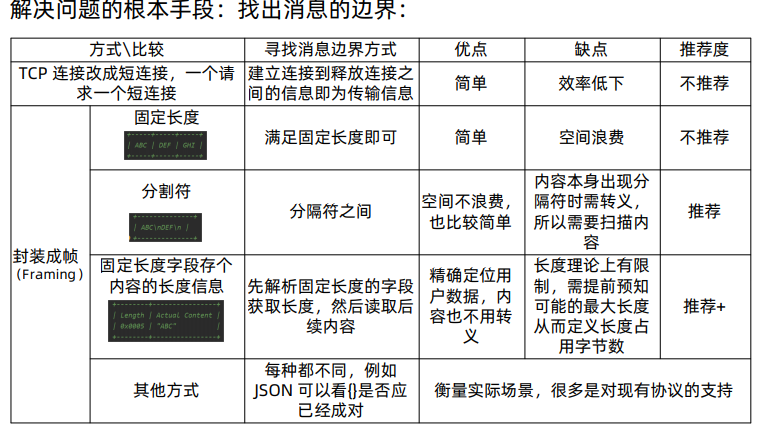

1.什么是粘包和半包？
举个例子，比如发送ABC DEF，收到的就一定是ABC DEF吗？不一定，有可能是A BCDEF,也有可能是AB CD EF.
前面一次接收到两个消息的称之为粘包，后面分三四次接收到多个不完整消息内容的现象，称之为半包

2.为什么TCP应用中会出现粘包和半包现象？
粘包的主要原因：a发送方每次写入数据<套接字缓冲区大小，这个时候，往往网卡不会给你立马发送，就像我们寄快递，快递公司不会
立马给我们发送，它会合并很多包裹一起发送，这种情况下，接收方就有可能收到一个粘包.
b接收方读取套接字缓冲区数据不够及时

半包的主要原因：
发送方写入数据>套接字缓冲区大小
发送的数据大于协议的MTU（最大传输单元）

产生这两种的根本原因？TCP是流式协议，消息无边界
UDP像邮寄的包裹，虽然一次运输多个，但是每个包裹都有界限，一个一个签收，所以无粘包、半包问题

3.解决粘包和半包问题的几种常用方法

4.Netty对三种常用封帧方式的支持？

5.解读Netty处理粘包、半包的源码
