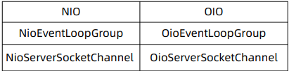

1.什么是经典的三种I/O模式
> 饭店->服务器，饭菜->数据，饭菜好了->数据就绪，端菜/送菜->数据读取
> 阻塞与非阻塞
> 菜没好，要不要死等->数据就绪前要不要等待？
> 阻塞：没有数据传过来时，读会阻塞直到有数据；缓冲区满时，写操作也会阻塞。
> 非阻塞遇到这些情况，都是直接返回
>
> 同步与异步
> 菜好了，谁端->数据就绪后，数据操作谁完成？
> 数据就绪后需要自己去读是同步，数据就绪直接读好再回调给程序时异步

> 2.Netty对三种I/O模式的支持

3.为什么Netty仅支持NIO了？
> 为什么不建议阻塞I/O?
> 连接数高的情况下：阻塞->耗资源、效率低

>为什么删掉已经做好的AIO支持？
> windows实现成熟，但是很少用来做服务器
> Linux常用来做服务器，但是AIO实现不够成熟
> Linux下AIO相比较NIO的性能提升不明显

4.为什么Netty有多种NIO实现？
> 通用的NIO实现（Common）在Linux下也是使用epoll，为什么自己单独实现？
> >实现的更好
>
> Netty暴露了更多的可控参数，例如：
> >jdk的NIO默认实现是水平触发
> > Netty是边缘触发（默认）和水平触发可切换
>>> 水平触发:点单后，菜(数据)做好了，服务员端上来问吃不吃(读)，你不吃或者吃不完，她过会还会端过来问你吃不吃，提醒你，还没吃完，可以继续吃，反反复复。
>>> 边缘触发:服务员端上菜后，你一次没有吃完，好了，等你想吃剩下的时候，也别吃了，除非再点菜，才能吃到刚没吃完的。
> >
> Netty是吸纳的垃圾回收更少、性能更好

5.NIO一定优于BIO么？
> BIO代码简单
> 特定场景：连接数少，并发度低，BIO性能不输NIO
>
6.源码解读Netty怎么切换I/O模式？
>.怎么切换？
> 对于服务器开发：从NIO切换到OIO
> 
>
> 原理是什么？
> 例如对于ServerSockerChannel：工厂模式+泛型+反射实现
>
> 为什么服务器并不需要切换客户端对应NioSocketChannel？
> ServerSocketChannel负责创建对应的SocketChannel
>