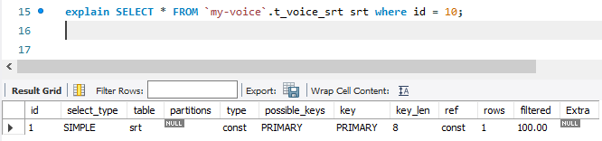
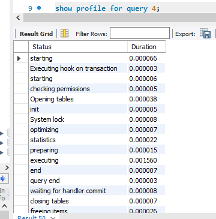
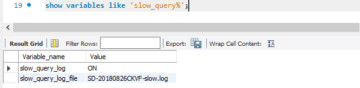
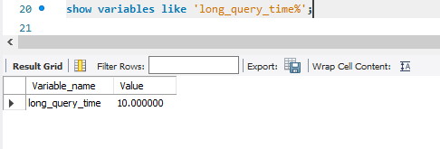

#### 优化SQL语句的具体步骤

    通常,我们在执行一条SQL语句时,要想知道这个SQL先后查询了哪些表,是否使用了索引,这些数据从哪些获取到,获取到数据遍历了多少行数据等等,
    我们可以通过EXPLAIN命令来查看这些执行信息.这些执行信息被统称为执行计划.

### 1.通过EXPLAIN分析sql执行计划

    id:每个执行计划都有一个id,如果是一个联合查询,这里还将有多个id
    select_type:表示select查询类型,常见的有simple(普通查询,即没有联合查询 子查询) PRIMARY(主查询)
                union(union中后面的查询) sunquery(子查询)等
    table:当前执行计划查询的表,如果给表起别名,则显示别名信息;
    partitions:访问的分区表信息;
    type:表示从表中查询到行所执行的方式,查询方式是sql优化的一个很重要的指标,结果值从好到差依次是
        system>const>eq_ref>ref>range>index>all
        system/const:表中只有一行数据匹配,此时根据索引查询一次就能找到对应的数据explain SELECT * FROM `my-voice`.t_voice_srt srt where id = 10;
        eq_ref:使用唯一索引扫描,常见于多表连接中使用主键和唯一索引作为关联条件 explain SELECT * FROM `my-voice`.t_voice_srt srt left join t_basic_file bf on srt.basic_file_id = bf.id;
        ref:非唯一索引扫描,还可见与唯一索引最左原则匹配扫描 explain select * from t_voice_srt srt where srt.srt_name ='九品芝麻官';
        range:索引范围扫描,比如> < between explain SELECT * FROM `my-voice`.t_voice_srt srt where id>  10;
        index:索引全表扫描 explain SELECT id FROM `my-voice`.t_voice_srt srt;
        all:表示全表扫描,需要遍历全表来找到对应的行;
        possible_keys:可能用到的索引;
        key:实际用到的索引;
        key_len:当前使用的索引的长度;
        ref:关联id等信息;
        rows:查找当前记录所扫描的行数;
        filter:查找到所需记录占总扫描记录数的比例;
        extra:额外的信息;

### 2.通过show profile 分析SQL执行性能
 

    深入到MySQL内核中,从执行线程的状态和时间来分析的话,可以选择使用profile.
    Profile 除了可以分析执行线程的状态和时间，还支持进一步选择 ALL、CPU、MEMORY、BLOCK IO、CONTEXT SWITCHES 等类型来查询 SQL 语句在不同系统资源上所消耗的时间。
    以下是相关命令的注释：
    SHOW PROFILE [type [, type] ... ]
    [FOR QUERY n]
    [LIMIT row_count [OFFSET offset]]
    
    type参数：
    | ALL：显示所有开销信息
    | BLOCK IO：阻塞的输入输出次数
    | CONTEXT SWITCHES：上下文切换相关开销信息
    | CPU：显示CPU的相关开销信息 
    | IPC：接收和发送消息的相关开销信息
    | MEMORY ：显示内存相关的开销，目前无用
    | PAGE FAULTS ：显示页面错误相关开销信息
    | SOURCE ：列出相应操作对应的函数名及其在源码中的调用位置(行数) 
    | SWAPS：显示swap交换次数的相关开销信息
    
    MySQL是在5.0.37版本之后才支持show profile功能的,可以通过查询select @@havie_profiling
    开启show profile功能    set profiling = 1
    show profiles只显示最近发送给服务器sql语句,默认情况下是记录最近已执行的15条记录,可以通过重置
    profiling_history_size增大该存储记录,最大值100;
   
    
    获取到query_id之后,可以通过show profile for query id语句,查询到query_id的sql语句在执行过程中线程的每个状态所消耗的时间
    

### 3.常用的SQL优化
    1.优化分页查询
    通常我们是使用<Limit m,n>+合适的order by来实现分页查询,这种实现方式在没有任何索引支持的条件下,需要做大量的文件排序操作,性能将会非常的槽糕,
    如果有对应的索引,通常刚开始的分页查询效率会比较理想,但越往后,分页查询的性能就越差.
    这是因为我们在使用limit的时候,偏移量m在分页越靠后的时候,值就越大,数据库检索的数据也就越多.例如limit 10000,10这样的查询,数据库需要查询10010条记录,最后返回10条记录.
    也就是说将会有10000条记录被查询出来没有被使用到.
    .利用子查询优化分页查询
    explain select * from t_voice_srt srt order by srt.id limit 1000,10;
    explain select * from t_voice_srt srt where id>(select id from t_voice_srt order by id limit 1000,1) limit 10;

    2.优化select count(*)
    count()函数在MyISAM和InnoDB存储引擎所执行的原理是一样的.通常在没有任何查询条件下的count(*),MyISAM的查询速度要明显快于InnoDB.
    这是因为MyISAM存储引擎记录的是整个表的行数,在count(*)查询操作时无需遍历表计算,直接获取该值即可.
    而在InnoDB存储引擎中就需要扫描表来统计具体的行数,而当带上where条件语句之后,两者就没有区别了,他们都需要扫描表来进行行数的统计
    对大表的count()进行优化?
    使用近似值
        使用explain对表进行估算
    增加汇总统计
        汇总统计表或者缓存字段来统计需要的count值
    
    3.优化select *
    InnoDB在默认创建主键时会创建主键索引,而主键索引属于聚簇索引,即在存储数据时,索引是基于B+树构成的,具体的行数据则存储在叶子节点
    
    而MyISAM默认创建的主键索引 二级索引以及InnoDB的二级索引都属于非聚簇索引,即在存储数据时,索引是基于B+树构成的,而叶子节点存储的是主键值
    假设我们的订单表是基于 InnoDB 存储引擎创建的，且存在 order_no、status 两列组成的组合索引。此时，我们需要根据订单号查询一张订单表的 status，  
    如果我们使用 select * from order where order_no='xxx’来查询，则先会查询组合索引，通过组合索引获取到主键 ID. 
    再通过主键 ID 去主键索引中获取对应行所有列的值。
    
    如果我们使用 select order_no, status from order where order_no='xxx’来查询，则只会查询组合索引，通过组合索引获取到对应的 order_no 和 status 的值
    
    总结
    查看是否开启了慢查询
            
    最大的执行时间:
    
    
### 4.思考题:
    假设有一张订单表order,主要包含了主键订单编码order_no 订单状态status 提交时间create_time等列,并且创建了status列索引和create_time列索引.此时通过创建时间
    降序获取状态为1的订单编码.下面是具体实现代码
    select order_no from order where status =1 order by create_time desc
    其中的问题所在?又该如何优化
    status和create_time单独建索引，在查询时只会遍历status索引对数据进行过滤，不会用到create_time列索引，将符合条件的数据返回到server层，在server对数据通过快排算法进行排序，
    Extra列会出现file sort；应该利用索引的有序性，在status和create_time列建立联合索引，这样根据status过滤后的数据就是按照create_time排好序的，避免在server层排序

    作者回复: 对的，为了避免文件排序的发生。因为查询时我们只能用到status索引，如果要对create_time进行排序，则需要使用文件排序filesort。
    filesort是通过相应的排序算法将取得的数据在内存中进行排序，如果内存不够则会使用磁盘文件作为辅助。虽然在一些场景中，filesort并不是特别消耗性能，但是我们可以避免filesort就尽量避免。