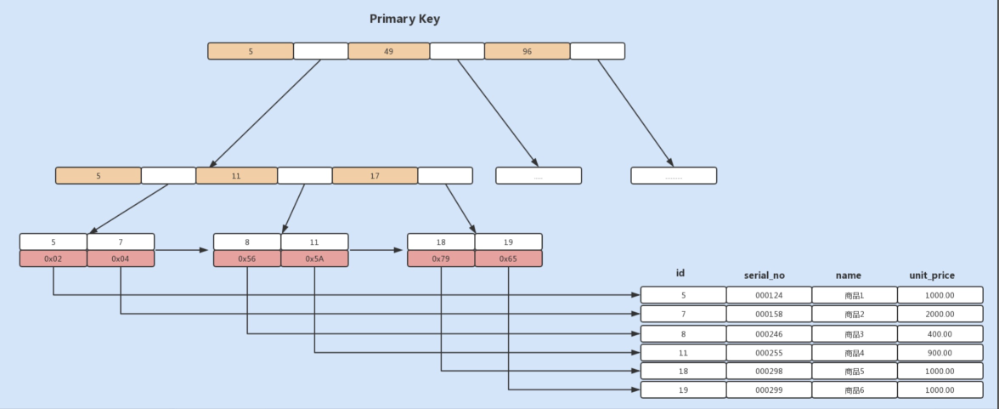
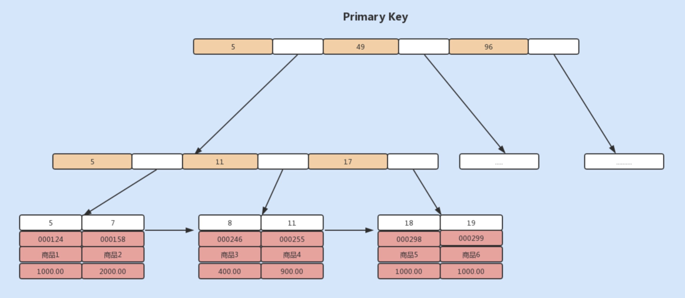
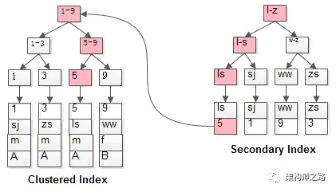
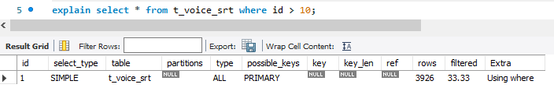
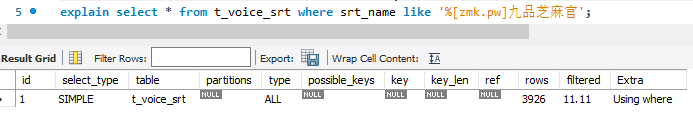

# 索引的失效和优化

## 不同的存储引擎分别支持哪种索引类型

|索引类型|MyISAM引擎|InnoDB引擎|Memory引擎|
|:----|:----:|:----:|:----:|
|B+Tree索引|yes|yes|yes|
|Hash索引|no|no|yes|
|R-Tree索引|yes|no|no|
|Full-Text索引|yes|no|no|

>B+Tree索引是通过B+树实现的,是有序排列存储的,所以在排序和范围查找方面都比较有优势.
>
> Hash索引相对简单,只有Memory存储引擎支持Hash索引
> >优点:Hash索引适合key-value键值对查询,无论表数据多大,查询数据的复杂度都是O(1)


## InnoDB MyISAM存储引擎
>在创建表时，无论使用 InnoDB 还是 MyISAM 存储引擎，默认都会创建一个主键索引，
>而创建的主键索引默认使用的是 B+Tree 索引。不过虽然这两个存储引擎都支持 B+Tree 索引，但它们在具体的数据存储结构方面却有所不同。

>如果使用MyISAM存储引擎,由于MyISAM使用的辅助索引,索引中每一个叶子节点仅仅记录的是每行数据的物理地址,即行指针
>
> 

>如果我们使用的是InnoDB存储引擎,由于InnoDB使用的是聚簇索引,聚簇索引中的叶子节点则记录了主键值 事务id 用于事务和MVCC的回流指针以及所有的剩余列
>
>


## 什么是回表查询?
> 普通索引的查询过程是如何执行的?select * from t where name='ls';
>
> 
>
> 如粉红色路径,需要扫描两遍索引树
> >1)先通过普通索引定位到主键值id=5
> > 在通过聚簇索引定位到行记录
这就是所谓的回表查询


## 覆盖索引优化查询
> 假设我们只需要查询商品的名称 价格信息,我们该如何避免回表呢?可以建立一个组合索引,即商品编码 名称 价格作为一个组合索引.
> 如果索引中存在这些数据,查询将不会再次检索主键索引,从而避免回表.这种从辅助索引中查询得到记录,而不需要通过聚簇索引来查询获取,MySQL中将其称为覆盖索引

## 自增字段作为主键优化查询
>如果我们使用自增主键，那么每次插入的新数据就会按顺序添加到当前索引节点的位置，不需要移动已有的数据，当页面写满，就会自动开辟一个新页面。因为不需要重新移动数据，因此这种插入数据的方法效率非常高。

## 前缀索引优化
>前缀索引顾名思义就是使用某个字段中字符串的前几个字符建立索引
> 索引文件是存储在磁盘中的，而磁盘中最小分配单元是页，通常一个页的默认大小为 16KB，假设我们建立的索引的每个索引值大小为 2KB，则在一个页中，
> 我们能记录 8 个索引值，假设我们有 8000 行记录，则需要 1000 个页来存储索引。如果我们使用该索引查询数据，可能需要遍历大量页，这显然会降低查询效率。  
> 减小索引字段大小，可以增加一个页中存储的索引项，有效提高索引的查询速度。在一些大字符串的字段作为索引时，使用前缀索引可以帮助我们减小索引项的大小。
## 防止索引失效
>hash索引
>>对于 Hash 索引实现的列，如果使用到范围查询，那么该索引将无法被优化器使用到。也就是说 Memory 引擎实现的 Hash 索引只有在“=”的查询条件下，索引才会生效。
>>我们将 order 表设置为 Memory 存储引擎，分析查询条件为 id<10 的 SQL，可以发现没有使用到索引。

>> 

> like查询
>> 如果是以%开头的like查询将无法利用节点查询数据

>> 

> 最左匹配原则
> >当我们在使用复合索引时，需要使用索引中的最左边的列进行查询，才能使用到复合索引。例如我们在 order 表中建立一个复合索引 idx_user_order_status(order_no, status, user_id)，  
> >如果我们使用 order_no、order_no+status、order_no+status+user_id 以及 order_no+user_id 组合查询，则能利用到索引；而如果我们用 status、status+user_id 查询，将无法使用到索引，这也是我们经常听过的最左匹配原则。

> 条件中or
> >如果查询条件中使用 or，且 or 的前后条件中有一个列没有索引，那么涉及的索引都不会被使用到。

> 索引 函数 表达式
> > 对索引进行函数操作或者表达式计算也会导致索引的失效


## 思考题
> 假设我们有一个订单表 order_detail，其中有主键 id、主订单 order_id、商品 sku 等字段，其中该表有主键索引、主订单 id 索引。现在有一个查询订单详情的 SQL 如下，
> 查询订单号范围在 5000~10000，请问该查询选择的索引是什么？有什么方式可以强制使用我们期望的索引呢？

 ```
 select * from order_detail where order_id between 5000 and 10000
 ```
 >由于是select *操作，所以每条记录都需进行回表，当server层分析器发现between的范围太大时，使用辅助索引存在大量回表操作，所以觉得得不偿失，故而直接使用主键索引。  
> 如果想使用我们期望的索引，需要给server层分析器一个hint，force index(idx_order_id)