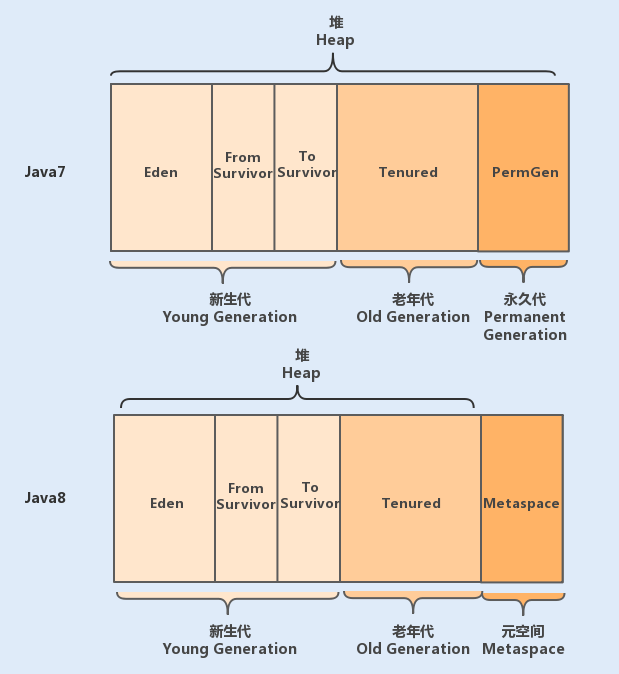

#### 1.为什么JVM在java中如此重要?
> 我们知道运行一个java程序,我们必须要安装jdk或者jre包.这是因为java应用在编译后会变成字节码,然后通过字节码运行在
> jvm中,而jvm是jre的核心组成部分,jvm不仅承担了java字节码的分析(jit
> compiler)和执行,同时也内置了自动内存分配管理机制.这个机制可以大大降低手动分配回收机制可能带来的内存泄漏和内存溢出风险,
> 使得java开发人员不需要关注每个对象的内存分配以及回收,从而更专注业务本身.

#### 2.JVM内存模型的具体设计
> 在java中,jvm内存模型主要分为堆 方法区 程序计数器 本地方法栈
> 虚拟机栈,其中堆和方法区为线程共享,程序计数器 本地方法栈 虚拟机栈为线程私有

##### 2.1堆
> 堆是jvm内存中最大的一块内存空间,该内存被所有线程共享,几乎所有对象和数组都被分配到了堆内存中.
> 堆被划分为新生代young generation和老年代 old
> generation,新生代又被进一步划分为eden和Survivor区,最后Survivor区由From
> Survivor和To Survivor组成.
>
> 在java6中,永久代在非堆内存区;到了java7,永久代的静态变量和运行时常量池被合并到了堆中;而到了java8中
> 永久代被元空间取代了.

##### 2.2程序计数器
> 程序计数器是一块很小的内存空间,主要用来记录各个线程执行的字节码地址,例如,分支
> 循环 跳转 异常 线程恢复等都依赖于计数器.
> 由于java是多线程语言,当执行的线程数量超过CPU核数时,线程之间会根据时间片轮询争夺CPU资源,如果一个线程的时间片用完了,
> 或者是其他原因导致这个线程的CPU资源被抢夺,那么这个退出的线程就需要单独的一个程序计数器,来记录下一条运行的指令.

##### 3.方法区
> 方法区主要是用来存放已被虚拟机加载的类相关信息,包括类信息 运行时常量池
> 字符串常量池.类信息又包括了类的版本 字段 方法 接口 和 父类等信息
> JVM在执行某个类的时候,必须经过加载 连接 初始化,而连接又包括验证 准备
> 解析三个阶段.在加载类的时候,JVM会先加载class文件,而在class文件中除了有类的版本
> 字段 方法 和 接口等描述信息外,还有一项信息是常量池(Constant Pool
> Table),用于存放编译期间生成的各种字面量和符号引用.
>
> 字面量包括字符串 String a="b",基本类型的常量
> final修饰的变量,符号引用则包括类和方法的全限定(例如String这个类,它的全限定名就是java/lang/String
> 字段的名称和描述符以及方法的名称和描述符,描述符:public/private/protected
> static abstract final synchronized volatile
