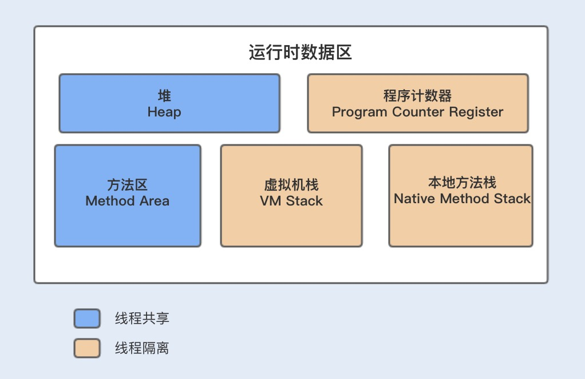
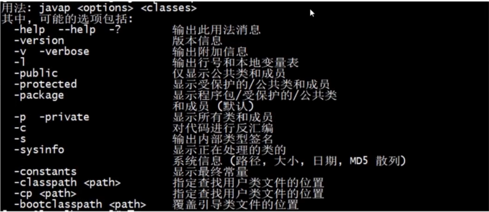

1.jvm参数

    标准参数（各版本中保持稳定）
    -help
    -server -client
    -version -showversion
    -cp -classpath

    X 参数（非标准化参数）
    -Xint：解释执行
    -Xcomp：第一次使用就编译成本地代码
    -Xmixed：混合模式，JVM 自己决定是否编译成本地代码
    
    XX 参数（非标准化参数）
    主要用于 JVM调优和 debug
    Boolean类型（+-）
    格式：-XX:[+-]<name>表示启用或禁用 name 属性
    如：-XX:+UseConcMarkSweepGC（启用cms垃圾收集器）
    -XX:+UseG1GC（启用G1垃圾收集器）
    非Boolean类型（key-value）（带=的）
    格式：-XX:<name>=<value>表示 name 属性的值是 value
    如：-XX:MaxGCPauseMillis=500（GC最大停用时间）
    -xx:GCTimeRatio=19 XX:GCTimeRatio=19时，表示5%的时间用于垃圾回收。默认情况为99，即1%的时间用于垃圾回收
    -Xmx -Xms属于 XX 参数
    -Xms 等价于-XX:InitialHeapSize（初始化堆大小）
    -Xmx 等价于-XX:MaxHeapSize    (最大堆大小)
    -xss 等价于-XX:ThreadStackSize（线程堆栈）
    查看
    jinfo -flag MaxHeapSize <pid>（查看最大内存）
    -XX:+PrintFlagsInitial 查看初始值
    -XX:+PrintFlagsFinal    查看最终值
    -XX:+UnlockExperimentalVMOptions 解锁实验参数
    -XX:+UnlockDiagnosticVMOptions 解锁诊断参数
    -XX:+PrintCommandLineFlags 打印命令行参数
    输出结果中=表示默认值，:=表示被用户或 JVM 修改后的值
    示例：java -XX:+PrintFlagsFinal -version

2.jinfo & jps(参数和进程查看)
    pid 可通过类似 ps -ef|grep tomcat或 jps来进行查看
    jps
    [详情参考 jps官方文档](https://docs.oracle.com/javase/8/docs/technotes/tools/unix/jps.html)
    -l
    jinfo
    jinfo -flag MaxHeapSize <pid>
    jinfo -flags <pid>

    jstat
    [详情参考 jps官方文档](https://docs.oracle.com/javase/8/docs/technotes/tools/unix/jstat.html#BEHBBBDJ)
    jstat 使用示例

3.jstat(类加载、垃圾收集、JIT 编译)

    类加载
    每隔1000ms 即1秒，共输出10次
    jstat -class <pid> 1000 10
    loaded 加载类的个数
    [root@localhost java]# jps
    4167 Jps
    3370 Bootstrap
    [root@localhost java]# jstat -class 3370
    Loaded  Bytes  Unloaded  Bytes     Time
      5990  12028.7    0     0.0       15.50

jinfo -flags 3276

   lzw@zhaowen:~/apache-tomcat-8.5.58$ jinfo -flags 28022  
   Attaching to process ID 28022, please wait...  
   Debugger attached successfully. Server compiler
   detected. JVM version is 25.181-b13 Non-default VM flags: -XX:CICompilerCount=2 -XX:ConcGCThreads=1
   -XX:+DisableExplicitGC -XX:G1HeapRegionSize=1048576 -XX:+HeapDumpOnOutOfMemoryError
   -XX:HeapDumpPath=null -XX:InitialHeapSize=134217728 -XX:MarkStackSize=4194304
   -XX:MaxGCPauseMillis=100 -XX:MaxHeapSize=134217728 -XX:MaxNewSize=79691776
   -XX:MetaspaceSize=67108864 -XX:MinHeapDeltaBytes=1048576 -XX:+PrintGC -XX:+PrintGCDateStamps
   -XX:+PrintGCDetails -XX:+PrintGCTimeStamps -XX:+UseCompressedClassPointers -XX:+UseCompressedOops
   -XX:+UseFastUnorderedTimeStamps -XX:+UseG1GC Command line:
   -Djava.util.logging.config.file=/home/lzw/apache-tomcat-8.5.58/conf/logging.properties
   -Djava.util.logging.manager=org.apache.juli.ClassLoaderLogManager -XX:+UseG1GC
   -XX:MetaspaceSize=64M -XX:MaxGCPauseMillis=100 -Xms128M -Xmx128M -XX:+DisableExplicitGC
   -XX:+HeapDumpOnOutOfMemoryError -XX:HeapDumpPath=/home/lzw/apache-tomcat-8.5.58/logs/
   -XX:+PrintGCDetails -XX:+PrintGCTimeStamps -XX:+PrintGCDateStamps
   -Xloggc:/home/lzw/apache-tomcat-8.5.58/logs/gc.log -Djdk.tls.ephemeralDHKeySize=2048
   -Djava.protocol.handler.pkgs=org.apache.catalina.webresources
   -Dorg.apache.catalina.security.SecurityListener.UMASK=0027 -Dignore.endorsed.dirs=
   -Dcatalina.base=/home/lzw/apache-tomcat-8.5.58 -Dcatalina.home=/home/lzw/apache-tomcat-8.5.58
   -Djava.io.tmpdir=/home/lzw/apache-tomcat-8.5.58/temp

    jinfo -flag CICompilerCount pid
    -XX:CICompilerCount=2

jstat 统计信息

    jstat -class 3276 查看类加载信息
    Loaded  Bytes  Unloaded  Bytes     Time   
    6425 11646.2        0     0.0       5.66
    
    jstat -gc 3276 1000 10 每1s,输出一次gc信息,总共输出10次
     S0C    S1C    S0U    S1U      EC       EU        OC         OU       MC     MU    CCSC   CCSU   YGC     YGCT    FGC    FGCT     GCT   
    8192.0 7168.0  0.0    0.0   153088.0 109612.0  39424.0    18626.7   33020.0 31379.2 4348.0 4001.6     13    0.105   2      0.149    0.254
    8192.0 7168.0  0.0    0.0   153088.0 109612.0  39424.0    18626.7   33020.0 31379.2 4348.0 4001.6     13    0.105   2      0.149    0.254
    8192.0 7168.0  0.0    0.0   153088.0 109612.0  39424.0    18626.7   33020.0 31379.2 4348.0 4001.6     13    0.105   2      0.149    0.254
    8192.0 7168.0  0.0    0.0   153088.0 109612.0  39424.0    18626.7   33020.0 31379.2 4348.0 4001.6     13    0.105   2      0.149    0.254
    8192.0 7168.0  0.0    0.0   153088.0 109612.0  39424.0    18626.7   33020.0 31379.2 4348.0 4001.6     13    0.105   2      0.149    0.254
    8192.0 7168.0  0.0    0.0   153088.0 109612.0  39424.0    18626.7   33020.0 31379.2 4348.0 4001.6     13    0.105   2      0.149    0.254
    8192.0 7168.0  0.0    0.0   153088.0 109612.0  39424.0    18626.7   33020.0 31379.2 4348.0 4001.6     13    0.105   2      0.149    0.254
    8192.0 7168.0  0.0    0.0   153088.0 109612.0  39424.0    18626.7   33020.0 31379.2 4348.0 4001.6     13    0.105   2      0.149    0.254
    8192.0 7168.0  0.0    0.0   153088.0 109612.0  39424.0    18626.7   33020.0 31379.2 4348.0 4001.6     13    0.105   2      0.149    0.254
    8192.0 7168.0  0.0    0.0   153088.0 109612.0  39424.0    18626.7   33020.0 31379.2 4348.0 4001.6     13    0.105   2      0.149    0.254
以下大小的单位均为 KB
S0C, S1C, S0U, S1U: S0和 S1的总量和使用量
EC, EU: Eden区总量与使用量
OC, OU: Old区总量与使用量
MC, MU: Metacspace区(jdk1.8前为 PermGen)总量与使用量
CCSC, CCSU: 压缩类区总量与使用量
YGC, YGCT: YoungGC 的次数与时间
FGC, FGCT: FullGC 的次数与时间
GCT: 总的 GC 时间

4.jmap+MAT(内存溢出)

    -Xmx32M -Xms32M -XX:+HeapDumpOnOutOfMemoryError -XX:HeapDumpPath=./
    可以看到自动在当前目录中生成了一个java_pid660.hprof文件
    
    另一种导出溢出也更推荐的方式是jmap
    option: -heap, -clstats, -dump:<dump-options>, -F
    jmap -dump:format=b,file=heap.hprof <pid>

    jmap 导出溢出文件 MAT找开上述导出的内存溢出文件即可进行分析

5.jstack(线程 死循环 死锁)

    1.查看线程状态 
        jstack： 打印jvm内部所有线程
        C:\Users\Mr Chen\Desktop>jps -l
        15260 com.imooc.monitor_tuning.MonitorTuningApplication
        10836 sun.tools.jps.Jps
        6744
        C:\Users\Mr Chen\Desktop>jstack 15260> 15260.txt
    
        可查看其中包含java.lang.Thread.State: WAITING (parking)，
        JAVA 线程包含的状态有： 
        NEW：线程尚未启动 
        RUNNABLE：线程正在 JVM 中执行 
        BLOCKED：线程在等待监控锁(monitor lock) 
        WAITING：线程在等待另一个线程进行特定操作（时间不确定） 
        TIMED_WAITING：线程等待另一个线程进行限时操作 TERMINATED：线程已退出 
    2.死循环导致cpu飙高
        top -p <pid> -H可以查看线程及 CPU 消耗情况
        jstack 1824 > 1824.txt 1824 为进程id
        printf "%x" tid 将线程转成16进制
        通过16进制在1824.txt中搜索        
    3,死锁
        lzw@zhaowen:~/apache-tomcat-8.5.58$ ps -ef | grep tomcat
        lzw       28861      1 99 14:05 pts/1    00:21:34 /data/jdk1.8.0_181/jre/bin/java -Djava.util.logging.config.file=/home/lzw/apache-tomcat-8.5.58/conf/logging.properties -Djava.util.logging.manager=org.apache.juli.ClassLoaderLogManager -XX:+UseG1GC -XX:MetaspaceSize=64M -XX:MaxGCPauseMillis=100 -Xms128M -Xmx128M -XX:+DisableExplicitGC -XX:+HeapDumpOnOutOfMemoryError -XX:HeapDumpPath=/home/lzw/apache-tomcat-8.5.58/logs/ -XX:+PrintGCDetails -XX:+PrintGCTimeStamps -XX:+PrintGCDateStamps -Xloggc:/home/lzw/apache-tomcat-8.5.58/logs/gc.log -Djdk.tls.ephemeralDHKeySize=2048 -Djava.protocol.handler.pkgs=org.apache.catalina.webresources -Dorg.apache.catalina.security.SecurityListener.UMASK=0027 -Dignore.endorsed.dirs= -classpath /home/lzw/apache-tomcat-8.5.58/bin/bootstrap.jar:/home/lzw/apache-tomcat-8.5.58/bin/tomcat-juli.jar -Dcatalina.base=/home/lzw/apache-tomcat-8.5.58 -Dcatalina.home=/home/lzw/apache-tomcat-8.5.58 -Djava.io.tmpdir=/home/lzw/apache-tomcat-8.5.58/temp org.apache.catalina.startup.Bootstrap start
        lzw       29072  28256  0 14:17 pts/2    00:00:00 grep --color=auto tomcat
        lzw@zhaowen:~/apache-tomcat-8.5.58$ jstack 28861 > deadlock.txt
        在导出的文件中,最后
Found one Java-level deadlock:
=============================
"Thread-8":
  waiting to lock monitor 0x00007fcb68084d28 (object 0x00000000fbef6b98, a java.lang.Object),
  which is held by "Thread-7"
"Thread-7":
  waiting to lock monitor 0x00007fcb58006528 (object 0x00000000fbef6b88, a java.lang.Object),
  which is held by "Thread-8"

Java stack information for the threads listed above:
===================================================
"Thread-8":
    at com.imooc.monitor_tuning.chapter2.CpuController.lambda$deadlock$1(CpuController.java:41)

waiting to lock <0x00000000fbef6b98> (a java.lang.Object) - locked <0x00000000fbef6b88> (a
java.lang.Object) at
com.imooc.monitor_tuning.chapter2.CpuController$$Lambda$330/1900958474.run(Unknown Source) at
java.lang.Thread.run(Thread.java:748) "Thread-7": at
com.imooc.monitor_tuning.chapter2.CpuController.lambda$deadlock$0(CpuController.java:33) - waiting to
lock <0x00000000fbef6b88> (a java.lang.Object) - locked <0x00000000fbef6b98> (a java.lang.Object) at
com.imooc.monitor_tuning.chapter2.CpuController$$Lambda$329/1970395516.run(Unknown Source) at
java.lang.Thread.run(Thread.java:748)

Found 1 deadlock.

6.JVM层GC调优  
1.运行时数据区  

    程序计数器 PC Register
    jvm支持多线程同时执行，每一个线程都有自己的PC Register,线程正在执行的方法叫做当前方法，如果是java代码，PC Register
    里面存放的就是当前正在执行的指令的地址，如果是C代码，则为空
    
    虚拟机栈JVMStacks
    java虚拟机栈是线程私有的，它的生命周期与线程相同。虚拟机栈描述的是java方法执行的内存模型：每个方法在执行的同时都会常见一个
    栈帧，用于存储局部变量表 操作数栈 动态链接 方法出库等信息。每一个方法从调用直至执行完成的过程，就对应着一个栈帧在虚拟机栈
    中入栈到出栈的过程。
    
    java堆是java虚拟机锁管理的内存中最大的一块。堆是被所有线程共享的一块内存区域，在虚拟机启动时创建。此内存区域的唯一目的就是
    存放对象实例，几乎所有的对象实例都在这里分配内存。java堆可以处于物理上不连续的内存空间中，只要逻辑上市连续的即可。
    
    方法区Method Area
    方法区与java堆一样，是各个线程共享的内存区域，它用于存储已被虚拟机加载的类信息 常量 静态变量 即时编译后的代码等数据。虽然
    java虚拟机规范把方法区描述为对的一个逻辑部分，但是它却有一个别名叫做非堆Non-Heap，目的是与java堆区分开来。
    
    方法区中的常量池Run-Time Constant Pool
    运行时常量池是方法区的一部分，class文件中除了有类的版本 字段 方法 接口等描述信息外，还有一项信息是常量池，用于存放编译期
    生成的各种字面量和符号引用，这部分内容将在类加载后进入方法区的运行时常量池中存放。
    
    本地方法栈
    本地方法栈跟 Java 虚拟机栈的功能类似，Java 虚拟机栈用于管理 Java 函数的调用，而本地方法栈则用于管理本地方法的调用。但本
    地方法并不是用 Java 实现的，而是由 C 语言实现的。
    
    非堆区 Metaspace = Class Package Method Field 字节码 常量池 符号引用等 CSS: 32位指针的Class
    CodeCache：JIT编译后的本地代码 JNI使用的C代码
2.常用参数

    -Xms 最小堆内存 -Xmx最大堆内存
    -XX:NewSize 新生代大小 
    -XX:MaxNewSize最大新生代大小
    -XX:NewRatio new和old的比例 
    -XX:SurvivorRatio survivor和edn的比例
    -XX:MetaspaceSize -XX:MaxMetaspaceSize   一般调大
    -XX:+UseCompressedClassPointers 是否启用压缩类指针
    -XX:CompressedClassSpaceSize 这个选项打开后，class信息中的指针也用32bit的Compressed版本。而这些指针指向的空间
    被称作“Compressed Class Space”。默认大小是1G，但可以通过“CompressedClassSpaceSize”调整。如果你的java程序引用
    了太多的包，有可能会造成这个空间不够用，于是会看到java.lang.OutOfMemoryError: Compressed class space这时，一般
    调大CompreseedClassSpaceSize就可以了
    -XX:InitialCodeCacheSize
    -XX:ReservedCodeCacheSize  
    JVM一个有趣的，但往往被忽视的内存区域是“代码缓存”，它是用来存储已编译方法生成的本地代码。代码缓存确实很少引起性能问题，
    但是一旦发生其影响可能是毁灭性的。如果代码缓存被占满，JVM会打印出一条警告消息，并切换到interpreted-only 模式：JIT编译
    器被停用，字节码将不再会被编译成机器码。因此，应用程序将继续运行，但运行速度会降低一个数量级，直到有人注意到这个问题。就像
    其他内存区域一样，我们可以自定义代码缓存的大小。相关的参数是-XX:InitialCodeCacheSize 和-XX:ReservedCodeCacheSize，
    它们的参数和上面介绍的参数一样，都是字节值。  

3. 

    PARALLEL_OPTION="-XX:+UseParallelGC -XX:+UseParallelOldGC -XX:MaxGCPauseMillis=200 -XX:GCTimeRatio=99"
    CMS_OPTION="-XX:+UseConcMarkSweepGC -XX:+UseCMSCompactAtFullCollection -XX:CMSFullGCsBeforeCompaction=5"
    G1_OPTION="-XX:+UseG1GC -XX:+UseStringDeduplication -XX:StringDeduplicationAgeThreshold=3 -XX:+UseCompressedClassPointers -XX:MaxGCPauseMillis=200"
    JAVA_OPTS="$JAVA_OPTS $CMS_OPTION -Xms128M -Xmx128M -XX:MetaspaceSize=128M -XX:MaxMetaspaceSize=128M -XX:+UseCompressedClassPointers"
    串行收集器 Serial:：Serial, Serial Old (-XX:+UseSerialGC -XX:+UseSerialOldGC)
    并行收集器 Parallel（吞吐量优先, Server 模式默认收集器）：Parallel Scavenge, Parallel Old (-XX:+UseParallelGC, -XX:+UseParallelOldGC)
    
    -XX:+UseCompressedClassPointers 启用压缩指针
    jstat -gc 22150
     S0C    S1C    S0U    S1U      EC       EU        OC         OU       MC     MU     CCSC    CCSU     YGC     YGCT    FGC    FGCT     GCT   
    4352.0 4352.0  0.0   2198.1 34944.0  28774.0   87424.0    38587.7   38784.0 37004.1 4992.0 4623.3     25    0.274    0      0.000    0.274
    
    禁用压缩指针
    jstat -gc 22234
     S0C    S1C    S0U    S1U      EC       EU        OC         OU       MC     MU      CCSC   CCSU     YGC     YGCT    FGC    FGCT     GCT   
    4352.0 4352.0 4352.0  0.0   34944.0  17612.1   87424.0    42306.4   39168.0 37290.5  0.0    0.0       26    0.221    0      0.000    0.221
    
    -Xint
     S0C    S1C    S0U    S1U      EC       EU        OC         OU       MC     MU     CCSC    CCSU     YGC     YGCT    FGC    FGCT     GCT   
    4352.0 4352.0  0.0   4352.0 34944.0  24250.6   87424.0    39959.9   35840.0 33702.1  0.0    0.0       27    0.215    0      0.000    0.215

    MC 39168.0 --》 35840.0 没有codeCache ，完全解释执行，没有本地代码

常用参数

    -Xms -Xmx  最小堆内存和最大堆内存
    -XX:NewSize -XX:MaxNewSize 新生代
    -XX:NewRatio  young区与old区的比例  -XX:SurvivorRatio eden区与Survivor区的比例
    -XX:MetaspaceSize -XX:MaxMetaspaceSize 一般调大
    -XX:+UseCompressedClassPointers是否启用压缩类指针
    -XX:CompressedClassSpaceSize 设置压缩类空间大小
    -XX:InitialCodeCacheSize CodeCache初始大小
    -XX:ReservedCodeCacheSize CodeCache最大大小
    
    以上参数只需要调整-XX:MetaspaceSize -XX:MaxMetaspaceSize，其他的都不用调

3.垃圾回收算法

    思想:枚举根节点，做可达性分析
    根节点:类加载器 Thread 虚拟机栈的本地变量表 static成员 常量引用 本地方法栈的变量等

算法一标记清除

    算法
    算法分为“标记”和“清除”两个阶段:首先标记处所有需要回收的对象，在标记完成后统一回收所有。
    缺点：效率不高。标记和清除两个过程的效率都不高，产生碎片，碎片太多会导致提前GC。
算法二复制

    它将可用内存按容量划分为大小相等的两块，每次只使用其中的一块。当这一块的内存用完了，就将还存活的对象复制到
    另一块上面，然后再把已使用过的内存空间一次清理掉。
算法三标记整理

    标记过程仍然与“标记-清除”算法一样，但是后续步骤不是直接对可回收对象进行清理，而是让所有存活的对象都向一端移动，
    然后直接清理掉端边界以外的内存。
    优缺点:没有了内存碎片，但是整理内存比较耗时
分代垃圾回收

    Young区采用复制算法，对象朝生夕死，产生的垃圾比较多，采用复制算法，效率比较高
    Old区用标记清除或者标记整理，垃圾比较少，采用标记清除或标记整理效率高
对象分配

    对象优先在Eden区分配
    大对象直接进入老年代:-XX:PretenureSizeThreshold 大于这个值的对象直接在老年代分配,这样做的目的是避免在Eden区和两个
    Survivor区之间发生大量的内存复制
    长期存活的对象进入老年代:
    -XX:MaxTenuringThreshold 设定survivor区的目标使用率。默认50，即survivor区对象目标使用率为50%。
    -XX:+PrintTenuringDistribution 如果希望跟踪每次新生代GC后，survivor区中对象的年龄分布，可在启动参数上增加该参数
    -XX:TargetSurvivorRatio 设定survivor区的目标使用率。默认50，即survivor区对象目标使用率为50%。
4.垃圾收集器

常见配置实例 ./bin/catalina.sh

    PARALLEL_OPTION="-XX:+UseParallelGC -XX:+UseParallelOldGC -XX:MaxGCPauseMillis=200 -XX:GCTimeRatio=99"
    CMS_OPTION="-XX:+UseConcMarkSweepGC -XX:+UseCMSCompactAtFullCollection -XX:CMSFullGCsBeforeCompaction=5"
    G1_OPTION="-XX:+UseG1GC -XX:+UseStringDeduplication -XX:StringDeduplicationAgeThreshold=3 -XX:+UseCompressedClassPointers -XX:MaxGCPauseMillis=200"
    
    JAVA_OPTS="$JAVA_OPTS $CMS_OPTION -Xms128M -Xmx128M -XX:MetaspaceSize=128M -XX:MaxMetaspaceSize=128M -XX:+UseCompressedClassPointers"
    串行收集器 Serial:：Serial, Serial Old (-XX:+UseSerialGC -XX:+UseSerialOldGC)
    并行收集器 Parallel（吞吐量优先, Server 模式默认收集器）：Parallel Scavenge, Parallel Old (-XX:+UseParallelGC, -XX:+UseParallelOldGC)

    -XX:ParallelGCThreads=<N> 多少个 GC 线程（CPU> 8 N=5/8; CPU<8 N=CPU）
    Parallel Collector Ergonomics:
    -XX:MaxGCPauseMillis=<N>
    -XX:GCTimeRatio=<N>
    -Xmx<N>
    
    动态内存调整
    -XX:YoungGenerationSizeIncrement=<Y>
    -XX:TenuredGenerationSizeIncrement=<T>
    -XX:AdaptiveSizeDecrementScaleFactor=<D>
    
    并发收集器 Concurent（停顿时间优先）：CMS (-XX:+UseConcMarkSweepGC -XX:+UseParNewGC), G1(-XX:UseG1GC)
    停顿时间：垃圾收集器做垃圾回收中断应用执行的时间。
    -xx:MANGCPauseMillis
    吞吐量：花在垃圾收集的时间和花在应用时间的占比。-xx:GCTimeRatio=<n>,垃圾收集时间占：1/1+n 吞吐量最大的时候停顿时间最小最好
    
    串行收集器Serial：Serial SerialOld
    并行收集器Parallel：ParallelScavenger Parallel OLd 吞吐量优先
    并发收集器Concurrent:CMS G1 停顿时间优先
    
    并行与并发
    并行Parallel:指多条垃圾收集线程并行工作，但此时用户线程仍然处于等待状态，适合科学计算 后台处理等弱交互场景
    并发Concurrent:指用户线程与垃圾收集线程同时执行（但不一定是并行的，可能会交替执行），垃圾收集线程在执行的时候不会
    停顿用户程序的运行。适合对响应时间有要求的场景，比如web
    
    停顿时间与吞吐量
    停顿时间:垃圾收集器做垃圾回收中断应用执行的时间。-XX:MaxGCPauseMills
    吞吐量:花在垃圾收集的时间和花在应用时间的占比.-XX:GCTimeRatio=<n>,垃圾收集时间占比:1/(1+n)
    理想情况下:在吞吐量最大的时候,停顿时间最小,现实情况下,两者是互斥的,我们在调优的时候,也是重点调这两个变量
    
    吞吐量是指应用程序线程用时占程序总用时的比例。 例如，吞吐量99/100意味着100秒的程序执行时间应用程序线程运行了99秒， 而在这一时间段内GC线程只运行了1秒。
    ”暂停时间”是指一个时间段内应用程序线程让与GC线程执行而完全暂停
串行收集器

    -XX:+UseSerialGC -XX:+UseSerialOldGC
并行收集器

    吞吐量优先
    -XX:+UseParallelGC,-XX:+UseParallelOldGC
    Server模式下的默认收集器
    
    查看web项目下启用的收集器
    jinfo -flag UseParallelGC 23942
     -XX:+UseParallelGC
     
    jinfo -flag UseParallelOldGC 23942
    -XX:+UseParallelOldGC
并发收集器

    响应时间优先
    CMS:-XX:+UseParNewGC(young区) XX:+UseConcMarkSweepGC(old区) 
    CMS_OPTION="-XX:+UseConcMarkSweepGC -XX:+UseCMSCompactAtFullCollection -XX:CMSFullGCsBeforeCompaction=5"

    jinfo -flag UseParNewGC 24073
    -XX:+UseParNewGC

    jinfo -flag UseConcMarkSweepGC 24073
    -XX:+UseConcMarkSweepGC
    
    使用G1GC
    jinfo -flag UseG1GC 24259
    -XX:+UseG1GC
如何选择垃圾收集器

    优先调整堆的大小让服务器自己来选择
    如果内存小于100M,使用串行收集器
    如果是单核,并且没有停顿时间的要求,串行或者jvm自己选
    如果允许停顿时间超过1s,选择并行或者jvm自己选
    如果响应时间最重要,并且不能超过1s,使用并发收集器

Parallel Collector

    -XX:+UseParallelGC手动开启,Server默认开启
    -XX:ParallelGCThreads=<N>多少个线程
    CPU>8 N=5/8
    CPU<8 N=CPU
 Parallel Collector Ergonomics 自适应

    -XX:MaxGCPauseMills=<N>
    -XX:GCTimeRatio=<N>
    -Xmx<N>
动态内存调整

    -XX:YoungGenerationSizeIncrement=<Y>
    -XX:TenuredGenerationSizeIncrement=<T>
    -XX:AdaptiveSizeDecrementScaleFactor=<D>
    生产环境很少使用自适应

CMS Collector

    并发收集
        低停顿 低延迟的垃圾收集器,同时是一个老年代收集器
CMS垃圾收集过程

    1.CMS inital mark :初始标记 Root,STW
    2.CMS concurrent mark:并发标记
    3.CMS-concurrent-preclean:并发预清理
    4.CMS remark:重新标记,STW
    5.CMS concurrent sweep 并发清除
    6.CMS concurrent reset:并发重置

cms的缺点

    cpu敏感
    产生浮动垃圾
    空间碎片

CMS的相关参数

    -XX:ConcGCThreads:并发的GC线程数
    -XX:+UseCMSCompactAtFullCollection:FullGC之后做压缩
    -XX:CMSFullGCsBeforeCompaction:多少次FullGC之后压缩一次
    -XX:CMSInitiatingOccupancyFraction:触发FullGC
    -XX:+UseCMSInitiatingOccupancyOnly:是否动态调
    -XX:+CMSScavengeBeforeRemark:FullGC之前先做YGC
    -XX:+CMSClassUnloadingEnabled:是否启动回收Perm区
    
    -XX:+UseConcMarkSweepGC -XX:+UseCMSCompactAtFullCollection -XX:CMSFullGCsBeforeCompaction=5 -Xms128M  
    -Xmx128M -XX:MetaspaceSize=128M -XX:MaxMetaspaceSize=128M -XX:-UseCompressedClassPointers    
iCMS

    适用于单核或者双核

G1 Collector

    大内存 停顿时间小
    新生代和老生代收集器

G1的几个概念

    Region
    SATB:Snapshot-At-The-Beginning,它是通过Root Tracing得到的,GC开始时候存活对象的快照
    RSet:记录了其他Region中的对象引用本Region中对象的关系,属于points-into结构(谁引用了我的对象)

YoungGC

    新对象进入Eden区
    存活对象拷贝到Survivor区
    存活时间到达年龄阈值时,对象晋升到Old区

MixedGC

    不是FullGC,回收所有的Young和部分Old
    global concurrent marking
        1.Initial marking phase:标记GC Root,STW
        2.Root region scanning phase:标记存活Region
        3.Concurrent marking phase:标记存活的对象
        4.Remark phase:重新标记,STW
        5.Cleanup phase:部分STW
    
    初始标记（initial mark，STW）
    在此阶段，G1 GC 对根进行标记。该阶段与常规的 (STW) 年轻代垃圾回收密切相关。
    根区域扫描（root region scan）
    G1 GC 在初始标记的存活区扫描对老年代的引用，并标记被引用的对象。该阶段与应用程序（非 STW）同时运行，并且只有完成该阶段后，才能开始下一次 STW 年轻代垃圾回收。
    并发标记（Concurrent Marking）
    G1 GC 在整个堆中查找可访问的（存活的）对象。该阶段与应用程序同时运行，可以被 STW 年轻代垃圾回收中断
    最终标记（Remark，STW）
    该阶段是 STW 回收，帮助完成标记周期。G1 GC 清空 SATB 缓冲区，跟踪未被访问的存活对象，并执行引用处理。
    清除垃圾（Cleanup，STW）
    在这个最后阶段，G1 GC 执行统计和 RSet 净化的 STW 操作。在统计期间，G1 GC 会识别完全空闲的区域和可供进行混合垃圾回收的区域。清理阶段在将空白区域重置并返回到空闲列表时为部分并发。    
Mixed GC时机

    InitiatingHeapOccupancyPercent:堆占有率达到这个数值则触发global concurrent marking,默认45%
    G1HeapWastePercent:在global concurrent marking结束之后,可以知道区有多少空间要被回收,在每次YGC
        之后和再次发生MixedGC之前,会检查垃圾占比是否达到此参数,只有达到了,下次才会发生MixedGC
    G1MixedGCLiveThresholdPercent:Old区的region被回收时候的存活对象占比
    G1MixedGCCountTarget:一次global concurrent marking 之后,最多执行Mixed GC的次数
    G1OldCSetRegionThresholdPercent:一次Mixed GC中能被选入CSet的最多old区的region数量
常用参数

    -XX:+UseG1GC开启G1
    -XX:G1HeapRegionSize=n,region的大小,1-32M,最多2048个
    XX:MaxGCPauseMillis=200 最大停顿时间 
    -XX:G1NewSizePercent、-XX:G1MaxNewSizePercent 
    -XX:G1ReservePercent=10 保留防止 to space溢出 
    -XX:ParallelGCThreads=n SWT线程数并行 
    -XX:ConcGCThreads=n 并发线程数=1/4*并行
    
    最佳实践 年轻代大小：避免使用-Xmn, -XX:NewRatio 等显式 Young 区大小，会覆盖暂停时间目标 
    暂停时间目标:暂停时间不要太严苛，其吞吐量目标是90%的应用程序时间和10%的垃圾回收时间，太严苛会直接影响到吞吐量

    需要切换到 G1的情况：

        50%以上的堆被存活对象占用
        对象分配和晋升的速度变化非常大
        垃圾回收时间特别长，超过了1秒

可视化GC日志分析工具

    [在线工具gceasy](http://gceasy.io/)
    GCViewer
    
    打印日志相关参数
    -XX:+PrintGCDetails -XX:+PrintGCTimeStamps -XX:+PrintGCDateStamps -Xloggc:$CATALINA_HOME/logs/gc.log 
    -XX:+PrintHeapAtGC -XX:+PrintTenuringDistribution
    
    例（默认为 ParallelGC, 其它的添加-XX:+UseConcMarkSweepGC或-XX:+UseG1GC即可）：
    JAVA_OPTS="$JAVA_OPTS -XX:+PrintGCDetails -XX:+PrintGCTimeStamps -XX:+PrintGCDateStamps -Xloggc:$CATALINA_HOME/logs/gc.log"

G1 GC 最佳实践

    -XX:InitiatingHeapOccupancyPercent: 
    Percentage of the (entire) heap occupancy to start a concurrent GC cycle. It is used by GCs that 
    trigger a concurrent GC cycle based on the occupancy of the entire heap, not just one of the 
    generations (e.g., G1). A value of 0 denotes 'do constant GC cycles'. The default value is 45.
    
    -XX:G1MixedGCLiveThresholdPercent and -XX:G1HeapWastePercent: Use to change the mixed garbage collection decisions.
    -XX:G1MixedGCCountTarget and -XX:G1OldCSetRegionThresholdPercent: Use to adjust the CSet for old regions.    
     
     jinfo -flag InitiatingHeapOccupancyPercent 25571
    -XX:InitiatingHeapOccupancyPercent=45

GC调优步骤

    打印GC日志
    根据日志得到关键性能指标
    分析GC原因,调优JVM参数

实战GC 调优

    初始设置
    -XX:+DisableExplicitGC(禁止System.gc()) 
    -XX:+HeapDumpOnOutOfMemoryError 导出内存溢出的堆信息
    -XX:HeapDumpPath=$CATALINA_HOME/logs/ 
    -XX:+PrintGCDetails     打印GC明细    
    -XX:+PrintGCTimeStamps  打印GC时间戳
    -XX:+PrintGCDateStamps 
    -Xloggc:$CATALINA_HOME/logs/gc.log 

ParallelGC调优的指导原则

    除非确定,否则不要设置最大堆内存
    优先设置吞吐量目标
    如果吞吐量目标达不到,调大最大内存,不能让OS使用Swap,如果仍然达不到,降低目标
    吞吐量能达到,GC时间太长,设置停顿时间的目标
Parallel

            吞吐量   最小         最大      平均      YGC    FGC 
    调优前    94.6%  0.00425s    0.06383   0.01965  12     2
    调优后    94.52% 0.00385s    0.08957   0.01882  12     2
    调优后    94.53% 0.0041      0.09232   0.01825  13     2
    调优后    95.18% 0.004       0.07968   0.01873  12     2
G1 GC最佳实践

    年轻代大小:避免使用-Xmn -XX:NewRatio等显示设置Young区大小,会覆盖暂停时间目标
    暂停时间目标:暂停时间不要太苛刻,其吞吐量目标是90%的应用程序时间和10%的垃圾回收时间,太苛刻会直接影响到吞吐量
             吞吐量   最小         最大      平均      GC     
    调优前    96.02%  0.00036s    0.01865   0.00628  39     
    调优后    96.05%  0.00022s    0.02035   0.00708  32  -XX:+MetaspaceSize=64M  
    调优后    96.46%  0.00389s    0.0279    0.01402  16  -XX:+MetaspaceSize=64M -Xms128M -Xmx128M   
    调优后    96.53%  0.00389s    0.02207   0.01195  16  -XX:+MetaspaceSize=64M -Xms128M -Xmx128M -XX:MaxGCPauseMillis=100 

java字节码层调优

jvm字节码指令与javap

i++与++i

    从字节码看 
    int i=0;
    int j=i++;
    print(j);
    i++
         0: iconst_0
         1: istore_0
         2: iload_0
         3: iinc          0, 1
         6: istore_1
        10: iload_1
      LocalVariableTable:
        Start  Length  Slot  Name   Signature
            2      13     0     i   I
            7       8     1     j   I
    int i=0;
    int j=++i;
    print(j)
    ++i
         0: iconst_0
         1: istore_0
         2: iinc          0, 1
         5: iload_0
         6: istore_1
        10: iload_1
        LocalVariableTable:
        Start  Length  Slot  Name   Signature
            2      13     0     i   I
            7       8     1     j   I
    
    for(int i=0;i<10;i++)与for(int i=0;i<10;++i)从字节码上看是一样的,效率一样
         0: iconst_0
         1: istore_0
         2: iload_0
         3: bipush        10
         5: if_icmpge     21
         8: getstatic     #4                  // Field java/lang/System.out:Ljava/io/PrintStream;
        11: iload_0
        12: invokevirtual #5                  // Method java/io/PrintStream.println:(I)V
        15: iinc          0, 1
        18: goto          2
        21: return
    ----------------------------------------------------
         0: iconst_0
         1: istore_0
         2: iload_0
         3: bipush        10
         5: if_icmpge     21
         8: getstatic     #4                  // Field java/lang/System.out:Ljava/io/PrintStream;
        11: iload_0
        12: invokevirtual #5                  // Method java/io/PrintStream.println:(I)V
        15: iinc          0, 1
        18: goto          2
        21: return
    
        
    ,字符串拼接+原理
    其他代码优化方法
    
    Try Finally
     String str = "hello";
        try{
            return str;
        }
        finally{
            str = "imooc";
        } 
        
     Code:
      stack=1, locals=3, args_size=0
         0: ldc           #5                  // String hello
         2: astore_0
         3: aload_0
         4: astore_1
         5: ldc           #6                  // String imooc
         7: astore_0
         8: aload_1
         9: areturn
        10: astore_2
        11: ldc           #6                  // String imooc
        13: astore_0
        14: aload_2
        15: athrow
      Exception table:
         from    to  target type
             3     5    10   any
      LineNumberTable:
        line 28: 0
        line 30: 3
        line 33: 5
      LocalVariableTable:
        Start  Length  Slot  Name   Signature
            3      13     0   str   Ljava/lang/String;
      StackMapTable: number_of_entries = 1
        frame_type = 255 /* full_frame */
          offset_delta = 10
          locals = [ class java/lang/String ]
          stack = [ class java/lang/Throwable ]

尽量重用对象，不要循环创建对象，比如:for 循环字符串拼接(不在 for中使用+拼接，先new 一个StringBuilder再在 for 里 append)
容器类初始化的地时候指定长度（扩容比较耗时）
List<String> collection = new ArrayLIst<String>(5);
Map<String, String> map = new HashMap<String, String>(32);
ArrayList（底层数组）随机遍历快，LinkedList（底层双向链表）添加删除快只需移动一个指针，hashmap底层数组+链表
集合遍历尽量减少重复计算
使用 Entry 遍历 Map
for(Map.Entry<String,String>entry:map.entrySet()){
    String key=entry.getKey();
    String value=entry.getValue();
}
大数组复制使用System.arraycopy
尽量使用基本类型而不是包装类型 Integer底层使用缓存，因为没有1000没有缓存，所以要new
不要手动调用 System.gc()
及时消除过期对象的引用，防止内存泄漏
尽量使用局部变量，减小变量的作用域
尽量使用非同步的容器ArraryList vs. Vector（建议使用ArraryList）手动加锁
尽量减小同步作用范围, synchronized 方法 vs. 代码块（建议synchronized 方法）
用ThreadLocal 缓存线程不安全的对象，SimpleDateFormat
尽量使用延迟加载
尽量减少使用反射，必须用加缓存
尽量使用连接池、线程池、对象池、缓存
及时释放资源， I/O 流、Socket、数据库连接
慎用异常，不要用抛异常来表示正常的业务逻辑
String 操作尽量少用正则表达式
日志输出注意使用不同的级别
日志中参数拼接使用占位符 log.info("orderId:" + orderId); 不推荐 log.info("orderId:{}", orderId); 推荐（没有字符串拼接）

