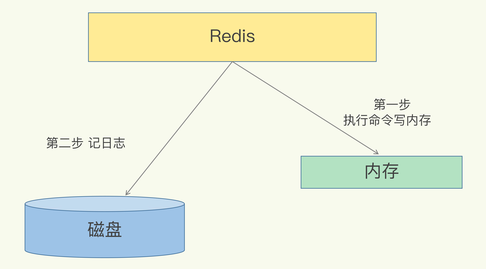
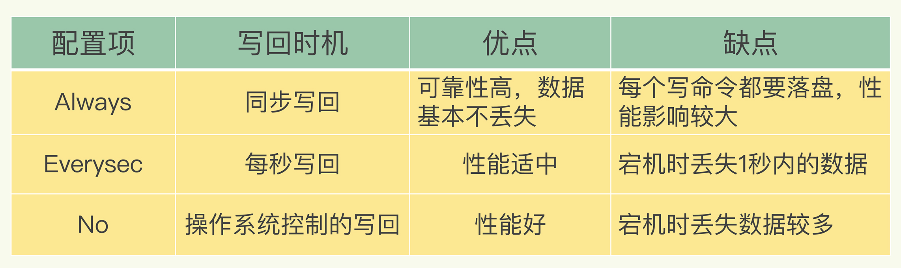
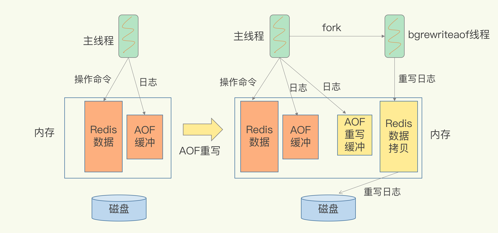
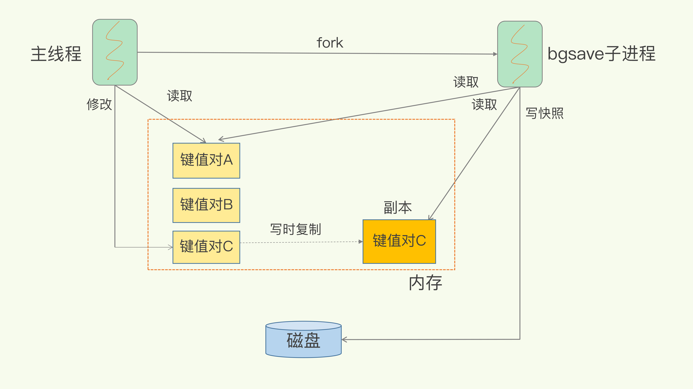
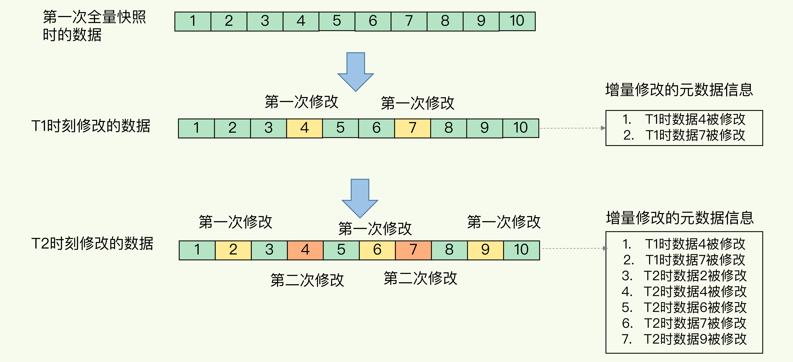
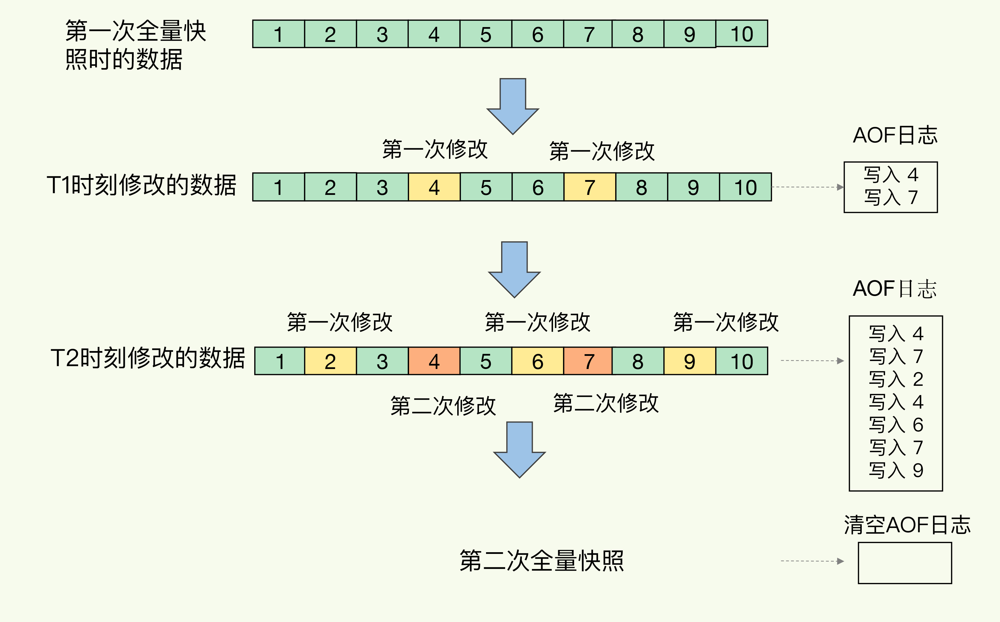
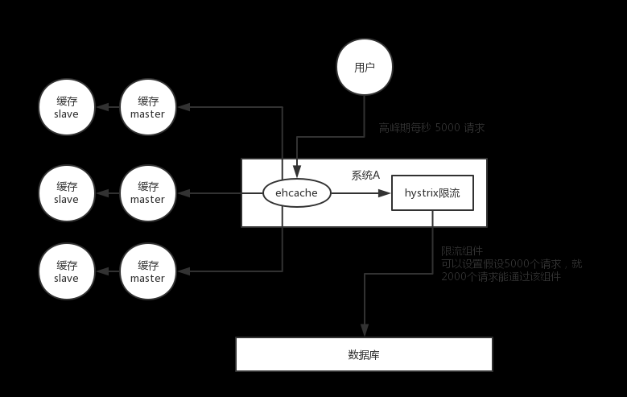
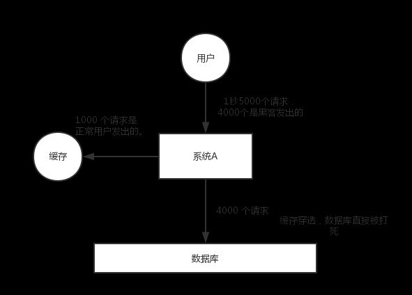

0.redis的使用场景?

    比如：我想知道什么时候封锁一个IP（某一个IP地址在某一段时间内访问的特别频繁，那有可能这个IP可能存在风险，所以对它进行封锁），使用Incrby命令记录当前IP访问次数 
    
    存储用户信息【id,name,age】
    
    存储方式：set(userKey,用户信息字符串) 用户信息字符串不易变动

1.项目中缓存是如何使用的?为什么要用缓存?缓存使用不当会造成什么后果?

    项目中是如何使用的? 这个需要结合自己项目的业务来.
    
    为什么要用缓存?
    用缓存,主要有两个用途:高性能 高并发
    假设这么个场景，你有个操作，一个请求过来，吭哧吭哧你各种乱七八糟操作 mysql，半天查出来一个结果，耗时 600ms。但是这个结果
    可能接下来几个小时都不会变了，或者变了也可以不用立即反馈给用户。那么此时咋办？

    缓存啊，折腾 600ms 查出来的结果，扔缓存里，一个 key 对应一个 value，下次再有人查，别走 mysql 折腾 600ms 了，直接从
    缓存里，通过一个 key 查出来一个 value，2ms 搞定。性能提升 300 倍。

    就是说对于一些需要复杂操作耗时查出来的结果，且确定后面不怎么变化，但是有很多读请求，那么直接将查询出来的结果放在缓存中，后
    面直接读缓存就好。
    
    高并发
    mysql 这么重的数据库，压根儿设计不是让你玩儿高并发的，虽然也可以玩儿，但是天然支持不好。mysql 单机支撑到 2000QPS 也开
    始容易报警了。

    所以要是你有个系统，高峰期一秒钟过来的请求有 1万，那一个 mysql 单机绝对会死掉。你这个时候就只能上缓存，把很多数据放缓存，
    别放mysql。缓存功能简单，说白了就是 key-value 式操作，单机支撑的并发量轻松一秒几万十几万，支撑高并发 so easy。单机承
    载并发量是 mysql 单机的几十倍。
    
    缓存是走内存的,内存天然就支持高并发
    
    缓存使用不当会造成什么后果?
    常见的缓存问题有以下几个：
        缓存与数据库双写不一致
        缓存雪崩、缓存穿透
        缓存并发竞争

2.redis和Memcached有什么区别?redis的线程模型是什么?为什么redis单线程却能支撑高并发?

    redis和Memcached有什么区别?
        1.redis拥有更多的数据结构,支持复杂的操作,更好用
        2.redis原生支持集群模式,在 redis3.x 版本中，便能支持 cluster 模式，而 memcached 没有原生的集群模式，需要依靠
        客户端来实现往集群中分片写入数据。
    
3.redis的线程模型?

文件事件处理器

    Redis基于Reactor模式开发了网络事件处理器,这个处理器就叫做文件事件处理器(file event handler).这个文件事件处理器是单
    线程的,所以Redis才叫做单线程的模型,文件事件处理器采用了IO多路复用机制同时监听多个socket,根据socket上的事件来选择对应
    的事件处理器来处理这个事件;
    
    如果被监听的socket准备好执行accept,read,write,close等事件/操作的时候,跟事件/操作对应的文件事件就会产生,这个时候文件
    事件处理器就会调用之前关联好的事件处理器来处理这个事件;

    文件事件处理器是单线程模式运行的,但是通过IO多路复用机制监听多个socket,可以实现高性能的网络通信模型.又可以跟内部其他单线
    程的模块进行对接,保证了Redis内部的线程模型的简单性;
    
    文件事件处理器的结构包含4个部分:
        ①.多个socket;
        ②.IO多路复用程序;
        ③.文件事件分派器;
        ④.事件处理器(命令请求处理器,命令回复处理器,连接应答处理器等等);
    多个socket可能并发的产生不同的操作,每个操作对应不同的文件事件,但是IO多路复用程序会监听多个socket,会将socket放入一个队
    列中排队,然后每次从队列中取出一个socket给事件分派器,事件分派器再把socket分派给对应的事件处理器去处理;
    
    当一个socket的事件被处理完之后,IO多路复用程序才会将队列中的下一个socket取出交给事件分派器.文件事件分派器再根据socket当
    前产生的事件来选择对应的事件处理器来处理; 
    
文件事件

    1>.当socket变得可读时(比如客户端对Redis执行write操作或者close操作),或者有新的可以应答的socket出现时(客户端对Redis
    执行connect操作),socket就会产生一个"AE_READABLE"事件;

    2>.当socket变得可写的时候(客户端对Redis执行read操作),socket就会产生一个"AE_WRITABLE"事件;

    3>.IO多路复用程序可以同时监听"AE_READABLE"和"AE_WRITABLE"两种事件,要是一个socket同时产生了"AE_READABLE"和"AE
    _WRITABLE"两种事件,那么文件事件分派器会优先处理"AE_READABLE"事件,然后才是"AE_WRITABLE"事件;
    
常用的文件事件处理器

        1>.如果是客户端要连接Redis,那么会为socket关联连接应答处理器;
        2>.如果是客户端要写数据到Redis,那么会为socket关联命令请求处理器;
        3>.如果是客户端要从Redis中读取数据(Redis发送数据给客户端),那么会为socket关联命令回复处理器;

客户端与Redis通信的一次流程


    说明
        ①.在Redis启动及初始化的时候,Redis会(预先)将连接应答处理器跟"AE_READABLE"事件关联起来,接着如果一个客户端向Redis
        发起连接,此时就会产生一个"AE_READABLE"事件,然后由连接应答处理器来处理跟客户端建立连接,创建客户端对应的socket,同
        时将这个socket的"AE_READABLE"事件跟命令请求处理器关联起来;

        ②.当客户端向Redis发起请求的时候(不管是读请求还是写请求,都一样),首先就会在之前创建的客户端对应的socket上产生一个
        "AE_READABLE"事件,然后IO多路复用程序会监听到在之前创建的客户端对应的socket上产生了一个"AE_READABLE"事件,接着
        把这个socket放入一个队列中排队,然后由文件事件分派器从队列中获取socket交给对应的命令请求处理器来处理(因为之前在Red
        is启动并进行初始化的时候就已经预先将"AE_READABLE"事件跟命令请求处理器关联起来了).之后命令请求处理器就会从之前创建
        的客户端对应的socket中读取请求相关的数据,然后在自己的内存中进行执行和处理;

        ③.当客户端请求处理完成,Redis这边也准备好了给客户端的响应数据之后,就会(预先)将socket的"AE_WRITABLE"事件跟命令回
        复处理器关联起来,当客户端这边准备好读取响应数据时,就会在之前创建的客户端对应的socket上产生一个"AE_WRITABLE"事件,
        然后IO多路复用程序会监听到在之前创建的客户端对应的socket上产生了一个"AE_WRITABLE"事件,接着把这个socket放入一个
        队列中排队,然后由文件事件分派器从队列中获取socket交给对应的命令回复处理器来处理(因为之前在Redis这边准备好给客户端的
        响应数据之后就已经预先将"AE_WRITABLE"事件跟命令回复处理器关联起来了),之后命令回复处理器就会向之前创建的客户端对应的
        socket输出/写入准备好的响应数据,最终返回给客户端,供客户端来读取;

        ④.当命令回复处理器将准备好的响应数据写完之后,就会删除之前创建的客户端对应的socket上的"AE_WRITABLE"事件和命令回复
        处理器的关联关系;

为什么Redis单线程模型也能效率这么高?

        1>.纯内存操作;
       
        2>.核心是基于非阻塞的IO多路复用机制;
        
        3>.底层使用C语言实现,一般来说,C 语言实现的程序"距离"操作系统更近,执行速度相对会更快;
        
        4>.单线程同时也避免了多线程的上下文频繁切换问题,预防了多线程可能产生的竞争问题

4.Redis 都有哪些数据类型？分别在哪些场景下使用比较合适？

        redis 主要有以下几种数据类型：

        string
        hash
        list
        set
        sorted set
    
        string这是最简单的类型，就是普通的 set 和 get，做简单的 KV 缓存。set college szu    
        
        hash
        这个是类似 map 的一种结构，这个一般就是可以将结构化的数据，比如一个对象（前提是这个对象没嵌套其他的对象）给缓存在 
        redis 里，然后每次读写缓存的时候，可以就操作 hash 里的某个字段。
        
        hset person name bingo
        hset person age 20
        hset person id 1
        hget person name
        person = {
            "name": "bingo",
            "age": 20,
            "id": 1
        }
        list:有序列表,比如可以通过 lrange 命令，读取某个闭区间内的元素，可以基于 list 实现分页查询             
        set 是无序集合，自动去重。把两个大 V 的粉丝都放在两个 set 中，对两个 set 做交集
        sorted set 是排序的 set，去重但可以排序，写进去的时候给一个分数，自动根据分数排序。
5.redis 的过期策略都有哪些？内存淘汰机制都有哪些？手写一下 LRU 代码实现？
redis 过期策略

    redis 过期策略是：定期删除+惰性删除。
    所谓定期删除，指的是 redis 默认是每隔 100ms 就随机抽取一些设置了过期时间的 key，检查其是否过期，如果过期就删除。
    假设 redis 里放了 10w 个 key，都设置了过期时间，你每隔几百毫秒，就检查 10w 个 key，那 redis 基本上就死了，cpu 负载  
    会很高的，消耗在你的检查过期 key 上了。注意，这里可不是每隔 100ms 就遍历所有的设置过期时间的 key，那样就是一场性能上的  
    灾难。实际上 redis 是每隔 100ms 随机抽取一些 key 来检查和删除的。
    但是问题是，定期删除可能会导致很多过期 key 到了时间并没有被删除掉，那咋整呢？所以就是惰性删除了。这就是说，在你获取某个  
    key 的时候，redis 会检查一下 ，这个 key 如果设置了过期时间那么是否过期了？如果过期了此时就会删除，不会给你返回任何东西。
    获取 key 的时候，如果此时 key 已经过期，就删除，不会返回任何东西。
    但是实际上这还是有问题的，如果定期删除漏掉了很多过期 key，然后你也没及时去查，也就没走惰性删除，此时会怎么样？如果大量过期  
    key 堆积在内存里，导致 redis 内存块耗尽了，咋整？
    答案是：走内存淘汰机制。

redis 内存淘汰机制有以下几个：

    noeviction: 当内存不足以容纳新写入数据时，新写入操作会报错，这个一般没人用吧，实在是太恶心了。
    allkeys-lru：当内存不足以容纳新写入数据时，在键空间中，移除最近最少使用的 key（这个是最常用的）。
    allkeys-random：当内存不足以容纳新写入数据时，在键空间中，随机移除某个 key，这个一般没人用吧，为啥要随机，肯定是把最近最少使用的 key 给干掉啊。
    volatile-lru：当内存不足以容纳新写入数据时，在设置了过期时间的键空间中，移除最近最少使用的 key（这个一般不太合适）。
    volatile-random：当内存不足以容纳新写入数据时，在设置了过期时间的键空间中，随机移除某个 key。
    volatile-ttl：当内存不足以容纳新写入数据时，在设置了过期时间的键空间中，有更早过期时间的 key 优先移除。
```java
class LRUCache<K, V> extends LinkedHashMap<K, V> {
    private final int CACHE_SIZE;

    /**
     * 传递进来最多能缓存多少数据
     *
     * @param cacheSize 缓存大小
     */
    public LRUCache(int cacheSize) {
        // true 表示让 linkedHashMap 按照访问顺序来进行排序，最近访问的放在头部，最老访问的放在尾部。
        super((int) Math.ceil(cacheSize / 0.75) + 1, 0.75f, true);
        CACHE_SIZE = cacheSize;
    }

    @Override
    protected boolean removeEldestEntry(Map.Entry<K, V> eldest) {
        // 当 map中的数据量大于指定的缓存个数的时候，就自动删除最老的数据。
        return size() > CACHE_SIZE;
    }
}
```
```java
 import java.util.LinkedHashMap;
    public class LRUCache {
        private LinkedHashMap<Integer, Integer> map;
        private final int CAPACITY;
        public LRUCache(int capacity) {
            CAPACITY = capacity;
            map = new LinkedHashMap<Integer, Integer>(capacity, 0.75f, true){
                protected boolean removeEldestEntry(Map.Entry eldest) {
                    return size() > CAPACITY;
                }
            };
        }
        public int get(int key) {
            return map.getOrDefault(key, -1);
        }
        public void set(int key, int value) {
            map.put(key, value);
        }
    }
```
6.如何保证 redis 的高并发和高可用？redis 的主从复制原理能介绍一下么？redis 的哨兵原理能介绍一下么？

    主从架构->读写分离

7.数据同步:主从库如何实现数据一致?
Redis具有高可靠性,是什么意思?
两层含义:一是数据尽量少丢失;二是服务尽量少中断.AOF和RDB保证了前者,对于后者,Redis的做法是增加副本冗余量

多副本之间的数据如何保持一致?
Redis提供了主从库模式,以保证数据副本的一致,主从库之间采用的读写分离的方式.
读操作:主库 从库都可以接收
写操作:首先到主库执行,然后,主库将写操作同步给从库

主从库间如何进行第一次同步?
三个阶段


第一阶段是主从库间建立连接 协商同步,主要是为全力复制做准备.在这一步,从库和主库建立起连接,并告诉主库即将进行同步,主库确认回复后,主从库间
就可以开始同步了

第二阶段,主库将所有数据同步给从库.从库收到数据后,在本地完成数据加载.具体说,主句执行bgsave命令,生成RDB文件
接着讲文件发给从库.从库接收到RDB文件后,会先清空当前数据库,然后加载RDB文件

第三阶段,主库会把第二阶段执行过程中新收到的写命令,再发送给从库

主从级联模式分担全量复制时的主库压力
分析主从库间第一次数据同步的过程,可以看到,一次全量复制中,对于主库来说,需要完成两个耗时的操作:生成RDB文件和传输RDB文件

1)如果从库数量很多,而且都要和主库进行全量复制的话,就会导致主库忙于fork子进程生成RDB,进行数据全量同步.fork这个操作会阻塞主线程处理正常
请求,从而导致主库响应应用程序的请求速度变慢
2)传输RDB文件也会占用主库的网络带宽,同样给主库的资源使用带来压力.

下面介绍更好的解决办法 "主-从-从"模式 通过“主 - 从 - 从”模式将主库生成 RDB 和传输 RDB 的压力，以级联的方式分散到从库上。
简单来说，我们在部署主从集群的时候，可以手动选择一个从库（比如选择内存资源配置较高的从库），用于级联其他的从库。然后，我们可以再选择一些从库（例如三分之一的从库），在这些从库上执行如下命令，让它们和刚才所选的从库，建立起主从关系。
这样一来，这些从库就会知道，在进行同步时，不用再和主库进行交互了，只要和级联的从库进行写操作同步就行了，这就可以减轻主库上的压力，如下图所示


8.哨兵集群:哨兵挂了,主从库还能切换吗?

    哨兵其实就是一个运行在特殊模式下的 Redis 进程，主从库实例运行的同时，它也在运行。
    哨兵主要负责的就是三个任务：监控、选主（选择主库）和通知
    
    我们先看监控。监控是指哨兵进程在运行时，周期性地给所有的主从库发送 PING 命令，检测它们是否仍然在线运行。如果从库没有在规
    定时间内响应哨兵的 PING 命令，哨兵就会把它标记为“下线状态”；同样，如果主库也没有在规定时间内响应哨兵的 PING 命令，哨兵
    就会判定主库下线，然后开始自动切换主库的流程。
    这个流程首先是执行哨兵的第二个任务，选主。主库挂了以后，哨兵就需要从很多个从库里，按照一定的规则选择一个从库实例，把它作为
    新的主库。这一步完成后，现在的集群里就有了新主库。
    然后，哨兵会执行最后一个任务：通知。在执行通知任务时，哨兵会把新主库的连接信息发给其他从库，让它们执行 replicaof 命令，
    和新主库建立连接，并进行数据复制。同时，哨兵会把新主库的连接信息通知给客户端，让它们把请求操作发到新主库上。


如何监控

    在这三个任务中，通知任务相对来说比较简单，哨兵只需要把新主库信息发给从库和客户端，让它们和新主库建立连接就行，并不涉及决策
    的逻辑。但是，在监控和选主这两个任务中，哨兵需要做出两个决策: 在监控任务中，哨兵需要判断主库是否处于下线状态；
    在选主任务中，哨兵也要决定选择哪个从库实例作为主库。
    接下来，我们就先说说如何判断主库的下线状态。你首先要知道的是，哨兵对主库的下线判断有“主观下线”和“客观下线”两种。那么，
    为什么会存在两种判断呢？它们的区别和联系是什么呢？
        
    哨兵进程会使用 PING 命令检测它自己和主、从库的网络连接情况，用来判断实例的状态。如果哨兵发现主库或从库对 PING 命令的响应
    超时了，那么，哨兵就会先把它标记为“主观下线”。  
    
    但是，如果检测的是主库，那么，哨兵还不能简单地把它标记为“主观下线”，开启主从切换。因为很有可能存在这么一个情况：那就是哨兵
    误判了，其实主库并没有故障。可是，一旦启动了主从切换，后续的选主和通知操作都会带来额外的计算和通信开销。 
    
    首先，我们要知道啥叫误判。很简单，就是主库实际并没有下线，但是哨兵误以为它下线了。误判一般会发生在集群网络压力较大、网络拥塞，
    或者是主库本身压力较大的情况下。一旦哨兵判断主库下线了，就会开始选择新主库，并让从库和新主库进行数据同步，这个过程本身就会有
    开销，例如，哨兵要花时间选出新主库，从库也需要花时间和新主库同步。而在误判的情况下，主库本身根本就不需要进行切换的，所以这
    个过程的开销是没有价值的。正因为这样，我们需要判断是否有误判，以及减少误判。 
    
    那怎么减少误判呢？在日常生活中，当我们要对一些重要的事情做判断的时候，经常会和家人或朋友一起商量一下，然后再做决定。
    
    哨兵机制也是类似的，它通常会采用多实例组成的集群模式进行部署，这也被称为哨兵集群。引入多个哨兵实例一起来判断，就可以避免单
    个哨兵因为自身网络状况不好，而误判主库下线的情况。同时，多个哨兵的网络同时不稳定的概率较小，由它们一起做决策，误判率也能降低。
    
    在判断主库是否下线时，不能由一个哨兵说了算，只有大多数的哨兵实例，都判断主库已经“主观下线”了，主库才会被标记为“客观下线”，
    这个叫法也是表明主库下线成为一个客观事实了。这个判断原则就是：少数服从多数。同时，这会进一步触发哨兵开始主从切换流程。
    
    “客观下线”的标准就是，当有 N 个哨兵实例时，最好要有 N/2 + 1 个实例判断主库为“主观下线”，才能最终判定主库为“客观下线”。
    这样一来，就可以减少误判的概率，也能避免误判带来的无谓的主从库切换。（当然，有多少个实例做出“主观下线”的判断才可以，可以由 Redis 管理员自行设定）。

如何选主?


    在选主时，除了要检查从库的当前在线状态，还要判断它之前的网络连接状态。如果从库总是和主库断连，而且断连次数超出了一定的阈值
    ，我们就有理由相信，这个从库的网络状况并不是太好，就可以把这个从库筛掉了。
    
    接下来就要给剩余的从库打分了。我们可以分别按照三个规则依次进行三轮打分，这三个规则分别是从库优先级、从库复制进度以及从库 
    ID 号。只要在某一轮中，有从库得分最高，那么它就是主库了，选主过程到此结束。如果没有出现得分最高的从库，那么就继续进行下一轮。
    
    第一轮：优先级最高的从库得分高。用户可以通过 slave-priority 配置项，给不同的从库设置不同优先级。比如，你有两个从库，
    它们的内存大小不一样，你可以手动给内存大的实例设置一个高优先级。在选主时，哨兵会给优先级高的从库打高分，如果有一个从库优先
    级最高，那么它就是新主库了。如果从库的优先级都一样，那么哨兵开始第二轮打分。
    
    第二轮：和旧主库同步程度最接近的从库得分高。这个规则的依据是，如果选择和旧主库同步最接近的那个从库作为主库，那么，这个新主
    库上就有最新的数据。

    我们想要找的从库，它的 slave_repl_offset 需要最接近 master_repl_offset。如果在所有从库中，有从库的 
    slave_repl_offset 最接近 master_repl_offset，那么它的得分就最高，可以作为新主库。
    
    就像下图所示，旧主库的 master_repl_offset 是 1000，从库 1、2 和 3 的 slave_repl_offset 分别是 950、990 和 900，
    那么，从库 2 就应该被选为新主库。


    当然，如果有两个从库的 slave_repl_offset 值大小是一样的（例如，从库 1 和从库 2 的 slave_repl_offset 值都是 990）
    ，我们就需要给它们进行第三轮打分了。
    
    第三轮：ID 号小的从库得分高。
    每个实例都会有一个 ID，这个 ID 就类似于这里的从库的编号。目前，Redis 在选主库时，有一个默认的规定：
    在优先级和复制进度都相同的情况下，ID 号最小的从库得分最高，会被选为新主库。
    到这里，新主库就被选出来了，“选主”这个过程就完成了。

9.哨兵挂了,主从库还能切换吗?

    一旦多个实例组成了哨兵集群，即使有哨兵实例出现故障挂掉了，其他哨兵还能继续协作完成主从库切换的工作，包括判定主库是不是处于
    下线状态，选择新主库，以及通知从库和客户端。

    哨兵实例之间可以相互发现，要归功于 Redis 提供的 pub/sub 机制，也就是发布 / 订阅机制
    哨兵只要和主库建立起了连接，就可以在主库上发布消息了，比如说发布它自己的连接信息（IP 和端口）。同时，它也可以从主库上订阅
    消息，获得其他哨兵发布的连接信息。当多个哨兵实例都在主库上做了发布和订阅操作后，它们之间就能知道彼此的 IP 地址和端口。

    除了哨兵实例，我们自己编写的应用程序也可以通过 Redis 进行消息的发布和订阅。所以，为了区分不同应用的消息，Redis 会以频道
    的形式，对这些消息进行分门别类的管理。所谓的频道，实际上就是消息的类别。当消息类别相同时，它们就属于同一个频道。反之，就属
    于不同的频道。只有订阅了同一个频道的应用，才能通过发布的消息进行信息交换。
    
    在主从集群中，主库上有一个名为“__sentinel__:hello”的频道，不同哨兵就是通过它来相互发现，实现互相通信的
    
    我来举个例子，具体说明一下。在下图中，哨兵 1 把自己的 IP（172.16.19.3）和端口（26579）发布到“__sentinel__:hello”
    频道上，哨兵 2 和 3 订阅了该频道。那么此时，哨兵 2 和 3 就可以从这个频道直接获取哨兵 1 的 IP 地址和端口号。
    
    然后，哨兵 2、3 可以和哨兵 1 建立网络连接。通过这个方式，哨兵 2 和 3 也可以建立网络连接，这样一来，哨兵集群就形成了。它
    们相互间可以通过网络连接进行通信，比如说对主库有没有下线这件事儿进行判断和协商。


    哨兵除了彼此之间建立起连接形成集群外，还需要和从库建立连接。这是因为，在哨兵的监控任务中，它需要对主从库都进行心跳判断，
    而且在主从库切换完成后，它还需要通知从库，让它们和新主库进行同步

那么，哨兵是如何知道从库的 IP 地址和端口的呢？

    这是由哨兵向主库发送 INFO 命令来完成的。就像下图所示，哨兵 2 给主库发送 INFO 命令，主库接受到这个命令后，就会把从库列表
    返回给哨兵。接着，哨兵就可以根据从库列表中的连接信息，和每个从库建立连接，并在这个连接上持续地对从库进行监控。哨兵 1 和 3 可以通过相同的方法和从库建立连接。

    你看，通过 pub/sub 机制，哨兵之间可以组成集群，同时，哨兵又通过 INFO 命令，获得了从库连接信息，也能和从库建立连接，
    并进行监控了。
    
    但是，哨兵不能只和主、从库连接。因为，主从库切换后，客户端也需要知道新主库的连接信息，才能向新主库发送请求操作。所以，哨兵
    还需要完成把新主库的信息告诉客户端这个任务。
    
    此时，我们仍然可以依赖 pub/sub 机制，来帮助我们完成哨兵和客户端间的信息同步。

基于 pub/sub 机制的客户端事件通知

    从本质上说，哨兵就是一个运行在特定模式下的 Redis 实例，只不过它并不服务请求操作，只是完成监控、选主和通知的任务。所以，
    每个哨兵实例也提供 pub/sub 机制，客户端可以从哨兵订阅消息。哨兵提供的消息订阅频道有很多，不同频道包含了主从库切换过程中
    的不同关键事件。


    知道了这些频道之后，你就可以让客户端从哨兵这里订阅消息了。具体的操作步骤是，客户端读取哨兵的配置文件后，可以获得哨兵的地址
    和端口，和哨兵建立网络连接。然后，我们可以在客户端执行订阅命令，来获取不同的事件消息。
    
    你也可以执行如下命令，订阅所有的事件PSUBSCRIBE  *
    
    当哨兵把新主库选择出来后，客户端就会看到下面的 switch-master 事件。这个事件表示主库已经切换了，新主库的 IP 地址和端口
    信息已经有了。这个时候，客户端就可以用这里面的新主库地址和端口进行通信了。

主库故障以后，哨兵集群有多个实例，那怎么确定由哪个哨兵来进行实际的主从切换呢？

    确定由哪个哨兵执行主从切换的过程，和主库“客观下线”的判断过程类似，也是一个“投票仲裁”的过程
    任何一个实例只要自身判断主库“主观下线”后，就会给其他实例发送 is-master-down-by-addr 命令。接着，其他实例会根据自己和
    主库的连接情况，做出 Y 或 N 的响应，Y 相当于赞成票，N 相当于反对票。


    一个哨兵获得了仲裁所需的赞成票数后，就可以标记主库为“客观下线”。这个所需的赞成票数是通过哨兵配置文件中的 quorum 配置项设
    定的。例如，现在有 5 个哨兵，quorum 配置的是 3，那么，一个哨兵需要 3 张赞成票，就可以标记主库为“客观下线”了。这 3 张赞
    成票包括哨兵自己的一张赞成票和另外两个哨兵的赞成票。
    
    此时，这个哨兵就可以再给其他哨兵发送命令，表明希望由自己来执行主从切换，并让所有其他哨兵进行投票。这个投票过程称为“Leader
     选举”。因为最终执行主从切换的哨兵称为 Leader，投票过程就是确定 Leader。
    
    在投票过程中，任何一个想成为 Leader 的哨兵，要满足两个条件：第一，拿到半数以上的赞成票；第二，拿到的票数同时还需要大于等
    于哨兵配置文件中的 quorum 值。以 3 个哨兵为例，假设此时的 quorum 设置为 2，那么，任何一个想成为 Leader 的哨兵只要拿到
    2 张赞成票，就可以了 

10.AOF日志:宕机了,Redis如何避免数据丢失?

    1.你会把Redis用在什么业务场景下?
    我会把它当做缓存使用,因为它把后端数据库中的数据存储在内存中,然后直接从内存中读取数据,响应速度会非常快.
    一旦服务器宕机,内存中的数据将全部丢失
    2.Redis的持久化主要有两大机制,即AOF日志和RDB快照
    3.AOF日志是如何实现的?
    AOF日志是写后日志,写后的意思是Redis是先执行命令,把数据写入内存,然后才记录日志


    4.AOF为什么要先执行命令再记日志?
    要回答这个问题,我们先要知道AOF记录了什么内容.AOF里记录的是Redis收到的每一条命令,这些命令是以文本形式保存的.
    为了避免额外的检查开销,Redis在向AOF里面记录日志的时候,并不会先去对这些命令进行语法检查.所以,如果先记日志再执行
    命令的话,日志中就有可能记录了错误的命令,Redis在使用日志恢复数据是,就可能会出错
    而写后日志这种方式,就是先让系统执行命令,只有命令能执行成功,才会被记录到日志中.否则,系统就会直接向客户端报错,所以
    Redis使用写后日志这一方式的一大好处是,可以避免出现记录错误命令的情况.
    除此之外,AOF还有一个好处:它是在命令执行后记录日志,所以不会阻塞当前的写操作.
    
    5.AOF的两个潜在风险?
    首先,如果刚执行完一个命令,还没有来得及记日志就宕机了,那么这个命令和相应的数据就有丢失.如果此时Redis是用作缓存,还可以
    从后端数据库重新读入数据进行恢复,但是,如果Redis是直接用作数据库的话,此时,因为命令没有记入日志,所以就无法用日志进行
    恢复了
    其次,AOF虽然避免了对当前命令的阻塞,但可能会给下一个操作带来阻塞风险.这是因为,AOF日志也是在主线程中执行的,如果在把
    日志文件写入磁盘时,磁盘写压力大,就会导致写盘很慢,进而导致后续的操作也无法执行了.
    仔细分析的话,你就会发现,这两个风险都是和AOF写回磁盘的时机相关的.这也就意味着,如果我们能够控制一个写命令执行完后AOF
    日志写回磁盘的时机,这两个风险就解除了.
    
    6.三种写回策略
    其实,对于这个问题,AOF机制给我们提供了三个选择,也就是AOF配置项appendfsync的三个可选值.
    Always,同步写回:每个写命令执行完,立马同步的将日志写回磁盘.
    Everysec每秒写回:每个写命令执行完,只是先把日志写到AOF文件的内存缓冲区,每隔一秒把缓冲区的内容写入磁盘.
    NO:操作系统控制的写回,每个写命令执行完,只是先把日志写到AOF文件的内存缓冲区,由操作系统决定何时将换缓冲区内容写回磁盘
    
    # no: don't fsync, just let the OS flush the data when it wants. Faster.
    # always: fsync after every write to the append only log. Slow, Safest.
    # everysec: fsync only one time every second. Compromise.
    
    针对避免主线程阻塞和减少数据丢失的问题,这三种写回策略都无法做到两全其美.我们来分析下其中的原因.
    同步写回可以做到基本不丢数据,但是他在每一个写命令后都有一个慢速的落盘操作,不可避免的会影响主线程性能.
    
    虽然操作系统控制的写回在写完缓冲区后,就可以继续执行后续的命令,但是落盘的时机已经不再Redis手中了,只要AOF记录没有写回磁盘,
    一旦宕机对应的数据就丢失了.
    
    每秒写回采用一秒写回一次的频率,避免了同步写回的性能开销,虽然减少了对系统性能的影响,但是如果发生宕机,上一秒未落盘的命令操作
    仍然会丢失,所以这只能算是,在避免影响主线程性能和避免数据丢失两者间取了个折中.


    总结下,想要获得高性能,就选择NO策略;如果想要得到高可靠性保证,就选择Always策略,如果允许数据有一点丢失,又希望性能别受太大
    影响的话,那么就选择EverySec策略
    
    7.避免AOF文件过大带来的性能问题
    一是,文件系统本身对文件大小有限制,无法保存过大的文件
    二是,如果文件太大,之后再往里面追加命令记录的话,效率也会变低
    三是,如果发生宕机,AOF中记录的命令要一个个被重新执行,用于故障恢复,如果日志文件太大,整个恢复过程就会非常缓慢,这就会影响到Redis的
    正常使用

    8.如何避免日志文件过大?使用AOF重写机制
    AOF 重写机制就是在重写时，Redis 根据数据库的现状创建一个新的 AOF 文件，也就是说，读取数据库中的所有键值对，然后对每一个
    键值对用一条命令记录它的写入。比如说，当读取了键值对“testkey”: “testvalue”之后，重写机制会记录 set testkey testvalue
    这条命令。这样，当需要恢复时，可以重新执行该命令，实现“testkey”: “testvalue”的写入。    

    为什么重写机制可以把日志文件变小呢? 实际上，重写机制具有“多变一”功能。所谓的“多变一”，也就是说，旧日志文件中的多条命令，
    在重写后的新日志中变成了一条命令。
    
    我们知道，AOF 文件是以追加的方式，逐一记录接收到的写命令的。当一个键值对被多条写命令反复修改时，AOF 文件会记录相应的多条命令。
    但是，在重写的时候，是根据这个键值对当前的最新状态，为它生成对应的写入命令。这样一来，一个键值对在重写日志中只用一条命令就行了，
    而且，在日志恢复时，只用执行这条命令，就可以直接完成这个键值对的写入了。
    
    8.AOF重写会阻塞吗?
    和 AOF 日志由主线程写回不同，重写过程是由后台线程 bgrewriteaof 来完成的，这也是为了避免阻塞主线程，导致数据库性能下降。
    
    一个拷贝,两处日志
    “一个拷贝”就是指，每次执行重写时，主线程 fork 出后台的 bgrewriteaof 子进程。此时，fork 会把主线程的内存拷贝一份给 
    bgrewriteaof 子进程，这里面就包含了数据库的最新数据。然后，bgrewriteaof 子进程就可以在不影响主线程的情况下，逐一把
    拷贝的数据写成操作，记入重写日志
    
    两处日志
    因为主线程未阻塞，仍然可以处理新来的操作。此时，如果有写操作，第一处日志就是指正在使用的 AOF 日志，Redis 会把这个操作写到
    它的缓冲区。这样一来，即使宕机了，这个 AOF 日志的操作仍然是齐全的，可以用于恢复。
    
    而第二处日志，就是指新的 AOF 重写日志。这个操作也会被写到重写日志的缓冲区。这样，重写日志也不会丢失最新的操作。等到拷贝数
    据的所有操作记录重写完成后，重写日志记录的这些最新操作也会写入新的 AOF 文件，以保证数据库最新状态的记录。此时，我们就可以
    用新的 AOF 文件替代旧文件了。
    
    总结来说，每次 AOF 重写时，Redis 会先执行一个内存拷贝，用于重写；然后，使用两个日志保证在重写过程中，新写入的数据不会丢失
    。而且，因为 Redis 采用额外的线程进行数据重写，所以，这个过程并不会阻塞主线程。


11.内存快照:宕机后,Redis如何实现快速恢复?

    基本概念:内存快照,就是指内存中的数据在某一个时刻的状态记录.
    
    1.给哪些内存数据做快照?
    Redis的数据都在内存中,为了提供所有数据的可靠性保证,它执行的是全量快照,也就是说,把内存中的所有数据都记录到磁盘中.
    
    对应Redis而言,它的单线程模型就决定了,我们要尽量避免所有会阻塞主线程的操作,所以,针对任何操作,我们都会提一个灵魂之
    问:它会阻塞主线程吗?RDB文件的生成是否会阻塞主线程,这就关系到是否会降低Redis的性能
    
    2.save和bgsave两个命令
    save:在主线程中执行,会导致阻塞
    bgsave:创建一个子线程,专门用于写入RDB文件,避免了主线程的阻塞,这也是Redis RDB文件生成的默认配置
    
    3.快照数据能修改吗?
    避免阻塞和正常处理写操作并不是一回事.此时,主线程的确并没有阻塞,可以正常接收请求,但是,为了保证快照完整性,它只能处理读操作,
    因为不能修改正在执行快照的数据.
    为了快照而暂停写操作,肯定是不能接受的.所以这个时候,Redis就会借助操作系统提供的写时复制技术COW,在执行快照的同时,正常处理
    写操作.
    
    4.写时复制机制
    bgsave子进程是由主进程 fork 生成的,可以共享主线程的所有内存数据.bgsave子进程运行后,开始读取主线程的内存数据,并把他们写
    入RDB文件.
    此时,如果主线程对这些数据都是读操作,那么主线程和bgsave子进程相互不影响.但是,如果主线程要修改一块数据,那么这块数据就会被复制
    一份,生成该数据的副本.然后,bgsave子进程会把这个副本写入RDB文件,而这个过程中,主线程仍然可以直接修改原来的数据
    这样既保证了快照的完整性,也允许主线程同时对数据进行修改,避免了对正常业务的影响.
    
    到这里，我们就解决了对“哪些数据做快照”以及“做快照时数据能否修改”这两大问题：Redis 会使用 bgsave 对当前内存中的所有数据
    做快照，这个操作是子进程在后台完成的，这就允许主线程同时可以修改数据


    5.可以每秒做一次快照吗?
    如果频繁的执行全量快照,也会带来两方面的开销.
    一方面，频繁将全量数据写入磁盘，会给磁盘带来很大压力，多个快照竞争有限的磁盘带宽，前一个快照还没有做完，后一个又开始做了，
    容易造成恶性循环
    另一方面，bgsave 子进程需要通过 fork 操作从主线程创建出来。虽然，子进程在创建后不会再阻塞主线程，但是，fork 这个创建过
    程本身会阻塞主线程，而且主线程的内存越大，阻塞时间越长。如果频繁 fork 出 bgsave 子进程，这就会频繁阻塞主线程了
    
    6.增量快照
    所谓增量快照，就是指，做了一次全量快照后，后续的快照只对修改的数据进行快照记录，这样可以避免每次全量快照的开销。
    在第一次做完全量快照后，T1 和 T2 时刻如果再做快照，我们只需要将被修改的数据写入快照文件就行.
    但是，这么做的前提是，我们需要记住哪些数据被修改了。你可不要小瞧这个“记住”功能，它需要我们使用额外的元数据信息去记录哪些
    数据被修改了，这会带来额外的空间开销问题



    缺陷:如果我们对每一个键值对的修改，都做个记录，那么，如果有 1 万个被修改的键值对，我们就需要有 1 万条额外的记录。而且，
    有的时候，键值对非常小，比如只有 32 字节，而记录它被修改的元数据信息，可能就需要 8 字节，这样的话，为了“记住”修改，引入的
    额外空间开销比较大。这对于内存资源宝贵的 Redis 来说，有些得不偿失
    
    到这里，你可以发现，虽然跟 AOF 相比，快照的恢复速度快，但是，快照的频率不好把握，如果频率太低，两次快照间一旦宕机，就可能
    有比较多的数据丢失。如果频率太高，又会产生额外开销，那么，还有什么方法既能利用 RDB 的快速恢复，又能以较小的开销做到尽量少
    丢数据呢
    
    7.混合使用AOF日志和内存快照的方法
    内存快照以一定的频率执行，在两次快照之间，使用 AOF 日志记录这期间的所有命令操作.
    这样一来，快照不用很频繁地执行，这就避免了频繁 fork 对主线程的影响。而且，AOF 日志也只用记录两次快照间的操作，也就是说，
    不需要记录所有操作了，因此，就不会出现文件过大的情况了，也可以避免重写开销。

    如下图所示，T1 和 T2 时刻的修改，用 AOF 日志记录，等到第二次做全量快照时，就可以清空 AOF 日志，因为此时的修改都已经记录
    到快照中了，恢复时就不再用日志了。
    
    这个方法既能享受到 RDB 文件快速恢复的好处，又能享受到 AOF 只记录操作命令的简单优势，颇有点“鱼和熊掌可以兼得”的感觉，建议
    你在实践中用起来


12.redis持久化的两种方式?

    RDB:RDB持久化机制,是对redis中的数据进行周期性的持久化.
    AOF:AOF机制对每条写入命令作为日志,以append-only的模式写入一个日志文件中,在redis重启的时候,可以通过回放
    AOF日志中的写入指令来重新构建整个数据集.
    如果 redis 挂了，服务器上的内存和磁盘上的数据都丢了，可以从云服务上拷贝回来之前的数据，放到指定的目录中，然后重新启动 
    redis，redis 就会自动根据持久化数据文件中的数据，去恢复内存中的数据，继续对外提供服务。
    
    如果同时使用AOF和RDB两种持久化机制,那么在redis重启的时候,会使用AOF来重新构建数据,因为AOF中的数据更加完整.
    
    RDB方式的优缺点
    
    RDB 会生成多个数据文件，每个数据文件都代表了某一个时刻中 redis 的数据，这种多个数据文件的方式，非常适合做冷备，可以将这种
    完整的数据文件发送到一些远程的安全存储上去，比如说 Amazon 的 S3 云服务上去，在国内可以是阿里云的 ODPS 分布式存储上，以
    预定好的备份策略来定期备份 redis 中的数据。
    
    RDB 对 redis 对外提供的读写服务，影响非常小，可以让 redis 保持高性能，因为 redis 主进程只需要 fork 一个子进程，让子
    进程执行磁盘 IO 操作来进行 RDB 持久化即可。
    
    相对于 AOF 持久化机制来说，直接基于 RDB 数据文件来重启和恢复 redis 进程，更加快速
    
    如果想要在 redis 故障时，尽可能少的丢失数据，那么 RDB 没有 AOF 好。一般来说，RDB 数据快照文件，都是每隔 5 分钟，或者
    更长时间生成一次，这个时候就得接受一旦 redis 进程宕机，那么会丢失最近 5 分钟的数据
    
    RDB 每次在 fork 子进程来执行 RDB 快照数据文件生成的时候，如果数据文件特别大，可能会导致对客户端提供的服务暂停数毫秒，或
    者甚至数秒。
    
    AOF方式的优点

    AOF 可以更好的保护数据不丢失，一般 AOF 会每隔 1 秒，通过一个后台线程执行一次fsync操作，最多丢失 1 秒钟的数据。
    
    AOF 日志文件以 append-only 模式写入，所以没有任何磁盘寻址的开销，写入性能非常高，而且文件不容易破损，即使文件尾部破损，
    也很容易修复。
    
    AOF 日志文件即使过大的时候，出现后台重写操作，也不会影响客户端的读写。因为在 rewrite log 的时候，会对其中的指令进行压缩，
    创建出一份需要恢复数据的最小日志出来。在创建新日志文件的时候，老的日志文件还是照常写入。当新的 merge 后的日志文件 ready 
    的时候，再交换新老日志文件即可。
    
    AOF 日志文件的命令通过非常可读的方式进行记录，这个特性非常适合做灾难性的误删除的紧急恢复。比如某人不小心用 flushall 命令
    清空了所有数据，只要这个时候后台 rewrite 还没有发生，那么就可以立即拷贝 AOF 文件，将最后一条 flushall 命令给删了，然后
    再将该 AOF 文件放回去，就可以通过恢复机制，自动恢复所有数据。
    
    AOF方式的缺点:
    对于同一份数据来说，AOF 日志文件通常比 RDB 数据快照文件更大。
    AOF 开启后，支持的写 QPS 会比 RDB 支持的写 QPS 低，因为 AOF 一般会配置成每秒 fsync 一次日志文件，当然，每秒一次 
    fsync，性能也还是很高的。（如果实时写入，那么 QPS 会大降，redis 性能会大大降低）
    
    RDB和AOF到底该如何选择?
    不要仅仅使用 RDB，因为那样会导致你丢失很多数据；
    
    也不要仅仅使用 AOF，因为那样有两个问题：第一，你通过 AOF 做冷备，没有 RDB 做冷备来的恢复速度更快；第二，RDB 每次简单粗暴生成  
    数据快照，更加健壮，可以避免 AOF 这种复杂的备份和恢复机制的 bug；
    
    redis 支持同时开启开启两种持久化方式，我们可以综合使用 AOF 和 RDB 两种持久化机制，用 AOF 来保证数据不丢失，作为数据恢
    复的第一选择; 用 RDB 来做不同程度的冷备，在 AOF 文件都丢失或损坏不可用的时候，还可以使用 RDB 来进行快速的数据恢复
13.了解什么是redis的雪崩 穿透和击穿?redis崩溃之后会怎么样?系统该如何应对这种情况?如何处理redis的穿透?

    缓存雪崩
    对于系统A,假设每天高峰期每秒5000个请求,本来缓存在高峰期可以抗住每秒4000个请求,但是缓存机器意外发生了全盘宕机.缓存挂了,
    此时1秒5000个请求全部落到数据库,数据库必然扛不住,它会报警,然后就挂了,此时,如果没有采用什么特别的方案来处理这个故障,DBA
    很捉急,重启数据库,但是数据库立马又被新的流量给打死了.这就是缓存雪崩.
    
    缓存雪崩的事前 事中 事后的解决方案如下:
        事前:redis高可用,主从+哨兵,redis cluster,避免全盘崩溃.
        事中:本地ehcache+hystrix限流&降级,避免mysql被打死.
        事后:redis持久化一旦重启,自动从磁盘上加载数据,快速恢复缓存数据
    用户发送一个请求,系统A收到请求后,先查本地ehcache缓存,如果没查到再查redis.如果ehcache和redis都没有,再查数据库,将数据
    库中的结果,写入ehcache和redis中.
    限流组件,可以设置每秒的请求,有多少能通过组件,剩余的未通过的请求,怎么办?走降级!可以返回一些默认的值,或者友情提示,或者空白的值.
    好处:
        数据库绝对不会死,限流组件确保了每秒只有多少个请求能通过.
        只要数据库不死,就是说,对用户来说,2/5的请求都是可以被处理的.
        只要有2/5的请求可以被处理,就意味着你的系统没死,对用户来说,可能就是点击几次刷不出来页面,但是多点几次,就可以刷出来一次.



    缓存穿透
    对于系统A,假设一秒5000个请求,结果其中4000个请求时黑客发出的恶意攻击.
    黑客发出的那4000个攻击,缓存中查不到,每次你去数据库里查,也查不到.
    举个例子,数据库id是从1开始的,结果黑客发过来的请求id全部都是负数.这样的话,缓存中不会有,请求每次都视缓存于无物,
    直接查询数据库.这种恶意攻击场景的缓存穿透就会直接把数据库打死
    
    解決方式很简单,每次系统A从数据库中只要没查到,就写一个空值到缓存里去,比如 set -999 UNKNOWN.然后设置一个过期
    时间,这样的话,下次有相同的key来访问的时候,在缓存失效之前,都可以直接从缓存中取数据


    缓存击穿
    缓存击穿,就是说某个key非常热点,访问非常频繁,处于集中式高并发访问的情况,当这个key在失效的瞬间,大量的请求就击穿了缓存,
    直接请求数据库,就像是在一道屏障上凿开了一个洞.
    解决方式也很简单,可以将热点数据设置为永远不过期;或者基于redis or zookeeper实现互斥锁,等待第一个请求构建完缓存之后,
    再释放锁,进而其它请求才能通过该key访问数据.  

14.如何保证缓存与数据库的双写一致性?


15.Redis的并发竞争问题是什么?如何解决这个问题?了解Redis事务的CAS方案吗?

    面试官心理分析
    这个也是线上非常常见的一个问题,就是多客户端同时并发写一个key,可能本来应该先到的数据后到了,导致数据版本错了;
    或者是多客户端同时获取一个key,修改值之后再写回去,只要顺序错了,数据就错了.
    而且redis自己就有天然解决这个问题的CAS类的乐观锁方案.
    
    面试题剖析
    某个时刻,多个系统实例都去更新某个key.可以基于zookeeper实现分布式锁.每个系统通过zookeeper获取分布式锁,确保
    同一时间,只能有一个系统实例在操作某个key,别人都不允许读和写
    
    你要写入缓存的数据,都是从mysql里查出来的,都得写入mysql中,写入mysql中的时候必须保存一个时间戳,从mysql查出来的
    时候,时间戳也查出来.
    
    每次要写之前,先判断一下当前这个value的时间戳是否比缓存里的value的时间戳要更新.如果是的话,那么可以写,否则,就不能用旧的
    数据覆盖新的数据.

16.生产环境中的Redis是怎么部署的?

    redis cluster,10台机器,5台机器部署了redis主实例,另外5台机器部署了redis的从实例,每个主实例挂了一个从实例,
    5个节点对外提供读写服务,每个节点的读写高峰qps可能可以达到每秒5万,5台机器最多是25万读写请求/s      uioooj\ 
    
    机器是什么配置？32G 内存+ 8 核 CPU + 1T 磁盘，但是分配给 redis 进程的是10g内存，一般线上生产环境，redis 的内存尽量不要超过 10g，超过 10g 可能会有问题。

5 台机器对外提供读写，一共有 50g 内存。

因为每个主实例都挂了一个从实例，所以是高可用的，任何一个主实例宕机，都会自动故障迁移，redis 从实例会自动变成主实例继续提供读写服务。

你往内存里写的是什么数据？每条数据的大小是多少？商品数据，每条数据是 10kb。100 条数据是 1mb，10 万条数据是 1g。常驻内存的是 200 万条商品数据，  
占用内存是 20g，仅仅不到总内存的 50%。目前高峰期每秒就是 3500 左右的请求量

https://blog.csdn.net/tmeng521/article/details/91039391