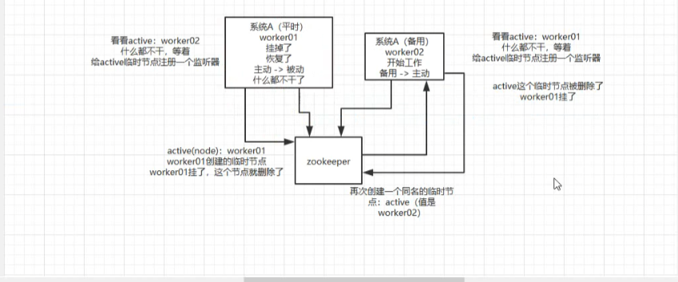

说说zookeeper一般都有哪些使用场景?

    1.分布式协调:这个其实是zk很经典的一个用法,简单来说,就好比,你A系统发送个请求到mq,然后系统B消费消息之后处理了
    那A系统如何知道B系统的处理结果呢?
    用zk就可以实现分布式系统之间的协调工作.A系统发送请求之后可以在zk上对某个节点的值注册监听器,一旦B系统处理完了就修改zk那个
    节点的值,A立马就可以收到通知

    2.分布式锁
    
    3.元数据/配置信息管理:存储监听服务provider的ip端口
    
    4.zookeeper高可用性:比如hadoop hdfs yarn等很多大数据系统,都选择基于zk来开发HA高可用机制,就是一个重要进程
    一般会做主备两个,主进程挂了立马通过zk感知到切换到备用进程
    

Zookeeper实现分布式锁

    除了数据库实现分布式锁的方式以外,我们还可以基于Zookeeper实现,Zookeeper是一种提供"分布式服务协调"的中心化服务,正式Zook
    eeper的一下两个特性,分布式应用程序才可以基于它实现分布式锁功能.
    
    顺序临时节点:Zookeeper提供一个多层及的节点命名空间(节点称之为Znode),每个节点都用一个以/分割的路径来表示,而且每个节点都
    有父节点(根节点除外),非常类似于文件系统.
    
    节点类型可以分为持久节点(persistent) 临时节点(ephemeral),每个节点还能被标记为有序性(sequential),一旦节点被标记为有
    序性,那么整个节点就具有顺序自增的特点.
    
    Watch机制:Zookeeper还提供了另外一个重要的特性,Watcher(事件监听器).Zookeeper允许用户在指定节点上注册一些Watcher,并
    且在一些特定事件触发的时候,Zookeeper服务端会将事件通知给用户

    Zookeeper是如何实现分布式锁的?
    首先我们需要建立一个父节点,节点类型为持久节点,每当需要访问共享资源时,就会在父节点下建立相应的顺序子节点,节点类型为临时节点
    ,且标记为有序性,并且以临时节点名称+父节点名称+顺序号组成特定的名字.
    
    在建立子节点后,对父节点下面的所有以临时节点名称name开头的子节点进行排序,判断刚刚建立的子节点序号是否是最小的节点,如果是最
    小节点,则获得锁.
    如果不是最小节点，则阻塞等待锁，并且获得该节点的上一顺序节点，为其注册监听事件，等待节点对应的操作获得锁。当调用完共享资源
    后，删除该节点，关闭 zk，进而可以触发监听事件，释放该锁。