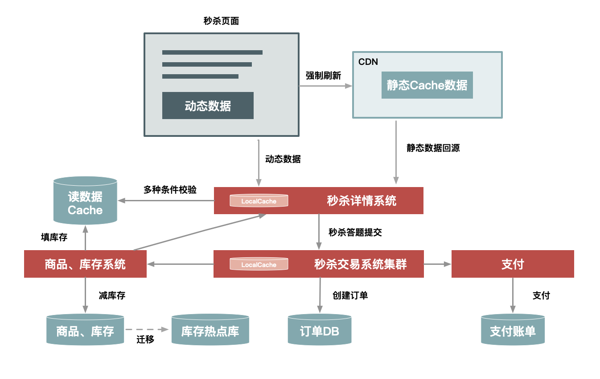

.设计秒杀系统要考虑哪些点? 数据预热,CDN缓存,超卖问题,流量削峰
a.秒杀系统架构设计都有哪些关键点?

        如何才能更好的理解秒杀系统呢?我觉得作为一个程序员,首先需要从高纬度出发,从整体上个思考问题.
    在我看来,秒杀其实主要解决两个问题,一个是并发读,一个是并发写.并发读的核心优化理念是尽量减少用户到服务端来"读"数据,
    或者让他们读更少的数据;并发写的处理原则也一样,她要求我们在数据层面独立出来一个库,做特殊的处理.另外,我们还要
    针对秒杀系统做一些保护,针对意料之外的情况设计兜底方案,防止最坏的情况发生.
        而从一个架构师的角度来看,要想打造并维护一个超大流量并发读写 高性能 高可用的系统,在整个用户请求路径上从浏览器
    到服务端我们要遵循几个原则,就是要保证用户请求的数据尽量少 请求数尽量少 路径尽量短 依赖尽量少,并且不要有单点.
        其实,秒杀的整体架构可以概括为"稳" "准" "快"几个关键字.
        所谓"稳",就是整个系统架构要满足高可用,流量符合预期时肯定要稳定,就是超出预期时也同样不能掉链子,你要保证秒杀活动顺利
    完成,即秒杀商品顺利的卖出去,这个是最基本的前提.
        然后就是"准",就是秒杀10台iPhone,那就只能成交10台,多一台少一台都不行,一旦库存不对,那平台就要承担损失,所以"准"
    就是要求保证数据的一致性.
        最后再看"快",就是系统的性能要足够高,否则怎么支撑这么大的流量?不光是服务端要做极致的性能优化,而且在整个请求链路上都要
    做协同的优化,每个地方快一点,整个系统就完美了.
        所以从技术角度上看"稳" "准" "快",就对应了我们架构上的高可用 一致性和高性能的要求.
        高性能:秒杀涉及大量的并发读和并发写,因此支持高并发访问这点非常关键.将从设计数据的动静分离 热点的发现与隔离 请求的削峰与分层过滤
    服务端的极致优化这4个方面重点分析
        一致性:秒杀中商品减库存的实现方式同样关键.可想而知,有限数量的商品在同一时刻被很多倍的请求同时来减库存,减库存又分为"拍下减库存"
    "付款减库存"以及预扣等几种,在大并发更新的过程中都要保证数据的准确性,其难度可想而知.
        高可用:现实中总难免出现一些我们考虑不到的情况,所以要保证系统的高可用和正确性,我们还需要设计一个PlanB;来兜底,以便在最坏情况发生
    时仍然能够从容应对                       
b.设计秒杀系统时应该注意的5个架构原则

        秒杀系统本质上就是一个满足大并发 高性能和高可用的分布式系统.现在我们就来聊聊,如何在满足一个良好架构的分布式系统基础上,针对秒杀这种业务
    做到极致的性能改进
        架构原则4要1不要
    1.数据要尽量少
        所谓数据要尽量少,首先是指用户请求的数据能少就少.请求的数据包括上传给系统的数据和系统返回给用户的数据(通常就是网页);
        为啥“数据要尽量少”呢？因为首先这些数据在网络上传输需要时间，其次不管是请求数据还是返回数据都需要服务器做处理，而服务器在写网络时通常都要做压缩和字符编码，
        这些都非常消耗 CPU，所以减少传输的数据量可以显著减少 CPU 的使用。例如，我们可以简化秒杀页面的大小，去掉不必要的页面装修效果。
        
        其次，“数据要尽量少”还要求系统依赖的数据能少就少，包括系统完成某些业务逻辑需要读取和保存的数据，这些数据一般是和后台
        服务以及数据库打交道的。调用其他服务会涉及数据的序列化和反序列化，而这也是 CPU 的一大杀手，同样也会增加延时。而且，
        数据库本身也容易成为一个瓶颈，所以和数据库打交道越少越好，数据越简单、越小则越好。
     
    2.请求数要尽量少
         用户请求的页面返回后，浏览器渲染这个页面还要包含其他的额外请求，比如说，这个页面依赖的 CSS/JavaScript、图片，以及 Ajax 请求等等都定义为“额外请求”，
    这些额外请求应该尽量少。因为浏览器每发出一个请求都多少会有一些消耗，例如建立连接要做三次握手，有的时候有页面依赖或者连接数限制，一些请求（例如 JavaScript）
    还需要串行加载等。另外，如果不同请求的域名不一样的话，还涉及这些域名的 DNS 解析，可能会耗时更久。所以你要记住的是，减少请求数可以显著减少以上这些因素导致的资源消耗。 
    例如，减少请求数最常用的一个实践就是合并 CSS 和 JavaScript 文件，把多个 JavaScript 文件合并成一个文件，
    在 URL 中用逗号隔开（https://g.xxx.com/tm/xx-b/4.0.94/mods/??module-preview/index.xtpl.js,module-jhs/index.xtpl.js,module-focus/index.xtpl.js）。
    这种方式在服务端仍然是单个文件各自存放，只是服务端会有一个组件解析这个 URL，然后动态把这些文件合并起来一起返回。
    3.路径要尽量短
    所谓“路径”，就是用户发出请求到返回数据这个过程中，需求经过的中间的节点数。通常，这些节点可以表示为一个系统或者一个新的 Socket 连接
    （比如代理服务器只是创建一个新的 Socket 连接来转发请求）。每经过一个节点，一般都会产生一个新的 Socket 连接。然而，每增加一个连接
    都会增加新的不确定性。从概率统计上来说，假如一次请求经过 5 个节点，每个节点的可用性是 99.9% 的话，那么整个请求的可用性是：99.9% 的 5 次方，
    约等于 99.5%。所以缩短请求路径不仅可以增加可用性，同样可以有效提升性能（减少中间节点可以减少数据的序列化与反序列化），
    并减少延时（可以减少网络传输耗时）。要缩短访问路径有一种办法，就是多个相互强依赖的应用合并部署在一起，把远程过程调用（RPC）变成 JVM 内部之间的方法调用
    4.依赖要尽量少
    所谓依赖，指的是要完成一次用户请求必须依赖的系统或者服务，这里的依赖指的是强依赖。举个例子，比如说你要展示秒杀页面，而这个页面必须强依赖商品信息、用户信息，
    还有其他如优惠券、成交列表等这些对秒杀不是非要不可的信息（弱依赖），这些弱依赖在紧急情况下就可以去掉。要减少依赖，我们可以给系统进行分级，比如 0 级系统、
    1 级系统、2 级系统、3 级系统，0 级系统如果是最重要的系统，那么 0 级系统强依赖的系统也同样是最重要的系统，以此类推。注意，0 级系统要尽量减少对 1 级系统的强依赖，
    防止重要的系统被不重要的系统拖垮。例如支付系统是 0 级系统，而优惠券是 1 级系统的话，在极端情况下可以把优惠券给降级，防止支付系统被优惠券这个 1 级系统给拖垮。
    5.不要有单点
    系统中的单点可以说是系统架构上的一个大忌，因为单点意味着没有备份，风险不可控，我们设计分布式系统最重要的原则就是“消除单点”。那如何避免单点呢？我认为关键点是
    避免将服务的状态和机器绑定，即把服务无状态化，这样服务就可以在机器中随意移动。如何那把服务的状态和机器解耦呢？这里也有很多实现方式。
    例如把和机器相关的配置动态化，这些参数可以通过配置中心来动态推送，在服务启动时动态拉取下来，我们在这些配置中心设置一些规则来方便地改变这些映射关系。应用无状态化
    是有效避免单点的一种方式，但是像存储服务本身很难无状态化，因为数据要存储在磁盘上，本身就要和机器绑定，那么这种场景一般要通过冗余多个备份的方式来解决单点问题。
    架构是一种平衡的艺术,而最好的架构一旦脱离了它所适应的场景,一切都是空谈.
不同场景下的不同架构实例

    秒杀架构演进
    架构1.如果你想快速搭建一个简单的秒杀系统，只需要把你的商品购买页面增加一个“定时上架”功能，仅在秒杀开始时才让用户看到购买按钮，当商品的库存卖完了也就结束了
    架构2.随着请求量的加大(比如从1w/s到了10w/s),这个简单的架构很快就遇到了瓶颈,因此需要做架构改造来提升系统性能.这些架构改造包括:
        1.把秒杀系统独立出来单独打造一个系统，这样可以有针对性地做优化，例如这个独立出来的系统就减少了店铺装修的功能，减少了页面的复杂度；
        2.在系统部署上也独立做一个机器集群，这样秒杀的大流量就不会影响到正常的商品购买集群的机器负载；
        3.将热点数据（如库存数据）单独放到一个缓存系统中，以提高“读性能”；
        4.增加秒杀答题，防止有秒杀器抢单
    架构3.然而这个架构仍然支持不了超过 100w/s 的请求量，所以为了进一步提升秒杀系统的性能，我们又对架构做进一步升级
        1.对页面进行彻底的动静分离，使得用户秒杀时不需要刷新整个页面，而只需要点击抢宝按钮，借此把页面刷新的数据降到最少
        2.在服务端对秒杀商品进行本地缓存，不需要再调用依赖系统的后台服务获取数据，甚至不需要去公共的缓存集群中查询数据，这样不仅可以减少系统调用，而且能够避免压垮公共缓存集群
        3.增加系统限流保护，防止最坏情况发生            
架构2示意图

架构3示意图
经过这些优化，系统架构变成了下图中的样子。在这里，我们对页面进行了进一步的静态化，秒杀过程中不需要刷新整个页面，而只需要向服务端请求很少的动态数据。而且，最关键的详情和交易系统都增加了本地缓存，来提前缓存秒杀商品的信息，热点数据库也做了独立部署，等等

d.如何做好动静分离？

e.如何有针对性的处理好系统的热点数据？

何为“热点商品”？
>假设你的系统中存储有几十亿上百亿的商品，而每天有千万级的商品被上亿的用户访问，那么肯定有一部分被大量用户访问的热卖
>商品，这就是我们常说的“热点商品”。

为什么要关注热点？
> 因为热点会对系统产生一系列的影响。
> 首先，热点请求会大量占用服务器处理资源，虽然这个热点可能只占请求总量的亿分之一，然而却可能抢占 90% 的服务器资源，如果这个热  
> 点请求还是没有价值的无效请求，那么对系统资源来说完全是浪费。
> 其次，即使这些热点是有效的请求，我们也要识别出来做针对性的优化，从而用更低的代价来支撑这些热点请求。

什么是“热点数据”
>用户的热点请求对应的数据。而热点数据又分为“静态热点数据”和“动态热点数据”。所谓“静态热点数据”，就是能够提前预测的热点数据
>所谓“动态热点数据”，就是不能被提前预测到的，系统在运行过程中临时产生的热点。例如，卖家在抖音上做了广告，然后商品一下就火了，  
>导致它在短时间内被大量购买。

发现静态热点数据
> 静态热点数据可以通过商业手段，例如强制让卖家通过报名参加的方式提前把热点商品筛选出来，实现方式是通过一个运营系统，把参加活动的  
> 商品数据进行打标，然后通过一个后台系统对这些热点商品进行预处理，如提前进行缓存。但是这种通过报名提前筛选的方式也会带来新的问题  
> ，即增加卖家的使用成本，而且实时性较差，也不太灵活。
> 不过，除了提前报名筛选这种方式，你还可以通过技术手段提前预测，例如对买家每天访问的商品进行大数据计算，然后统计出 TOP N
> 的商品，我们可以认为这些 TOP N 的商品就是热点商品。

发现动态热点数据
构建一个异步的系统，它可以收集交易链路上各个环节中的中间件产品的热点 Key，如 Nginx、缓存、RPC 服务框架等这些中间件  
（一些中间件产品本身已经有热点统计模块）。

建立一个热点上报和可以按照需求订阅的热点服务的下发规范，主要目的是通过交易链路上各个系统（包括详情、购物车、交易、优惠、库存、物流等  
）访问的时间差，把上游已经发现的热点透传给下游系统，提前做好保护。比如，对于大促高峰期，详情系统是最早知道的，在统一接入层上  
Nginx 模块统计的热点 URL。

将上游系统收集的热点数据发送到热点服务台，然后下游系统（如交易系统）就会知道哪些商品会被频繁调用，然后做热点保护。

处理热点数据

    处理热点数据通常有几张思路：一是优化，二是限制，三是隔离
    先来说说优化。优化热点数据最有效的办法就是缓存热点数据，如果热点数据做了动静分离，那么可以长期缓存静态数据。但是，缓存热点
    数据更多的是“临时”缓存，即不管是静态数据还是动态数据，都用一个队列短暂地缓存数秒钟，由于队列长度有限，可以采用 LRU 淘汰算
    法替换
    
    再来说说限制。限制更多的是一种保护机制，限制的办法也有很多，例如对被访问商品的 ID 做一致性 Hash，然后根据 Hash 做分桶，
    每个分桶设置一个处理队列，这样可以把热点商品限制在一个请求队列里，防止因某些热点商品占用太多的服务器资源，而使其他请求始终
    得不到服务器的处理资源

    最后介绍一下隔离。秒杀系统设计的第一个原则就是将这种热点数据隔离出来，不要让 1% 的请求影响到另外的 99%，隔离出来后也更方
    便对这 1% 的请求做针对性的优化。

具体到“秒杀”业务，我们可以在以下几个层次实现隔离。

    业务隔离。把秒杀做成一种营销活动，卖家要参加秒杀这种营销活动需要单独报名，从技术上来说，卖家报名后对我们来说就有了已知热点
    ，因此可以提前做好预热。
    系统隔离。系统隔离更多的是运行时的隔离，可以通过分组部署的方式和另外 99% 分开。秒杀可以申请单独的域名，目的也是让请求落到
    不同的集群中。
    数据隔离。秒杀所调用的数据大部分都是热点数据，比如会启用单独的 Cache 集群或者 MySQL 数据库来放热点数据，目的也是不想 
    0.01% 的数据有机会影响 99.99% 数据。

f.如何做流量削峰？

    流量削峰的一些操作思路：排队 答题 分层过滤。这几种方式都是无损（不会损失用户的发出请求）的实现方案。
排队

    要对流量进行削峰，最容易想到的解决方案就是用消息队列来缓冲瞬时流量，把同步的直接调用转换成异步的间接推送，中间通过一个队列
    在一端承接瞬时的流量洪峰，在另一端平滑地将消息推送出去。
    但是，如果流量峰值持续一段时间达到了消息队列的处理上限，例如本机的消息积压达到了存储空间的上限，消息队列同样也会被压垮，这
    样虽然保护了下游的系统，但是和直接把请求丢弃也没多大的区别。就像遇到洪水爆发时，即使是有水库恐怕也无济于事。
用消息队列来缓冲瞬时流量的方案。

答题

    这主要是为了增加购买的复杂度，从而达到两个目的
    第一个目的是防止部分买家使用秒杀器在参加秒杀时作弊
    第二个目的是延缓请求，起到对请求流量进行削峰的作用，从而让系统能够更好的支持瞬时的流量高峰
分层过滤

    对请求进行分层过滤，从而过滤掉一些无效的请求。
    分层校验的目的是：在读系统中，尽量减少由于一致性校验带来的系统瓶颈，但是尽量将不影响性能的检查条件提前，如用户是否具有秒杀资格、
    商品状态是否正常、用户答题是否正确、秒杀是否已经结束、是否非法请求、营销等价物是否充足等；在写数据系统中，主要对写的数据
    （如“库存”）做一致性检查，最后在数据库层保证数据的最终准确性（如“库存”不能减为负数）

g.如何提高系统的性能？

如何发现CPU瓶颈？

    就服务器而言，会出现瓶颈的地方有很多，例如 CPU、内存、磁盘以及网络等都可能会导致瓶颈。此外，不同的系统对瓶颈的关注度也不一
    样，例如对缓存系统而言，制约它的是内存，而对存储型系统来说 I/O 更容易是瓶颈。我们定位的场景是秒杀，它的瓶颈更多地发生在 CPU 上

     一是利用JProfiler 和 Yourkit 这两个工具，它们可以列出整个请求中每个函数的 CPU 执行时间，可以发现哪个函数消耗的 CPU 时间最多
     ，以便你有针对性地做优化
     
    二是还有一些办法也可以近似地统计 CPU 的耗时，例如通过 jstack 定时地打印调用栈，如果某些函数调用频繁或者耗时较多，那么那些函
    数就会多次出现在系统调用栈里，这样相当于采样的方式也能够发现耗时较多的函数。 
如何优化系统

    对 Java 系统来说，可以优化的地方很多，这里我重点说一下比较有效的几种手段，供你参考，它们是：减少编码、减少序列化、Java 
    极致优化、并发读优化
    
    1.减少编码
        Java 的编码运行比较慢，这是 Java 的一大硬伤。在很多场景下，只要涉及字符串的操作（如输入输出操作、I/O 操作）都比较耗 
        CPU 资源，不管它是磁盘 I/O 还是网络 I/O，因为都需要将字符转换成字节，而这个转换必须编码。
        
        每个字符的编码都需要查表，而这种查表的操作非常耗资源，所以减少字符到字节或者相反的转换、减少字符编码会非常有成效。减少
        编码就可以大大提升性能。    
        
        那么如何才能减少编码呢？例如，网页输出是可以直接进行流输出的，即用 resp.getOutputStream() 函数写数据，把一些静态
        的数据提前转化成字节，等到真正往外写的时候再直接用 OutputStream() 函数写，就可以减少静态数据的编码转换。 
        基于把静态的字符串提前编码成字节并缓存，然后直接输出字节内容到页面，从而大大减少编码的性能消耗的，网页输出的性能比没有
        提前进行字符到字节转换时提升了 30% 左右。           
    
    2.减少序列化
        序列化也是 Java 性能的一大天敌，减少 Java 中的序列化操作也能大大提升性能。又因为序列化往往是和编码同时发生的，所以
        减少序列化也就减少了编码。
    
        序列化大部分是在 RPC 中发生的，因此避免或者减少 RPC 就可以减少序列化，当然当前的序列化协议也已经做了很多优化来提升
        性能。有一种新的方案，就是可以将多个关联性比较强的应用进行“合并部署”，而减少不同应用之间的 RPC 也可以减少序列化的消耗。
    
        所谓“合并部署”，就是把两个原本在不同机器上的不同应用合并部署到一台机器上，当然不仅仅是部署在一台机器上，还要在同一个 
        Tomcat 容器中，且不能走本机的 Socket，这样才能避免序列化的产生。        
    
    3.java极致优化
        Java 和通用的 Web 服务器（如 Nginx 或 Apache 服务器）相比，在处理大并发的 HTTP 请求时要弱一点，所以一般我们都
        会对大流量的 Web 系统做静态化改造，让大部分请求和数据直接在 Nginx 服务器或者 Web 代理服务器（如 Varnish、Squid
         等）上直接返回（这样可以减少数据的序列化与反序列化），而 Java 层只需处理少量数据的动态请求。
         
        直接使用 Servlet 处理请求。避免使用传统的 MVC 框架，这样可以绕过一大堆复杂且用处不大的处理逻辑，节省 1ms 时间（具
        体取决于你对 MVC 框架的依赖程度）。
    
        直接输出流数据。使用 resp.getOutputStream() 而不是 resp.getWriter() 函数，可以省掉一些不变字符数据的编码，
        从而提升性能；数据输出时推荐使用 JSON 而不是模板引擎（一般都是解释执行）来输出页面。     
    4.并发读优化
        也许有读者会觉得这个问题很容易解决，无非就是放到 Redis 缓存里面。集中式缓存为了保证命中率一般都会采用一致性 Hash，
        所以同一个 key 会落到同一台机器上。虽然单台缓存机器也能支撑 30w/s 的请求，但还是远不足以应对像“大秒”这种级别的热点
        商品。那么，该如何彻底解决单点的瓶颈呢？
        
        答案是采用应用层的 LocalCache，即在秒杀系统的单机上缓存商品相关的数据。那么，又如何缓存（Cache）数据呢？你需要划分
        成动态数据和静态数据分别进行处理
    
        像商品中的“标题”和“描述”这些本身不变的数据，会在秒杀开始之前全量推送到秒杀机器上，并一直缓存到秒杀结束；
        像库存这类动态数据，会采用“被动失效”的方式缓存一定时间（一般是数秒），失效后再去缓存拉取最新的数据。        

h.如何设计秒杀系统的“减库存”？

根据减库存是发生在下单阶段还是付款阶段，把减库存做一下划分。

减库存有哪几种方式：

    下单减库存，即当买家下单后，在商品的总库存中减去买家购买数量。下单减库存是最简单的减库存方式，也是控制最精确的一种，下
    单时直接通过数据库的事务机制控制商品库存，这样一定不会出现超卖的情况。但是，你要知道，有些人下完单可能并不会付款。
    
    付款减库存，即买家下单后，并不立即减库存，而是等到用户付款后才真正减库存，否则库存一直保留给其他买家。但是因为付款时才
    减库存，如果并发比较高，有可能出现买家下单后付不了款的情况，因为可能商品已经被其他人买走了。
    
    预扣库存，这种方式相对复杂一些，买家下单后，库存为其保留一定的时间（如10分钟），超过这个时间，库存将会自动释放，释放后其他
    买家就可以继续购买。在买家付款前，系统会校验该订单的库存是否还有保留：如果没有保留，则再次尝试预扣；如果库存不足则不允许
    继续付款；如果预扣成功，则完成付款并实际地减去库存。

减库存可能存在的问题

    下单减库存的不足之处，竞争对手可能通过恶意下单的方式将卖家的商品全部下单，让这款商品的库存减为0，却不真正付款。
    
    付款减库存会存在“库存超卖”的问题。假如有100件商品，就可能出现300人下单成功的情况，因为下单时不会减库存，所以也就可能
    出现下单成功数远远超过真正库存数的情况，这尤其会发生在做活动的热门商品上。这样一来，就会导致很多买家下单成功但是付不了
    款，买家的购物体验自然比较差。

    预扣库存也不能彻底解决恶意下单的问题，针对恶意下单的情况，虽然把有效的付款时间设置为10分钟，但是恶意买家完全可以在10分钟
    后再次下单，或者采用一次下单很多件的方式把库存减完。针对这种情况，解决办法还是要结合安全和反作弊的措施来制止。

    例如，给经常下单不付款的买家进行识别达标（可以在被打标的买家下单时不减库存）
         给某些类目设置最大购买件数（例如，参加活动的商品一人最多只能买3件）
         对重复下单不付款的操作进行次数限制
    
    针对“库存超卖”这种情况，在 10 分钟时间内下单的数量仍然有可能超过库存数量，遇到这种情况我们只能区别对待：对普通的商品下单数
    量超过库存数量的情况，可以通过补货来解决；但是有些卖家完全不允许库存为负数的情况，那只能在买家付款时提示库存不足。          

大型秒杀中如何减库存？

    由于参加秒杀的商品，一般都是抢到就是赚到，所以成功下单后却不付款的情况比较少，再加上卖家对秒杀商品的库存有严格限制，所以秒杀
    商品采用“下单减库存”更加合理。另外，理论上由于“下单减库存”比“预扣库存”以及设计第三方支付的“付款减库存”在逻辑上更简单，所以
    性能上更占优势。
    “下单减库存”在数据一致性上，主要是保证大并发请求时库存数据不能为负数，也就是要保证数据库中的库存字段值不能为负值，一般我们
    有多种解决方案：
        一种是在应用程序中通过事务来判断，即保证减后库存不能为负数，否则就回滚。
        第二种办法是直接设置数据库的字段数据为无符号整数，这样减后库存字段值小于零时会直接执行SQL语句来报错；
        第三种就是使用CASE WHEN 判断语句。例如：
        update item set inventory = CASE WHEN inventory >=xxx THEN inventory-xxx else inventory end            
i.如何设计兜底方案？

高可用建设应该从哪里着手

    说到系统的高可用建设，它其实是一个系统工程，需要考虑到系统建设的各个阶段，也就是说它其实贯穿了系统建设的整个生命周期
    1.架构阶段：架构阶段主要考虑系统的可扩展性和容错性，要避免系统出现单点问题。例如多机房单元化部署，即使某个城市的某个机房
    出现整体故障，仍然不会影响整体网站
    
    2.编码阶段

