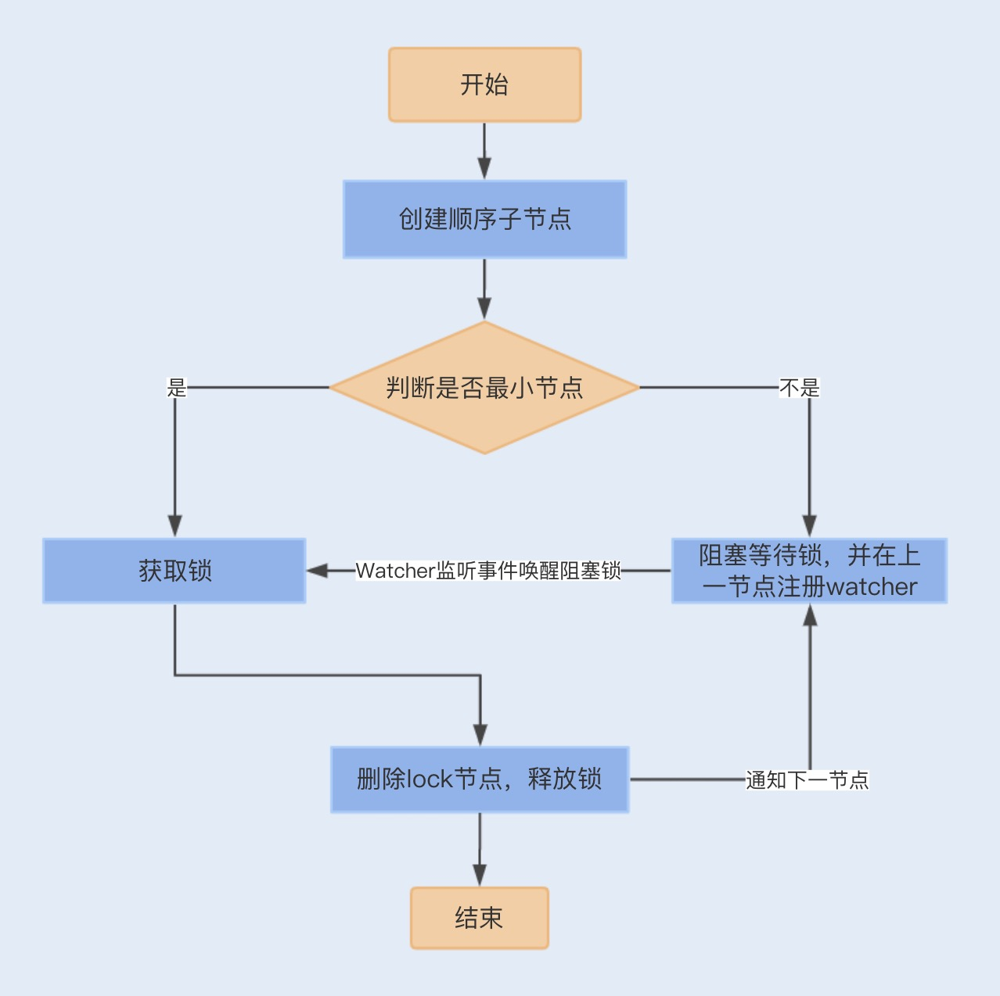

数据库实现分布式锁

    首先,我们创建一个锁表,通过创建和查询数据来保证一个数据的原子性
```mysql
CREATE TABLE `order`  (
  `id` int(11) NOT NULL AUTO_INCREMENT,
  `order_no` int(11) DEFAULT NULL,
  `pay_money` decimal(10, 2) DEFAULT NULL,
  `status` int(4) DEFAULT NULL,
  `create_date` datetime(0) DEFAULT NULL,
  `delete_flag` int(4) DEFAULT NULL,
  PRIMARY KEY (`id`) USING BTREE,
  INDEX `idx_status`(`status`) USING BTREE,
  INDEX `idx_order`(`order_no`) USING BTREE
) ENGINE = InnoDB;
select id from `order` where `order_no`= 'xxxx' for update
```
    其次,如果是校验订单的幂等性,就要先查询该记录是否存在数据库中,查询的时候要防止幻读,如果不存在,就插入到数据库,否则放弃操作.
    select id from `order` where `order_no`= 'xxxx' for update
    
    最后注意下,除了查询时防止幻读,我们还需要保证查询和插入是在同一个事务中,因此我们需要申明事务,具体的实现代码如下
```java
class LockTest{
  @Transactional
  public int addOrderRecord(Order order) {
    if(orderDao.selectOrderRecord(order)==null){
                int result = orderDao.addOrderRecord(order);
                if(result>0){
                      return 1;
              }
         }
    return 0;
  }
}
```
    该方式存在的缺陷:在RR事务级别,select 的for update操作是基于间隙锁gap lock实现的,这是一种悲观锁的实现方式,所以存在
    阻塞问题.因此在高并发情况下,当有大量的请求进来时,大部分的请求都会进行排队等待

    除了阻塞等待之外,因为订单没有删除操作,所以这张锁表的数据将会逐渐累积,我们需要设置另外一个线程,隔一段时间就去删除该表中的过
    期订单,这就增加了业务的复杂度.
    
    除了这种幂等新校验的分布式锁,有一些单纯基于数据库实现的分布式锁代码块或对象,是需要在锁释放时,删除或修改数据的.如果在获取锁
    之后,锁一直没有获得释放,即数据没有被删除或修改,这将会引发死锁问题.
Zookeeper实现分布式锁

    除了数据库实现分布式锁的方式以外,我们还可以基于Zookeeper实现,Zookeeper是一种提供"分布式服务协调"的中心化服务,正式Zook
    eeper的一下两个特性,分布式应用程序才可以基于它实现分布式锁功能.
    
    顺序临时节点:Zookeeper提供一个多层及的节点命名空间(节点称之为Znode),每个节点都用一个以/分割的路径来表示,而且每个节点都
    有父节点(根节点除外),非常类似于文件系统.
    
    节点类型可以分为持久节点(persistent) 临时节点(ephemeral),每个节点还能被标记为有序性(sequential),一旦节点被标记为有
    序性,那么整个节点就具有顺序自增的特点.
    
    Watch机制:Zookeeper还提供了另外一个重要的特性,Watcher(事件监听器).Zookeeper允许用户在指定节点上注册一些Watcher,并
    且在一些特定事件触发的时候,Zookeeper服务端会将事件通知给用户

    Zookeeper是如何实现分布式锁的?
    首先我们需要建立一个父节点,节点类型为持久节点,每当需要访问共享资源时,就会在父节点下建立相应的顺序子节点,节点类型为临时节点
    ,且标记为有序性,并且以临时节点名称+父节点名称+顺序号组成特定的名字.
    
    在建立子节点后,对父节点下面的所有以临时节点名称name开头的子节点进行排序,判断刚刚建立的子节点序号是否是最小的节点,如果是最
    小节点,则获得锁.
    如果不是最小节点，则阻塞等待锁，并且获得该节点的上一顺序节点，为其注册监听事件，等待节点对应的操作获得锁。当调用完共享资源
    后，删除该节点，关闭 zk，进而可以触发监听事件，释放该锁。



    以上实现的分布式锁是严格按照顺序访问的并发锁。一般我们还可以直接引用 Curator 框架来实现 Zookeeper 分布式锁，代码如下
    
    InterProcessMutex lock = new InterProcessMutex(client, lockPath);
    if ( lock.acquire(maxWait, waitUnit) ) 
    {
        try 
        {
            // do some work inside of the critical section here
        }
        finally
        {
            lock.release();
        }
    }
    Zookeeper实现的分布式锁优点:例如相对数据库实现,有很多优点.zookeeper是集群实现,可以避免单点问题,且能保证每次操作都可以
    有效的释放锁,这是因为一旦应用服务挂掉了,临时节点会因为session连接断开而自动删除掉.
    
    缺陷:由于频繁的创建和删除节点,加上大量的watch事件,对zookeeper集群来说,压力非常大.且从性能上来说,与Redis实现的分布式锁
    相比,还是存在一定的差距.
Redis实现分布式锁

    大部分开发人员利用 Redis 实现分布式锁的方式，都是使用 SETNX+EXPIRE 组合来实现，在 Redis 2.6.12 版本之前，具体实现  
    代码如下：
```java
class RedisLock{
    
    public static boolean tryGetDistributedLock(Jedis jedis, String lockKey, String requestId, 
                        int expireTime) {
        Long result = jedis.setnx(lockKey, requestId);//设置锁
        if (result == 1) {//获取锁成功
            // 若在这里程序突然崩溃，则无法设置过期时间，将发生死锁
            jedis.expire(lockKey, expireTime);//通过过期时间删除锁
            return true;
        }
        return false;
    }
}
```
    这种方式实现的分布式锁，是通过 setnx() 方法设置锁，如果 lockKey 存在，则返回失败，否则返回成功。设置成功之后，为了能在
    完成同步代码之后成功释放锁，方法中还需要使用 expire() 方法给 lockKey 值设置一个过期时间，确认 key 值删除，避免出现锁
    无法释放，导致下一个线程无法获取到锁，即死锁问题
    如果程序在设置过期时间之前、设置锁之后出现崩溃，此时如果 lockKey 没有设置过期时间，将会出现死锁问题。
    在  Redis 2.6.12 版本后 SETNX 增加了过期时间参数：
```java
class RedisLockDemo{
    
    private static final String LOCK_SUCCESS = "OK";
    private static final String SET_IF_NOT_EXIST = "NX";
    private static final String SET_WITH_EXPIRE_TIME = "PX";

    /**
     * 尝试获取分布式锁
     * @param jedis Redis客户端
     * @param lockKey 锁
     * @param requestId 请求标识
     * @param expireTime 超期时间
     * @return 是否获取成功
     */
    public static boolean tryGetDistributedLock(Jedis jedis, String lockKey, String requestId, int expireTime) {
        /**
        *  EX|PX, expire time units: EX = seconds; PX = milliseconds
        *  NX|XX, NX -- Only set the key if it does not already exist. XX -- Only set the key
        *          if it already exist.
        *          NX命令: 仅当key不存在时，set才会生效。
        *          XX命令：仅当key存在时，set才会生效。
        */
        String result = jedis.set(lockKey, requestId, SET_IF_NOT_EXIST, SET_WITH_EXPIRE_TIME, expireTime);

        if (LOCK_SUCCESS.equals(result)) {
            return true;
        }
        return false;

    }
}
```
    我们可以通过Lua脚本来实现锁的设置和过期时间的原子性,再通过jedis.eval()方法运行该脚本:
    
    // 加锁脚本
    private static final String SCRIPT_LOCK = "if redis.call('setnx', KEYS[1], ARGV[1]) == 1 then redis.call('pexpire', KEYS[1], ARGV[2]) return 1 else return 0 end";
    // 解锁脚本
    private static final String SCRIPT_UNLOCK = "if redis.call('get', KEYS[1]) == ARGV[1] then return redis.call('del', KEYS[1]) else return 0 end";
    虽然 SETNX 方法保证了设置锁和过期时间的原子性，但如果我们设置的过期时间比较短，而执行业务时间比较长，就会存在锁代码块失效
    的问题。我们需要将过期时间设置得足够长，来保证以上问题不会出现。
    
    这个方案是目前最优的分布式锁方案，但如果是在 Redis 集群环境下，依然存在问题。由于 Redis 集群数据同步到各个节点时是异步的
    ，如果在 Master 节点获取到锁后，在没有同步到其它节点时，Master 节点崩溃了，此时新的 Master 节点依然可以获取锁，所以多
    个应用服务可以同时获取到锁。
RedLock算法

    Redisson是基于netty通信框架实现的,所以支持非阻塞通信,性能相对Jedis会好些.
    Redisson 中实现了 Redis 分布式锁，且支持单点模式和集群模式。在集群模式下，Redisson 使用了 Redlock 算法，避免在 
    Master 节点崩溃切换到另外一个 Master 时，多个应用同时获得锁。我们可以通过一个应用服务获取分布式锁的流程，了解下 
    Redlock 算法的实现：
        在不同的节点上使用单个实例获取锁的方式去获得锁,且每次获取锁都有超时时间,如果请求超时,则认为该节点不可用.当应用服务成功
    获取锁的Redis节点超过半数(N/2+1,N为节点数)时,并且获取锁消耗的实际时间不超过锁的过期时间,则获取锁成功.
    一旦获取锁成功,就会重新计算释放锁的时间,该时间是由原来释放锁的时间减去获取锁所消耗的时间;而如果获取锁失败,客户端依然会
    释放获取锁成功的节点
