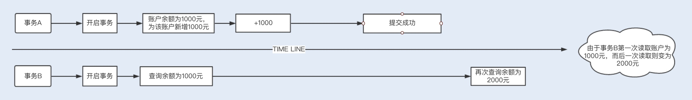
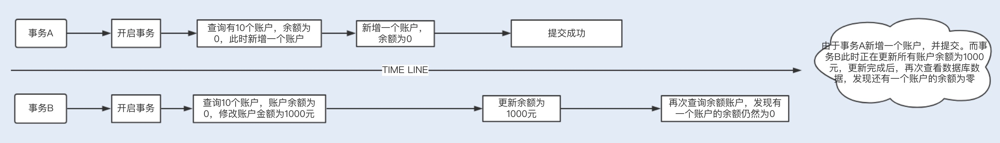
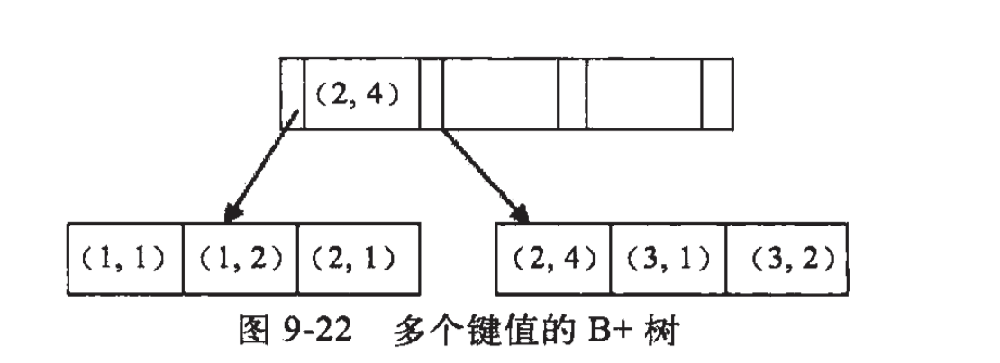

MySQL优化
1.MySQL调优之SQL语句:如何写出高性能SQL语句?

a.应该尽量避免一些慢SQL语句的出现

    慢SQL语句的几种常见诱因
        1.无索引 索引失效导致慢查询
        如果在一张几千万数据的表中以一个没有索引的列作为查询条件,大部分情况下查询会非常耗时,这种查询毫无疑问是一个慢SQL查询,
    所以对于大数据量的查询,我们需要建立适合的索引来优化查询
        虽然我们很多时候建立了索引,但在一些特定的场景下,索引还有可能会失效,所以索引失效也是导致慢查询的主要原因之一
        2.锁等待
        我们常用的存储引擎有InnoDB和MyISAM,前者支持行锁和表锁,后者只支持表锁.
        如果数据库操作是基于表锁实现的,试想下,如果一张订单表在更新时,需要锁住整张表,那么其他大量数据库操作(包括查询)都将处于等待
    状态,这将严重影响到系统的并发功能
        这时,InnoDB存储引擎支持的行锁更适合高并发的场景,但是在使用InnoDB存储引擎时,我们要特别注意行锁升级为表锁的可能.在批量更新
    操作时,行锁就很可能会升级为表锁.
        MySQL认为如果对一张表使用大量行锁,会导致事务执行效率下降,从而可能造成其他事务长时间所等待和更多的锁冲突问题发生,致使性能严重下降,
    所以MySql会将行锁升级为表锁.还有,行锁是基于索引加的锁,如果我们在更新操作时,条件索引失效,那么行锁也会升级为表锁.
        因此,基于表锁的数据库操作,会导致SQL阻塞等待,从而影响执行速度.在一些更新操作(insert/update/delete)大于或等于读操作的情况下,mysql
    不建议使用MyISAM存储引擎.
        除了锁升级之外,行锁相对表锁来说,虽然粒度更细,并发能力提升了,但是也带来了新的问题,那就是死锁,因此,在使用行锁时,我们要注意避免死锁
        
        3.不恰当的sql语句
        使用不恰当的SQL语句也是慢sql最常见的诱因之一.例如习惯使用<select *>,<select count(*)> sql语句,在大数据表中使用<limit m,n>分页查询,
    以及对非索引字段进行排序等等
b.优化sql语句的步骤

        通常,我们在执行一条sql语句时,要想知道这个sql先后查询了那些表,是否使用了索引,这些数据从哪里获取到,获取到了数据遍历了多少行数据等等,我们可以通过
    EXPLAIN命令来查看这些执行信息.这些执行信息被统称为执行计划
        1.通过explain分析sql执行计划
        2.通过show profiles分析sql执行性能 
            通过explain分析执行计划,仅仅是停留在分析sql的外部执行情况,如果我们想要深入到MySQL内核中,从执行线程的状态和时间来分析的话,这个时候我们就看
    选择profile;show profiles只显示最近发给服务器的SQL语句,默认情况下是记录最近已执行的15条记录,我们可以重新设置profiling_history_size
    增大该存储记录,最大值为100;获取到query_id,再通过show profile for query_id,就能够查询到对应的query_id的sql
    语句在执行过程中线程的每个状态所消耗的时间了
c.常用的SQL优化

    1.优化分页查询
    通常我们使用<limit m,n> + 合适的order by来实现分页查询,这种实现方式在没有任何索引条件支持的情况下,需要做大量的文件排序索引,
    性能将会非常槽糕,如果有对应的索引,通常刚开始的分页查询效率会比较理想,但越往后,分页查询的性能就越差.
    这是因为我们在使用limit的时候,偏移量m在分页越靠后的时候,值就越大,数据库检索的数据也就越多.例如limit 10000,10这样的查询,数据库需要查询
    10010条记录,最后返回10条记录.也就是说将会有10000条记录被查询出来没有被使用到
        利用子查询优化分页查询:我们可以先查询出所需要的10行数据中的最小id值,然后通过偏移量返回所需要的10行数据给我们
    select * from `demo`.`order` where id> (select id from `demo`.`order` order by order_no limit 10000, 1)  limit 20;    
    2.优化select count(*)
    COUNT() 是一个聚合函数，主要用来统计行数，有时候也用来统计某一列的行数量（不统计 NULL 值的行）。我们平时最常用的就是 COUNT(*) 和 COUNT(1) 这两种方式了，
    其实两者没有明显的区别，在拥有主键的情况下，它们都是利用主键列实现了行数的统计。但 COUNT() 函数在 MyISAM 和 InnoDB 存储引擎所执行的原理是不一样的，
    通常在没有任何查询条件下的 COUNT(*)，MyISAM 的查询速度要明显快于 InnoDB。这是因为 MyISAM 存储引擎记录的是整个表的行数，在 COUNT(*) 查询操作时无需遍历表计算，
    直接获取该值即可。而在 InnoDB 存储引擎中就需要扫描表来统计具体的行数。而当带上 where 条件语句之后，MyISAM 跟 InnoDB 就没有区别了，它们都需要扫描表来进行行数的统计。
    如果对一张大表经常做 SELECT COUNT(*) 操作，这肯定是不明智的。那么我们该如何对大表的 COUNT() 进行优化呢？
    
    使用近似值
    有时候某些业务场景并不需要返回一个精确的 COUNT 值，
    此时我们可以使用近似值来代替。我们可以使用 EXPLAIN 对表进行估算，要知道，执行 EXPLAIN 并不会真正去执行查询，而是返回一个估算的近似值。
    
    增加汇总统计
    如果需要一个精确的 COUNT 值，我们可以额外新增一个汇总统计表或者缓存字段来统计需要的 COUNT 值，这种方式在新增和删除时有一定的成本，但却可以大大提升 COUNT() 的性能。
    2.优化select *
    MySQL 常用的存储引擎有 MyISAM 和 InnoDB，其中 InnoDB 在默认创建主键时会创建主键索引，而主键索引属于聚簇索引，
    即在存储数据时，索引是基于 B + 树构成的，具体的行数据则存储在叶子节点           
                                                       
    假设我们的订单表是基于 InnoDB 存储引擎创建的，且存在 order_no、status 两列组成的组合索引。此时，我们需要根据订单号查询一张订单表的 status，
    如果我们使用 select * from order where order_no='xxx’来查询，则先会查询组合索引，通过组合索引获取到主键 ID，再通过主键 ID 去主键索引中获取对应行所有列的值。
    如果我们使用 select order_no, status from order where order_no='xxx’来查询，则只会查询组合索引，通过组合索引获取到对应的 order_no 和 status 的值。
d.开启慢sql配置项

    在开发中，我们要尽量写出高性能的 SQL 语句，但也无法避免一些慢 SQL 语句的出现，或因为疏漏，或因为实际生产环境与开发环境有所区别，这些都是诱因。面对这种情况，
    我们可以打开慢 SQL 配置项，记录下都有哪些 SQL 超过了预期的最大执行时间。
    set global slow_query_log='ON'; //开启慢SQL日志
    set global slow_query_log_file='/var/lib/mysql/test-slow.log';//记录日志地址
    set global long_query_time=1;//最大执行时间

2.MySql调优之事务:高并发场景下的数据库事务调优

并发事务带来的问题

    1.数据丢失

    2. 脏读

    3.不可重复读

    4.幻读

事务隔离解决并发问题

    1.解决数据丢失问题,可以基于数据库中的悲观锁来避免发生,即在查询时通过在事务中使用
    select xx for update语句来实现一个排他锁,保证在该事务结束前其他事务无法更新数据.
    当然,我们也可以基于乐观锁来避免,即将某一个字段作为版本号,如果更新时的版本号跟之前的版本一直,则更新,否则更新失败
   
    2.剩下三个问题,是数据库读一致性造成的,需要数据库提供一定的事务隔离机制来解决.
    通过加锁的方式,可以实现不同的事务隔离机制.
    InnoDB实现了两种类型的锁机制:共享锁和排他锁;共享锁允许一个事务读数据,不允许修改数据,如果其他事务要再对该行加锁,
    只能加共享锁;排他锁是修改数据时加的锁,可以读取和修改数据,一旦一个事务对该行数据加锁,其他事务将不能再对改数据加任务锁.
熟悉了以上 InnoDB 行锁的实现原理，我们就可以更清楚地理解下面的内容。  
在操作数据的事务中，不同的锁机制会产生以下几种不同的事务隔离级别，不同的隔离级别分别可以解决并发事务产生的几个问题，对应如下：

    未提交读（Read Uncommitted）：在事务 A 读取数据时，事务 B 读取数据加了共享锁，修改数据时加了排它锁。这种隔离级别，
    会导致脏读、不可重复读以及幻读。
    
    已提交读（Read Committed）：在事务 A 读取数据时增加了共享锁，一旦读取，立即释放锁，事务 B 读取修改数据时增加了行级排
    他锁，直到事务结束才释放锁。也就是说，事务 A 在读取数据时，事务 B 只能读取数据，不能修改。当事务 A 读取到数据后，事务 B 
    才能修改。这种隔离级别，可以避免脏读，但依然存在不可重复读以及幻读的问题
    
    可重复读（Repeatable Read）：在事务 A 读取数据时增加了共享锁，事务结束，才释放锁，事务 B 读取修改数据时增加了行级排他
    锁，直到事务结束才释放锁。也就是说，事务 A 在没有结束事务时，事务 B 只能读取数据，不能修改。当事务 A 结束事务，事务 B 才
    能修改。这种隔离级别，可以避免脏读、不可重复读，但依然存在幻读的问题。

    可序列化（Serializable）：在事务 A 读取数据时增加了共享锁，事务结束，才释放锁，事务 B 读取修改数据时增加了表级排他锁
    ，直到事务结束才释放锁。可序列化解决了脏读、不可重复读、幻读等问题，但隔离级别越来越高的同时，并发性会越来越低。
    
    InnoDB 中的 RC 和 RR 隔离事务是基于多版本并发控制（MVCC）实现高性能事务。一旦数据被加上排他锁，其他事务将无法加入共享
    锁，且处于阻塞等待状态，如果一张表有大量的请求，这样的性能将是无法支持的

    MVCC 对普通的 Select 不加锁，如果读取的数据正在执行 Delete 或 Update 操作，这时读取操作不会等待排它锁的释放，而是直
    接利用 MVCC 读取该行的数据快照（数据快照是指在该行的之前版本的数据，而数据快照的版本是基于 undo 实现的，undo 是用来做事
    务回滚的，记录了回滚的不同版本的行记录）。MVCC 避免了对数据重复加锁的过程，大大提高了读操作的性能

事务隔离级别

    读未提交：别人改数据的事务尚未提交，我在我的事务中也能读到。
    读已提交：别人改数据的事务已经提交，我在我的事务中才能读到。  
    可重复读：别人改数据的事务已经提交，我在我的事务中也不去读。
    串行：我的事务尚未提交，别人就别想改数据。  
    这4种隔离级别，并行性能依次降低，安全性依次提高。

3.最左匹配原则

    写在前面：我在上大学的时候就听说过数据库的最左匹配原则，当时是通过各大博客论坛了解的，但是这些博客的局限性在于它们对最左匹配原则  
    的描述就像一些数学定义一样，往往都是列出123点，满足这123点就能匹配上索引，否则就不能。但是我觉得编程不是死记硬背，这个所谓最左  
    匹配原则肯定是有他背后的原理的。所以我尝试说明一下这个原理，这样以后用上优化索引的时候就不需要去记这些像数学定理一样的东西。了解  
    原理比记住某些表面特点，我觉得是更聪明的方式。

    1.简单说下什么是最左匹配原则
    顾名思义：最左优先，以最左边的为起点任何连续的索引都能匹配上。同时遇到范围查询(>、<、between、like)就会停止匹配。
    例如：b = 2 如果建立(a,b)顺序的索引，是匹配不到(a,b)索引的；但是如果查询条件是a = 1 and b = 2或者a=1(又或者是b = 2 and a = 1)  
    就可以，因为优化器会自动调整a,b的顺序。再比如a = 1 and b = 2 and c > 3 and d = 4 如果建立(a,b,c,d)顺序的索引，d是用  
    不到索引的，因为c字段是一个范围查询，它之后的字段会停止匹配。
    
    2.最左匹配原则的原理
    最左匹配原则都是针对联合索引来说的，所以我们有必要了解一下联合索引的原理。了解了联合索引，那么为什么会有最左匹配原则这种说法也就  
    理解了。
    
    我们都知道索引的底层是一颗B+树，那么联合索引当然还是一颗B+树，只不过联合索引的健值数量不是一个，而是多个。构建一颗B+树只能
    根据一个值来构建，因此数据库依据联合索引最左的字段来构建B+树。
    例子：假如创建一个（a,b)的联合索引，那么它的索引树是这样的

    可以看到a的值是有顺序的，1，1，2，2，3，3，而b的值是没有顺序的1，2，1，4，1，2。所以b = 2这种查询条件没有办法利用索引，
    因为联合索引首先是按a排序的，b是无序的。

    同时我们还可以发现在a值相等的情况下，b值又是按顺序排列的，但是这种顺序是相对的。所以最左匹配原则遇上范围查询就会停止，剩下
    的字段都无法使用索引。例如a = 1 and b = 2 a,b字段都可以使用索引，因为在a值确定的情况下b是相对有序的，而a>1and b=2，
    a字段可以匹配上索引，但b值不可以，因为a的值是一个范围，在这个范围中b是无序的

复合索引

概念: 单一索引是指索引列为一列的情况,即新建索引的语句只实施在一列上;
用户可以在多个列上建立索引,这种索引叫做复合索引(组合索引); 复合索引在数据库操作期间所需的开销更小,可以代替多个单一索引;
同时有两个概念叫做窄索引和宽索引,窄索引是指索引列为1-2列的索引,宽索引也就是索引列超过2列的索引;
设计索引的一个重要原则就是能用窄索引不用宽索引,因为窄索引往往比组合索引更有效; 使用: 创建索引 create index idx1 on
table1(col1,col2,col3) 查询 select * from table1 where col1= A and col2= B and col3 = C
这时候查询优化器,不在扫描表了,而是直接的从索引中拿数据,因为索引中有这些数据,这叫覆盖式查询,这样的查询速度非常快;

注意事项:
    1、对于复合索引,在查询使用时,最好将条件顺序按找索引的顺序,这样效率最高;
    select * from table1 where col1=A AND col2=B AND col3=D
    如果使用 where col2=B AND col1=A 或者 where col2=B 将不会使用索引

    2、何时是用复合索引
    根据where条件建索引是极其重要的一个原则;
    注意不要过多用索引,否则对表更新的效率有很大的影响,因为在操作表的时候要化大量时间花在创建索引中

    3、复合索引会替代单一索引么
    如果索引满足窄索引的情况下可以建立复合索引,这样可以节约空间和时间

备注:
    对一张表来说,如果有一个复合索引 on (col1,col2),就没有必要同时建立一个单索引 on col1;
    如果查询条件需要,可以在已有单索引 on col1的情况下,添加复合索引on (col1,col2),对于效率有一定的提高
    同时建立多字段(包含5、6个字段)的复合索引没有特别多的好处,相对而言,建立多个窄字段(仅包含一个,或顶多2个字段)的索引可以达到更好的效率和灵活性
