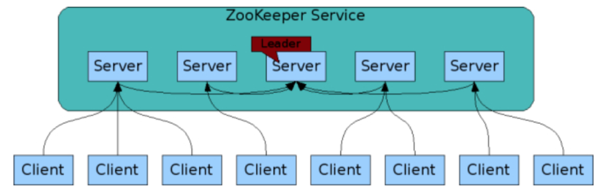

了解CAP吗?redis里的CAP是怎样的?

a.什么是CAP?

    结合电商的例子,理解CAP的含义?
    假设某电商在北京 杭州 上海三个城市建立了仓库,同时建立了对应的服务器A B C,用于存储商品信息.比如,某电吹风在北京仓库有20个,在杭州仓库
     有10个,在上海仓库有30个.那么,CAP这三个字母在这个例子中分别代表什么呢?
    C 代表Consistency,一致性,是指所有节点在同一时刻的数据是相同的,即更新操作执行结束并响应用户完成后,所有节点存储的数据会保持相同.
    在电商系统中,A B C 中存储的该电吹风的数量应该是20+10+30=60.假设,现在有一个北京用户买走一个电吹风,服务器A会更新数据为60-1=59,
    与此同时要求B和C也更新为59,以保证在同一时刻,无论访问A B C 中的哪个服务器,得到的数据均是59;
    A代表Availability,可用性,是指系统提供的服务一直处于可用状态,对于用户的请求可即时响应
    在电商系统中,用户在任一时刻向A B C中的任一服务器发出请求时,均可得到即时响应,比如查询商品信息等.
    P代表Partition Tolerance,分区容错性,是指在分布式系统遇到网路分区的情况下,仍然可以响应用户的请求.网络分区是指因为网络故障不连通,不同节点分布在不同的子网络
    中,各个子网络内网络正常.
    在电商系统中,假设C和A B的网络都不通了,A和B是相通的.也就是说,形成了两个分区{A,B}和{C},在这种情况下,系统仍能响应用户请求.
    一致性 可用性 分区容错性是分布式系统的三个特征,那么我们平时所说的CAP理论又是什么呢?

b.CAP理论指的就是在分布式系统中C A P这三个特征不能同时满足,只能满足其中两个

    对这个系统来说.分别满足C A P指的是
    在满足一致性C的情况下,Server1和Server2中的数据库始终保持一致,即DB1和DB2内容要始终保持相同
    在满足可用性A的情况下,用户无论访问Server1还是Server2,都会得到即时响应;
    在满足分区容错性P的情况下,Server1和Server2之间即使出现网路故障也不会影响Server1和Server2分别处理用户的请求

    在实际场景中,网络环境不可能100%不出故障,比如网络拥塞 网卡故障等,会导致网络故障或不通,从而导致节点之间无法通信,
    或者集群中节点被划分为多个分区,分区中节点之间可通信,分区间不可通信,这种由网络故障导致的集群分区情况,被称为"网络分区"

    在分布式系统中,网络分区不可避免,因此分区容错性P必须满足.
    在满足分区容错性P的情况下,一致性C和可用性A是否可以同时满足
    User2向Server2发送读取数据a的请求时,Server2无法给用户返回最新数据,那么该如何处理呢?
    第一种处理方式,保证一致性C,牺牲可用性A:Server2选择让User2的请求阻塞,一直等到网络恢复正常,Server1被修改的数据同步更新
    到Server2之后,即DB2中数据a修改成最新值2后,再给用户User2响应;
    第二种处理方式是,保证可用性A,牺牲一致性C:Server2选择将旧的数据a=1返回给用户,等到网络恢复,再进行数据同步
    除了以上这两种方案,没有其他方案可以选择,可以看出:在满足分区容错性P的前提下,一致性C和可用性A只能选择一个,无法同时满足;

c.CAP的选择策略和应用,在无法同时满足CAP这三个特性,那该如何进行取舍呢?

    其实,C A P,没有谁优谁劣,只是不同的分布式场景适合不同的策略,接下来,针对一些场景为例,分别向你介绍保CA弃P 保CP弃A
    保AP弃C这三种策略,分析面对不同的分布式场景时,知道如何权衡这三个特征.
    
    保 CA 弃 P
    在分布式系统中,现在的网络基础设施无法做到始终保持稳定,网络分区难易避免,牺牲分区容错性,就相当于放弃使用分布式系统.因此
    在分布式系统中,这种策略不需要过多讨论.
    
    既然分布式系统不能采用这种策略,那单点系统毫无疑问就需要满足CA特性了,比如关系型数据库部署在单台机器上,因此不存在网络通信问题,所以保证CA就可以了
    
    保 CP 弃 A
    如果一个分布式场景需要很强的数据一致性,或者该场景可以容忍系统长时间无响应的情况下,保CP弃A这个策略就比较合适
    一个保证CP而舍弃A的分布式系统,一旦发生网络分区会导致无法同步情况,就要牺牲系统的可用性,降低用户体验,直到节点数据达到一致后再响应用户.
    这种策略通常用在涉及金钱交易的分布式场景下,因为它任何时候都不允许出现数据不一致的情况,否则就会给用户造成损失.因此这种场景下必须保证CP
    保证CP的系统有很多,典型的有Redis Hbase Zookeeper.
    以zookeeper为例,带你了解它是如何保证CP的
    下面是zookeeper的架构图

    zookeeper集群包含多个节点(Server),这些节点会通过分布式选举算法选出一个Leader节点.在Zookeeper中选举Leader节点采用的是ZAB算法
    在Zookeeper集群中,Leader节点之外的节点被称为Follower节点,Leader节点会专门负责处理用户的写请求:
    当用户向节点发送写请求的时候,如果请求的节点刚好是Leader,那就直接处理该请求;
    如果请求的是follower节点,那该节点会将请求转给Leader,然后Leader会先向所有的Follower发出一个 Proposal ,等超过一半的节点同意后,
    Leader才会提交这次写操作,从而保证了数据的一致性.
    当出现网络分区时,如果其中一个分区的节点数大于集群总节点数的一半,那么这个分区可以再选出一个Leader,仍然对用户提供服务,但在选出Leader
    之前,不能正常为用户提供服务;如果形成的分区中,没有一个分区的节点数大于集群总节点数的一半,那么系统不能正常为用户提供服务,必须待网络恢复后,  
    才能正常提供服务.
    这种设计方式保证了分区容错性,但是牺牲了一定的系统可用性;
    
    保AP弃C
    如果一个分布式场景需要很高的可用性,或者说在网络状况不太好的情况下,该场景允许数据暂时不一致,那这种情况下就可以牺牲一定的一致性了.
    网络分区出现后,各个节点之间数据无法马上同步,为了保证高可用,分布式系统需要即刻响应用户的请求.但是此时可能某些节点还没有拿到最新数据,只能将本地旧的数据  
    返回给用户,从而导致数据不一致的情况.
    适合保证AP放弃C的场景有很多.比如,很多查询网站 电商系统中的商品查询等,用户体验非常重要,所以大多会保证系统的可用性,而牺牲一定的数据一致性;

d.三种策略的对比

CAP和ACID的"C" "A"是一样的吗?

    首先看C:
    CAP中的C强调的是数据一致性,也就是集群中节点之间通过复制技术保证每个节点上数据在同一时刻是相同的;
    ACID中的C强调的是事务执行前后,数据的完整性保持一致或满足完整性约束.也就是不管在什么时候,不管并发事务有多少,事务在分布式系统中的状态始终保持一致;
    再来看A:
    CAP中的A指的是可用性Availablity,也就是系统提供的服务一直处于可用状态,即对于用户的请求可即时响应.
    ACID中的A指的是原子性Atomicity,强调的是事务要么执行成功,要么执行失败
    因此,CAP和ACID的C和A是不一样的,不能混为一谈.
    redis简单主从模式侧重于CP的,即对于一致性要求较高.redis-cluster,则属于AP类型,更加强调可用性

BASE理论