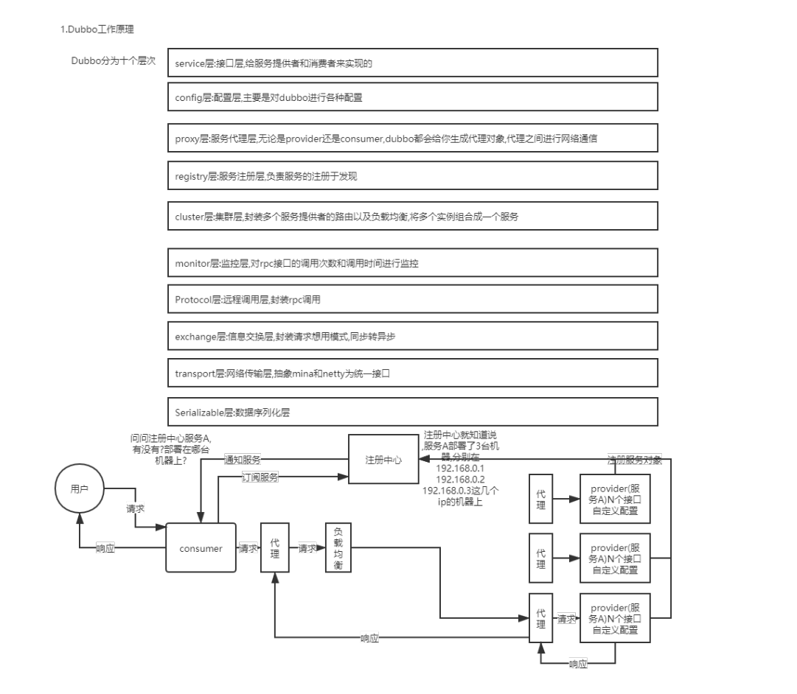
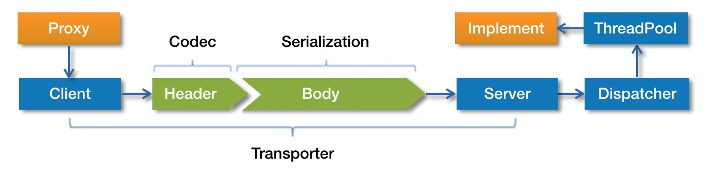
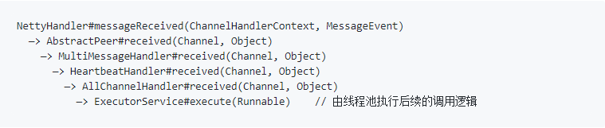
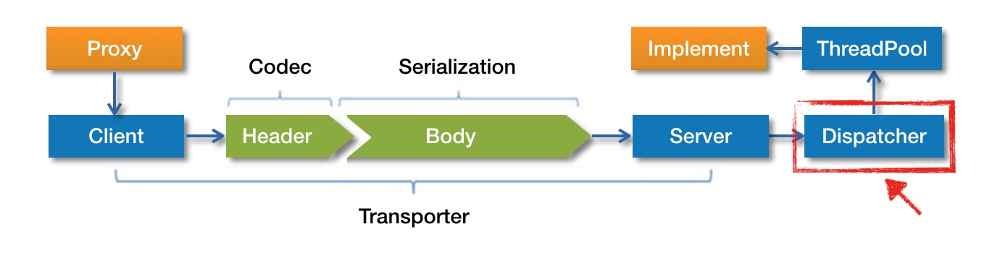
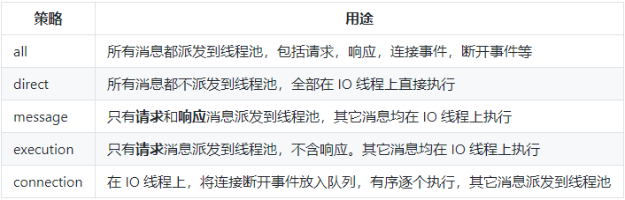
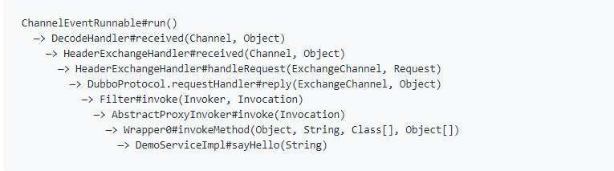

1.为什么要把系统拆成分布式系统的?为什么用dubbo?

    为什么要拆分系统?
        要是不拆分系统,多人维护一份代码,合并代码时容易造成代码冲突,还有可能导致重复性测试工作.
        系统每次发布,可能都要做很多的检查,而且所有开发人员都要留守,造成开发人员的人力浪费.
        同时也不利于把技术升级
    
        拆分了以后,每个人维护自己那一部分代码就可以了,职责清晰明了,代码不易冲突
        系统服务上线时,相关负责人员留守
    
        系统拆分成分布式系统之后,大量的分布式系统面临的问题也接踵而来.            
    
    系统怎么拆分?
        首先系统拆分为分布式系统，拆成多个服务，拆成微服务的架构，是需要拆很多轮的。并不是说上来一个架构师一次就给拆好了，而以后都
        不用拆。
        第一轮；团队继续扩大，拆好的某个服务，刚开始是 1 个人维护 1 万行代码，后来业务系统越来越复杂，这个服务是 10 万行代码，
        5 个人；第二轮，1个服务 -> 5个服务，每个服务 2 万行代码，每人负责一个服务
        个人建议，一个服务的代码不要太多，1 万行左右，两三万撑死了吧。
        大部分的系统，是要进行多轮拆分的，第一次拆分，可能就是将以前的多个模块该拆分开来了，比如说将电商系统拆分成订单系统、
        商品系统、采购系统、仓储系统、用户系统          
        但是后面可能每个系统又变得越来越复杂了，比如说采购系统里面又分成了供应商管理系统、采购单管理系统，订单系统又拆分成了购
        物车系统、价格系统、订单管理系统。
        核心意思就是根据情况，先拆分一轮，后面如果系统更复杂了，可以继续分拆
        
    
        为什么用dubbo?
        活跃社区
        官方持续维护
        经过验证,可靠性有保障
    
        很多微服务框架中的服务通信是基于 RPC 通信实现的，在没有进行组件扩展的前提下，SpringCloud 是基于 Feign 组件实现的 RPC
        通信（基于 Http+Json 序列化实现），Dubbo 是基于 SPI 扩展了很多 RPC 通信框架，包括 RMI、Dubbo、Hessian 等 RPC 
        通信框架（默认是 Dubbo+Hessian 序列化）。不同的业务场景下，RPC 通信的选择和优化标准也不同。
        
        当时的选择标准就是 RPC 通信可以支持抢购类的高并发，在这个业务场景中，请求的特点是瞬时高峰、请求量大和传入、传出参数数据包
        较小。而 Dubbo 中的 Dubbo 协议就很好地支持了这个请求。
        
        无论从响应时间还是吞吐量上来看，单一 TCP 长连接 +Protobuf 序列化实现的 RPC 通信框架都有着非常明显的优势。
        
        正是因为有阿里的 dubbo，很多中小型公司才可以基于 dubbo，来把系统拆分成很多的服务，每个人负责一个服务，大家的代码都没有冲
        突，服务可以自治，自己选用什么技术都可以，每次发布如果就改动一个服务那就上线一个服务好了，不用所有人一起联调，每次发布都是
        几十万行代码，甚至几百万行代码了。

        拆分后不用 dubbo 可以吗？
        当然可以了，大不了最次，就是各个系统之间，直接基于 spring mvc，就纯 http 接口互相通信呗，还能咋样。但是这个肯定是
        有问题的，因为 http 接口通信维护起来成本很高，你要考虑超时重试、负载均衡等等各种乱七八糟的问题，比如说你的订单系统调用
        商品系统，商品系统部署了 5 台机器，你怎么把请求均匀地甩给那 5 台机器？这不就是负载均衡？你要是都自己搞那是可以的，但
        是确实很痛苦。

        所以 dubbo 说白了，是一种 rpc 框架，就是说本地就是进行接口调用，但是 dubbo 会代理这个调用请求，跟远程机器网络通信
        ，给你处理掉负载均衡、服务实例上下线自动感知、超时重试等等乱七八糟的问题。那你就不用自己做了，用 dubbo 就可以了。    

 2.Dubbo工作原理,注册中心挂了,还可以继续通信吗?

dubbo分成十层

    第一层：service 层，接口层，给服务提供者和消费者来实现的
    第二层：config 层，配置层，主要是对 dubbo 进行各种配置的
    第三层：proxy 层，服务代理层，无论是 consumer 还是 provider，dubbo 都会给你生成代理，代理之间进行网络通信
    第四层：registry 层，服务注册层，负责服务的注册与发现
    第五层：cluster 层，集群层，封装多个服务提供者的路由以及负载均衡，将多个实例组合成一个服务
    第六层：monitor 层，监控层，对 rpc 接口的调用次数和调用时间进行监控
    第七层：protocal 层，远程调用层，封装 rpc 调用
    第八层：exchange 层，信息交换层，封装请求响应模式，同步转异步
    第九层：transport 层，网络传输层，抽象 mina 和 netty 为统一接口
    第十层：serialize 层，数据序列化层

工作流程

    第一步：provider 向注册中心去注册
    第二步：consumer 从注册中心订阅服务，注册中心会通知 consumer 注册好的服务
    第三步：consumer 调用 provider
    第四步：consumer 和 provider 都异步通知监控中心    
  

3.Dubbo Spi机制?

    spi全称为Service Provider Interface,是一种服务发现机制
    比如你有个接口,该接口有3个实现类,那么在系统运行时,这个接口应该选择哪个实现类?这就需要SPI了,需要根据指定的配置或者是默认的配置
    找到对应的实现类加载进来,然后使用该实例类的实例
    
    接口A有三个实现类,实现类A1,实现类A2,实现类A3,配置一下,接口A=实现A2.
    在系统实际运行的时候,会加载你的配置,用实现类A2实例化一个对象来提供服务
    
    spi的使用场景:插件扩展的场景,比如你开发了一个开源框架,若你想让别人自己写个插件,安排到你的开源框架中,扩展功能.
    例如JDBC,java定义一套JDBC接口,但是并没有提供其实现类,但是实际上项目运行时,要使用JDBC,但是并没有提供实现类.
    一般来说,我们要根据自己使用的数据库,比如
        MySql,你就将mysql-jdbc-connector.jar
        oracle,你就将oracle-jdbc-connector.jar引入
    系统运行时,碰到你使用的jdbc的接口,就会在底层使用你引入的那个jar中提供的实现类
    
    Dubbo中的SPI
    Dubbo 并未使用 Java SPI，而是重新实现了一套功能更强的 SPI 机制。Dubbo SPI 的相关逻辑被封装在了 ExtensionLoader 
    类中，通过 ExtensionLoader，我们可以加载指定的实现类。Dubbo SPI 所需的配置文件需放置在 META-INF/dubbo/internal 路径下，配置内容如下。        
    optimusPrime = org.apache.spi.OptimusPrime
    bumblebee = org.apache.spi.Bumblebee

    与Java SPI实现类配置不同,Dubbo SPI是通过键值对的方式进行配置,这样我们可以按需加载指定的实现类.需要在指定的的接口上标注@SPI注解

4.基于dubbo如何做服务治理 服务降级以及重试?

    停留在Dubbo本身的功能上面 抱歉,我们公司没有人力做,但是我可以说下这块的思想,或者从什么角度去做服务治理

    服务治理:全调用链路图 服务延时统计 报警 可用性  服务鉴权
    
    服务降级:比如说服务A调用服务B,结果服务B挂掉了,服务A重试几次调用服务B,还是不行,直接降级,走一个备用的逻辑,给用户返回响应
    在Dubbo中就是mock,如果调用失败统一返回null,但是可以将mock 修改为true,然后在跟接口同一个路径下实现一个mock类,命名规则
    是接口名称加Mock后缀,然后在该Mock类里面实现自己的降级逻辑
    
    dubbo 重试
    <dubbo retries="3" timeout="200ms"/>

5.分布式服务接口的幂等性如何设计(比如不能重复扣款)?

    其实保证幂等性主要是三点:
    a.对于每个请求必须有一个唯一的标识.举个例子:订单支付请求,肯定得包含订单id,一个订单id最多支付一次.
    b.每次处理完请求之后,必须有一个记录标识这个请求处理过了,如果说常见的方案是在mysql中记录个状态,比如在支付之前
    记录一条这个订单的支付流水,而且支付流水采用orderId作为唯一键.只有成功插入这个支付流水,才可以执行实际的支付扣款
    c.实际运作过程中,要结合自己的业务来,比如说用redis,支付扣款时,你就可以写一个标识到redis里面去,set orderid payed,下一次
    重复请求过来了,先查redis的orderid对应的value,如果是payed就说明已经支付过了,你就别重复支付了

6.分布式系统中的接口调用如何保证顺序性?

    消息队列 hash分发 到一个系统中,然后再分发到一个消息队列中,使用一个线程慢慢消费
    分布式锁 每个请求带一个seq

7.如何设计类似一个dubbo的RPC框架?

    1.你的服务得去注册中心吧,你是不是得有个注册中心,保留各个服务的信息,可以用zookeeper来做
    2.你的消费需要去注册中心拿对应的服务信息吧,而且每个服务可能会存在多台机器上
    3.接着你就应该发起一次请求了,怎么发起?.当然是基于动态代理了,你面向接口获取到一个动态代理,这个动态代理就是接口
    在本地的一个代理,然后这个代理会找到服务对应的机器地址
    4.然后找那个机器发送请求?那肯定得有个负载均衡的算法,比如最简单的可以随机轮询
    5.接着找到一台机器,就可以跟他发送请求了,第一怎么发送?可以用netty,nio的方式;第二发送什么格式的数据?
    可以用hessian序列化协议
    6.服务器那边一样的,需要针对你自己的服务生成一个动态代理,监听某个网络端口了,然后代理你本地的服务代码.接收到请求的时候,就调
    用对应的服务代码.

8.看过dubbo源码吗?

服务调用

    在进行源码分析之前,我们先来通过一张图了解Dubbo服务调用过程

    首先服务消费者通过代理对象Proxy发起远程调用,接着通过网络客户端Client将编码后的请求发送给服务方的网络层,也就是Server.
    Server在收到请求后,首先要做的事情是对数据包进行解码.
    然后将解码后的请求发送至分发其Dispatcher,再由分发其将请求派发到指定的线程池上,最后由线程池调用具体的服务.
    这就是一个远程调用请求的发送和接收过程.

服务调用方式源码

    1.Dubbo默认使用javassist框架为服务接口生成动态代理类
    2.动态代理类调用InvocationHandler接口实现类InvokerInvocationHandler的invoke方法,得到调用结果,最后将结果转型并返回给调用方.
    invoker.invoke(createInvocation(method, args)).recreate();
    3.InvokerInvocationHandler中的invoker成员变量类型为MockClusterInvoker,MockClusterInvoker内部封装了服务降级逻辑
    4.调用AbstractInvoker.invoke()方法,将信息添加到RpcInvocation#attachment 变量中,添加完毕后,调用doInvoke执行后续的调用
    5.doInvoke是一个抽象方法,需要由子类实现.该实现方法中包含了Dubbo对同步和异步调用的处理逻辑.Dubbo实现同步和异步调用比较
    关键的一点就在于谁调用ResponseFuture的get方法,同步调用模式下,由框架自身调用ResponseFuture 的get()方法.异步调用模式下
    ,则由用户调用该方法.ResponseFuture是一个接口
    6.DefaultFuture的get()-->当服务消费者还未接收到调用结果时，用户线程调用 get 方法会被阻塞住。同步调用模式下，框架获得
     DefaultFuture 对象后，会立即调用 get 方法进行等待。而异步模式下则是将该对象封装到 FutureAdapter 实例中，并将 
     FutureAdapter 实例设置到 RpcContext 中，供用户使用。FutureAdapter 是一个适配器，用于将 Dubbo 中的 ResponseFuture
     与 JDK 中的 Future 进行适配。这样当用户线程调用 Future 的 get 方法时，经过 FutureAdapter 适配，最终会调用 
     ResponseFuture 实现类对象的 get 方法，也就是 DefaultFuture 的 get 方法。

服务消费方发送请求源码

    发送请求
    1.从DubboInvoker.doInvoke()中的 return (Result) currentClient.request(inv, timeout).get(); 调用的request
    开始分析.ReferenceCountExchangeClient 内部定义了一个引用计数变量 referenceCount，每当该对象被引用一次 referenceCount 
    都会进行自增。每当 close 方法被调用时，referenceCount 进行自减。ReferenceCountExchangeClient 内部仅实现了一个
    引用计数的功能，其他方法并无复杂逻辑，均是直接调用被装饰对象的相关方法
    2.调用HeaderExchangeClient的request(),调用HeaderExchangeChannel的同签名方法
    3.HeaderExchangeChannel的request()首先定义了一个Request对象,然后再将该对象传给NettyClient的send方法,进行后续
    的调用.NettyClient中并未实现send方法,该方法继承自父类AbstractPeer
    4.进入AbstractPeer.send(Object message),send(message, url.getParameter(Constants.SENT_KEY, false));
    由AbstractClient实现
    5.AbstractClient的send()会获取Channel, Channel channel = getChannel();
    默认情况下Dubbo使用Netty作为底层的通信框架,NettyClient#getChannel获取一个NettyChannel类型对象
    6.获取到NettyChannel实例后,调用send()
    7.发送消息(包含请求和响应消息) ChannelFuture future = channel.writeAndFlush(message);
            // sent 的值源于 <dubbo:method sent="true/false" /> 中 sent 的配置值，有两种配置值：
            //   1. true: 等待消息发出，消息发送失败将抛出异常
            //   2. false: 不等待消息发出，将消息放入 IO 队列，即刻返回
            // 默认情况下 sent = false；
请求编码过程

    该过程首先会通过位运算将消息头写入到header数组中.
    然后对Request对象的data字段执行序列化操作,序列化后的数据最终会存储到channelBuffer中.
    序列化操作执行完后,可得到数据序列化后的长度len.
    紧接着将len写入到header指定位置处.
    最后将消息头字节数组header写入到ChannelBuffer中,整个编码过程就结束了.

调用服务

    解码器将数据包解析成Request对象后,NettyHandler的messageReceived方法紧接着会收到整个对象,并将这个对象继续向下传递.
    这期间该对象会被依次传递给NettyServer MultiMessageHandler HeartbeatHandler以及AllChannelHandler.
    最后由AllChannelHandler将该对象封装到Runnable实现类对象中,并将Runnable放入线程池中执行后续的调用逻辑
    调用栈如下        

    考虑到很多中间调用的逻辑并非十分重要,所以这里就不对调用栈中的每个方法都进行分析了.这里我们直接分析调用栈中的第一个和
    最后一个调用方法逻辑
    NettyHandler中的messageReceived逻辑比较简单.首先根据一些信息获取NettyChannel,
    然后将NettyChannel实例以及Request对象向下传递
    下面再来看看 AllChannelHandler 的逻辑，在详细分析代码之前，我们先来了解一下 Dubbo 中的线程派发模型
线程派发模型

    Dubbo将底层通信框架中接收请求的线程称为io线程.如果一些时间处理器逻辑可以很快执行完.比如只在内存打一个标记,此时直接在
    io线程上执行该段逻辑即可.但是如果时间的处理逻辑比较耗时,比如该段逻辑会发起数据库查询或者http请求.此时我们就不应该
    让时间处理器逻辑在io线程上执行,二是应该派发到线程中去执行.原因很简单,io线程主要用于接收请求,如果io线程被占满,将导致它
    不能接收新的请求,.
    以上就是线程派发的背景，下面我们再来通过 Dubbo 调用图，看一下线程派发器所处的位置。

    如上图，红框中的 Dispatcher 就是线程派发器。需要说明的是，Dispatcher 真实的职责创建具有线程派发能力的 ChannelHandler，  
    比如 AllChannelHandler、MessageOnlyChannelHandler 和 ExecutionChannelHandler 等，其本身并不具备线程派发能力。
    Dubbo 支持 5 种不同的线程派发策略，下面通过一个表格列举一下。
 

    默认配置下，Dubbo 使用 all 派发策略，即将所有的消息都派发到线程池中。
    请求对象会被封装到ChannelEventRunnable中,ChannelEventRunnable将会是服务调用过程的新起点
    cexecutor.execute(new ChannelEventRunnable(channel, handler, ChannelState.DISCONNECTED));

调用服务源码

    1.ChannelEventRunnable仅是一个中转站,它的run方法中并不包含具体的调用逻辑,仅仅用于将参数传给其他的ChannelHandler
    对象进行处理,该对象类型为DecodeHandler
    2.DecodeHandler主要是包含了一些解码逻辑,请求解码可在IO线程上进行,也可在线程池中执行,这个取决于运行时配置.
    DecodeHandler存在的意义就是保证请求或相应对象可在线程池中被解码.解码完毕后,完全解码后的Request对象会继续向后传递,
    下一站是HeaderExchangeHandler
    3.对于双向通信,HeaderExchangeHandler 首先向后进行调用,得到调用结果.然后将调用结果封装到Response对象中,最后再将
    对象返回给服务消费方.如果请求不合法,或者调用失败,则将错误信息封装到Response对象中,并返回给服务消费方.
    4.分析定义在 DubboProtocol 类中的匿名类对象逻辑reply(),getInvoker()用于获取与指定服务对应的Invoker实例,并通过
    Invoker的invoke方法调用服务逻辑.invoke方法定义在AbstractProxyInvoker中
    5.AbstractProxyInvoker.doInvoke()是一个抽象方法,这个需要由具体的Invoker实例实现.Invoker实例是在运行时通过
    JavassistProxyFactory 创建的.JavassistProxyFactory的getInvoker()方法中创建匿名对象 Wrapper
    6.Wrapper是一个抽象类,其中invokeMethod 是一个抽象方法.Dubbo会在运行时通过Javassist 框架为Wrapper生成实现类,并实现
    invokeMethod方法,该方法最终会根据调用信息调用具体的服务.
    7.到这里整个服务调用过程就完成了,下面调用过程

    服务提供方调用指定服务后，会将调用结果封装到 Response 对象中，并将该对象返回给服务消费方。服务提供方也是通过 
    NettyChannel 的 send 方法将 Response 对象返回

-----------------------------------------------------------------------------------------

服务消费方接收调用结果

    1.服务消费方在收到响应数据后,首先要做的事情是对响应数据进行解码,得到Response对象.
    2.然后再将该对象传递给下一个入站处理器,这个入站处理器就是NettyHandler.
    3.接下来NettyHandler会将这个对象就绪向下传递.
    4.最后AllChannelHandler的received方法会收到整个对象,并将这个对象派发到线程池中.
    这个过程和服务提供方接收请求的过程是一样,因此在这里不再重复分析.

重点分析Dubbo如何将调用结果传递给用户线程的

    响应数据解码完成后,Dubbo会将响应对象派发到线程池上,要注意的是,线程池中的线程并非用户的调用线程,所以要想办法将响应对象
    从线程池线程传递到用户线程上.我们前面分析过用户线程在发送完请求后的动作,即调用DefaultFuture的get方法等待响应对象的到来.
    当响应对象到来后,用户线程会被唤醒,并通过调用编号获取属于自己的响应对象.
            // 根据调用编号从 FUTURES 集合中查找指定的 DefaultFuture 对象
            DefaultFuture future = FUTURES.remove(response.getId());
    将响应对象保存到响应的DefaultFuture实例中,然后再唤醒用户线程,随后用户线程即可从DefaultFuture实例中获取到相应的结果