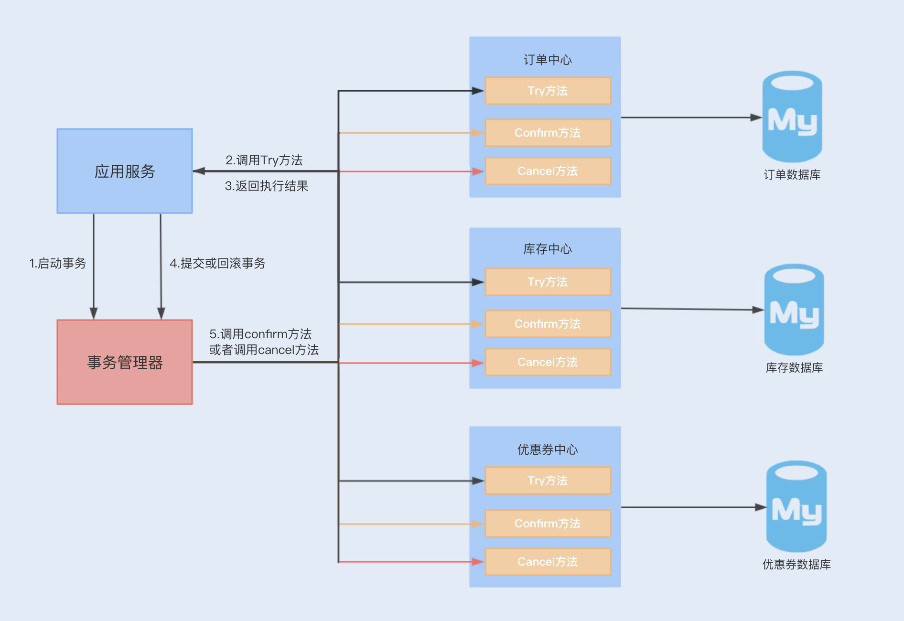

1.分布式事务一致性如何保证
分布式事务解决方案

       在单个数据库的情况下,数据事务操作具有ACID四个特性,但是如果在一个事务中操作多个数据库,则无法使用数据库事务
    来保证一致性.也就是说,当两个数据库操作数据时,可能存在一个数据库操作成功,而另一个数据库操作失败的情况,我们无法通过  
    单个数据库事务来回滚两个数据操作.  
       而分布式事务就是为了解决在同一个事务下,不同节点的数据库操作数据不一致的问题.在一个事务操作请求多个服务或者多个数据库  
    节点时,要么所有请求成功,要么所有请求都失败回滚回去.  
       通常分布式事务的实现有多种方式,例如XA协议实现的二阶段提交2PC 三阶段提交3PC,以及TCC补偿性事务
    什么是XA协议?XA协议是由X/Open组织提出的一个分布式事务处理规范,目前MySql中只有InnoDB存储引擎支持XA协议
a.XA规范

    在XA规范之前,存在一个DTP模型,该模型规范了分布式事务的模型设计.
    DTP规范中主要包含了AP RM TM三个部分,其中AP是应用程序,是事务发起和结束的地方;RM是资源管理器,主要负责管理每个数据库的
    连接数据源;TM是事务管理器,负责事务的全局管理,包括事务的生命周期管理和资源的分配协调等 

    XA则规范了TM与RM之间的通信接口,在TM与多个RM之间形成一个双向通信桥梁,从而在多个数据库资源下保证ACID特性;
    (JTA是基于XA规范实现的一套java事务编程接口,是一种2pc事务)

b.二阶段提交和三阶段提交

        XA规范实现的分布式事务属于二阶提交事务,就是通过两个阶段来实现事务的提交.
    在第一阶段,应用程序向事务管理器(TM)发起事务请求,而事务管理器则会分别向参与的各个资源管理器(RM)发送事务预处理请求(prepare)
        ,此时这些资源管理器会打开本地数据库事务,然后开始执行数据库事务,但是执行完成后并不会立即提交事务,而是向事务管理器返回就绪(Ready)  
    或者未就绪(Not Ready)状态,如果各个参与节点都返回状态,就会进入第二阶段

        到了第二阶段,如果资源管理器返回的都是就绪状态,事务管理器则会向各个资源管理器发送提交(Commit)通知,资源管理器则会完成本地数据库的
    事务提交,最终返回提交结果给事务管理器

         在第二阶段中,如果任意资源管理器返回了未就绪状态,此时事务管理器会向所有资源管理器发送事务回滚(Rollback)通知,此时各个资源管理器就会
    回滚本地数据事务,释放资源,并返回结果通知;  

    **2PC事务存在的缺陷**
        第一,在整个流程中,我们会发现各个资源管理器节点存在阻塞,只有当所有的节点都准备完成之后,事务管理器才会发出进行全局事务提交的通知,
    这个过程如果很长,则会有很多节点长时间占用资源,从而影响整个节点的性能.
        (一旦资源管理器挂了,就会出现一致阻塞等待的情况,类似问题,我们可以通过设置事务超时时间来解决)
        第二,仍然存在数据不一致的可能性,例如,在最后通知提交全局事务时,由于网络故障,部分节点有可能收不到通知,由于这部分节点没有提交事务,就
    会导致数据不一致的情况出现.  
        而3PC事务的出现就是为了减少此类问题的发生.
        3PC把2PC的准备阶段分为了准备阶段和预处理阶段,在第一阶段只是询问各个资源节点是否可以执行事务,而在第二阶段,所有的节点反馈可以执行事务,
    才开始执行事务操作,最后在第三阶段执行提交或回滚操作.并且在事务管理器和资源管理器中都引入超时机制,如果在第三阶段,资源节点一直无法收到  
    来自资源管理器的提交或回滚请求,它就会在超时之后,继续提交事务
        所以3PC可以通过超时机制,避免管理器挂掉所造成的长时间阻塞问题,但是其实这样还是无法解决在最后提交全局事务时,由于网络故障无法通知
    到一些节点的问题,特别是回滚通知,这样会导致事务等待超时从而默认提交.

c.事务补偿机制(TCC)

        以上这种基于XA规范实现的事务提交,由于阻塞等性能问题,有着比较明显的低性能 低吞吐的特性.所以在抢购活动中使用该事务,
    很难满足系统的并发性能.  
        除了性能问题,JTA只能解决同一服务下操作多数据源的分布式事务问题,换到微服务架构下,可能存在同一个事务操作,分别在不同服务上连接  
    数据源,提交数据库操作.
        而TCC正是为了解决以上问题而出现的一种分布式事务解决方案.TCC采用最终一致性方式实现了一种柔性分布式事务,与XA规范实现的二阶事务不同的是,TCC
    的实现是基于服务层实现的一种二阶事务提交

d.TCC分为三个阶段,即Try Confirm Cancel三个阶段

    Try阶段:主要尝试执行业务,执行各个服务中的Try方法,主要包括预留操作
    Confirm阶段:确认Try中的各个方法执行成功,然后通过TM调用各个服务的Confirm方法,这个阶段是提交阶段
    Cancel阶段:当在Try阶段发现其中一个Try方法失败,例如预留资源失败 代码异常等,则会触发TM调用各个服务的Cancel方法,对全局事务进行回滚,取消执行业务.
    
    以上执行只是保证Try阶段执行时成功或失败的提交和回滚操作,你肯定会想到,如果在Confirm和Cancel阶段出现异常情况,那TCC该如何处理呢?
    此时TCC会不停的重试调用失败的Confirm或Cancel方法,直到成功为止.

e.TCC的缺点

    但是TCC补偿性事务也有比较明显的缺点,那就是对业务的侵入性非常大
    首先,我们需要在业务设计的时候考虑预留资源.
    然后,我们要编写大量业务线代码,例如Try Confirm Cancel方法
    最后,我们还需要为每个方法考虑幂等性.
    这种事务的实现和维护成本非常高,但综合来看,这种实现是目前大家最常用的分布式事务解决方案.
