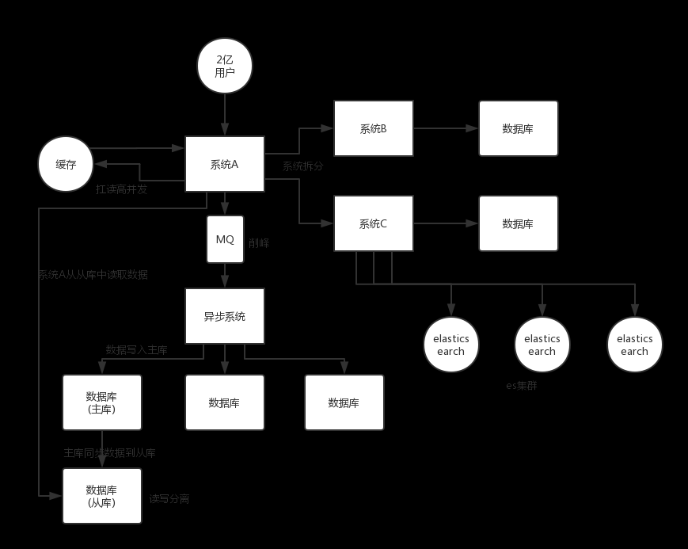
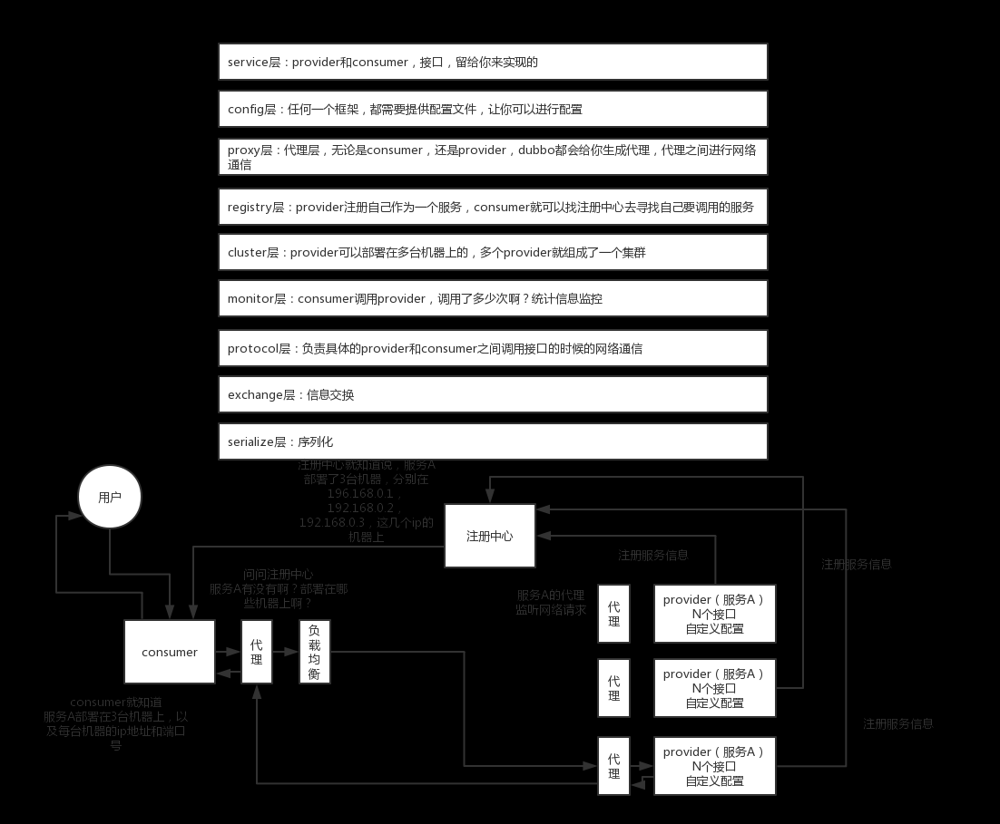

1.面试连环炮?

2.如何设计一个高并发系统
架构图
    

    系统拆分:将一个系统拆分为多个子系统内,用dubbo来搞.然后每个系统连接一个数据库,这样本来本来就一个库,现在多个数据库,
    不也可以扛高并发么.
    
    缓存:必须得用缓存.大部分的高并发场景,都是读多写少,那你完全可以在数据库和缓存里都写一份,然后读的时候大量走缓存不就得了.
    毕竟人家redis轻轻松松单机几万的并发.所以你可以考虑你的项目里,哪些承载主要请求的读场景,怎么用缓存来扛高并发
    
    MQ:MQ必须得用MQ.可能你还是会出现高并发写的场景,比如说一个业务操作里要频繁搞数据库几十次,增删改增删改,疯了,拿高并发绝
    对搞挂你的系统,你要是用redis来承载写那肯定不行,人家是缓存,数据随时就被LRU了,数据格式还无比简单,没有事务支持.所以改用
    mysql还得用mysql啊,那你咋办?用MQ吧,大量的写请求贯入MQ里,排队慢慢玩儿,后边系统消费后慢慢写,控制在mysql承载范围之内.
    所以你得考虑你的项目里,哪些承载复杂写业务逻辑的场景里,如何用MQ来异步写,提升并发性.
    
    分库分表:可能到了最后数据库层面还是免不了扛高并发的要求,好吧,那么就将一个数据库拆分为多个库,多个库来扛更高的并发;
    然后将一个表拆分为多个表,每个表的数据量保持少一点,提高sql跑的性能.
    
    读写分离:这个就是说大部分时候数据库可能也是读多写少,没必要所有请求都集中在一个库上,可以搞个主从架构,主库写入,从库读
    取,搞一个读写分离.读流量太多的时候,还可以加更多的从库;
    
    ElasticSearch
    Elasticsearch，简称 es。es 是分布式的，可以随便扩容，分布式天然就可以支撑高并发，因为动不动就可以扩容加机器来扛
    更高的并发。那么一些比较简单的查询、统计类的操作，可以考虑用 es 来承载，还有一些全文搜索类的操作，也可以考虑用 es 来承载。
3.说下Dubbo 的工作原理?注册中心挂了可以继续通信吗?
工作原理
    第一层：service 层，接口层，给服务提供者和消费者来实现的
    第二层：config 层，配置层，主要是对 dubbo 进行各种配置的
    第三层：proxy 层，服务代理层，无论是 consumer 还是 provider，dubbo 都会给你生成代理，代理之间进行网络通信
    第四层：registry 层，服务注册层，负责服务的注册与发现
    第五层：cluster 层，集群层，封装多个服务提供者的路由以及负载均衡，将多个实例组合成一个服务
    第六层：monitor 层，监控层，对 rpc 接口的调用次数和调用时间进行监控
    第七层：protocal 层，远程调用层，封装 rpc 调用
    第八层：exchange 层，信息交换层，封装请求响应模式，同步转异步
    第九层：transport 层，网络传输层，抽象 mina 和 netty 为统一接口
    第十层：serialize 层，数据序列化层
工作流程

    第一步：provider 向注册中心去注册
    第二步：consumer 从注册中心订阅服务，注册中心会通知 consumer 注册好的服务
    第三步：consumer 调用 provider
    第四步：consumer 和 provider 都异步通知监控中心
流程图  

注册中心挂了可以继续通信吗?  
    可以，因为刚开始初始化的时候，消费者会将提供者的地址等信息拉取到本地缓存，所以注册中心挂了可以继续通信。

4.Dubbo支持哪些序列化协议?说一下Hessian的数据结构?PB知道吗?为什么PB的效率是最高的?

    Dubbo 缺省协议采用单一长连接和 NIO 异步通讯，适合于小数据量大并发的服务调用，以及服务消费者机器数远大于服务提供者机器数的情况。
    反之，Dubbo 缺省协议不适合传送大数据量的服务，比如传文件，传视频等，除非请求量很低
    
    RMI 协议采用 JDK 标准的 java.rmi.* 实现，采用阻塞式短连接和 JDK 标准序列化方式。
    
    Hessian 协议用于集成 Hessian 的服务，Hessian 底层采用 Http 通讯，采用 Servlet 暴露服务，Dubbo 缺省内嵌 Jetty 作为服务器实现。
    
    http协议 基于 HTTP 表单的远程调用协议，采用 Spring 的 HttpInvoker 实现
    
    webservice thrift memcached redis rest grpc
说一下 Hessian 的数据结构

    Hessian 的对象序列化机制有 8 种原始类型：
    原始二进制数据
    boolean
    64-bit date（64 位毫秒值的日期）
    64-bit double
    32-bit int
    64-bit long
    null
    UTF-8 编码的 string
    另外还包括 3 种递归类型：
    
    list for lists and arrays
    map for maps and dictionaries
    object for objects
    还有一种特殊的类型：
    
    ref：用来表示对共享对象的引用。  
 为什么 PB 的效率是最高的?

    第一，它使用 proto 编译器，自动进行序列化和反序列化，速度非常快，应该比 XML 和 JSON 快上了 20~100 倍；  
    第二，它的数据压缩效果好，就是说它序列化后的数据量体积小。因为体积小，传输起来带宽和速度上会有优化     
5.Dubbo的负载均衡策略和集群容错策略都有哪些?动态代理策略呢?
负载均衡

    random loadbalance
    默认情况下，dubbo 是 random load balance ，即随机调用实现负载均衡，可以对 provider 不同实例设置不同的权重，会按照权重来负载均衡，权重越大分配流量越高，一般就用这个默认的就可以了。
    roundrobin loadbalance
    这个的话默认就是均匀地将流量打到各个机器上去，但是如果各个机器的性能不一样，容易导致性能差的机器负载过高。所以此时需要调整权重，让性能差的机器承载权重小一些，流量少一些。
    leastactive loadbalance
    这个就是自动感知一下，如果某个机器性能越差，那么接收的请求越少，越不活跃，此时就会给不活跃的性能差的机器更少的请求。
    consistanthash loadbalance
    一致性 Hash 算法，相同参数的请求一定分发到一个 provider 上去，provider 挂掉的时候，会基于虚拟节点均匀分配剩余的流量，抖动不会太大。如果你需要的不是随机负载均衡，  
    是要一类请求都到一个节点，那就走这个一致性 Hash 策略。

 dubbo 集群容错策略

    failover cluster 模式
    失败自动切换，自动重试其他机器，默认就是这个，常见于读操作。（失败重试其它机器）
    
    可以通过以下几种方式配置重试次数：
    
    <dubbo:service retries="2" />
    或者
    
    <dubbo:reference retries="2" />
    或者
    <dubbo:reference>
        <dubbo:method name="findFoo" retries="2" />
    </dubbo:reference>
    failfast cluster 模式
    一次调用失败就立即失败，常见于非幂等性的写操作，比如新增一条记录（调用失败就立即失败）
    
    failsafe cluster 模式
    出现异常时忽略掉，常用于不重要的接口调用，比如记录日志。
    配置示例如下：
    <dubbo:service cluster="failsafe" />
    或者
    <dubbo:reference cluster="failsafe" />
    failback cluster 模式
    失败了后台自动记录请求，然后定时重发，比较适合于写消息队列这种。
    
    forking cluster 模式
    并行调用多个 provider，只要一个成功就立即返回。常用于实时性要求比较高的读操作，但是会浪费更多的服务资源，可通过 forks="2" 来设置最大并行数。
    
    broadcacst cluster
    逐个调用所有的 provider。任何一个 provider 出错则报错（从2.1.0 版本开始支持）。通常用于通知所有提供者更新缓存或日志等本地资源信息。

dubbo动态代理策略

    默认使用 javassist 动态字节码生成，创建代理类。但是可以通过 spi 扩展机制配置自己的动态代理策略。
6.Dubbo的spi思想是什么?

    spi 是啥？
    spi，简单来说，就是 service provider interface，说白了是什么意思呢，比如你有个接口，现在这个接口有 3 个实现类，那么在系统运行的时候对这个接口到底选择哪个实现类呢？这就需要 spi 了，需要根据指定的配置或者是默认的配置，去找到对应的实现类加载进来，然后用这个实现类的实例对象。

    举个栗子。
    你有一个接口 A。A1/A2/A3 分别是接口A的不同实现。你通过配置 接口 A = 实现 A2，那么在系统实际运行的时候，会加载你的配置，用实现 A2 实例化一个对象来提供服务。
    spi 机制一般用在哪儿？插件扩展的场景，比如说你开发了一个给别人使用的开源框架，如果你想让别人自己写个插件，插到你的开源框架里面，从而扩展某个功能，这个时候 spi 思想就用上了。
    
    Java spi 思想的体现
    spi 经典的思想体现，大家平时都在用，比如说 jdbc。
    
    Java 定义了一套 jdbc 的接口，但是 Java 并没有提供 jdbc 的实现类。
    但是实际上项目跑的时候，要使用 jdbc 接口的哪些实现类呢？一般来说，我们要根据自己使用的数据库，比如 mysql，你就将 mysql-jdbc-connector.jar 引入进来；oracle，你就将 oracle-jdbc-connector.jar 引入进来。
    
    在系统跑的时候，碰到你使用 jdbc 的接口，他会在底层使用你引入的那个 jar 中提供的实现类。
    dubbo 也用了 spi 思想，不过没有用 jdk 的 spi 机制，是自己实现的一套 spi 机制。

    Protocol protocol = ExtensionLoader.getExtensionLoader(Protocol.class).getAdaptiveExtension();
    Protocol 接口，在系统运行的时候，，dubbo 会判断一下应该选用这个 Protocol 接口的哪个实现类来实例化对象来使用。
    
    它会去找一个你配置的 Protocol，将你配置的 Protocol 实现类，加载到 jvm 中来，然后实例化对象，就用你的那个 Protocol 实现类就可以了。
    
    上面那行代码就是 dubbo 里大量使用的，就是对很多组件，都是保留一个接口和多个实现，然后在系统运行的时候动态根据配置去找到对应的实现类。如果你没配置，那就走默认的实现好了，没问题。

    @SPI("dubbo")  
    public interface Protocol {
    
        int getDefaultPort();  
      
        @Adaptive  
        <T> Exporter<T> export(Invoker<T> invoker) throws RpcException;  
      
        @Adaptive  
        <T> Invoker<T> refer(Class<T> type, URL url) throws RpcException;  
    
        void destroy();  
    
    }  
    在 dubbo 自己的 jar 里，在/META_INF/dubbo/internal/com.alibaba.dubbo.rpc.Protocol文件中：
    
    dubbo=com.alibaba.dubbo.rpc.protocol.dubbo.DubboProtocol
    http=com.alibaba.dubbo.rpc.protocol.http.HttpProtocol
    hessian=com.alibaba.dubbo.rpc.protocol.hessian.HessianProtocol
    所以说，这就看到了 dubbo 的 spi 机制默认是怎么玩儿的了，其实就是 Protocol 接口，@SPI("dubbo") 说的是，通过 SPI 机制来提供实现类，
    实现类是通过 dubbo 作为默认 key 去配置文件里找到的，配置文件名称与接口全限定名一样的，通过 dubbo 作为 key 可以找到默认的实现类就是 
    com.alibaba.dubbo.rpc.protocol.dubbo.DubboProtocol。
    
    如果想要动态替换掉默认的实现类，需要使用 @Adaptive 接口，Protocol 接口中，有两个方法加了 @Adaptive 注解，就是说那俩接口会被代理实现。
    啥意思呢？
    比如这个 Protocol 接口搞了俩 @Adaptive 注解标注了方法，在运行的时候会针对 Protocol 生成代理类，这个代理类的那俩方法里面会有代理代码，
    代理代码会在运行的时候动态根据 url 中的 protocol 来获取那个 key，默认是 dubbo，你也可以自己指定，你如果指定了别的 key，那么就会获取别的实现类的实例了。
7.如何基于Dubbo进行服务治理 服务降级 失败重试以及超时重试?

8.分布式服务接口的幂等性如何设计(比如不能重复扣款)?

    这个不是技术问题，这个没有通用的一个方法，这个应该结合业务来保证幂等性。
    所谓幂等性，就是说一个接口，多次发起同一个请求，你这个接口得保证结果是准确的，比如不能多扣款、不能多插入一条数据、不能将统计值多加了 1。这就是幂等性。
    其实保证幂等性主要是三点：
    
    对于每个请求必须有一个唯一的标识，举个栗子：订单支付请求，肯定得包含订单 id，一个订单 id 最多支付一次，对吧。
    每次处理完请求之后，必须有一个记录标识这个请求处理过了。常见的方案是在 mysql 中记录个状态啥的，比如支付之前记录一条这个订单的支付流水。
    每次接收请求需要进行判断，判断之前是否处理过。比如说，如果有一个订单已经支付了，就已经有了一条支付流水，那么如果重复发送这个请求，则此时
    先插入支付流水，orderId 已经存在了，唯一键约束生效，报错插入不进去的。然后你就不用再扣款了。
    实际运作过程中，你要结合自己的业务来，比如说利用 redis，用 orderId 作为唯一键。只有成功插入这个支付流水，才可以执行实际的支付扣款。

    要求是支付一个订单，必须插入一条支付流水，order_id 建一个唯一键 unique key。你在支付一个订单之前，先插入一条支付流水，order_id 就
    已经进去了。你就可以写一个标识到 redis 里面去，set order_id payed，下一次重复请求过来了，先查 redis 的 order_id 对应的 value，
    如果是 payed 就说明已经支付过了，你就别重复支付了。
9.分布式服务接口请求的顺序性如何保证?

    最好是比如说刚才那种，一个订单的插入和删除操作，能不能合并成一个操作，就是一个删除，或者是其它什么，避免这种问题的产生。
10.如何保证自己设计一个类似Dubbo的RPC框架?

    上来你的服务就得去注册中心注册吧，你是不是得有个注册中心，保留各个服务的信息，可以用 zookeeper 来做，对吧。
    然后你的消费者需要去注册中心拿对应的服务信息吧，对吧，而且每个服务可能会存在于多台机器上。
    接着你就该发起一次请求了，咋发起？当然是基于动态代理了，你面向接口获取到一个动态代理，这个动态代理就是接口在本地的一个代理，然后这个代理会找到服务对应的机器地址。
    然后找哪个机器发送请求？那肯定得有个负载均衡算法了，比如最简单的可以随机轮询是不是。
    接着找到一台机器，就可以跟它发送请求了，第一个问题咋发送？你可以说用 netty 了，nio 方式；第二个问题发送啥格式数据？你可以说用 hessian 序列化协议了，或者是别的，对吧。然后请求过去了。
    服务器那边一样的，需要针对你自己的服务生成一个动态代理，监听某个网络端口了，然后代理你本地的服务代码。接收到请求的时候，就调用对应的服务代码，对吧。
11.为什么要进行系统拆分?如何进行系统拆分?拆分后不用Dubbo可以吗?
为什么要将系统进行拆分？

    网上查查，答案极度零散和复杂，很琐碎，原因一大坨。但是我这里给大家直观的感受：
    要是不拆分，一个大系统几十万行代码，20 个人维护一份代码，简直是悲剧啊。代码经常改着改着就冲突了，各种代码冲突和合并要处理，非常耗费时间；经常我改动了我的代码，你调用了我的，  
    导致你的代码也得重新测试，麻烦的要死；然后每次发布都是几十万行代码的系统一起发布，大家得一起提心吊胆准备上线，几十万行代码的上线，可能每次上线都要做很多的检查，很多异常问题  
    的处理，简直是又麻烦又痛苦；而且如果我现在打算把技术升级到最新的 spring 版本，还不行，因为这可能导致你的代码报错，我不敢随意乱改技术。
    假设一个系统是 20 万行代码，其中 A 在里面改了 1000 行代码，但是此时发布的时候是这个 20 万行代码的大系统一块儿发布。就意味着 20 万上代码在线上就可能出现各种变化，20 个人，  
    每个人都要紧张地等在电脑面前，上线之后，检查日志，看自己负责的那一块儿有没有什么问题。
    A 就检查了自己负责的 1 万行代码对应的功能，确保 ok 就闪人了；结果不巧的是，A 上线的时候不小心修改了线上机器的某个配置，导致另外 B 和 C 负责的 2 万行代码对应的一些功能，出错了。
    几十个人负责维护一个几十万行代码的单块应用，每次上线，准备几个礼拜，上线 -> 部署 -> 检查自己负责的功能。
    拆分了以后，整个世界清爽了，几十万行代码的系统，拆分成 20 个服务，平均每个服务就 1~2 万行代码，每个服务部署到单独的机器上。20 个工程，20 个 git 代码仓库，20 个开发人员，每个  
    人维护自己的那个服务就可以了，是自己独立的代码，跟别人没关系。再也没有代码冲突了，爽。每次就测试我自己的代码就可以了，爽。每次就发布我自己的一个小服务就可以了，爽。技术上想怎么升  
    级就怎么升级，保持接口不变就可以了，真爽。
    所以简单来说，一句话总结，如果是那种代码量多达几十万行的中大型项目，团队里有几十个人，那么如果不拆分系统，开发效率极其低下，问题很多。但是拆分系统之后，每个人就负责自己的一小部分  
    就好了，可以随便玩儿随便弄。分布式系统拆分之后，可以大幅度提升复杂系统大型团队的开发效率。
    但是同时，也要提醒的一点是，系统拆分成分布式系统之后，大量的分布式系统面临的问题也是接踵而来，所以后面的问题都是在围绕分布式系统带来的复杂技术挑战在说。

如何进行系统拆分？
    这个问题说大可以很大，可以扯到领域驱动模型设计上去，说小了也很小，我不太想给大家太过于学术的说法，因为你也不可能背这个答案，过去了直接说吧。还是说的简单一点，大家自己到时候知道怎么回答就行了。
    系统拆分为分布式系统，拆成多个服务，拆成微服务的架构，是需要拆很多轮的。并不是说上来一个架构师一次就给拆好了，而以后都不用拆。
    第一轮；团队继续扩大，拆好的某个服务，刚开始是 1 个人维护 1 万行代码，后来业务系统越来越复杂，这个服务是 10 万行代码，5 个人；第二轮，1个服务 -> 5个服务，每个服务 2 万行代码，每人负责一个服务。
    如果是多人维护一个服务，最理想的情况下，几十个人，1 个人负责 1 个或 2~3 个服务；某个服务工作量变大了，代码量越来越多，某个同学，负责一个服务，代码量变成了 10 万行了，他自己不堪重负，他现在一  
    个人拆开，5 个服务，1 个人顶着，负责 5 个人，接着招人，2 个人，给那个同学带着，3 个人负责 5 个服务，其中 2 个人每个人负责 2 个服务，1 个人负责 1 个服务。
    个人建议，一个服务的代码不要太多，1 万行左右，两三万撑死了吧。
    大部分的系统，是要进行多轮拆分的，第一次拆分，可能就是将以前的多个模块该拆分开来了，比如说将电商系统拆分成订单系统、商品系统、采购系统、仓储系统、用户系统，等等吧。
    但是后面可能每个系统又变得越来越复杂了，比如说采购系统里面又分成了供应商管理系统、采购单管理系统，订单系统又拆分成了购物车系统、价格系统、订单管理系统。
    扯深了实在很深，所以这里先给大家举个例子，你自己感受一下，核心意思就是根据情况，先拆分一轮，后面如果系统更复杂了，可以继续分拆。你根据自己负责系统的例子，来考虑一下就好了。

拆分后不用 dubbo 可以吗？

    当然可以了，大不了最次，就是各个系统之间，直接基于 spring mvc，就纯 http 接口互相通信呗，还能咋样。但是这个肯定是有问题的，因为 http 接口通信维护起来成本很高，  
    你要考虑超时重试、负载均衡等等各种乱七八糟的问题，比如说你的订单系统调用商品系统，商品系统部署了 5 台机器，你怎么把请求均匀地甩给那 5 台机器？这不就是负载均衡？  
    你要是都自己搞那是可以的，但是确实很痛苦。

所以 dubbo 说白了，是一种 rpc 框架，就是说本地就是进行接口调用，但是 dubbo 会代理这个调用请求，跟远程机器网络通信，给你处理掉负载均衡、服务实例上下线自动感知、超时重试等等乱七八糟的问题。  
    那你就不用自己做了，用 dubbo 就可以了。