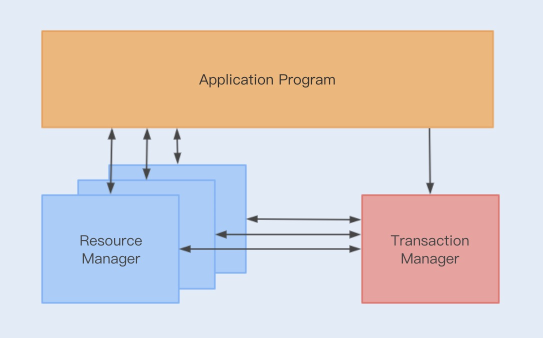
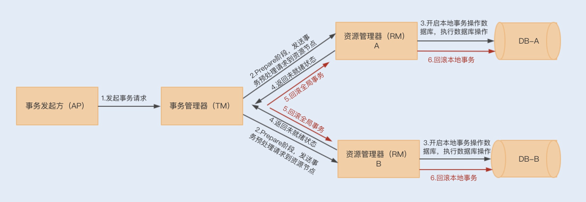

1.简单介绍下自己的近况

2.对kafka了解吗?RocketMq事务性消息怎么实现的?


    消息队列中的"事务",主要解决的是消息生产者和消息消费者的数据一致性问题
    1.发送Half消息
    2.Half消息发送成功
    3.执行本地事务
    4.提交或回滚事务
    5.网络异常，Broker没有收到commit or rollback，回查本地事务状态
    6.检查本地事务状态
    7.根据本地事务状态执行commit or rollback
    8.根据 4 或 7 投递消息到MQ订阅方，或者取消不投递

3.假设事务提交的消息丢了,没有发到broker上面,会怎么处理?

    我们可以消息队列的有序性来验证是否有消息丢失.原理非常简单,在Producer端,我们给每个发出的消息附加一个连续递增的序号,  
    然后在Consumer端来检查这个序号的连续性.
    一条消息从生产到消费完成这个过程,可以划分为三个阶段
    在生产阶段:你需要捕获消息发送的错误,并重发消息
    [
        在生產阶段,消息队列通过最常用的请求确认机制,来保证消息的可靠传递:当你的代码调用发送消息方法时,消息队列的客户端
        会把消息发送Broker,Broker收到消息后,会给客户端返回一个确认响应,表明消息已经收到了.客户端收到响应后,完成了一次
        正常消息的发送.
        只要Producer收到了Broker的确认响应,就可以保证消息在生产阶段不会丢失.有些消息队列在长时间没收到发送确认响应后,
        会自动重试,如果重试再失败,就会议返回值或者抛出异常的方式告知用户
        你在编写发送消息代码时,需要注意,正确处理返回值或者捕获异常,就可以保证这个阶段的消息不会丢失.
        以kafka为例,看下如何可靠的发送消息

        try {
            RecordMetadata metadata = producer.send(record).get();
            System.out.println("消息发送成功。");
        } catch (Throwable e) {
            System.out.println("消息发送失败！");
            System.out.println(e);
        }
    
        异步发送时,则需要在回调方法里进行检查    
        producer.send(record, (metadata, exception) -> {
            if (metadata != null) {
                System.out.println("消息发送成功。");
            } else {
                System.out.println("消息发送失败！");
                System.out.println(exception);
            }
        });    
    ]

    在存储阶段:你可以通过配置刷盘和复制相关的参数,让消息写入到多个副本的磁盘上,来确保消息不会因为某个broker宕机,或者磁盘
    损坏而丢失.
    [
        在存储阶段正常情况下,只要broker在正常运行,就不会出现消息丢失的问题,但是如果Broker出现了故障,比如进程死掉了或者服务器
    宕机,还是可能会丢失消息的
    如果对消息的可靠性要求非常高,可以通过配置Broker参数来避免因为宕机丢失消息
       对于单个节点的Broker,需要配置Broker参数,在收到消息后,将消息写入磁盘后再给Producer返回确认机制,这样即使发生宕机,由于
    消息已经被写入磁盘,就不会丢失消息,恢复后还可以继续消费.在RocketMQ中,需要将双排方式FlushDiskType配置为SYNC_Flush同步刷盘
       如果是Broker是由多个节点组成的集群,需要将Broker集群配置成:至少将消息发送到2个以上的节点,再给客户端恢复发送确认响应.
    这样当某个Broker宕机时,其他的Broker可以替代宕机的Broker,也不会发生消息丢失            
    ]
      
    在消费阶段:你需要在处理完全部消费业务逻辑之后,再发送消费确认
    [
        消费阶段采用和生产阶段类似的确认机制来保证消息的可靠性,客户端从Broker拉取消息后,执行用户的消费业务逻辑,成功后,才会给Broker发送消费确认响应.
        如果Broker没有收到消费确认响应,下次拉消息的时候还会返回同一条消息,确保消息不会在网络传输过程中丢失,也不会因为客户端在执行消费逻辑中出错导致丢失.
        注意:不要在收到消息后就立即发送消费确认,而是应该在执行完成所有消费业务逻辑之后,再发送消费确认    
    ]

4.分布式事务一致性如何保证
分布式事务解决方案

       在单个数据库的情况下,数据事务操作具有ACID四个特性,但是如果在一个事务中操作多个数据库,则无法使用数据库事务
    来保证一致性.也就是说,当两个数据库操作数据时,可能存在一个数据库操作成功,而另一个数据库操作失败的情况,我们无法通过  
    单个数据库事务来回滚两个数据操作.  
       而分布式事务就是为了解决在同一个事务下,不同节点的数据库操作数据不一致的问题.在一个事务操作请求多个服务或者多个数据库  
    节点时,要么所有请求成功,要么所有请求都失败回滚回去.  
       通常分布式事务的实现有多种方式,例如XA协议实现的二阶段提交2PC 三阶段提交3PC,以及TCC补偿性事务
    什么是XA协议?XA协议是由X/Open组织提出的一个分布式事务处理规范,目前MySql中只有InnoDB存储引擎支持XA协议
a.XA规范

    在XA规范之前,存在一个DTP模型,该模型规范了分布式事务的模型设计.
    DTP规范中主要包含了AP RM TM三个部分,其中AP是应用程序,是事务发起和结束的地方;RM是资源管理器,主要负责管理每个数据库的
    连接数据源;TM是事务管理器,负责事务的全局管理,包括事务的生命周期管理和资源的分配协调等 
    
    XA则规范了TM与RM之间的通信接口,在TM与多个RM之间形成一个双向通信桥梁,从而在多个数据库资源下保证ACID特性;
    (JTA是基于XA规范实现的一套java事务编程接口,是一种2pc事务)

b.二阶段提交和三阶段提交

        XA规范实现的分布式事务属于二阶提交事务,就是通过两个阶段来实现事务的提交.
    在第一阶段,应用程序向事务管理器(TM)发起事务请求,而事务管理器则会分别向参与的各个资源管理器(RM)发送事务预处理请求(prepare)
        ,此时这些资源管理器会打开本地数据库事务,然后开始执行数据库事务,但是执行完成后并不会立即提交事务,而是向事务管理器返回就绪(Ready)  
    或者未就绪(Not Ready)状态,如果各个参与节点都返回状态,就会进入第二阶段
    
        到了第二阶段,如果资源管理器返回的都是就绪状态,事务管理器则会向各个资源管理器发送提交(Commit)通知,资源管理器则会完成本地数据库的
    事务提交,最终返回提交结果给事务管理器
       
         在第二阶段中,如果任意资源管理器返回了未就绪状态,此时事务管理器会向所有资源管理器发送事务回滚(Rollback)通知,此时各个资源管理器就会
    回滚本地数据事务,释放资源,并返回结果通知;  
    

    **2PC事务存在的缺陷**
        第一,在整个流程中,我们会发现各个资源管理器节点存在阻塞,只有当所有的节点都准备完成之后,事务管理器才会发出进行全局事务提交的通知,
    这个过程如果很长,则会有很多节点长时间占用资源,从而影响整个节点的性能.
        (一旦资源管理器挂了,就会出现一致阻塞等待的情况,类似问题,我们可以通过设置事务超时时间来解决)
        第二,仍然存在数据不一致的可能性,例如,在最后通知提交全局事务时,由于网络故障,部分节点有可能收不到通知,由于这部分节点没有提交事务,就
    会导致数据不一致的情况出现.  
        而3PC事务的出现就是为了减少此类问题的发生.
        3PC把2PC的准备阶段分为了准备阶段和预处理阶段,在第一阶段只是询问各个资源节点是否可以执行事务,而在第二阶段,所有的节点反馈可以执行事务,
    才开始执行事务操作,最后在第三阶段执行提交或回滚操作.并且在事务管理器和资源管理器中都引入超时机制,如果在第三阶段,资源节点一直无法收到  
    来自资源管理器的提交或回滚请求,它就会在超时之后,继续提交事务
        所以3PC可以通过超时机制,避免管理器挂掉所造成的长时间阻塞问题,但是其实这样还是无法解决在最后提交全局事务时,由于网络故障无法通知
    到一些节点的问题,特别是回滚通知,这样会导致事务等待超时从而默认提交.

c.事务补偿机制(TCC)

        以上这种基于XA规范实现的事务提交,由于阻塞等性能问题,有着比较明显的低性能 低吞吐的特性.所以在抢购活动中使用该事务,
    很难满足系统的并发性能.  
        除了性能问题,JTA只能解决同一服务下操作多数据源的分布式事务问题,换到微服务架构下,可能存在同一个事务操作,分别在不同服务上连接  
    数据源,提交数据库操作.
        而TCC正是为了解决以上问题而出现的一种分布式事务解决方案.TCC采用最终一致性方式实现了一种柔性分布式事务,与XA规范实现的二阶事务不同的是,TCC
    的实现是基于服务层实现的一种二阶事务提交

d.TCC分为三个阶段,即Try Confirm Cancel三个阶段


    Try阶段:主要尝试执行业务,执行各个服务中的Try方法,主要包括预留操作
    Confirm阶段:确认Try中的各个方法执行成功,然后通过TM调用各个服务的Confirm方法,这个阶段是提交阶段
    Cancel阶段:当在Try阶段发现其中一个Try方法失败,例如预留资源失败 代码异常等,则会触发TM调用各个服务的Cancel方法,对全局事务进行回滚,取消执行业务.
    
    以上执行只是保证Try阶段执行时成功或失败的提交和回滚操作,你肯定会想到,如果在Confirm和Cancel阶段出现异常情况,那TCC该如何处理呢?
    此时TCC会不停的重试调用失败的Confirm或Cancel方法,直到成功为止.

e.TCC的缺点

    但是TCC补偿性事务也有比较明显的缺点,那就是对业务的侵入性非常大
    首先,我们需要在业务设计的时候考虑预留资源.
    然后,我们要编写大量业务线代码,例如Try Confirm Cancel方法
    最后,我们还需要为每个方法考虑幂等性.
    这种事务的实现和维护成本非常高,但综合来看,这种实现是目前大家最常用的分布式事务解决方案.

5.2pc 3pc tcc

6.TCC对异常流式如何操作的?

7.为什么要看源码?

    a.通过学习开源框架 开源项目的源码,我们可以学习到多种场景 多种技术的解决方案,快速增加经验
    b.在使用某个框架或工具进行开发时,如果你对其源码有所了解,可以最大化的减少出故障的可能
    c.有利于你研究一个新系统的代码逻辑,快速接手一个新系统
    d.最大的好处是可以开阔思维,提升架构设计能力,通过看源码,看别人如何设计,然后思考为何这样设计才能领悟到

问题扩展:如何阅读源码

    Google查找这个开源框架的官方介绍，了解以下信息
    框架有几个模块
    模块的作用
    模块之间的联系
    每个模块的核心类（在阅读源码的过程中，着重看核心类）
    对哪个模块感兴趣就去写个小demo，先了解一下这个模块的具体作用。
    debug进入看具体实现。（这里面可以充分使用IDEA的调试功能）
    第一遍是走马观花，简略看一下调用逻辑，都用了哪些类；
    第二遍需有重点地debug，看看这些类担任了架构图里的哪些功能，使用了哪些设计模式。
    第三遍debug，把主要类的调用时序图以及类图结构画出来，对着时序图分析调用流程   
8.最终一致性如何实现的?

9.有没有遇到过死锁?
    没有
10.A往B转钱,B往A转钱,同时转会死锁吗?如何解决死锁?
账户转账代码
```java
class Account{
    private int balance;
    // 转账
    void transfer(Account target,int amt){
        // 锁定转出账户
        synchronized(this){ //  ①
            // 锁定转入账户
            synchronized (target){ // ② 
                if (this.balance>amt){
                    this.balance-=amt;
                    target.balance+=amt;
                }
            }
        }
    }
}
```
上面转账的代码是怎么发生死锁的呢?

    1.我们假设线程T1执行账户A转账户B的操作,账户A.transfer(账户B);同时线程T2执行账户B转账户A的操作,账户B.transfer(账户A);
    2.当T1和T2同时执行完①处的代码时,T1获得了账户A的锁(对于T1,this是账户A),而T2获得了账户B的锁(对于T2,this是账户B).
    3.当T1和T2在执行②处的代码时,T1视图获取账户B的锁时,发现账户B已经被锁定(被T2锁定),所以T1开始等待;T2则视图获取账户A的锁时候,
    发现账户已经被锁定(被T1锁定),所以T2也开始等待.
    4.于是T1和T2会无限期的等待下去,也就是我们所说的死锁了
如何预防死锁?

    并发程序一旦发生死锁,一般没有特别好的方法,很多时候我们只能重启应用.因此,解决死锁问题最好的办法还是规避死锁.  
    那如何避免死锁呢?要避免死锁就需要分析死锁发生的条件,有个叫Coffman的牛人总结过了,只有一下四个条件都发生时才会出现死锁:
        1.互斥,共享资源X和Y只能被一个线程占用
        2.占有且等待,线程T1已经取得共享资源X,在等待共享资源Y的时候,不释放共享资源X
        3.不可抢占,其他线程不能强行抢占线程T1占有的资源
        4.循环等待,线程T1等待线程T2占有的资源,线程T2等待线程T1占有的资源,就是循环等待.
    反过来分析,只要我们破坏其中一个,就可以成功避免死锁的发生.
    其中,互斥这个条件我们没有办法破坏,因为我们用锁为的就是互斥,不过其他三个条件都是有办法破坏掉的,到底该如何做呢?
        1.对于"占有且等待"这个条件,我们可以一次性申请所有的资源,这样就不存在等待了
        2.对于"不可抢占"这个条件,占用部分资源的线程进一步申请其他资源时,如果申请不到,可以主动释放它占有的资源,这样不可抢占这个条件就
            破坏掉了
        3.对于"循环等待"这个条件,可以靠按序申请资源来预防.所谓按序申请,是指资源是有线性顺序的,申请的时候可以先申请资源序号小的,再申请资源序号大的,
        这样线性化后自然就不存在循环了.

代码实现
a.破坏占有且等待
```java

class Allocator {
  private List<Object> als = new ArrayList<>();
  // 一次性申请所有资源
  synchronized boolean apply(Object from, Object to){
    if(als.contains(from) ||als.contains(to)){
      return false;  
    } else {
      als.add(from);
      als.add(to);  
    }
    return true;
  }
  // 归还资源
  synchronized void free(Object from, Object to){
    als.remove(from);
    als.remove(to);
  }
}

class Account {
  // actr应该为单例
  private Allocator actr;
  private int balance;
  // 转账
  void transfer(Account target, int amt){
    // 一次性申请转出账户和转入账户，直到成功
    while(!actr.apply(this, target));
    try{
      // 锁定转出账户
      synchronized(this){              
        // 锁定转入账户
        synchronized(target){           
          if (this.balance > amt){
            this.balance -= amt;
            target.balance += amt;
          }
        }
      }
    } finally {
      actr.free(this, target);
    }
  } 
}
```
b.破坏不可抢占条件

    破坏不可抢占条件看上去很简单，核心是要能够主动释放它占有的资源，这一点 synchronized 是做不到的。
    原因是 synchronized 申请资源的时候，如果申请不到，线程直接进入阻塞状态了，而线程进入阻塞状态，
    啥都干不了，也释放不了线程已经占有的资源。
    java.util.concurrent 这个包下面提供的 Lock 是可以轻松解决这个问题的
c.破坏循环等待条件

    破坏这个条件，需要对资源进行排序，然后按序申请资源。这个实现非常简单，我们假设每个账户都有不同的属性 id，  
    这个 id 可以作为排序字段，申请的时候，我们可以按照从小到大的顺序来申请。比如下面代码中，①~⑥处的代码对转出账户（this）  
    和转入账户（target）排序，然后按照序号从小到大的顺序锁定账户。这样就不存在“循环”等待了
```java
class Account {
  private int id;
  private int balance;
  // 转账
  void transfer(Account target, int amt){
    Account left = this;       // ①
    Account right = target;    // ②
    if (this.id > target.id) { // ③
      left = target;           // ④
      right = this;            // ⑤
    }                          // ⑥
    // 锁定序号小的账户
    synchronized(left){
      // 锁定序号大的账户
      synchronized(right){ 
        if (this.balance > amt){
          this.balance -= amt;
          target.balance += amt;
        }
      }
    }
  } 
}
```
关于死锁的问题拓展:

    除了死锁外,还有两种情况,分别是"活锁"和"饥饿"
    发生死锁后线程会互相等待,而且会一直等待下去,在技术上的表现形式是线程永久的阻塞了.
活锁

       但有时线程虽然没有发生阻塞,但仍然会存在执行不下去的情况,这就是所谓的"活锁".
    可以类比现实世界里的例子，路人甲从左手边出门，路人乙从右手边进门，两人为了不相撞，互相谦让，  
    路人甲让路走右手边，路人乙也让路走左手边，结果是两人又相撞了。这种情况，基本上谦让几次就解决了，  
    因为人会交流啊。可是如果这种情况发生在编程世界了，就有可能会一直没完没了地“谦让”下去，成为没有  
    发生阻塞但依然执行不下去的“活锁”.
        解决"活锁"的方案很简单,谦让时,尝试等待一个随机的时间就可以了.
饥饿

        "饥饿":所谓饥饿指的是线程因为无法访问所需资源而无法执行下去的情况.
    发生饥饿的场景:"不患寡,而患不均",如果线程优先级不均,在cpu繁忙的情况下,优先级低的线程得到执行的机会很小,就可能发生线程饥饿;
    持有锁的线程,如果执行的时间过长,也可能导致饥饿问题.
    
    解决饥饿问题的方案,有三种:
    一是保证资源充足;
    二是公平的分配资源;
    三是避免持有锁的线程长时间执行;
    这三个方案中，方案一和方案三的适用场景比较有限，因为很多场景下，资源的稀缺性是没办法解决的，持有锁的线程执行的时间也很难缩短。
    倒是方案二的适用场景相对来说更多一些。那如何公平地分配资源呢？在并发编程里，主要是使用公平锁。所谓公平锁，是一种先来后到的方案，
    线程的等待是有顺序的，排在等待队列前面的线程会优先获得资源。

11.设计一个全局唯一流水号?

    1.设置数据库sequence或者表自增字段步长
        可以通过设置数据库sequence或者表的自增字段步长来进行水平伸缩.比如说,现在有8个服务节点,每个服务节点使用一个sequence功能来产生
    id,每个sequence的起始id不同,并且依次递增,步长都是8.这种设计方式适合的场景:防止id重复,这种方案实现起来比较简单,也能达到
    性能目标.但是服务节点固定,步长也固定,将来如果还要增加服务节点,就不好搞了.


    2.Redis生成id
    当使用数据库来生成id性能不够要求的时候,我们可以尝试使用Redis来生成id,这主要依赖于Redis是单线程的,所以也可以用来生成全局唯一的id.
    可以用Redis的原子操作INCR和INCRBY来实现.
    可以使用Redis集群来获取更高的吞吐量.假如一个集群中有5台Redis.可以初始化每台Redis的值分别是1,2,3,4,5,然后步长都是5.各个Redis生成
    的id为:
            A：1,6,11,16,21
        
            B：2,7,12,17,22
            
            C：3,8,13,18,23
            
            D：4,9,14,19,24
            
            E：5,10,15,20,25
    优点:不依赖与数据库,灵活方便,且性能优于数据库.数字id天然排序,对分页或者需要排序的结果很有帮助,使用Redis集群可以防止单点故障的问题.
    缺点:如果系统中没有Redis,还需要引入新的组件,增加系统复杂度,需要编码和配置的工作量比较大,多环境运维很麻烦.
    
    3.Flicker的解决方案    
    MySQL中id自增的特性，可以借此来生成全局的序列号，Flicker在解决全局ID生成方案里就采用了MySQL自增长ID的机制（auto_increment + replace into + MyISAM）。一个生成64位ID方案具体就是这样的： 先创建单独的数据库，然后创建一个表：
```mysql
    CREATE TABLE borrow_order (
    id bigint(20) unsigned NOT NULL auto_increment,
    stub char(1) NOT NULL default '',
    PRIMARY KEY (id),
    UNIQUE KEY stub (stub)
    ) ENGINE=MyISAM
```
    当我们插入记录后，执行SELECT * from borrow_order ，查询结果就是这样的：
    +-------------------+------+
    | id | stub |
    +-------------------+------+
    | 1 | 192.168.100.102      |
    +-------------------+------+
    在我们的应用端需要做下面这两个操作，在一个事务会话里提交：
    REPLACE INTO borrow_order (stub) VALUES ('192.168.100.102');
    SELECT LAST_INSERT_ID();
    上述操作，通过 replace into 操作，首先尝试插入数据到表中，如果发现表中已经有此行数据则先删除此行数据，然后插入新的数据。 如果没有此行数据的话，直接插入新数据。注意：插入的行字段需要有主键索引或者唯一索引，否则会出错
    通过上述方式，就可以拿到不重复且自增的ID了。 到上面为止，我们只是在单台数据库上生成ID，从高可用角度考虑，接下来就要解决单点故障问题：Flicker启用了两台数据库服务器来生成ID，通过区分auto_increment的起始值和步长来生成奇偶数的ID。
    DBServer1:
    auto-increment-increment = 2
    auto-increment-offset = 1
     
    DBServer2:
    auto-increment-increment = 2
    auto-increment-offset = 2
    最后，在客户端只需要通过轮询方式取ID就可以了。
    优点：充分借助数据库的自增ID机制，提供高可靠性，生成的ID有序。 缺点：占用两个独立的MySQL实例，有些浪费资源，成本较高 数据库中记录过多，每次生成id都需要请求数据库
12.设计幂等方案防止重复提交

    1.利用数据库的唯一约束实现幂等
    2.为更新的数据设置前置条件,通用办法是:给你的数据增加一个版本号属性,每次更新数据前,
    比较当前数据的版本号是否和消息中版本号一致,如果不一致就拒绝更新数据,如果相等就更新数据,同时将版本号+1
    3.记录并检查操作(Token机制):在执行数据更新操作之前,先检查一下是否执行过这个更新操作.
    原理和实现是不是很简单？其实一点儿都不简单，在分布式系统中，这个方法其实是非常难实现的。首先，给每个消息指定一个全局唯一的 ID 就是一件不那么简单的事儿，
    方法有很多，但都不太好同时满足简单、高可用和高性能，或多或少都要有些牺牲。更加麻烦的是，在“检查消费状态，然后更新数据并且设置消费状态”中，三个操作必须作为一组操作保证原子性，
    才能真正实现幂等，否则就会出现 Bug。比如说，对于同一条消息：“全局 ID 为 8，操作为：给 ID 为 666 账户增加 100 元”，有可能出现这样的情况：t0 时刻：Consumer A 收到条消息，
    检查消息执行状态，发现消息未处理过，开始执行“账户增加 100 元”；t1 时刻：Consumer B 收到条消息，检查消息执行状态，发现消息未处理过，因为这个时刻，Consumer A 还未来得及更
    新消息执行状态。这样就会导致账户被错误地增加了两次 100 元，这是一个在分布式系统中非常容易犯的错误，一定要引以为戒。对于这个问题，当然我们可以用事务来实现，也可以用锁来实现，
    但是在分布式系统中，无论是分布式事务还是分布式锁都是比较难解决问题。


13.


17.再答一次秒杀系统

18.写金融类的系统有什么需要关注的地方

19.非功能性的设计关注那些?日志规范,代码规范

20.你有什么想问的

21.TCP的三次握手?


22.
