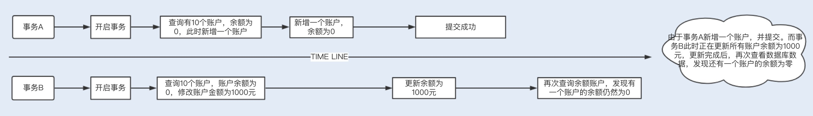

MySQL优化
1.MySQL调优之SQL语句:如何写出高性能SQL语句?

a.应该尽量避免一些慢SQL语句的出现

    慢SQL语句的几种常见诱因
        1.无索引 索引失效导致慢查询
        如果在一张几千万数据的表中以一个没有索引的列作为查询条件,大部分情况下查询会非常耗时,这种查询毫无疑问是一个慢SQL查询,
    所以对于大数据量的查询,我们需要建立适合的索引来优化查询
        虽然我们很多时候建立了索引,但在一些特定的场景下,索引还有可能会失效,所以索引失效也是导致慢查询的主要原因之一
        2.锁等待
        我们常用的存储引擎有InnoDB和MyISAM,前者支持行锁和表锁,后者只支持表锁.
        如果数据库操作是基于表锁实现的,试想下,如果一张订单表在更新时,需要锁住整张表,那么其他大量数据库操作(包括查询)都将处于等待
    状态,这将严重影响到系统的并发功能
        这时,InnoDB存储引擎支持的行锁更适合高并发的场景,但是在使用InnoDB存储引擎时,我们要特别注意行锁升级为表锁的可能.在批量更新
    操作时,行锁就很可能会升级为表锁.
        MySQL认为如果对一张表使用大量行锁,会导致事务执行效率下降,从而可能造成其他事务长时间所等待和更多的锁冲突问题发生,致使性能严重下降,
    所以MySql会将行锁升级为表锁.还有,行锁是基于索引加的锁,如果我们在更新操作时,条件索引失效,那么行锁也会升级为表锁.
        因此,基于表锁的数据库操作,会导致SQL阻塞等待,从而影响执行速度.在一些更新操作(insert/update/delete)大于或等于读操作的情况下,mysql
    不建议使用MyISAM存储引擎.
        除了锁升级之外,行锁相对表锁来说,虽然粒度更细,并发能力提升了,但是也带来了新的问题,那就是死锁,因此,在使用行锁时,我们要注意避免死锁
        
        3.不恰当的sql语句
        使用不恰当的SQL语句也是慢sql最常见的诱因之一.例如习惯使用<select *>,<select count(*)> sql语句,在大数据表中使用<limit m,n>分页查询,
    以及对非索引字段进行排序等等
b.优化sql语句的步骤

        通常,我们在执行一条sql语句时,要想知道这个sql先后查询了那些表,是否使用了索引,这些数据从哪里获取到,获取到了数据遍历了多少行数据等等,我们可以通过
    EXPLAIN命令来查看这些执行信息.这些执行信息被统称为执行计划
        1.通过explain分析sql执行计划
        2.通过show profiles分析sql执行性能 
            通过explain分析执行计划,仅仅是停留在分析sql的外部执行情况,如果我们想要深入到MySQL内核中,从执行线程的状态和时间来分析的话,这个时候我们就看
    选择profile;show profiles只显示最近发给服务器的SQL语句,默认情况下是记录最近已执行的15条记录,我们可以重新设置profiling_history_size
    增大该存储记录,最大值为100;获取到query_id,再通过show profile for query_id,就能够查询到对应的query_id的sql
    语句在执行过程中线程的每个状态所消耗的时间了
c.常用的SQL优化

    1.优化分页查询
    通常我们使用<limit m,n> + 合适的order by来实现分页查询,这种实现方式在没有任何索引条件支持的情况下,需要做大量的文件排序索引,
    性能将会非常槽糕,如果有对应的索引,通常刚开始的分页查询效率会比较理想,但越往后,分页查询的性能就越差.
    这是因为我们在使用limit的时候,偏移量m在分页越靠后的时候,值就越大,数据库检索的数据也就越多.例如limit 10000,10这样的查询,数据库需要查询
    10010条记录,最后返回10条记录.也就是说将会有10000条记录被查询出来没有被使用到
        利用子查询优化分页查询:我们可以先查询出所需要的10行数据中的最小id值,然后通过偏移量返回所需要的10行数据给我们
    select * from `demo`.`order` where id> (select id from `demo`.`order` order by order_no limit 10000, 1)  limit 20;    
    2.优化select count(*)
    COUNT() 是一个聚合函数，主要用来统计行数，有时候也用来统计某一列的行数量（不统计 NULL 值的行）。我们平时最常用的就是 COUNT(*) 和 COUNT(1) 这两种方式了，
    其实两者没有明显的区别，在拥有主键的情况下，它们都是利用主键列实现了行数的统计。但 COUNT() 函数在 MyISAM 和 InnoDB 存储引擎所执行的原理是不一样的，
    通常在没有任何查询条件下的 COUNT(*)，MyISAM 的查询速度要明显快于 InnoDB。这是因为 MyISAM 存储引擎记录的是整个表的行数，在 COUNT(*) 查询操作时无需遍历表计算，
    直接获取该值即可。而在 InnoDB 存储引擎中就需要扫描表来统计具体的行数。而当带上 where 条件语句之后，MyISAM 跟 InnoDB 就没有区别了，它们都需要扫描表来进行行数的统计。
    如果对一张大表经常做 SELECT COUNT(*) 操作，这肯定是不明智的。那么我们该如何对大表的 COUNT() 进行优化呢？
    
    使用近似值
    有时候某些业务场景并不需要返回一个精确的 COUNT 值，
    此时我们可以使用近似值来代替。我们可以使用 EXPLAIN 对表进行估算，要知道，执行 EXPLAIN 并不会真正去执行查询，而是返回一个估算的近似值。
    
    增加汇总统计
    如果需要一个精确的 COUNT 值，我们可以额外新增一个汇总统计表或者缓存字段来统计需要的 COUNT 值，这种方式在新增和删除时有一定的成本，但却可以大大提升 COUNT() 的性能。
    2.优化select *
    MySQL 常用的存储引擎有 MyISAM 和 InnoDB，其中 InnoDB 在默认创建主键时会创建主键索引，而主键索引属于聚簇索引，
    即在存储数据时，索引是基于 B + 树构成的，具体的行数据则存储在叶子节点           
                                                       
    假设我们的订单表是基于 InnoDB 存储引擎创建的，且存在 order_no、status 两列组成的组合索引。此时，我们需要根据订单号查询一张订单表的 status，
    如果我们使用 select * from order where order_no='xxx’来查询，则先会查询组合索引，通过组合索引获取到主键 ID，再通过主键 ID 去主键索引中获取对应行所有列的值。
    如果我们使用 select order_no, status from order where order_no='xxx’来查询，则只会查询组合索引，通过组合索引获取到对应的 order_no 和 status 的值。
d.开启慢sql配置项

    在开发中，我们要尽量写出高性能的 SQL 语句，但也无法避免一些慢 SQL 语句的出现，或因为疏漏，或因为实际生产环境与开发环境有所区别，这些都是诱因。面对这种情况，
    我们可以打开慢 SQL 配置项，记录下都有哪些 SQL 超过了预期的最大执行时间。
    set global slow_query_log='ON'; //开启慢SQL日志
    set global slow_query_log_file='/var/lib/mysql/test-slow.log';//记录日志地址
    set global long_query_time=1;//最大执行时间

2.MySql调优之事务:高并发场景下的数据库事务调优

并发事务带来的问题

    1.数据丢失

    2. 脏读

    3.不可重复读

    4.幻读

事务隔离解决并发问题

    1.解决数据丢失问题,可以基于数据库中的悲观锁来避免发生,即在查询时通过在事务中使用
    select xx for update语句来实现一个排他锁,保证在该事务结束前其他事务无法更新数据.
    当然,我们也可以基于乐观锁来避免,即将某一个字段作为版本号,如果更新时的版本号跟之前的版本一直,则更新,否则更新失败
   
    2.剩下三个问题,是数据库读一致性造成的,需要数据库提供一定的事务隔离机制来解决.
    通过加锁的方式,可以实现不同的事务隔离机制.
    InnoDB实现了两种类型的锁机制:共享锁和排他锁;共享锁允许一个事务读数据,不允许修改数据,如果其他事务要再对该行加锁,
    只能加共享锁;排他锁是修改数据时加的锁,可以读取和修改数据,一旦一个事务对该行数据加锁,其他事务将不能再对改数据加任务锁.
熟悉了以上 InnoDB 行锁的实现原理，我们就可以更清楚地理解下面的内容。  
在操作数据的事务中，不同的锁机制会产生以下几种不同的事务隔离级别，不同的隔离级别分别可以解决并发事务产生的几个问题，对应如下：

    未提交读（Read Uncommitted）：在事务 A 读取数据时，事务 B 读取数据加了共享锁，修改数据时加了排它锁。这种隔离级别，
    会导致脏读、不可重复读以及幻读。
    
    已提交读（Read Committed）：在事务 A 读取数据时增加了共享锁，一旦读取，立即释放锁，事务 B 读取修改数据时增加了行级排
    他锁，直到事务结束才释放锁。也就是说，事务 A 在读取数据时，事务 B 只能读取数据，不能修改。当事务 A 读取到数据后，事务 B 
    才能修改。这种隔离级别，可以避免脏读，但依然存在不可重复读以及幻读的问题
    
    可重复读（Repeatable Read）：在事务 A 读取数据时增加了共享锁，事务结束，才释放锁，事务 B 读取修改数据时增加了行级排他
    锁，直到事务结束才释放锁。也就是说，事务 A 在没有结束事务时，事务 B 只能读取数据，不能修改。当事务 A 结束事务，事务 B 才
    能修改。这种隔离级别，可以避免脏读、不可重复读，但依然存在幻读的问题。

    可序列化（Serializable）：在事务 A 读取数据时增加了共享锁，事务结束，才释放锁，事务 B 读取修改数据时增加了表级排他锁
    ，直到事务结束才释放锁。可序列化解决了脏读、不可重复读、幻读等问题，但隔离级别越来越高的同时，并发性会越来越低。
    
    InnoDB 中的 RC 和 RR 隔离事务是基于多版本并发控制（MVCC）实现高性能事务。一旦数据被加上排他锁，其他事务将无法加入共享
    锁，且处于阻塞等待状态，如果一张表有大量的请求，这样的性能将是无法支持的

    MVCC 对普通的 Select 不加锁，如果读取的数据正在执行 Delete 或 Update 操作，这时读取操作不会等待排它锁的释放，而是直
    接利用 MVCC 读取该行的数据快照（数据快照是指在该行的之前版本的数据，而数据快照的版本是基于 undo 实现的，undo 是用来做事
    务回滚的，记录了回滚的不同版本的行记录）。MVCC 避免了对数据重复加锁的过程，大大提高了读操作的性能