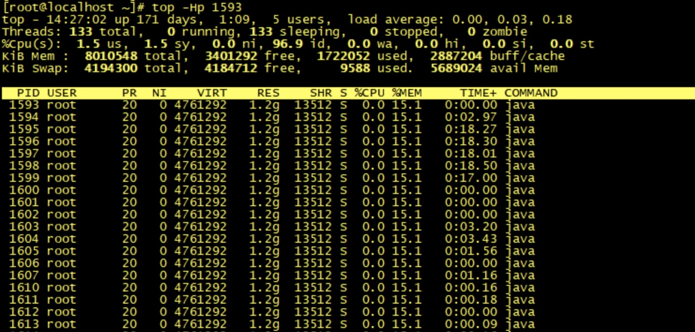

内存持续上升,我该如何排查?  
常用的监控和诊断内存工具  
1.Linux命令行工具之top命令  
他可以实时显示正在执行进程的cpu使用率 内存使用率以及系统负载等信息  
  
还可以通过 top -Hp pid查看具体线程使用系统资源情况

2.Linux命令行工具之vmstat命令
vmstat是一款指定采样周期和次数的功能性监测工具,我们可以看到,他不仅可以统计内存的使用情况,还可以观测到cpu的使用率 swap的使用
情况.但是vmstat一般很少用来查看内存的使用情况,而是经常被用来观测进程的上下文切换.

    r：等待运行的进程数；
    b：处于非中断睡眠状态的进程数；
    swpd：虚拟内存使用情况；
    free：空闲的内存；
    buff：用来作为缓冲的内存数；
    si：从磁盘交换到内存的交换页数量；
    so：从内存交换到磁盘的交换页数量；
    bi：发送到块设备的块数；
    bo：从块设备接收到的块数；
    in：每秒中断数；
    cs：每秒上下文切换次数；
    us：用户 CPU 使用时间；
    sy：内核 CPU 系统使用时间；
    id：空闲时间；
    wa：等待 I/O 时间；
    st：运行虚拟机窃取的时间

    步骤1:首先通过Linux系统命令查看进程在整个系统中内存的使用率是多少,最简单就是top命令了
    步骤2:再通过top -Hp pid查看具体线程占用系统资源
    步骤3:再通过jstack pid 查看具体线程的堆栈信息
    步骤4:通过jmap查看堆内存的使用情况
    步骤5:可以使用 jmap -histo live pid 查看堆内存中的对象数目、大小统计直方图，如果带上 live 则只统计活对象
    步骤6:通过 jmap 命令把堆内存的使用情况 dump 到文件中
    步骤7:使用MAT工具打开文件进行分析