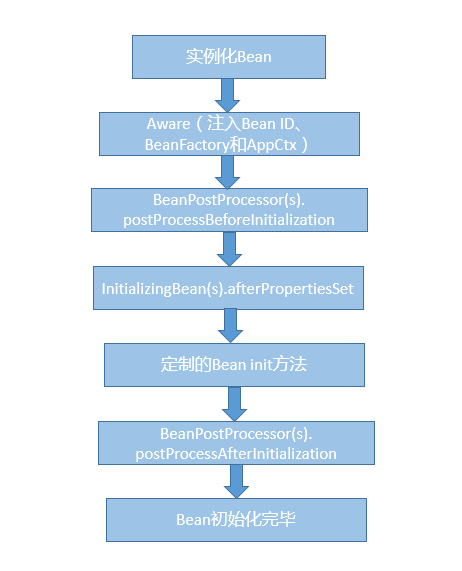
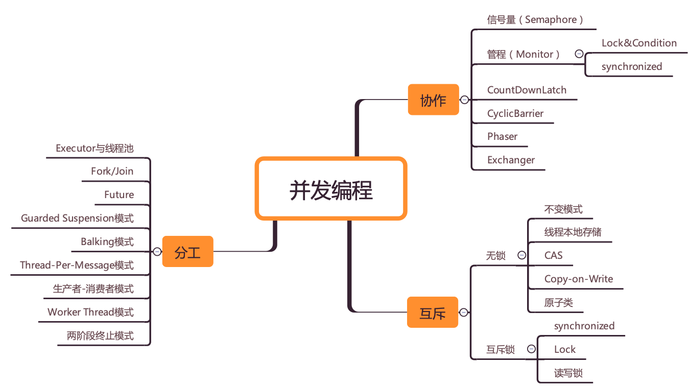

1.简单介绍下自己和项目
自我介绍:面试官你好,我叫李昭文,本科毕业于安徽巢湖学院,现居苏州吴江,从Boss招聘上看到公司招聘的这个java职位,  
我觉得自己比较适合公司的这个岗位,对自己的发展也有帮助,所以来争取下这份工作.
本人从事java开发有将近6年的开发经验,从事过不同业务场景开发,例如互联网金融 微信公众号 共享仓库存储等场景,可以适应不同场景的开发工作;  
期间解决了许多疑难问题,(本人总结了解决问题的三个步骤:首先,许多bug在于理解需求不清,因此写代码时有疑问的地方要多和产品 开发leader沟通好,  
其次代码层次要简洁明了,逻辑清楚,多测试,出了bug,自己能做到心中有数;再次要和测试人员加强沟通)
本人的优势在于痴迷技术,学习能力强,为人谦和,缺点在于非计算机专业,有时考虑问题不够全面.
谢谢面试官

项目介绍:目前本人在开发的项目,是一款既有web端,也有安卓端,还有小程序的项目,叫做任意仓,任意仓就是负责电商卖家的仓储租赁+配送的业务.
本人负责云仓出入库单 物流单模块中接口的定义,利用设计模式优化代码(观察者模式),确保接口访问的幂等性,优化出入库单请求响应参数

2.你觉得项目里最大的挑战是什么?项目的设计和推动

6.为什么在java面试中一定会深入考察HashMap?
    看完

7.你知道HashMap底层的数据结构吗?

    数组 链表 红黑树

8.jdk1.8中对hash算法和寻址算法是如何优化的?

    static final int hash(Object key) {
        int h;
        高低16位都参与运算 h>>>16
        return (key == null) ? 0 : (h = key.hashCode()) ^ (h >>> 16);
    }

    异或的意义:需要结合寻址算法的优化 (n-1)&hash 结合来看
    取模运算,性能比较差一点,为了优化这个数组的寻址过程,(n-1)&hash的效果跟hash对n取模,效果一样的,但是与运算的
    性能要比hash取模要高很多(数学问题) ,数组的长度一直是2的n次方,只要他保持数组长度是2的n次方 
    hash对n的取模效果==hash&(n-1),效果是一样的,后者的性能更高 
    
    如果直接使用h=key.hashCode()的值和(n-1)进行与运算,那么,两者之间的高16位之间的运算,是可以忽略的;
    核心点在于低16位的与运算,hash值的高16位没有参与到与预算中来,举例来说,有可能存在两个不同的key,hash后得到的值
    高16位不同,而低16位相同,然后与(n-1)进行与运算,得到的索引值是相同的, 进行复杂的hash冲突
    
    小结:优化一,h>>>16 高低16位都参与运算,优化二(n-1)&hash 提升运算

9.HashMap如何解决hash碰撞问题的?

    链地址法,形成一个链表
    put:当发生hash碰撞的时候,会在该索引处形成一个链表
    get:如果定位到数组里发现这个位置挂了一个链表,此时遍历链表,从里面找到自己要找的那个key-value对就可以了
    假设你的链表很长,可能会导致遍历链表,性能会比较差,O(n)
    优化:如果链表的长度达到一定的阈值后,其实会把链表转为红黑树,遍历红黑树,时间复杂度O(LogN),提高了查询效率

10.说说HashMap是如何进行扩容的?

    e.hash & (newCap - 1) 当前节点的hash值与上(扩容后的容量-1),如果多出来的一位经过与运算为0,则还在原地,如果为1,则为
    原索引+newCap

11.BAT面试官为什么喜欢问并发编程的问题?

    synchronized实现原理 cas无锁化的原理 AQS是什么 lock锁 ConcurrentHashMap的分段
    加锁的原理 线程池的原理 java内存模型 volatile 对Java并发包有什么了解?

12.说说synchronized关键字的实现底层原理?

    使用了synchronized关键字,在底层编译后的jvm指令中,会有monitorenter和monitorexit两个指令
    
    那么monitorenter指令执行的时候会干什么呢?
    
    每个对象都有关联的monitor,如果要对这个对象加锁,就必须获取这个对象关联的monitor的lock锁.monitor里面的原理和思路大概是
    这样的,monitor里面有一个计数器count,从0开始.如果一个线程获取monitor的锁,就会判断他的计数器是不是0,如果是0,那么说明没
    有人获取锁,他就可以获取锁,然后对计数器+1.同理释放锁的时候就会-1.如果一个线程来获取monitor锁时发现,count计数器不是0,这
    个线程就会进入阻塞状态.
    注意monitor的锁时支持重复加锁的,owner记录当前持有锁的线程id

13.能聊聊你对CAS的理解以及其底层实现原理吗?

    CAS是Compare and Swap的缩写,比较并替换.CAS机制中使用了3个基本操作数:内存地址V,旧的预期值A,要修改的新值B
    更新一个变量的时候,只有当变量的预期值A和内存地址V当中的实际值相同时,才会将内存地址V对应的值修改成B.
    从思想上来说,synchronized属于悲观锁,悲观的认为程序中的并发情况严重,所以严防死守.CAS属于乐观锁,乐观的认为程序中的并发情
    况不那么严重,所以让线程不断去重试更新.
    
    CAS的缺点:
        1)cpu开销过大,在并发量比较高的情况下,如果许多线程反复尝试更新某一个变量,却又一直更新不成功,循环往复,会给cpu带来很大
    的压力.
        2)不能保证代码块的原子性:CAS机制所保障的只是一个变量的原子性操作,而不能保障整个代码块的原子性.比如需要保证3个变量共
        同进行原子性的更新,就不得不使用synchronized了
        3)ABA问题 这是CAS机制最大的问题所在    

14.ConcurrentHashMap实现线程安全的底层原理到底是什么?

    ConcurrentHashMap的数据结构(数组+链表+红黑树),桶中的结构可能是链表,也可能是红黑树,红黑树是为了提高查找效率
    jdk7:Segment+HashEntry来进行实现的
    jdk8:摒弃了Segment的概念,二是直接用Node数组+链表+红黑树的数据结构来实现,并发控制使用synchronized和cas来操作,整个看
    起来就像是优化过且线程安全的.
    首先聊聊ConcurrentHashMap存在的必要性:
        一是因为HashTable本身比较低效,因为它的实现基本就是将put get size等各种方法加上synchronized.简单来说,这就导致了
        所有并发操作都要竞争同一把锁,一个线程在进行同步操作时,其他线程只能等待,大大降低了并发操作的效率
        
        二是HashMap不支持线程的同步，即任一时刻可以有多个线程同时写HashMap;可能会导致数据的不一致
        
        三能不能利用Collections提供的同步包装器来解决问题?同步包装器只是利用输入Map够早了另一个同步版本,所有操作虽然不再声明称为
         synchronized方法,但是还是利用了"this"作为互斥的mutex,没有真正意义上的改进
    所以，Hashtable 或者同步包装版本，都只是适合在非高度并发的场景下
    JDK并发包推出了ConcurrentHashMap,默认实现了线程的安全性
    
    ConcurrentHashMap是如何实现多线程并发安全性的
    在jdk1.7,它的实现方式是分段加锁,将HashMap在底层的数组分段成几个小数组,然后给每个数组分别加锁.
    jdk1.8以及之后,做了一些优化和改进,锁粒度的细化.
    这里仍然是一个大数组,数组中每个元素进行put都是有一个不同的锁,刚开始进行put的时候,如果两个线程都是在数组[5]这个位置进行put,
    这个时候,对数组[5]进行put的时候,采取的是cas策略.同一时间,只有一个线程能成功执行cas,其他线程都会失败.这就实现了分段加锁的
    第一步,如果多个线程堆数组中不同位置的元素进行操作,大家是互相不会影响的.
    
    如果多个线程堆同一个位置进行操作,cas失败的线程,就会在这个位置基于链表+红黑树来进行处理,synchronized(数组[5])进行加锁
    
    综上所述,jdk1.8之后,只有对相同位置的元素操作,才会加锁实行串行化操作,对不同位置进行操作是并发执行的.
15.对jdk的AQS了解吗?AQS的实现原理是什么?

    https://www.processon.com/diagraming/5f5ec16563768955617065e2
    Lock锁是基于java实现的锁,Lock是一个接口类,常见的实现类有ReentrantLock ReentrantReadAndWriteLock
    他们都是依赖AbstractQueuedSynchronized(AQS)类实现的
    AQS类结构中包含一个基于链表实现的等待队列,用于存储所有的阻塞线程,AQS中还有一个变量state,该变量对ReentrantLock
    来说表示加锁状态


16.说说线程池的底层工作原理?

    使用线程池的好处:
        系统是不可能频繁的创建线程又销毁线程的,这样会非常影响性能,所以我们需要线程池,好处如下:
        第一:降低资源消耗.通过重复利用已经创建的线程降低线程创建和销毁造成的消耗
        第二:提高响应速度.当任务到达时,任务可以不需要等待线程创建就能立即执行
        第三:提高线程的可管理性.线程是稀缺宝贵资源,不能无限制的创建.
    线程池原理:(创建线程池时,线程池里面是没有线程的)提交任务后,会首先判断当前线程池中的数量是否小于corePoolSize,
    如果小于,就会创建一个线程来执行这个任务
    当任务来时,会判断线程池里面是否有空闲线程,有空闲线程则提交任务,直到当前线程数量等于corePoolSize,无空线程则在
    阻塞队列等待,如果阻塞队列满了,那就创建新的线程执行当前任务,直到线程池中的线程数达到maxPoolSize,这时再有任务来,由
    饱和策略来处理提交的任务.
```java
//简化的线程池，仅用来说明工作原理
class MyThreadPool{
  //利用阻塞队列实现生产者-消费者模式
  BlockingQueue<Runnable> workQueue;
  //保存内部工作线程
  List<WorkerThread> threads = new ArrayList<>();
  // 构造方法
  MyThreadPool(int poolSize, BlockingQueue<Runnable> workQueue){
    this.workQueue = workQueue;
    // 创建工作线程
    for(int idx=0; idx<poolSize; idx++){
      WorkerThread work = new WorkerThread();
      work.start();
      threads.add(work);
    }
  }
  // 提交任务
  void execute(Runnable command){
    workQueue.put(command);
  }
  // 工作线程负责消费任务，并执行任务
  class WorkerThread extends Thread{
    public void run() {
      //循环取任务并执行
      while(true){ 
        Runnable task = workQueue.take();
        task.run();
      } 
    }
  }
/** 下面是使用示例 **/
public static void main(String[] args) {
    // 创建有界阻塞队列
    BlockingQueue<Runnable> workQueue = new LinkedBlockingQueue<>(2);
    // 创建线程池  
    MyThreadPool pool = new MyThreadPool(10, workQueue);
    // 提交任务  
    pool.execute(()->{System.out.println("hello"); });
  }
}
```
    线程应用的场景:
    普通的场景,使用工厂类Executors创建就可以了.常见的有fix Single cache三种,更多时候,为了更精细的控制,
    会直接对ThreadPoolExecutor类进行定制,我尤其关心其中的阻塞队列和饱和策略
    
    线程池拒绝策略:
        CallerRunsPolicy:提交任务的线程自己去执行该任务
        AbortPolicy:默认的拒绝策略,会抛出异常
        DiscardPolicy:直接丢弃任务,没有异常
        DiscardOldestPolicy:丢弃最老的任务                    
17.说说线程池的核心配置参数是干什么的?应该怎么用

```java
public class ThreadPoolExecutor{
    ThreadPoolExecutor(
      int corePoolSize,// 表示线程池保有的最小线程数.有些项目很闲,但是也不能把人都撤了,至少要保留corePoolSize个人坚守阵地
      int maximumPoolSize,// 表示线程池创建的最大线程数.当项目很忙时,就需要家加人,但是也不能无限加,最多加到maximumPoolSize个人
      long keepAliveTime,// 项目根据忙闲开增减人员,在编程世界里,如何定义忙和闲呢?一个线程如果在一段时间内,都没有执行任务,说明很闲,
      TimeUnit unit,// keepAliveTime&unit就是用来定义这个"一段时间"的参数,也就是说一个线程空闲了keepAliveTime&unit了这么久,
      // 而且线程池的线程数大于corePoolSize,na那么这个空闲的线程就要被回收了
      BlockingQueue<Runnable> workQueue,// 工作队列
      ThreadFactory threadFactory,//通过这个参数可以自定义如何创建线程,例如可以给线程指定一个有意义的名字
      RejectedExecutionHandler handler); //通过这个参数可以自定义任务的拒绝策略.如果线程池中所有的线程都在忙碌,并且工作队列也满了,前提是工作队列是有界队列,name
      // 此时提交任务,线程池就会拒绝接收
  }
```
    总结16.17,我介绍了使用线程池的好处 线程池的使用原理 线程池的使用场景以及线程池的核心参数和四种饱和策略
18.如果在线程池中使用无界队列会发生什么问题?等同于问,在远程服务异常的情况下,使用无界阻塞队列,是否会导致内存异常飙升?

    调用远程服务,一旦超时,则线程池中负责处理该调用任务的线程会阻塞,而阻塞队列是无界的,队列变得越来越大,此时会导致内存飙升起来,
    而且还可能会导致内存溢出.

19.你知道如果线程池的队列满了以后会怎么样?

20.如果线上机器突然宕机,线程池的阻塞队列中的请求怎么办?

    必然会导致线程池中积压的任务(等待队列中的任务)都会丢失
    如何解决这个问题?
    我们可以在提交任务之前,在数据库中插入这个任务的信息,更新任务的状态:未提交 已提交 已完成.提交成功后,更新它的状态是已提交状态.
    系统重启后,用一个后台线程去扫描数据库里的未提交和已提交状态的任务,可以把任务的信息读取出来,重新提交到线程池里去,继续进行执行

21.谈谈对java内存模型的理解?

    read读取 load载入 use使用 assign赋值 store存储 write
    lock(锁定):作用于主内存中的变量,他把一个变量标识为一条线程独占的状态
    unlock(锁定):作用于主内存中的变量,他把一个处于锁定状态的变量释放出来,释放后的变量才能被其他变量锁定
    read(读取):作用于主内存中的变量,他把一个变量从主内存传输到线程的工作内存中.
    load(载入):作用于主内存中的变量,他把read操作读取的值放入到工作内存的变量副本中
    use(使用):作用于主内存中的变量,他把工作内存中一个变量的值传递给执行引擎,每当jvm遇到一个需要使用变量的值的字节码指令时
        都会执行这个操作.
    assign(赋值):作用于主内存中的变量,它把一个从执行引擎接收到的值赋给工作内存中的变量.每当jvm遇到一个给变量赋值的字节码指令
    时都会执行这个操作
    store(存储):作用于主内存中的变量,他把一个变量的值传递到主内存中.
    write(写入):作用于主内存中的变量,他把store操作从工作内存中得到的变量的值放入主内存的变量中


22.说说java内存模型中的原子性 可见性 有序性?

    可见性:如果有多个线程对一个数据进行操作时,如果一个线程成功修改了数据,其他线程能够立马看到,称为可见性
    原子性:当一个线程在对内存中的某个数据进行操作的时候,必须要等到这个线程完全操作结束,其他线程才能操作,称之为原子性
    有序性:代码的顺序应该和指令的顺序相同.在执行的过程中不会发生指令重排,这就是有序性

23.能从java底层角度聊聊volatile关键字的原理吗

    volatile关键字的两层语义

    一旦一个共享变量（类的成员变量、类的静态成员变量）被volatile修饰之后，那么就具备了两层语义：
    
    1）保证了不同线程对这个变量进行操作时的可见性，即一个线程修改了某个变量的值，这新值对其他线程来说是立即可见的。
    
    2）禁止进行指令重排序。
    
    如果直接问volatile关键字，想要解释清楚的话，要从Java内存模型开始讲起。
    
    volatile关键字是用来解决可见性和有序性问题，在有些罕见的条件下，可以有限的保证原子性。 但是它主要不是用来保证原子性的。
    
    volatile保证可见性的原理，如果多个线程操作一个被volatile修饰的变量，当其中一个线程成功对组内存中的数据完成修改以后，
    它会将其他线程工作内存中的该变量的数据设为失效状态，迫使其它线程重新从主内存中读取变量数据，从而实现有可见性。
    
    在很多的开源中间件系统的源码里，大量的使用了volatile。常常使用的一个场景是对于一个变量，有的线程要更新它有的线程要读取
    它来进行判断操作，这个时候就需要使用volatile关键字，来保证读取到最新的数据。

24.happens-before六项原则性.

    1.什么是java内存模型
    我们已经知道,导致可见性的原因是缓存,导致有序性的原因是编译优化,那解决可见性 有序性最直接的办法是禁用缓存和编译优化,但是这
    样问题虽然解决了,我们程序的性能可就堪忧了.
    合理的方案应该是按需禁用缓存以及编译优化
    java内存模型是个很复杂的规范,可以从不同的视角来解读,站在我们这些程序员的视角,本质上可以理解为,java内存模型规范了JVM如何
    如何提供按需禁用缓存和编译优化的方法。具体来说，这些方法包括 volatile、synchronized 和 final 三个关键字，以及六项 
    Happens-Before 规则
    
    2.volatile
    我们声明一个 volatile 变量 volatile int x = 0，它表达的是：告诉编译器，对这个变量的读写，不能使用 CPU 缓存，必须从
    内存中读取或者写入
    
    3.happens-before规则
    如何理解happens-before规则?前面一个操作的结果对后续操作是可见的.Happens-Before约束了编译器的优化行为,虽然允许编译器
    优化,但是要求编译器优化后一定遵守happens-before规则
        1.程序的顺序性规则:这条规则是指在一个程序中,按照程序顺序,前面的操作hb于后续的任意操作
        2.volatile变量规则:这条规则是指对一个volatile变量的写操作,hb于后续对这个volatile变量的读操作
        3.传递性:这条规则是指如果A hb B,且B hb C,那么A hb C
        4.管程中的锁的规则:这条规则是指对一个锁的解锁 HB 于后续对这个锁的加锁
        5.线程start()规则:这条规则是指主线程A启动子线程B后,子线程B能够看到主线程在启动子线程B前的操作
        6.线程join()规则:这条规则是指主线程A等待子线程B完成(主线程A通过调用子线程B的join()方法实现),当子线程B完成后(主线
        程A中join()方法返回),主线程能够看到子线程的操作.当然所谓的看到,指的是对共享变量的操作.
        换句话说就是，如果在线程 A 中，调用线程 B 的 join() 并成功返回，那么线程 B 中的任意操作 Happens-Before 于该 
        join() 操作的返回 
    4.final关键字
    final 修饰变量时，初衷是告诉编译器：这个变量生而不变，可以可劲儿优化。
    final修饰的实例字段则是涉及到新建对象的发布问题。当一个对象包含final修饰的实例字段时，其他线程能够看到已经初始化的final
    实例字段，这是安全的

25.volatile底层是如何基于内存屏障保证可见性和有序性的？

    volatile+原子性：不能够保证原子性，只有在一些极端情况下能保证原子性。

    保证原子性：synchronized,lock,加锁。
    
    （1）lock指令：volatile保证可见性
    
    对volatile修饰的变量，执行写操作的话，JVM会发送一条lock前缀指令给CPU，CPU在计算完后会立即将这个值写回主内存，同时因为MESI  
    缓存一致性协议，所以各个CPU都会对总线进行嗅探，自己本地缓存中的数据是否被修改了。
    如果发现被修改了，那么CPU就会将自己的本地缓存数据过期掉，然后从主内存中重新加载最新的数据。
    （2）内存屏障：禁止重排序

26.能说说你对SpringIOC的理解吗？

        a.ioc是指容器控制程序对象之间的一种关系,而非传统实现中,由程序代码直接操控.控制权由应用代码转到了外部容器,控制权的转移称为反转.
        对于Spring而言,就是由Spring来控制对象的生命周期和对象之间的关系.ioc还有另外一个名字"依赖注入(DI)",所谓依赖注入,即组件之间的
        依赖关系由容器在运行期间决定,即由容器动态的将某种依赖关系注入到组件之中
        b.在spring的工作方式中,所有的类都会再spring容器中登记注册,告诉spring这是个什么东西,然后spring会在系统运行到适当的时候,把你要的
        东西主动给你.所有类的创建 销毁都由spring来控制,也就是说控制对象生命周期的不再是引用它的对象,而是spring.对于某个具体的对象而言,以  
        前是它控制其他对象,现在则是所有对象都被spring控制,所以叫做控制反转
        c.在系统运行中,动态的向某个对象提供它所需要的其他对象
        d.从Bean创建过程可以看到,它的依赖关系都是由容器负责注入,具体实现方式包括带参数的构造函数 setter方法或者@Autowired方式来显
        e.ioc的优点:降低了组件之间的耦合,降低业务对象之间替换的复杂性,使之能够灵活的管理对象
26.能说说你对SpringAOP的理解吗？

        (1). AOP面向方面编程基于IoC，是对OOP的有益补充；
        (2). AOP利用一种称为“横切”的技术，剖解开封装的对象内部，并将那些影响了 多个类的公共行为封装到一个可重用模块，并将其名为“Aspect”，即方面。所谓“方面”，简单地说，就是将那些与业务无关，却为业务模块所共同调用的 逻辑或责任封装起来，比如日志记录，便于减少系统的重复代码，降低模块间的耦合度，并有利于未来的可操作性和可维护性。
        (3). AOP代表的是一个横向的关 系，将“对象”比作一个空心的圆柱体，其中封装的是对象的属性和行为；则面向方面编程的方法，就是将这个圆柱体以切面形式剖开，选择性的提供业务逻辑。而 剖开的切面，也就是所谓的“方面”了。然后它又以巧夺天功的妙手将这些剖开的切面复原，不留痕迹，但完成了效果。
        (4). 实现AOP的技术，主要分为两大类：
        一是采用动态代理技术，利用截取消息的方式，对该消息进行装饰，以取代原有对象行为的执行；
        二是采用静态织入的方式，引入特定的语法创建“方面”，从而使得编译器可以在编译期间织入有关“方面”的代码。
        (5). Spring实现AOP：JDK动态代理和CGLIB代理
        JDK动态代理：其代理对象必须是某个接口的实现，它是通过在运行期间创建一个接口的实现类来完成对目标对象的代理；
        其核心的两个类是InvocationHandler和Proxy。
        
        CGLIB代理：实现原理类似于JDK动态代理，只是它在运行期间生成的代理对象是针对目标类扩展的子类。CGLIB是高效的代码生成包，底层是依靠ASM（开源的java字节码编辑类库）操作字节码实现的，性能比JDK强；需要引入包asm.jar和cglib.jar。
        使用AspectJ注入式切面和@AspectJ注解驱动的切面实际上底层也是通过动态代理实现的。
        (6). AOP使用场景：
        Authentication 权限检查
        Caching 缓存
        Context passing 内容传递
        Error handling 错误处理
        Lazy loading　延迟加载
        Debugging　　调试
        logging, tracing, profiling and monitoring　日志记录，跟踪，优化，校准
        Performance optimization　性能优化，效率检查
        Persistence　　持久化
        Resource pooling　资源池
        Synchronization　同步
        Transactions 事务管理

27.Spring的事务实现原理是什么？能聊聊你对事务传播机制的理解么？

    事务的实现原理：如果说你加了一个@Transactional注解，此时spring就会使用AOP的思想，对你的这个方法在执行之前去开启事务，执行  
    完毕之后，根据你方法是否报错，来决定回滚还是提交事务。
    
    支持当前事务的情况:
    
    ●TransactionDefinition.PROPAGATION_ REQUIRED: 如果当前存在事务， 则加入该事务;如果当前没有事务，则创建一个新的事务。
    
    ●TransactionDefinition.PROPAGATION_ SUPPORTS: 如果当前存在事务，则加入该事务;如果当前没有事务，则以非事务的方式继续运行。
    
    ●TransactionDefinition.PROPAGATION_ MANDATORY: 如果当前存在事务，则加入该事务;如果当前没有事务，则抛出异常。(mandatory: 强制性)
    
    不支持当前事务的情况:
    
    ●TransactionDefinition.PROPAGATION_ REQUIRES_ NEW:创建一个新的事务，如果当前存在事务，则把当前事务挂起。
    
    ●TransactionDefinition.PROPAGATION_ NOT_ SUPPORTED: 以非事务方式运行，如果当前存在事务，则把当前事务挂起。
    
    ●TransactionDefinition.PROPAGATION_ NEVER: 以非事务方式运行，如果当前存在事务，则抛出异常。
    
    其他情况（嵌套：方法A调用方法B, 如果B出错，方法B只能回滚他自己，方法A则会可以带着方法B一起回滚，NESTED嵌套事务。）:
    
    ●TransactionDefinition.PROPAGATION_ NESTED: 如果当前存在事务，则创 建一个事务作为当前事务的嵌套事务来运行;如果当前  
    没有事务，则该取值等价于 TransactionDefinition.PROPAGATION_ REQUIRED。 

28.Spring Bean 的生命周期 创建Bean的过程

    a.实例化Bean
    b.设置Bean属性
    c.如果我们通过各种Aware接口声明了依赖关系,则会注入Bean对容器基础设施层面的依赖.具体包括BeanNameAware
    BeanFactoryAware和ApplicationContextAware,分别注入BeanId BeanFactory或者ApplicationContext
    d.调用BeanPostProcessor的前置初始化方法postProcessBeforeInitialization
    e.如果实现了InitializingBean接口,则会调用afterPropertiesSet方法
    f.调用Bean自身定义的init方法
    g.调用BeanPostProcessor的后置初始化方法postProcessAfterInitialization
    h.创建过程完毕

销毁Bean的过程

    a.调用DisposableBean的destroy方法
    b.调用Bean定制的destroy方法
29.Spring Bean的五个作用域

    Singleton,这是Spring的默认作用域,也就是为每个IOC容器创建唯一的一个Bean实例
    Prototype,针对每个getBean请求,容器都会单独创建一个Bean实例
如果是Web容器,则支持另外三种作用域:

    Request,为每个Http请求创建单独的Bean实例
    Session,很显然Bean实例的作用域是Session范围
    GlobalSession用于Portlet容器,因为每个Portlet有单独的Session,GlobalSession提供一个全局性的HttpSession
30.100亿行数据,每个数字32位,取最小的数字

        类似于 100亿数据找出最大的1000个数字（top K问题）
        在大规模数据处理中，经常会遇到的一类问题：在海量数据中找出出现频率最好的前k个数，或者从海量数据中找出最大的前k个数，
        这类问题通常被称为top K问题。例如，在搜索引擎中，统计搜索最热门的10个查询词；在歌曲库中统计下载最高的前10首歌等。
        1、最容易想到的方法是将数据全部排序。该方法并不高效，因为题目的目的是寻找出最大的10000个数即可，而排序却是将所有的元
        素都排序了，做了很多的无用功。
        
        2、局部淘汰法。用一个容器保存前1000个数，然后将剩余的所有数字一一与容器内的最小数字相比，如果所有后续的元素都比容器
        内的10000个数还小，那么容器内这个1000个数就是最大1000个数。如果某一后续元素比容器内最小数字大，则删掉容器内最小
        元素，并将该元素插入容器，最后遍历完这100亿-1000个数，得到的结果容器中保存的数即为最终结果了。此时的时间复杂度为O
        （n+m^2），其中m为容器的大小。
        
        这个容器可以用（小顶堆）最小堆来实现。我们知道完全二叉树有几个非常重要的特性，就是假如该二叉树中总共有N个节点，那么该
        二叉树的深度就是log2N，对于小顶堆来说移动根元素到 底部或者移动底部元素到根部只需要log2N，相比N来说时间复杂度优化太
        多了（1亿的logN值是26-27的一个浮点数）。基本的思路就是先从文件中取出1000个元素构建一个小顶堆数组k，然后依次对剩下
        的100亿-1000个数字进行遍历m，如果m大于小顶堆的根元素，即k[0]，那么用m取代k[0]，对新的数组进行重新构建组成一个新的
        小顶堆。这个算法的时间复杂度是O((100亿-1000)log(1000))，即O((N-M)logM)，空间复杂度是M
        这个算法优点是性能尚可，空间复杂度低，IO读取比较频繁，对系统压力大。
        
        3、第三种方法是分治法，即大数据里最常用的MapReduce。
        a、将100亿个数据分为1000个大分区，每个区1000万个数据
        
        b、每个大分区再细分成100个小分区。总共就有1000*100=10万个分区
        
        c、计算每个小分区上最大的1000个数。
        
        为什么要找出每个分区上最大的1000个数？举个例子说明，全校高一有100个班，我想找出全校前10名的同学，很傻的办法就是，把
        高一100个班的同学成绩都取出来，作比较，这个比较数据量太大了。应该很容易想到，班里的第11名，不可能是全校的前10名。也
        就是说，不是班里的前10名，就不可能是全校的前10名。因此，只需要把每个班里的前10取出来，作比较就行了，这样比较的数据量
        就大大地减少了。我们要找的是100亿中的最大1000个数，所以每个分区中的第1001个数一定不可能是所有数据中的前1000个。
        
        d、合并每个大分区细分出来的小分区。每个大分区有100个小分区，我们已经找出了每个小分区的前1000个数。将这100个分区的
        1000*100个数合并，找出每个大分区的前1000个数。
        
        e、合并大分区。我们有1000个大分区，上一步已找出每个大分区的前1000个数。我们将这1000*1000个数合并，找出前1000.这
        1000个数就是所有数据中最大的1000个数。
        
        （a、b、c为map阶段，d、e为reduce阶段）
        
        4、Hash法。如果这1亿个书里面有很多重复的数，先通过Hash法，把这1亿个数字去重复，这样如果重复率很高的话，会减少很大的
        内存用量，从而缩小运算空间，然后通过分治法或最小堆法查找最大的10000个数。
        
        对于海量数据处理，思路基本上是：必须分块处理，然后再合并起来。
31.高并发的问题有遇到过吗,谈谈你理解的并发? 在我看来,并发编程领域可以抽象成三个核心问题:分工 同步和互斥

        所谓分工,类似于现实中一个组织完成一个项目,项目经理要拆分任务,安排合适的成员去完成
        在并发编程领域里的同步,主要指的是就是线程间的写作,本质上和现实生活中写作没有区别,不过
            是一个线程执行完了一个任务,如何通知执行后续任务的线程开工而已
        互斥,所谓互斥,指的是同一时刻,只允许一个线程访问共享变量.


        从性能角度讲,我们为了提高执行一定计算机任务的效率,所以io等待的时候,不能让cpu闲着,所以我们把任务拆分交替执行,有了分时
    操作系统,出现了并发,后来CPU多核了又有了并行计算.这里也就是"分工"
        分工以后我们为了进一步提升效率和更加灵活的达到目的,所以我们要对任务进行组织编排,也就是对线程组织编排,于是线程之间需要通信,  
    因此操作系统提供了一些让进程,线程之间通信的方式,也就是"同步"  
        但是事物总不是完美的,并发和通信带来了较高的编程复杂度,同时也出现了多线程并发操作共享资源的问题.于是天下大势,分久必合,我们又  
    要将对共享资源的访问串行化,所以我们根据现实世界的做法设计了锁,信号量等补充这套体系,也就是互斥.
并发编程bug的源头

        这些年,我们的cpu 内存 i/o设备都在不断在迭代,不断朝着更快的方向努力,但是在这个快速发展的过程中,有一个核心矛盾一直存在,就是三者之间速度
     差异,cpu是天上一天,内存是地上一年;内存是天上一年,io设备是地上十年.
        为了合理利用cpu的高性能,平衡三者的速度差异,计算机体系结构 操作系统 编译程序都做出了贡献,主要体现为:
        1.cpu增加了缓存,以均衡与内存的速度差异
        2.操作系统添加了进程 线程,以分时复用cpu,进而均衡cpu与io设备的速度差异
        3.编译程序优化指令执行次序,使得缓存能够得到更加合理的利用.
        现在我们几乎所有的程序都默默地享受着这些成果，但是天下没有免费的午餐，并发程序很多诡异问题的根源也在这里。
        源头1:缓存导致的可见性问题
        源头2:线程切换带来的原子性问题
        源头3:编译优化带来的有序性问题
java如何解决有序性和可见性

    1.什么是java内存模型
    我们已经知道,导致可见性的原因是缓存,导致有序性的原因是编译优化,那解决可见性 有序性最直接的办法是禁用缓存和编译优化,但是这
    样问题虽然解决了,我们程序的性能可就堪忧了.
    合理的方案应该是按需禁用缓存以及编译优化
    java内存模型是个很复杂的规范,可以从不同的视角来解读,站在我们这些程序员的视角,本质上可以理解为,java内存模型规范了JVM如何
    如何提供按需禁用缓存和编译优化的方法。具体来说，这些方法包括 volatile、synchronized 和 final 三个关键字，以及六项 
    Happens-Before 规则
    
    2.volatile
    我们声明一个 volatile 变量 volatile int x = 0，它表达的是：告诉编译器，对这个变量的读写，不能使用 CPU 缓存，必须从
    内存中读取或者写入
    
    3.happens-before规则
    如何理解happens-before规则?前面一个操作的结果对后续操作是可见的.Happens-Before约束了编译器的优化行为,虽然允许编译器
    优化,但是要求编译器优化后一定遵守happens-before规则
        1.程序的顺序性规则:这条规则是指在一个程序中,按照程序顺序,前面的操作hb于后续的任意操作
        2.volatile变量规则:这条规则是指对一个volatile变量的写操作,hb于后续对这个volatile变量的读操作
        3.传递性:这条规则是指如果A hb B,且B hb C,那么A hb C
        4.管程中的锁的规则:这条规则是指对一个锁的解锁 HB 于后续对这个锁的加锁
        5.线程start()规则:这条规则是指主线程A启动子线程B后,子线程B能够看到主线程在启动子线程B前的操作
        6.线程join()规则:这条规则是指主线程A等待子线程B完成(主线程A通过调用子线程B的join()方法实现),当子线程B完成后(主线
        程A中join()方法返回),主线程能够看到子线程的操作.当然所谓的看到,指的是对共享变量的操作.
        换句话说就是，如果在线程 A 中，调用线程 B 的 join() 并成功返回，那么线程 B 中的任意操作 Happens-Before 于该 
        join() 操作的返回 
    4.final关键字
    final 修饰变量时，初衷是告诉编译器：这个变量生而不变，可以可劲儿优化。
    final修饰的实例字段则是涉及到新建对象的发布问题。当一个对象包含final修饰的实例字段时，其他线程能够看到已经初始化的final
    实例字段，这是安全的                        


互斥锁解决原子性问题  
Synchronized同步锁实现原理 通常Synchronized实现同步锁的方式有两种,一种是修饰方法,一种是修饰方法块
```java
public class SyncTest{
    // 关键字在实例方法上,锁为当前实例
    public synchronized void method1(){
        
    }
    // 关键字在代码块上,锁为括号里面的对象
    public void method2(){
        Object obj = new Object();
        synchronized(obj){
            // code
        }
    }
}
```
        通过反编译
        javac -encoding UTF-8 SyncTest.java  //先运行编译class文件命令
        javap -v SyncTest.class //再通过javap打印出字节文件
        通过输出的字节码,我们会发现:Synchronized在修饰同步代码块时,是由monitorenter和monitorexit指令来实现同步的.进入
    monitorenter指令后,线程持有Monitor对象,退出monitorexit指令后,线程将释放该Monitor对象
        当Synchronized修饰同步方法时,并没有发现monitorenter和monitorexit指令,而是出现了一个ACC_SYNCHRONIZED标志.
    这是因为jvm使用了ACC_SYNCHRONIZED访问标志来区分一个方法是否是同步方法.当方法调用时,调用指令将会检查该方法是否被设置
    ACC_SYNCHRONIZED访问标志.如果设置了该标志,执行线程将先持有Monitor对象,然后再执行方法.在该方法运行期间,其他线程将无法
    获取到该Monitor对象,当方法执行完成后,再释放该Monitor对象.
        现在看看Synchronized修饰方法时怎么实现锁原理的?
    JVM中的同步是基于进入和退出管程对象实现的.每个对象实例都会有一个Monitor,Monitor可以和对象一起创建 销毁.Monitor是由
    ObjectMonitor实现的,而ObjectMonitor是由C++的ObjectMonitor.hpp文件实现的 
    
    ObjectMonitor() {
       _header = NULL;
       _count = 0; //记录个数
       _waiters = 0,
       _recursions = 0;
       _object = NULL;
       _owner = NULL;
       _WaitSet = NULL; //处于wait状态的线程，会被加入到_WaitSet
       _WaitSetLock = 0 ;
       _Responsible = NULL ;
       _succ = NULL ;
       _cxq = NULL ;
       FreeNext = NULL ;
       _EntryList = NULL ; //处于等待锁block状态的线程，会被加入到该列表
       _SpinFreq = 0 ;
       _SpinClock = 0 ;
       OwnerIsThread = 0 ;
    }          
        当多个线程同时访问一段同步代码时,多个线程会先被存放在ContentionLst和EntryList集合中,处于block状态的线程,都会被
    加入到该列表.接下来当线程获取到对象的Monitor时,Monitor是依靠底层操作系统的Mutex Lock来实现互斥的,线程申请Mutex 成功,
    则持有该Mutex,其他线程将无法获取到该Mutex,竞争失败的线程会再次进入ContentionList被挂起
        如果线程调用wait()方法,就会释放当前持有的Mutex,并且该线程会进入WaitSet集合中,等待下一次被唤醒.如果当前线程顺利
    执行完方法,也将释放Mutex;
            
        总结来说就是，同步锁在这种实现方式中，因 Monitor 是依赖于底层的操作系统实现，存在用户态与内核态之间的切换，所以增
        加了性能开销。
锁升级优化

    在 JDK1.6 JVM 中，对象实例在堆内存中被分为了三个部分：对象头、实例数据和对齐填充。其中 Java 对象头由 Mark Word、指向
    类的指针以及数组长度三部分组成
    Mark Word 记录了对象和锁有关的信息。Mark Word 在 64 位 JVM 中的长度是 64bit，我们可以一起看下 64 位 JVM 的存储结
    构是怎么样的。如下图所示：
image_36.png

    1.偏向锁
        偏向锁主要用来优化同一线程多次申请同一个锁的竞争。在某些情况下，大部分时间是同一个线程竞争锁资源，例如，在创建一个线程
    并在线程中执行循环监听的场景下，或单线程操作一个线程安全集合时，同一线程每次都需要获取和释放锁，每次操作都会发生用户态与内核态
    的切换。
        偏向锁的作用就是，当一个线程再次访问这个同步代码或方法时，该线程只需去对象头的 Mark Word 中去判断一下是否有偏向
    锁指向它的 ID，无需再进入 Monitor 去竞争对象了。当对象被当做同步锁并有一个线程抢到了锁时，锁标志位还是 01，“是否偏向锁”
    标志位设置为 1，并且记录抢到锁的线程 ID，表示进入偏向锁状态。一旦出现其它线程竞争锁资源时，偏向锁就会被撤销。偏向锁的撤销
    需要等待全局安全点，暂停持有该锁的线程，同时检查该线程是否还在执行该方法，如果是，则升级锁，反之则被其它线程抢占

    2.轻量级锁
    当有另外一个线程竞争获取这个锁时，由于该锁已经是偏向锁，当发现对象头 Mark Word 中的线程 ID 不是自己的线程 ID，就会进行
    CAS 操作获取锁，如果获取成功，直接替换 Mark Word 中的线程 ID 为自己的 ID，该锁会保持偏向锁状态；如果获取锁失败，代表
    当前锁有一定的竞争，偏向锁将升级为轻量级锁。
    
    3.自旋锁
    轻量级锁 CAS 抢锁失败，线程将会被挂起进入阻塞状态。如果正在持有锁的线程在很短的时间内释放资源，那么进入阻塞状态的线程无疑
    又要申请锁资源。
    JVM 提供了一种自旋锁，可以通过自旋方式不断尝试获取锁，从而避免线程被挂起阻塞。这是基于大多数情况下，线程持有锁的时间都不会
    太长，毕竟线程被挂起阻塞可能会得不偿失。
    从 JDK1.7 开始，自旋锁默认启用，自旋次数由 JVM 设置决定，这里我不建议设置的重试次数过多，因为 CAS 重试操作意味着长时间
    地占用 CPU。
    自旋锁重试之后如果抢锁依然失败，同步锁就会升级至重量级锁，锁标志位改为 10。在这个状态下，未抢到锁的线程都会进入 Monitor
    ，之后会被阻塞在 _WaitSet 队列中。

    4.动态编译实现锁消除 / 锁粗化
    除了锁升级优化，Java 还使用了编译器对锁进行优化。JIT 编译器在动态编译同步块的时候，借助了一种被称为逃逸分析的技术，来判断
    同步块使用的锁对象是否只能够被一个线程访问，而没有被发布到其它线程。
    确认是的话，那么 JIT 编译器在编译这个同步块的时候不会生成 synchronized 所表示的锁的申请与释放的机器码，即消除了锁的使用。
    在 Java7 之后的版本就不需要手动配置了，该操作可以自动实现。
    锁粗化同理，就是在 JIT 编译器动态编译时，如果发现几个相邻的同步块使用的是同一个锁实例，那么 JIT 编译器将会把这几个同步块
    合并为一个大的同步块，从而避免一个线程“反复申请、释放同一个锁”所带来的性能开销。

    5.减小锁粒度
    当我们的锁对象是一个数组或队列时，集中竞争一个对象的话会非常激烈，锁也会升级为重量级锁。我们可以考虑将一个数组和队列对象拆
    成多个小对象，来降低锁竞争，提升并行度。
    最经典的减小锁粒度的案例就是 JDK1.8 之前实现的 ConcurrentHashMap 版本。我们知道，HashTable 是基于一个数组 + 链表
    实现的，所以在并发读写操作集合时，存在激烈的锁资源竞争，也因此性能会存在瓶颈。而 ConcurrentHashMap 就很很巧妙地使用了
    分段锁 Segment 来降低锁资源竞争，
Lock锁的实现原理

        Lock 锁是基于 Java 实现的锁，Lock 是一个接口类，常用的实现类有ReentrantLock、ReentrantReadWriteLock（RRW）
        ，它们都是依赖 AbstractQueuedSynchronizer（AQS）类实现的。
        AQS 类结构中包含一个基于链表实现的等待队列（CLH 队列），用于存储所有阻塞的线程，AQS 中还有一个 state 变量，该变量
        对 ReentrantLock 来说表示加锁状态。
        该队列的操作均通过 CAS 操作实现，我们可以通过一张图来看下整个获取锁的流程          


Synchronized和Lock锁的区别


32.描述产生一次FullGC的整个过程

    a.堆分成两大块:新生代和老年代.对象产生之初在新生代,进入暮年时进入老年代,但是老年代也接纳在新生代无法容纳的超大对象.新生
    代=1个Eden去+2个Survivor区
    b.绝大部分对象在Eden区生生,当Eden区装填满的时候,则会触发YGC
    c.YGC垃圾回收的时候,在eden区实现清除策略,没有被引用的对象则直接回收,依然存活的对象会被移送到Survivor区.Survivor区分为
    S0和S1两块内存空间,送到哪块空间呢?每次YGC的时候,他们将存活的对象复制到未使用的那块空间,然后将当前正在使用的空间完全清除,
    交换两块空间的使用状态.假如一些没有进取心的对象以为可以一直在新生代的Survivor区交换来交换去,那就错了,每个对象都有一个计数
    器,每次YGC都会+1.-XX:MaxTenuringThreshold参数能配置计数器的值到达某个阈值的时候,对象从新生代晋升至老年代.
    d.如果YGC要移送的对象大于Survivor去容量的上限,则直接交给老年代
    e.结合d和c,如果Survivor区无法放下,或者超大对象的阈值超过上限,则尝试在老年代中进行分配
    f.如果老年代也无法放下,则会触发FGC,如果依然放不下则抛出OOM

33.频繁YGC如何排查

cpu占用过高排查思路
    top 查看占用cpu的进程 pid
    top -Hp pid 查看进程中占用cpu过高的线程id  tid
    printf '%x/n' tid 转化为十六进制
    jstack pid |grep tid的十六进制 -A 30 查看堆栈信息定位

jvm old区占用过高排查思路
    top查看占用cpu高的进程
    jstat -gcutil pid 时间间隔 查看gc状况
    jmap -dump:format=b,file=name.dump pid  导出dump文件
    用visualVM分析dump文件

34.堆和栈的区别,什么时候会压栈?什么时候会出栈?

    堆是 JVM 内存中最大的一块内存空间，该内存被所有线程共享，几乎所有对象和数组都被分配到了堆内存中。  
    堆被划分为新生代和老年代，新生代又被进一步划分为 Eden 和 Survivor 区，最后 Survivor 由 
    From Survivor 和 To Survivor 组成。
    
    Java 虚拟机栈是线程私有的内存空间，它和 Java 线程一起创建。当创建一个线程时，会在虚拟机栈中申请
    一个线程栈，用来保存方法的局部变量、操作数栈、动态链接方法和返回地址等信息，并参与方法的调用和返回。
    每一个方法的调用都伴随着栈帧的入栈操作，方法的返回则是栈帧的出栈操作。

35.HashMap如何实现?为什么会变红黑树?如何扩容?为什么是两倍?什么时候用到位运算?

    HashMap使用了数组+链表这两种数据结构相结合的方式实现了链地址法,当有哈希值冲突时,就可以将冲突的键值对链成一个链表.
    但是这种方式存在一个性能问题,如果链表过长,查询数据的时间复杂度就会增加.HashMap就在java8中使用了红黑树来解决链表  
    过长导致的查询性能下降问题;
    如何扩容?由于扩容数组的长度是2倍的关系,所以对于假设初始tableSize=4要扩容到8来说就是0100到1000的变化(左移一位就是2倍)
    在扩容中只用判断原来的hash值和左移动的一位(newTable的值)按位与操作是0或1,0的话索引不变,1的话索引变成原索引加上扩容前数组
    之所以能通过这种"与运算"来重新分配索引,是因为hash值本来就是随机的,而hash按位与上newTable得到的0和1就是随机的,索引
    扩容的过程就能把之前哈希冲突的元素再随机分到不同的索引中
    为什么是2倍?容量n为2的幂次方,n-1的二进制会全为1,位运算时可以重复散列,避免不必要的哈希冲突,因此扩容必须是2倍就是为了
    维持容量始终为2的幂次方. 什么时候用到位预算?
