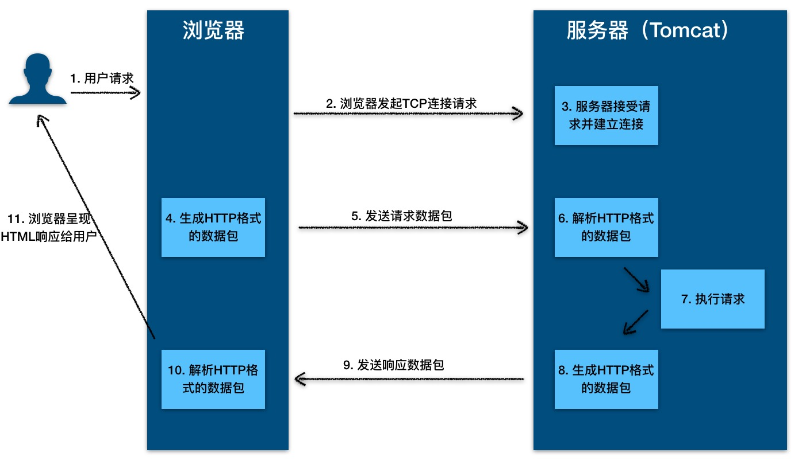

1.大数相加

    该思路是:
    1.反转两个字符串，便于从低位到高位相加和最高位的进位导致和的位数增加；
    2.对齐两个字符串，即短字符串的高位用‘0’补齐，便于后面的相加；
    3.从头遍历，把两个正整数的每一位都相加，并加上进位；
    4.最高位有进位则补上进位；
    5.逆序输出；

    在这里需要说明一点的是，string 类是没有reverse()方法的，所以，为了便利，在这里我们用了StringBuffer，可以使用它自带的reverse()方法，很方便。
```java
public class Demo2 {
    public static void main(String[] args) {
        Scanner sc = new Scanner(System.in);
        String s1 = sc.nextLine();
        String s2 = sc.nextLine();

        //反转字符串
        String n1 = new StringBuffer(s1).reverse().toString();
        String n2 = new StringBuffer(s2).reverse().toString();
        int l1 = n1.length();
        int l2 = n2.length();
        int maxL = l1 > l2 ? l1 : l2;

        //补齐0
        if (l1 < l2) {
            for (int i = l1; i < l2; i++) {
                n1 += "0";
            }
        } else {
            for (int i = l2; i < l1; i++) {
                n2 += "0";
            }
        }
        StringBuffer res = new StringBuffer();//存放的结果
        int c = 0;//进位

        for (int i = 0; i < maxL; i++) {
            int nSum = Integer.parseInt(n1.charAt(i) + "") + Integer.parseInt(n2.charAt(i) + "") + c;
            int ap = nSum % 10;
            res.append(ap);
            c = nSum / 10;
        }
        if (c > 0) {
            res.append(c);
        }
        System.out.println(res.reverse());
    }
}
```

2.为什么要看源码?

    a.通过学习开源框架 开源项目的源码,我们可以学习到多种场景 多种技术的解决方案,快速增加经验
    b.在使用某个框架或工具进行开发时,如果你对其源码有所了解,可以最大化的减少出故障的可能
    c.有利于你研究一个新系统的代码逻辑,快速接手一个新系统
    d.最大的好处是可以开阔思维,提升架构设计能力,通过看源码,看别人如何设计,然后思考为何这样设计才能领悟到
    
    问题扩展:如何阅读源码

    Google查找这个开源框架的官方介绍，了解以下信息
    框架有几个模块
    模块的作用
    模块之间的联系
    每个模块的核心类（在阅读源码的过程中，着重看核心类）
    对哪个模块感兴趣就去写个小demo，先了解一下这个模块的具体作用。
    debug进入看具体实现。（这里面可以充分使用IDEA的调试功能）
    第一遍是走马观花，简略看一下调用逻辑，都用了哪些类；
    第二遍需有重点地debug，看看这些类担任了架构图里的哪些功能，使用了哪些设计模式。
    第三遍debug，把主要类的调用时序图以及类图结构画出来，对着时序图分析调用流程 

3.A往B转钱,B往A转钱,同时转会死锁吗?如何解决死锁?
账户转账代码
```java
class Account{
    private int balance;
    // 转账
    void transfer(Account target,int amt){
        // 锁定转出账户
        synchronized(this){ //  ①
            // 锁定转入账户
            synchronized (target){ // ② 
                if (this.balance>amt){
                    this.balance-=amt;
                    target.balance+=amt;
                }
            }
        }
    }
}
```
上面转账的代码是怎么发生死锁的呢?

    1.我们假设线程T1执行账户A转账户B的操作,账户A.transfer(账户B);同时线程T2执行账户B转账户A的操作,账户B.transfer(账户A);
    2.当T1和T2同时执行完①处的代码时,T1获得了账户A的锁(对于T1,this是账户A),而T2获得了账户B的锁(对于T2,this是账户B).
    3.当T1和T2在执行②处的代码时,T1视图获取账户B的锁时,发现账户B已经被锁定(被T2锁定),所以T1开始等待;T2则视图获取账户A的锁时候,
    发现账户已经被锁定(被T1锁定),所以T2也开始等待.
    4.于是T1和T2会无限期的等待下去,也就是我们所说的死锁了
如何预防死锁?

    并发程序一旦发生死锁,一般没有特别好的方法,很多时候我们只能重启应用.因此,解决死锁问题最好的办法还是规避死锁.  
    那如何避免死锁呢?要避免死锁就需要分析死锁发生的条件,有个叫Coffman的牛人总结过了,只有一下四个条件都发生时才会出现死锁:
        1.互斥,共享资源X和Y只能被一个线程占用
        2.占有且等待,线程T1已经取得共享资源X,在等待共享资源Y的时候,不释放共享资源X
        3.不可抢占,其他线程不能强行抢占线程T1占有的资源
        4.循环等待,线程T1等待线程T2占有的资源,线程T2等待线程T1占有的资源,就是循环等待.
    反过来分析,只要我们破坏其中一个,就可以成功避免死锁的发生.
    其中,互斥这个条件我们没有办法破坏,因为我们用锁为的就是互斥,不过其他三个条件都是有办法破坏掉的,到底该如何做呢?
        1.对于"占有且等待"这个条件,我们可以一次性申请所有的资源,这样就不存在等待了
        2.对于"不可抢占"这个条件,占用部分资源的线程进一步申请其他资源时,如果申请不到,可以主动释放它占有的资源,这样不可抢占这个条件就
            破坏掉了
        3.对于"循环等待"这个条件,可以靠按序申请资源来预防.所谓按序申请,是指资源是有线性顺序的,申请的时候可以先申请资源序号小的,再申请资源序号大的,
        这样线性化后自然就不存在循环了.

代码实现
a.破坏占有且等待
```java

class Allocator {
  private List<Object> als = new ArrayList<>();
  // 一次性申请所有资源
  synchronized boolean apply(Object from, Object to){
    if(als.contains(from) ||als.contains(to)){
      return false;  
    } else {
      als.add(from);
      als.add(to);  
    }
    return true;
  }
  // 归还资源
  synchronized void free(Object from, Object to){
    als.remove(from);
    als.remove(to);
  }
}

class Account {
  // actr应该为单例
  private Allocator actr;
  private int balance;
  // 转账
  void transfer(Account target, int amt){
    // 一次性申请转出账户和转入账户，直到成功
    while(!actr.apply(this, target));
    try{
      // 锁定转出账户
      synchronized(this){              
        // 锁定转入账户
        synchronized(target){           
          if (this.balance > amt){
            this.balance -= amt;
            target.balance += amt;
          }
        }
      }
    } finally {
      actr.free(this, target);
    }
  } 
}
```
b.破坏不可抢占条件

    破坏不可抢占条件看上去很简单，核心是要能够主动释放它占有的资源，这一点 synchronized 是做不到的。
    原因是 synchronized 申请资源的时候，如果申请不到，线程直接进入阻塞状态了，而线程进入阻塞状态，
    啥都干不了，也释放不了线程已经占有的资源。
    java.util.concurrent 这个包下面提供的 Lock 是可以轻松解决这个问题的
c.破坏循环等待条件

    破坏这个条件，需要对资源进行排序，然后按序申请资源。这个实现非常简单，我们假设每个账户都有不同的属性 id，  
    这个 id 可以作为排序字段，申请的时候，我们可以按照从小到大的顺序来申请。比如下面代码中，①~⑥处的代码对转出账户（this）  
    和转入账户（target）排序，然后按照序号从小到大的顺序锁定账户。这样就不存在“循环”等待了
```java
class Account {
  private int id;
  private int balance;
  // 转账
  void transfer(Account target, int amt){
    Account left = this;       // ①
    Account right = target;    // ②
    if (this.id > target.id) { // ③
      left = target;           // ④
      right = this;            // ⑤
    }                          // ⑥
    // 锁定序号小的账户
    synchronized(left){
      // 锁定序号大的账户
      synchronized(right){ 
        if (this.balance > amt){
          this.balance -= amt;
          target.balance += amt;
        }
      }
    }
  } 
}
```
关于死锁的问题拓展:

    除了死锁外,还有两种情况,分别是"活锁"和"饥饿"
    发生死锁后线程会互相等待,而且会一直等待下去,在技术上的表现形式是线程永久的阻塞了.
活锁

       但有时线程虽然没有发生阻塞,但仍然会存在执行不下去的情况,这就是所谓的"活锁".
    可以类比现实世界里的例子，路人甲从左手边出门，路人乙从右手边进门，两人为了不相撞，互相谦让，  
    路人甲让路走右手边，路人乙也让路走左手边，结果是两人又相撞了。这种情况，基本上谦让几次就解决了，  
    因为人会交流啊。可是如果这种情况发生在编程世界了，就有可能会一直没完没了地“谦让”下去，成为没有  
    发生阻塞但依然执行不下去的“活锁”.
        解决"活锁"的方案很简单,谦让时,尝试等待一个随机的时间就可以了.
饥饿

        "饥饿":所谓饥饿指的是线程因为无法访问所需资源而无法执行下去的情况.
    发生饥饿的场景:"不患寡,而患不均",如果线程优先级不均,在cpu繁忙的情况下,优先级低的线程得到执行的机会很小,就可能发生线程饥饿;
    持有锁的线程,如果执行的时间过长,也可能导致饥饿问题.
    
    解决饥饿问题的方案,有三种:
    一是保证资源充足;
    二是公平的分配资源;
    三是避免持有锁的线程长时间执行;
    这三个方案中，方案一和方案三的适用场景比较有限，因为很多场景下，资源的稀缺性是没办法解决的，持有锁的线程执行的时间也很难缩短。
    倒是方案二的适用场景相对来说更多一些。那如何公平地分配资源呢？在并发编程里，主要是使用公平锁。所谓公平锁，是一种先来后到的方案，
    线程的等待是有顺序的，排在等待队列前面的线程会优先获得资源。

4.Http工作原理 一次http的请求过程
HTTP 协议是浏览器与服务器之间的数据传送协议。作为应用层协议，HTTP 是基于 TCP/IP 协议来传递数据的（HTML 文件、图片、  
查询结果等），HTTP 协议不涉及数据包（Packet）传输，主要规定了客户端和服务器之间的通信格式。



这个过程是：

        1.用户通过浏览器进行了一个操作，比如输入网址并回车，或者点击链接，接着浏览器获取了这个事件
        2.浏览器向服务端发出tcp连接请求
        3.服务程序接受浏览器的连接请求，并经过tcp三次握手建立连接
        4.浏览器将请求数据打包成一个http协议格式的数据包
        5.浏览器将该数据包推入网络，数据包经过网络传输，最终达到端服务程序
        6.服务端程序拿到这个数据包后，同样以http协议格式解包，获取到客户端的意图
        7.得知客户端意图后进行处理，比如提供静态文件或者调用服务端程序获得动态结果
        8.服务器将响应结果（可能是html或者图片）按照http协议格式打包
        9. 服务器将响应数据包推入网络，数据包经过网络传输最终达到到浏览器。
        10. 浏览器拿到数据包后，以 HTTP 协议的格式解包，然后解析数据，假设这里的数据是 HTML。
        11. 浏览器将 HTML 文件展示在页面上。                                


