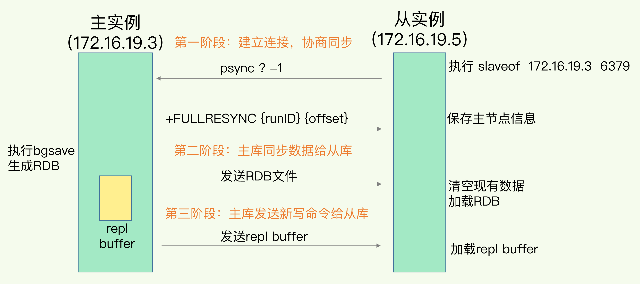

1.项目中缓存是如何使用的?为什么要用缓存?缓存使用不当会造成什么后果?

    项目中是如何使用的? 这个需要结合自己项目的业务来.
    
    为什么要用缓存?
    用缓存,主要有两个用途:高性能 高并发
    假设这么个场景，你有个操作，一个请求过来，吭哧吭哧你各种乱七八糟操作 mysql，半天查出来一个结果，耗时 600ms。但是这个结果
    可能接下来几个小时都不会变了，或者变了也可以不用立即反馈给用户。那么此时咋办？

    缓存啊，折腾 600ms 查出来的结果，扔缓存里，一个 key 对应一个 value，下次再有人查，别走 mysql 折腾 600ms 了，直接从
    缓存里，通过一个 key 查出来一个 value，2ms 搞定。性能提升 300 倍。

    就是说对于一些需要复杂操作耗时查出来的结果，且确定后面不怎么变化，但是有很多读请求，那么直接将查询出来的结果放在缓存中，后
    面直接读缓存就好。
    
    高并发
    mysql 这么重的数据库，压根儿设计不是让你玩儿高并发的，虽然也可以玩儿，但是天然支持不好。mysql 单机支撑到 2000QPS 也开
    始容易报警了。

    所以要是你有个系统，高峰期一秒钟过来的请求有 1万，那一个 mysql 单机绝对会死掉。你这个时候就只能上缓存，把很多数据放缓存，
    别放mysql。缓存功能简单，说白了就是 key-value 式操作，单机支撑的并发量轻松一秒几万十几万，支撑高并发 so easy。单机承
    载并发量是 mysql 单机的几十倍。
    
    缓存是走内存的,内存天然就支持高并发
    
    缓存使用不当会造成什么后果?
    常见的缓存问题有以下几个：
        缓存与数据库双写不一致
        缓存雪崩、缓存穿透
        缓存并发竞争

2.redis和Memcached有什么区别?redis的线程模型是什么?为什么redis单线程却能支撑高并发?

    redis和Memcached有什么区别?
        1.redis拥有更多的数据结构,支持复杂的操作,更好用
        2.redis原生支持集群模式,在 redis3.x 版本中，便能支持 cluster 模式，而 memcached 没有原生的集群模式，需要依靠
        客户端来实现往集群中分片写入数据。
    
3.redis的线程模型?

文件事件处理器

    Redis基于Reactor模式开发了网络事件处理器,这个处理器就叫做文件事件处理器(file event handler).这个文件事件处理器是单
    线程的,所以Redis才叫做单线程的模型,文件事件处理器采用了IO多路复用机制同时监听多个socket,根据socket上的事件来选择对应
    的事件处理器来处理这个事件;
    
    如果被监听的socket准备好执行accept,read,write,close等事件/操作的时候,跟事件/操作对应的文件事件就会产生,这个时候文件
    事件处理器就会调用之前关联好的事件处理器来处理这个事件;

    文件事件处理器是单线程模式运行的,但是通过IO多路复用机制监听多个socket,可以实现高性能的网络通信模型.又可以跟内部其他单线
    程的模块进行对接,保证了Redis内部的线程模型的简单性;
    
    文件事件处理器的结构包含4个部分:
        ①.多个socket;
        ②.IO多路复用程序;
        ③.文件事件分派器;
        ④.事件处理器(命令请求处理器,命令回复处理器,连接应答处理器等等);
    多个socket可能并发的产生不同的操作,每个操作对应不同的文件事件,但是IO多路复用程序会监听多个socket,会将socket放入一个队
    列中排队,然后每次从队列中取出一个socket给事件分派器,事件分派器再把socket分派给对应的事件处理器去处理;
    
    当一个socket的事件被处理完之后,IO多路复用程序才会将队列中的下一个socket取出交给事件分派器.文件事件分派器再根据socket当
    前产生的事件来选择对应的事件处理器来处理; 
    
文件事件

    1>.当socket变得可读时(比如客户端对Redis执行write操作或者close操作),或者有新的可以应答的socket出现时(客户端对Redis
    执行connect操作),socket就会产生一个"AE_READABLE"事件;

    2>.当socket变得可写的时候(客户端对Redis执行read操作),socket就会产生一个"AE_WRITABLE"事件;

    3>.IO多路复用程序可以同时监听"AE_READABLE"和"AE_WRITABLE"两种事件,要是一个socket同时产生了"AE_READABLE"和"AE
    _WRITABLE"两种事件,那么文件事件分派器会优先处理"AE_READABLE"事件,然后才是"AE_WRITABLE"事件;
    
常用的文件事件处理器

        1>.如果是客户端要连接Redis,那么会为socket关联连接应答处理器;
        2>.如果是客户端要写数据到Redis,那么会为socket关联命令请求处理器;
        3>.如果是客户端要从Redis中读取数据(Redis发送数据给客户端),那么会为socket关联命令回复处理器;

客户端与Redis通信的一次流程

    说明

        ①.在Redis启动及初始化的时候,Redis会(预先)将连接应答处理器跟"AE_READABLE"事件关联起来,接着如果一个客户端向Redis
        发起连接,此时就会产生一个"AE_READABLE"事件,然后由连接应答处理器来处理跟客户端建立连接,创建客户端对应的socket,同
        时将这个socket的"AE_READABLE"事件跟命令请求处理器关联起来;

        ②.当客户端向Redis发起请求的时候(不管是读请求还是写请求,都一样),首先就会在之前创建的客户端对应的socket上产生一个
        "AE_READABLE"事件,然后IO多路复用程序会监听到在之前创建的客户端对应的socket上产生了一个"AE_READABLE"事件,接着
        把这个socket放入一个队列中排队,然后由文件事件分派器从队列中获取socket交给对应的命令请求处理器来处理(因为之前在Red
        is启动并进行初始化的时候就已经预先将"AE_READABLE"事件跟命令请求处理器关联起来了).之后命令请求处理器就会从之前创建
        的客户端对应的socket中读取请求相关的数据,然后在自己的内存中进行执行和处理;

        ③.当客户端请求处理完成,Redis这边也准备好了给客户端的响应数据之后,就会(预先)将socket的"AE_WRITABLE"事件跟命令回
        复处理器关联起来,当客户端这边准备好读取响应数据时,就会在之前创建的客户端对应的socket上产生一个"AE_WRITABLE"事件,
        然后IO多路复用程序会监听到在之前创建的客户端对应的socket上产生了一个"AE_WRITABLE"事件,接着把这个socket放入一个
        队列中排队,然后由文件事件分派器从队列中获取socket交给对应的命令回复处理器来处理(因为之前在Redis这边准备好给客户端的
        响应数据之后就已经预先将"AE_WRITABLE"事件跟命令回复处理器关联起来了),之后命令回复处理器就会向之前创建的客户端对应的
        socket输出/写入准备好的响应数据,最终返回给客户端,供客户端来读取;

        ④.当命令回复处理器将准备好的响应数据写完之后,就会删除之前创建的客户端对应的socket上的"AE_WRITABLE"事件和命令回复
        处理器的关联关系;

为什么Redis单线程模型也能效率这么高?

        1>.纯内存操作;
       
        2>.核心是基于非阻塞的IO多路复用机制;
        
        3>.底层使用C语言实现,一般来说,C 语言实现的程序"距离"操作系统更近,执行速度相对会更快;
        
        4>.单线程同时也避免了多线程的上下文频繁切换问题,预防了多线程可能产生的竞争问题

4.Redis 都有哪些数据类型？分别在哪些场景下使用比较合适？

        redis 主要有以下几种数据类型：

        string
        hash
        list
        set
        sorted set
    
        string这是最简单的类型，就是普通的 set 和 get，做简单的 KV 缓存。set college szu    
        
        hash
        这个是类似 map 的一种结构，这个一般就是可以将结构化的数据，比如一个对象（前提是这个对象没嵌套其他的对象）给缓存在 
        redis 里，然后每次读写缓存的时候，可以就操作 hash 里的某个字段。
        
        hset person name bingo
        hset person age 20
        hset person id 1
        hget person name
        person = {
            "name": "bingo",
            "age": 20,
            "id": 1
        }
        list:有序列表,比如可以通过 lrange 命令，读取某个闭区间内的元素，可以基于 list 实现分页查询             
        set 是无序集合，自动去重。把两个大 V 的粉丝都放在两个 set 中，对两个 set 做交集
        sorted set 是排序的 set，去重但可以排序，写进去的时候给一个分数，自动根据分数排序。
5.redis 的过期策略都有哪些？内存淘汰机制都有哪些？手写一下 LRU 代码实现？
redis 过期策略

    redis 过期策略是：定期删除+惰性删除。
    所谓定期删除，指的是 redis 默认是每隔 100ms 就随机抽取一些设置了过期时间的 key，检查其是否过期，如果过期就删除。
    假设 redis 里放了 10w 个 key，都设置了过期时间，你每隔几百毫秒，就检查 10w 个 key，那 redis 基本上就死了，cpu 负载  
    会很高的，消耗在你的检查过期 key 上了。注意，这里可不是每隔 100ms 就遍历所有的设置过期时间的 key，那样就是一场性能上的  
    灾难。实际上 redis 是每隔 100ms 随机抽取一些 key 来检查和删除的。
    但是问题是，定期删除可能会导致很多过期 key 到了时间并没有被删除掉，那咋整呢？所以就是惰性删除了。这就是说，在你获取某个  
    key 的时候，redis 会检查一下 ，这个 key 如果设置了过期时间那么是否过期了？如果过期了此时就会删除，不会给你返回任何东西。
    获取 key 的时候，如果此时 key 已经过期，就删除，不会返回任何东西。
    但是实际上这还是有问题的，如果定期删除漏掉了很多过期 key，然后你也没及时去查，也就没走惰性删除，此时会怎么样？如果大量过期  
    key 堆积在内存里，导致 redis 内存块耗尽了，咋整？
    答案是：走内存淘汰机制。

redis 内存淘汰机制有以下几个：

    noeviction: 当内存不足以容纳新写入数据时，新写入操作会报错，这个一般没人用吧，实在是太恶心了。
    allkeys-lru：当内存不足以容纳新写入数据时，在键空间中，移除最近最少使用的 key（这个是最常用的）。
    allkeys-random：当内存不足以容纳新写入数据时，在键空间中，随机移除某个 key，这个一般没人用吧，为啥要随机，肯定是把最近最少使用的 key 给干掉啊。
    volatile-lru：当内存不足以容纳新写入数据时，在设置了过期时间的键空间中，移除最近最少使用的 key（这个一般不太合适）。
    volatile-random：当内存不足以容纳新写入数据时，在设置了过期时间的键空间中，随机移除某个 key。
    volatile-ttl：当内存不足以容纳新写入数据时，在设置了过期时间的键空间中，有更早过期时间的 key 优先移除。
```java
class LRUCache<K, V> extends LinkedHashMap<K, V> {
    private final int CACHE_SIZE;

    /**
     * 传递进来最多能缓存多少数据
     *
     * @param cacheSize 缓存大小
     */
    public LRUCache(int cacheSize) {
        // true 表示让 linkedHashMap 按照访问顺序来进行排序，最近访问的放在头部，最老访问的放在尾部。
        super((int) Math.ceil(cacheSize / 0.75) + 1, 0.75f, true);
        CACHE_SIZE = cacheSize;
    }

    @Override
    protected boolean removeEldestEntry(Map.Entry<K, V> eldest) {
        // 当 map中的数据量大于指定的缓存个数的时候，就自动删除最老的数据。
        return size() > CACHE_SIZE;
    }
}
```
```java
 import java.util.LinkedHashMap;
    public class LRUCache {
        private LinkedHashMap<Integer, Integer> map;
        private final int CAPACITY;
        public LRUCache(int capacity) {
            CAPACITY = capacity;
            map = new LinkedHashMap<Integer, Integer>(capacity, 0.75f, true){
                protected boolean removeEldestEntry(Map.Entry eldest) {
                    return size() > CAPACITY;
                }
            };
        }
        public int get(int key) {
            return map.getOrDefault(key, -1);
        }
        public void set(int key, int value) {
            map.put(key, value);
        }
    }
```
6.如何保证 redis 的高并发和高可用？redis 的主从复制原理能介绍一下么？redis 的哨兵原理能介绍一下么？

    主从架构->读写分离

7.redis 的主从复制原理能介绍一下么?(数据同步:主从库如何实现数据一致)?  
Redis具有高可靠性,是什么意思?
两层含义:一是数据尽量少丢失;二是服务尽量少中断.AOF和RDB保证了前者,对于后者,Redis的做法是增加副本冗余量

多副本之间的数据如何保持一致?
Redis提供了主从库模式,以保证数据副本的一致,主从库之间采用的读写分离的方式.
读操作:主库 从库都可以接收
写操作:首先到主库执行,然后,主库将写操作同步给从库

主从库间如何进行第一次同步?
三个阶段


第一阶段是主从库间建立连接 协商同步,主要是为全力复制做准备.在这一步,从库和主库建立起连接,并告诉主库即将进行同步,主库确认回复后,主从库间
就可以开始同步了

第二阶段,主库将所有数据同步给从库.从库收到数据后,在本地完成数据加载.具体说,主句执行bgsave命令,生成RDB文件
接着讲文件发给从库.从库接收到RDB文件后,会先清空当前数据库,然后加载RDB文件

第三阶段,主库会把第二阶段执行过程中新收到的写命令,再发送给从库

主从级联模式分担全量复制时的主库压力
分析主从库间第一次数据同步的过程,可以看到,一次全量复制中,对于主库来说,需要完成两个耗时的操作:生成RDB文件和传输RDB文件

1)如果从库数量很多,而且都要和主库进行全量复制的话,就会导致主库忙于fork子进程生成RDB,进行数据全量同步.fork这个操作会阻塞主线程处理正常
请求,从而导致主库响应应用程序的请求速度变慢
2)传输RDB文件也会占用主库的网络带宽,同样给主库的资源使用带来压力.

下面介绍更好的解决办法 "主-从-从"模式 通过“主 - 从 - 从”模式将主库生成 RDB 和传输 RDB 的压力，以级联的方式分散到从库上。
简单来说，我们在部署主从集群的时候，可以手动选择一个从库（比如选择内存资源配置较高的从库），用于级联其他的从库。然后，我们可以再选择一些从库（例如三分之一的从库），在这些从库上执行如下命令，让它们和刚才所选的从库，建立起主从关系。
这样一来，这些从库就会知道，在进行同步时，不用再和主库进行交互了，只要和级联的从库进行写操作同步就行了，这就可以减轻主库上的压力，如下图所示


8.Redis 的哨兵原理能介绍一下么?

