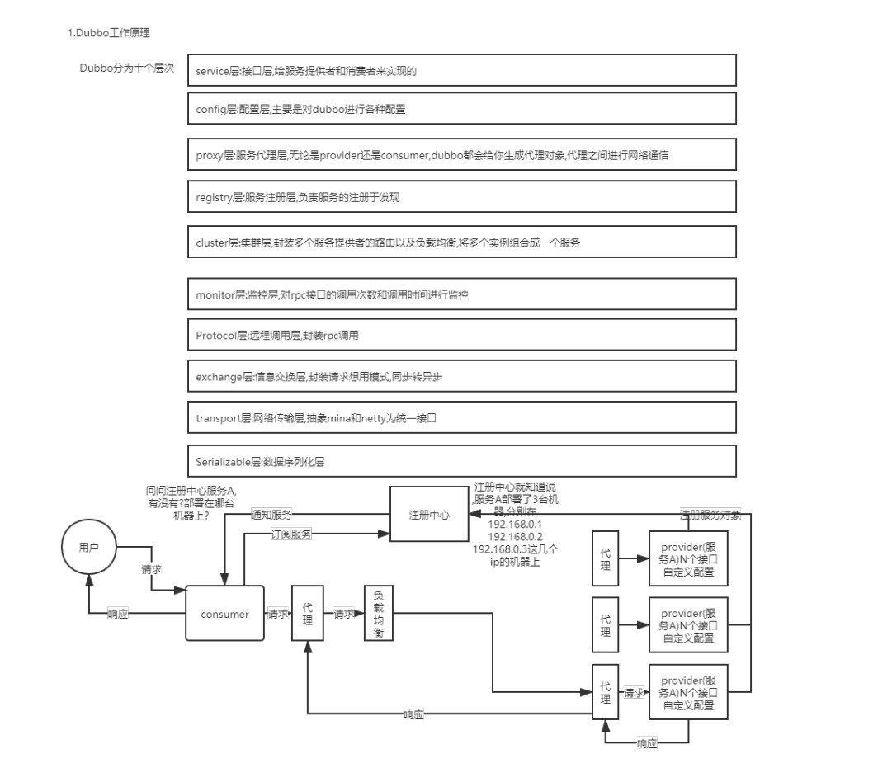

1.为什么要把系统拆成分布式系统的?为什么用dubbo?

    为什么要拆分系统?很简单痛苦啊,刚开始,系统从0到1的时候,一堆人维护一个系统,各种冲突,然后就拆,每个人只要维护一个系统,各种爽,
    某个系统要发布服务,也不需要所有人留守
    
    系统怎么拆分?根据服务拆,根据人员拆,根据代码量拆
    
    为什么用dubbo?
    很多微服务框架中的服务通信是基于 RPC 通信实现的，在没有进行组件扩展的前提下，SpringCloud 是基于 Feign 组件实现的 RPC
    通信（基于 Http+Json 序列化实现），Dubbo 是基于 SPI 扩展了很多 RPC 通信框架，包括 RMI、Dubbo、Hessian 等 RPC 
    通信框架（默认是 Dubbo+Hessian 序列化）。不同的业务场景下，RPC 通信的选择和优化标准也不同。
    
    当时的选择标准就是 RPC 通信可以支持抢购类的高并发，在这个业务场景中，请求的特点是瞬时高峰、请求量大和传入、传出参数数据包
    较小。而 Dubbo 中的 Dubbo 协议就很好地支持了这个请求。
    
    无论从响应时间还是吞吐量上来看，单一 TCP 长连接 +Protobuf 序列化实现的 RPC 通信框架都有着非常明显的优势。

 2.Dubbo工作原理,注册中心挂了,还可以继续通信吗?

     dubbo分成十层
      servi始ce层:provider和consumer,接口留给开发人员实现
      config层:任何一个框架,都需要提供配置文件,让你可以进行配置
      proxy层:代理层,无论是consumer,还是provider,dubbo都会给你生成代理,代理之间进行网络通信
      registry层:provider注册自己作为一个服务,consumer就可以找注册中心寻找自己要调用的服务
      cluster层:provider可以部署在多台机器上,多个provider就组成了一个集群
      monitor层:consumer调用provider,调用了多少次?统计信息监控
      Protocol层:负责具体的provider和consumer之间调用接口的时候的网络通信 exchange层:信息交换.
  

3.Dubbo Spi机制?

    spi全称为Service Provider Interface,是一种服务发现机制
    比如你有个接口,该接口有3个实现类,那么在系统运行时,这个接口应该选择哪个实现类?这就需要SPI了,需要根据指定的配置或者是默认的配置
    找到对应的实现类加载进来,然后使用该实例类的实例
    
    接口A有三个实现类,实现类A1,实现类A2,实现类A3,配置一下,接口A=实现A2.
    在系统实际运行的时候,会加载你的配置,用实现类A2实例化一个对象来提供服务
    
    spi的使用场景:插件扩展的场景,比如你开发了一个开源框架,若你想让别人自己写个插件,安排到你的开源框架中,扩展功能.
    例如JDBC,java定义一套JDBC接口,但是并没有提供其实现类,但是实际上项目运行时,要使用JDBC,但是并没有提供实现类.
    一般来说,我们要根据自己使用的数据库,比如
        MySql,你就将mysql-jdbc-connector.jar
        oracle,你就将oracle-jdbc-connector.jar引入
    系统运行时,碰到你使用的jdbc的接口,就会在底层使用你引入的那个jar中提供的实现类
    
    Dubbo中的SPI
    Dubbo 并未使用 Java SPI，而是重新实现了一套功能更强的 SPI 机制。Dubbo SPI 的相关逻辑被封装在了 ExtensionLoader 
    类中，通过 ExtensionLoader，我们可以加载指定的实现类。Dubbo SPI 所需的配置文件需放置在 META-INF/dubbo/internal 路径下，配置内容如下。        
    optimusPrime = org.apache.spi.OptimusPrime
    bumblebee = org.apache.spi.Bumblebee

    与Java SPI实现类配置不同,Dubbo SPI是通过键值对的方式进行配置,这样我们可以按需加载指定的实现类.需要在指定的的接口上标注@SPI注解

4.基于dubbo如何做服务治理 服务降级以及重试?

    停留在Dubbo本身的功能上面 抱歉,我们公司没有人力做,但是我可以说下这块的思想,或者从什么角度去做服务治理

    服务治理:全调用链路图 服务延时统计 报警 可用性  服务鉴权
    
    服务降级:比如说服务A调用服务B,结果服务B挂掉了,服务A重试几次调用服务B,还是不行,直接降级,走一个备用的逻辑,给用户返回响应
    在Dubbo中就是mock,如果调用失败统一返回null,但是可以将mock 修改为true,然后在跟接口同一个路径下实现一个mock类,命名规则
    是接口名称加Mock后缀,然后在该Mock类里面实现自己的降级逻辑
    
    dubbo 重试
    <dubbo retries="3" timeout="200ms"/>

5.分布式服务接口的幂等性如何设计(比如不能重复扣款)?

    其实保证幂等性主要是三点:
    a.对于每个请求必须有一个唯一的标识.举个例子:订单支付请求,肯定得包含订单id,一个订单id最多支付一次.
    b.每次处理完请求之后,必须有一个记录标识这个请求处理过了,如果说常见的方案是在mysql中记录个状态,比如在支付之前
    记录一条这个订单的支付流水,而且支付流水采用orderId作为唯一键.只有成功插入这个支付流水,才可以执行实际的支付扣款
    c.实际运作过程中,要结合自己的业务来,比如说用redis,支付扣款时,你就可以写一个标识到redis里面去,set orderid payed,下一次
    重复请求过来了,先查redis的orderid对应的value,如果是payed就说明已经支付过了,你就别重复支付了

6.分布式系统中的接口调用如何保证顺序性?

    消息队列 hash分发 到一个系统中,然后再分发到一个消息队列中,使用一个线程慢慢消费
    分布式锁 每个请求带一个seq

7.如何设计类似一个dubbo的RPC框架?

    1.你的服务得去注册中心吧,你是不是得有个注册中心,保留各个服务的信息,可以用zookeeper来做
    2.你的消费需要去注册中心拿对应的服务信息吧,而且每个服务可能会存在多台机器上
    3.接着你就应该发起一次请求了,怎么发起?.当然是基于动态代理了,你面向接口获取到一个动态代理,这个动态代理就是接口
    在本地的一个代理,然后这个代理会找到服务对应的机器地址
    4.然后找那个机器发送请求?那肯定得有个负载均衡的算法,比如最简单的可以随机轮询
    5.接着找到一台机器,就可以跟他发送请求了,第一怎么发送?可以用netty,nio的方式;第二发送什么格式的数据?
    可以用hessian序列化协议
    6.服务器那边一样的,需要针对你自己的服务生成一个动态代理,监听某个网络端口了,然后代理你本地的服务代码.接收到请求的时候,就调
    用对应的服务代码.

8.看过dubbo源码吗?

    服务调用
    网络通信
    异步变同步
