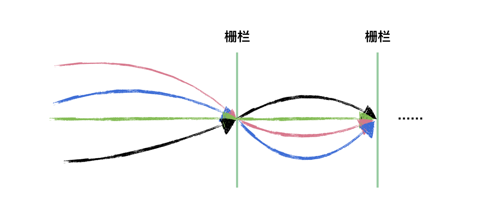

CyclicBarrier字面意思是“可重复使用的栅栏”，CyclicBarrier 相比 CountDownLatch 来说，要简单很多，其源码没有什么高深的  
地方，它是 ReentrantLock 和 Condition 的组合使用。

看如下示意图，CyclicBarrier 和 CountDownLatch 是不是很像，只是 CyclicBarrier 可以有不止一个栅栏，因为它的栅栏（Barrier）可以重复使用（Cyclic）。



首先，CyclicBarrier 的源码实现和 CountDownLatch 大相径庭，CountDownLatch 基于 AQS 的共享模式的使用，而 CyclicBarrier 基于 Condition 来实现的。因为 CyclicBarrier 的源码相对来说简单许多，读者只要熟悉了前面关于 Condition 的分析，那么这里的源码是毫无压力的，就是几个特殊概念罢了。

在CyclicBarrier类的内部有一个计数器，每个线程在到达屏障点的时候都会调用await方法将自己阻塞，此时计数器会减1，当计数器减为0的时候所有因调用await方法而被阻塞的线程将被唤醒。这就是实现一组线程相互等待的原理，下面我们先看看CyclicBarrier有哪些成员变量。

```java
public class CyclicBarrier {
    /**
     * Each use of the barrier is represented as a generation instance.
     * The generation changes whenever the barrier is tripped, or
     * is reset. There can be many generations associated with threads
     * using the barrier - due to the non-deterministic way the lock
     * may be allocated to waiting threads - but only one of these
     * can be active at a time (the one to which {@code count} applies)
     * and all the rest are either broken or tripped.
     * There need not be an active generation if there has been a break
     * but no subsequent reset.
     */
    private static class Generation {
        boolean broken = false;
    }

    /** The lock for guarding barrier entry */ // 同步操作锁
    private final ReentrantLock lock = new ReentrantLock();
    /** Condition to wait on until tripped */ // 线程拦截器
    private final Condition trip = lock.newCondition();
    /** The number of parties */    // 每次拦截的线程数
    private final int parties;
    /* The command to run when tripped */ // 换代前执行的任务
    private final Runnable barrierCommand;
    /** The current generation */// 表示栅栏的当前代
    private Generation generation = new Generation();

    /**
     * Number of parties still waiting. Counts down from parties to 0
     * on each generation.  It is reset to parties on each new
     * generation or when broken.
     */
    private int count;

    /**
     * Updates state on barrier trip and wakes up everyone.
     * Called only while holding lock.
     */
    private void nextGeneration() {
        // signal completion of last generation
        trip.signalAll();
        // set up next generation
        count = parties;
        generation = new Generation();
    }
}
```
上面贴出了CyclicBarrier所有的成员变量，可以看到CyclicBarrier内部是通过条件队列trip来对线程进行阻塞的，  
并且其内部维护了两个int型的变量parties和count，parties表示每次拦截的线程数，该值在构造时进行赋值。  
count是内部计数器，它的初始值和parties相同，以后随着每次await方法的调用而减1，直到减为0就将所有线程唤醒。

CyclicBarrier有一个静态内部类Generation，该类的对象代表栅栏的当前代，就像玩游戏时代表的本局游戏，利用它可以实现循环等待。  
barrierCommand表示换代前执行的任务，当count减为0时表示本局游戏结束，需要转到下一局。在转到下一局游戏之前会将所有阻塞的线程  
唤醒，在唤醒所有线程之前你可以通过指定barrierCommand来执行自己的任务。

我用一图来描绘下 CyclicBarrier 里面的一些概念：


构造器
    public CyclicBarrier(int parties, Runnable barrierAction) {
        if (parties <= 0) throw new IllegalArgumentException();
        this.parties = parties;
        this.count = parties;
        this.barrierCommand = barrierAction;
    }

    public CyclicBarrier(int parties) {
        this(parties, null);
    }
    
    CyclicBarrier有两个构造器，其中构造器1是它的核心构造器，在这里你可以指定本局游戏的参与者数量(要拦截的线程数)以及本局结
    束时要执行的任务，还可以看到计数器count的初始值被设置为parties。CyclicBarrier类最主要的功能就是使先到达屏障点的线程
    阻塞并等待后面的线程，其中它提供了两种等待的方法，分别是定时等待和非定时等待
    非定时等待
    public int await() throws InterruptedException, BrokenBarrierException {
        try {
            return dowait(false, 0L);
        } catch (TimeoutException toe) {
            throw new Error(toe); // cannot happen
        }
    }
    定时等待
    public int await(long timeout, TimeUnit unit)
        throws InterruptedException,
               BrokenBarrierException,
               TimeoutException {
        return dowait(true, unit.toNanos(timeout));
    }
```java
class CyclicBarrir{
    //核心等待方法
    private int dowait(boolean timed, long nanos) throws InterruptedException, BrokenBarrierException, TimeoutException {
      final ReentrantLock lock = this.lock;
      lock.lock();
      try {
        final Generation g = generation;
        //检查当前栅栏是否被打翻
        if (g.broken) {
          throw new BrokenBarrierException();
        }
        //检查当前线程是否被中断
        if (Thread.interrupted()) {
          //如果当前线程被中断会做以下三件事
          //1.打翻当前栅栏
          //2.唤醒拦截的所有线程
          //3.抛出中断异常
          breakBarrier();
          throw new InterruptedException();
        }
        //每次都将计数器的值减1
        int index = --count;
        //计数器的值减为0则需唤醒所有线程并转换到下一代
        if (index == 0) {
          boolean ranAction = false;
          try {
            //唤醒所有线程前先执行指定的任务
            final Runnable command = barrierCommand;
            if (command != null) {
              command.run();
            }
            ranAction = true;
            //唤醒所有线程并转到下一代
            nextGeneration();
            return 0;
          } finally {
            //确保在任务未成功执行时能将所有线程唤醒
            if (!ranAction) {
              breakBarrier();
            }
          }
        }
     
        //如果计数器不为0则执行此循环
        for (;;) {
          try {
            //根据传入的参数来决定是定时等待还是非定时等待
            if (!timed) {
              trip.await();
            }else if (nanos > 0L) {
              nanos = trip.awaitNanos(nanos);
            }
          } catch (InterruptedException ie) {
            //若当前线程在等待期间被中断则打翻栅栏唤醒其他线程
            if (g == generation && ! g.broken) {
              breakBarrier();
              throw ie;
            } else {
              //若在捕获中断异常前已经完成在栅栏上的等待, 则直接调用中断操作
              Thread.currentThread().interrupt();
            }
          }
          //如果线程因为打翻栅栏操作而被唤醒则抛出异常
          if (g.broken) {
            throw new BrokenBarrierException();
          }
          //如果线程因为换代操作而被唤醒则返回计数器的值
          if (g != generation) {
            return index;
          }
          //如果线程因为时间到了而被唤醒则打翻栅栏并抛出异常
          if (timed && nanos <= 0L) {
            breakBarrier();
            throw new TimeoutException();
          }
        }
      } finally {
        lock.unlock();
      }
    }
    
    //切换栅栏到下一代
    private void nextGeneration() {
      //唤醒条件队列所有线程
      trip.signalAll();
      //设置计数器的值为需要拦截的线程数
      count = parties;
      //重新设置栅栏代次
      generation = new Generation();
    }
     
    //打翻当前栅栏
    private void breakBarrier() {
      //将当前栅栏状态设置为打翻
      generation.broken = true;
      //设置计数器的值为需要拦截的线程数
      count = parties;
      //唤醒所有线程
      trip.signalAll();
    }
    
    public void reset() {
        final ReentrantLock lock = this.lock;
        lock.lock();
        try {
            breakBarrier();   // break the current generation
            nextGeneration(); // start a new generation
        } finally {
            lock.unlock();
        }
    }
}
```
可以看到在dowait方法中每次都将count减1，减完后立马进行判断看看是否等于0，如果等于0的话就会先去执行之前指定好的任务，执行完之  
后再调用nextGeneration方法将栅栏转到下一代，在该方法中会将所有线程唤醒，将计数器的值重新设为parties，最后会重新设置栅栏代次  
，在执行完nextGeneration方法之后就意味着游戏进入下一局。如果计数器此时还不等于0的话就进入for循环，根据参数来决定是调用trip  
.awaitNanos(nanos)还是trip.await()方法，这两方法对应着定时和非定时等待。如果在等待过程中当前线程被中断就会执行  
breakBarrier方法，该方法叫做打破栅栏，意味着游戏在中途被掐断，设置generation的broken状态为true并唤醒所有线程。同时这也说  
明在等待过程中有一个线程被中断整盘游戏就结束，所有之前被阻塞的线程都会被唤醒。线程醒来后会执行下面三个判断，看看是否因为调用  
breakBarrier方法而被唤醒，如果是则抛出异常；看看是否是正常的换代操作而被唤醒，如果是则返回计数器的值；看看是否因为超时而被唤  
醒，如果是的话就调用breakBarrier打破栅栏并抛出异常。这里还需要注意的是，如果其中有一个线程因为等待超时而退出，那么整盘游戏也  
会结束，其他线程都会被唤醒。下面贴出nextGeneration方法和breakBarrier方法的具体代码。
