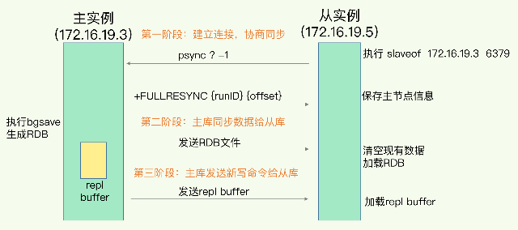
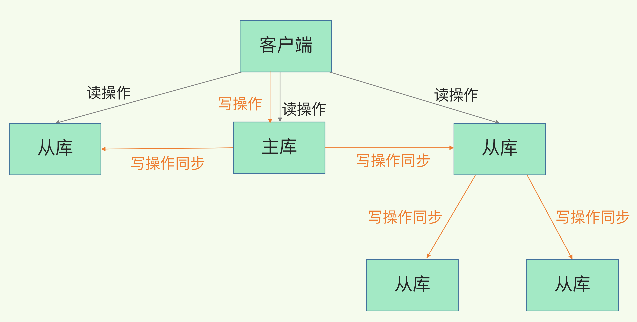

1.数据结构：快速的Redis有哪些慢操作？

2.为什么单线程的Redis能那么快?
Redis是单线程,主要是指Redis的网络io和键值对读写是由一个线程来完成的,这也是Redis对外提供键值
存储服务的主要流程,但是Redis的其他功能,比如持久化 异步删除 集群数据同步等,其实是由额外的线程执行的.
>Redis为什么要用单线程?
> a.多线程编程模式面临的共享资源的并发访问控制问题
> 01:并发访问控制一直是多线程开发中的一个难点问题,如果没有精细的设计,比如说,只是简单的采用一个粗粒度互斥锁
> 就会出现不理想的结果:即使增加了线程,大部分线程也在等待获取访问共享资源的互斥锁,并行变串行,系统吞吐率并没有
> 随着线程的增加而增加
> 02,采用多线程开发一般会引入同步原语来保护共享资源的并发访问,这也会降低系统代码的易调试性和可维护性.
> 为了避免这些问题,Redis 直接采用了单线程模式

3.单线程的处理能力要比多线程差很多，但是 Redis 却能使用单线程模型达到每秒数十万级别的处理能力，这是为什么呢？
>a.Redis的大部分操作在内存上完成,再加上它采用了高效的数据结构,例如哈希表和跳表,这是它实现高性能的一个重要原因
>b.Redis采用了多路复用机制,使其在网路IO操作中能并发处理大量的客户端请求,实现高吞吐率

4.基于多路复用的高性能i/o模型
Linux中的io多路复用机制是指一个线程处理多个io流,即select/epoll机制.简单说,在Redis只运行单线程的情况下,
该机制允许内核中,同时存在多个监听套接字和已连接套接字.内核会一直监听这些套接字上的连接请求或数据请求.一旦请求
到达,就会交给Redis线程处理,这就实现了一个Redis线程处理多个IO流的效果

5小结:Redis真的只有单线程吗?为什么用单线程?单线程为什么这么快?
Redis单线程是指它对网络io和数据读写的操作采用了一个线程,而采用单线程的一个核心原因是避免多线程开发的并发控制问题
单线程的Redis也能获得高性能,跟多路复用的io模型密切先关,因为这避免了accept()和send()/recv()潜在的网络io操作
阻塞点

6.select和epoll poll的区别
select 和 poll本质上没有区别,就是文件描述符数量的限制,select根据不同的系统,文件描述符限制为1024和2048,
poll没有数量限制.两者都是把文件描述符集合保存在用户态,每次把集合传入内核态,内核态返回ready的文件描述符
epoll是通过epoll_create和epoll_ctl和epoll三个系统调用完成的,每当接入一个文件描述符,通过ctl添加到内核
维护的红黑树中,通过事件机制,当数据ready后,从红黑树移动到链表,通过awit获取链表中准备好数据的fd,程序去处理

7.AOF日志:宕机了,Redis如何避免数据丢失?
Redis使用写后日志的好处一是可以避免出现记录错误命令的情况,二是在命令执行后才记录日志,索引不会阻塞当前的写操作
AOF两个潜在风险:一. 如果刚执行完一个命令,还没有来得及写日志就宕机了,那么这个命令和相应的数据就有丢失的风险.
              二.AOF虽然避免了对当前命令的阻塞,但可能会给下一个操作带来阻塞风险.这是因为,AOF日志也是在主线程中
              执行的,如果在把日志文件写入磁盘时,磁盘写压力大,就会导致写盘很慢,进而导致后续的操作也无法执行了.
三种写回策略:  对于上面的两个风险,AOF机制给我们提供了三个选择,也就是AOF配置项的appendfsync的三个可选值  
            Always,同步写回:每个写命令执行完,立马同步的将日志写回磁盘  
            Everysec,每秒写回:每个写命令执行完,只是先把日志写到AOF文件的内存缓冲区,每隔一秒把缓冲区中的内容写入磁盘  
            NO 操作系统控制的写回:每个写命令执行完,只是先把日志写到AOF文件的内存缓冲区,由操作系统决定何时将缓冲区内容写回磁盘
针对避免主线程阻塞和减少数据丢失问题，这三种写回策略都无法做到两全其美。我们来分析下其中的原因。  
“同步写回”可以做到基本不丢数据，但是它在每一个写命令后都有一个慢速的落盘操作，不可避免地会影响主线程性能；  
虽然“操作系统控制的写回”在写完缓冲区后，就可以继续执行后续的命令，但是落盘的时机已经不在 Redis 手中了，  
只要 AOF 记录没有写回磁盘，一旦宕机对应的数据就丢失了；  
“每秒写回”采用一秒写回一次的频率，避免了“同步写回”的性能开销，虽然减少了对系统性能的影响，但是如果发生宕机，  
上一秒内未落盘的命令操作仍然会丢失。所以，这只能算是，在避免影响主线程性能和避免数据丢失两者间取了个折中。

到这里，我们就可以根据系统对高性能和高可靠性的要求，来选择使用哪种写回策略了。总结一下就是：想要获得高性能，  
就选择 No 策略；如果想要得到高可靠性保证，就选择 Always 策略；如果允许数据有一点丢失，又希望性能别受太大  
影响的话，那么就选择 Everysec 策略

一定要小心AOF文件过大带来的性能问题
这里的性能问题,主要在于以下三个方面:
一是,文件系统本身对文件大小有限制,无法保存过大的文件
二是,如果文件太大,之后往里面追加命令记录的话,效率也会变低
三是,如果发生宕机,AOF中记录的命令要一个一个被重新执行,用于故障恢复,如果日志文件过大,整个恢复过程就会非常缓慢,这就会影响
到Redis的正常使用了

AOF重写机制
AOF重写机制就是在重写时,Redis根据数据库的现状创建一个新的AOF文件.  
也就是说，读取数据库中的所有键值对，然后对每一个键值对用一条命令记录它的写入。比如说，当读取了键值对“testkey”: “testvalue”之后，重写机制会记录 set testkey testvalue 这条命令。这样，当需要恢复时，可以重新执行该命令，实现“testkey”: “testvalue”的写入

AOF重写会阻塞主线程吗?
和AOF日志由主线程写回不同,重写过程是由后台线程bgrewriteaof来完成的,这是为了避免阻塞主线程,导致数据库性能下降

一个拷贝,两处日志

8.内存快照:宕机后,Redis如何实现快速恢复?
内存快照:就是指内存中的数据在某一个时刻的状态以文件的形式写到磁盘上.
>对那些数据做快照?这关系到快照的执行效率问题?
>做快照时,数据还能增删改吗?这关系到Redis是否被阻塞,能否正常处理请求?

RDB这个方法的优势在于,可以快速恢复数据库,也就是只需要把RDB文件直接读入内存,这就避免了AOF需要顺序
逐一重新执行操作命令带来的低效性能问题.

RDB局限性:RDB拍的是一张内存的"大合影",不可避免的会耗时耗力.虽然,Redis设计了bgsave和写时复制方式,尽可能
减少内存快照对正常读写的影响,但是,频繁快照,仍然是不太能接受的.而混合使用RDB和AOF,正好可以取两者之长,避免两者之短
,以较小的性能开销保证数据可靠性和性能
关于AOF和RDB的选择问题,三点建议:
a.数据不能丢失,内存快照和AOF的混合使用是一个很好的选择;
b.如果允许分钟级别的数据丢失,可以只适用RDB
c.如果只使用AOF,优先使用everysec的配置选项,因为他在可靠性和性能之间取了一个平衡

9.数据同步:主从库如何实现数据一致?
Redis具有高可靠性,是什么意思?
两层含义:一是数据尽量少丢失;二是服务尽量少中断.AOF和RDB保证了前者,对于后者,Redis的做法是增加副本冗余量

多副本之间的数据如何保持一致?
Redis提供了主从库模式,以保证数据副本的一致,主从库之间采用的读写分离的方式.
读操作:主库 从库都可以接收
写操作:首先到主库执行,然后,主库将写操作同步给从库

主从库间如何进行第一次同步?
三个阶段

第一阶段是主从库间建立连接 协商同步,主要是为全力复制做准备.在这一步,从库和主库建立起连接,并告诉主库即将进行同步,主库确认回复后,主从库间
就可以开始同步了

第二阶段,主库将所有数据同步给从库.从库收到数据后,在本地完成数据加载.具体说,主句执行bgsave命令,生成RDB文件
接着讲文件发给从库.从库接收到RDB文件后,会先清空当前数据库,然后加载RDB文件

第三阶段,主库会把第二阶段执行过程中新收到的写命令,再发送给从库

主从级联模式分担全量复制时的主库压力
分析主从库间第一次数据同步的过程,可以看到,一次全量复制中,对于主库来说,需要完成两个耗时的操作:生成RDB文件和传输RDB文件

1)如果从库数量很多,而且都要和主库进行全量复制的话,就会导致主库忙于fork子进程生成RDB,进行数据全量同步.fork这个操作会阻塞主线程处理正常
请求,从而导致主库响应应用程序的请求速度变慢
2)传输RDB文件也会占用主库的网络带宽,同样给主库的资源使用带来压力.

下面介绍更好的解决办法 "主-从-从"模式 通过“主 - 从 - 从”模式将主库生成 RDB 和传输 RDB 的压力，以级联的方式分散到从库上。
简单来说，我们在部署主从集群的时候，可以手动选择一个从库（比如选择内存资源配置较高的从库），用于级联其他的从库。然后，我们可以再选择一些从库（例如三分之一的从库），在这些从库上执行如下命令，让它们和刚才所选的从库，建立起主从关系。
这样一来，这些从库就会知道，在进行同步时，不用再和主库进行交互了，只要和级联的从库进行写操作同步就行了，这就可以减轻主库上的压力，如下图所示

主从库网络断了怎么办?
增量复制 repl_backlog_size
(因为 repl_backlog_buffer 是一个环形缓冲区，所以在缓冲区写满后，主库会继续写入，此时，就会覆盖掉之前写入的操作。如果从库的读取速度比较慢，就有可能导致从库还未读取的操作被主库新写的操作覆盖了，这会导致主从库间的数据不一致。)
如果遇到了网络断连，增量复制就派上用场了。我特别建议你留意一下 repl_backlog_size 这个配置参数。如果它配置得过小，在增量复制阶段，  
可能会导致从库的复制进度赶不上主库，进而导致从库重新进行全量复制。所以，通过调大这个参数，可以减少从库在网络断连时全量复制的风险。