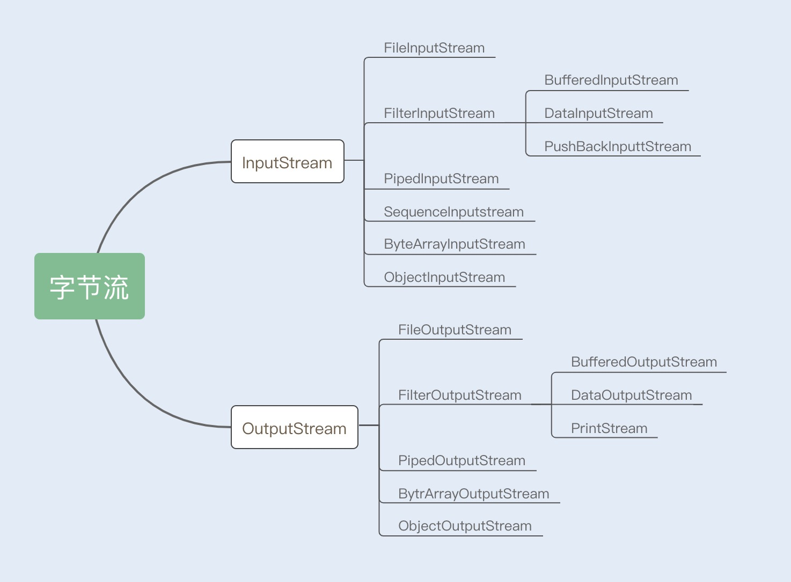
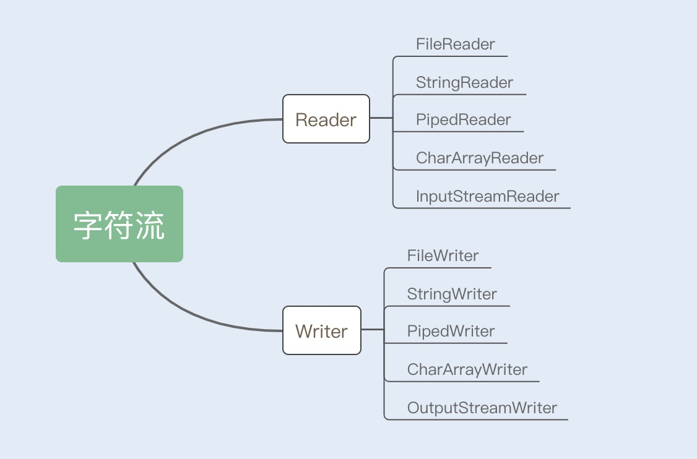
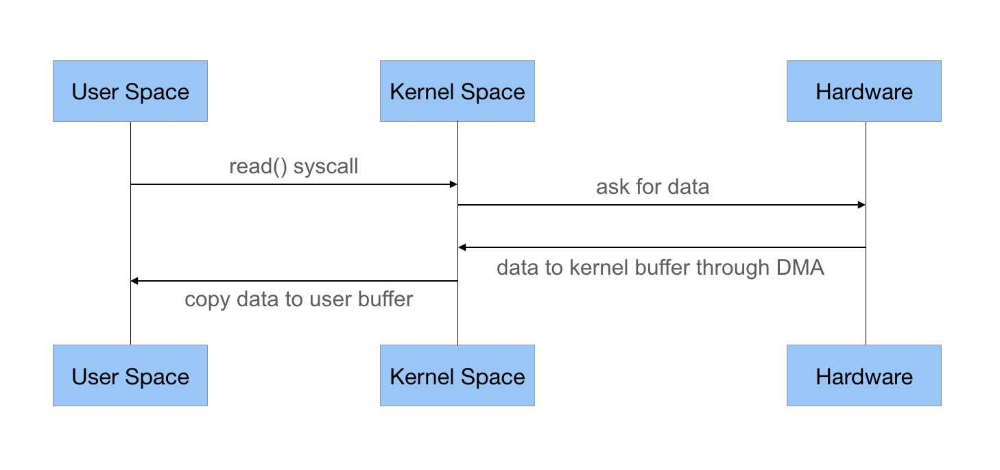

1.TreeSet和HashSet的区别

    ans:两者主要在实现方式 数据是否有序,以及是否可以放入null值等三方面存在区别
    
    **一.实现方式**
    a.HashSet底层采用HashMap,也就是hash表实现
    b.TreeSet底层采用TreeMap,也就是红黑树实现

    **二.数据是否有序**
    HashSet中的数据是无序的
    TreeSet中数据可以根据自然排序Comparable和比较排序Comparator进行排序
    
    **三.是否可以放入null值**
    HashSet可以放入null,但是只能放入null,(key==null,key键的hash值将为0,HashMap使用第0个桶存放键为null的键值对)  
    而TreeSet不允许放入null(无法进行比较)

2.HashMap如何解决冲突,扩容机制

    HashMap是基于哈希表的数据结构实现的
    常用的数据结构:数组 链表 哈希表 树
    哈希表将键的hash值映射到内存地址,也就是说HashMap是根据键的Hash值来决定对应值的存储位置.通过这种索引方式,HashMap获取数据的速度会非常快.
    两个对象的存储地址冲突,这种现象被称为哈希冲突,哈希表是怎么解决的呢?开放地址法 再哈希函数法和链地址法
    
    **开放地址法**:当发生哈希冲突时,如果哈希表未被装满,说明在哈希表中必然还有空位置,那么可以把key存放到冲突位置后面的空位置上去.这种方法存在着很多
    缺点,例如查找 扩容.所以不建议作为解决哈希冲突的首选
    
    **再哈希法**:在同一词产生地址冲突时再计算另一个哈希函数地址,直到冲突不再发生,这种方法不易产生"聚集",但却增加了计算时间,如果不考虑增加元素的时间,  
    且对查询元素的要求极高,就可以考虑使用这种算法设计.
    
    **链地址法**:这种方法时采用了数组(哈希表)+链表的数据结构,当发生哈希冲突时,就用一个链表结构存储相同hash值的数据
    
HashMap的重要属性**:HashMap是由一个Node数组构成,每个Node包含了一个key-value键值对.

```java
public class HashMap{
    transient Node<K,V>[] table;
    int threshold;// 边界值
    final float loadFactor;// 加载因子
    
    static class Node<K,V> implements Map.Entry<K,V>{
        final int hash;
        final K key;
        V value;
        Node<K,V> next;
         Node(int hash, K key, V value, Node<K,V> next) { 
             this.hash = hash;          
             this.key = key;           
             this.value = value;        
             this.next = next;      
         }
    }
}
```
HashMap添加元素优化:

```java
public class HashMap{
 public V put(K key, V value) {
        return putVal(hash(key), key, value, false, true);
    }
  
 static final int hash(Object key) {
        int h;
        // (h = key.hashCode()) ^ (h >>> 16)尽量打乱hashcode真正参与运算的低16位
        return (key == null) ? 0 : (h = key.hashCode()) ^ (h >>> 16);
    } 
  void put(){
  if ((tab = table) == null || (n = tab.length) == 0)
            n = (tab = resize()).length;
        //通过putVal方法中的(n - 1) & hash决定该Node的存储位置
        // (n - 1) & hash,n为2的n次方,这样恰好可以保证计算得到的索引值总是位于table数组的索引之内
        if ((p = tab[i = (n - 1) & hash]) == null)
            tab[i] = newNode(hash, key, value, null);
  }  
}
```
put方法流程图:


put方法流程解释:

    1.开始put
    2.判断table为null或者tab的长度为0时,通过resize()方法得到初始化table
    3.通过(n - 1) & hash计算出的值作为tab的下标i,并判断该下标i的节点是否为null
    4.如果3为true,则new第一个Node节点,调用newNode方法返回新节点赋值给tab[i]
    5.如果3为false,则分为三种情况处理
        a.HashMap中判断是否存在key和插入的key相等,如果相等,则将存在key值的Node覆盖
        b.判断新增节点是否为红黑树节点,如果是则新增红黑树节点
        c.轮询新增节点所在的链表长度,判断长度是否超过TREEIFY_THRESHOLD
        c1.如果超过,则将链表转为红黑树,否则在链表尾部新增Node节点

```java

public class HashMap{
    /**
     * Associates the specified value with the specified key in this map.
     * If the map previously contained a mapping for the key, the old
     * value is replaced.
     *
     * @param key key with which the specified value is to be associated
     * @param value value to be associated with the specified key
     * @return the previous value associated with <tt>key</tt>, or
     *         <tt>null</tt> if there was no mapping for <tt>key</tt>.
     *         (A <tt>null</tt> return can also indicate that the map
     *         previously associated <tt>null</tt> with <tt>key</tt>.)
     */
    public V put(K key, V value) {
        return putVal(hash(key), key, value, false, true);
    }
    /**
     * Implements Map.put and related methods
     *
     * @param hash hash for key
     * @param key the key
     * @param value the value to put
     * @param onlyIfAbsent if true, don't change existing value
     * @param evict if false, the table is in creation mode.
     * @return previous value, or null if none
     */
 final V putVal(int hash, K key, V value, boolean onlyIfAbsent,boolean evict) {
        Node<K,V>[] tab; Node<K,V> p; int n, i;
        if ((tab = table) == null || (n = tab.length) == 0)
        //1、判断当table为null或者tab的长度为0时，即table尚未初始化，此时通过resize()方法得到初始化的table
            n = (tab = resize()).length;
        if ((p = tab[i = (n - 1) & hash]) == null)
        //1.1、此处通过（n - 1） & hash 计算出的值作为tab的下标i，并另p表示tab[i]，也就是该链表第一个节点的位置。并判断p是否为null
            tab[i] = newNode(hash, key, value, null);
        //1.1.1、当p为null时，表明tab[i]上没有任何元素，那么接下来就new第一个Node节点，调用newNode方法返回新节点赋值给tab[i]
        else {
        //2.1下面进入p不为null的情况，有三种情况：p为链表节点；p为红黑树节点；p是链表节点但长度为临界长度TREEIFY_THRESHOLD，再插入任何元素就要变成红黑树了。
            Node<K,V> e; K k;
            if (p.hash == hash &&
                ((k = p.key) == key || (key != null && key.equals(k))))
        //2.1.1HashMap中判断key相同的条件是key的hash相同，并且符合equals方法。这里判断了p.key是否和插入的key相等，如果相等，则将p的引用赋给e
                e = p;
            else if (p instanceof TreeNode)
        //2.1.2现在开始了第一种情况，p是红黑树节点，那么肯定插入后仍然是红黑树节点，所以我们直接强制转型p后调用TreeNode.putTreeVal方法，返回的引用赋给e
                e = ((TreeNode<K,V>)p).putTreeVal(this, tab, hash, key, value);
            else {
        //2.1.3接下里就是p为链表节点的情形，也就是上述说的另外两类情况：插入后还是链表/插入后转红黑树。另外，上行转型代码也说明了TreeNode是Node的一个子类
                for (int binCount = 0; ; ++binCount) {
        //我们需要一个计数器来计算当前链表的元素个数，并遍历链表，binCount就是这个计数器

                    if ((e = p.next) == null) {
                        p.next = newNode(hash, key, value, null);
                        if (binCount >= TREEIFY_THRESHOLD - 1) 
        // 插入成功后，要判断是否需要转换为红黑树，因为插入后链表长度加1，而binCount并不包含新节点，所以判断时要将临界阈值减1
                            treeifyBin(tab, hash);
        //当新长度满足转换条件时，调用treeifyBin方法，将该链表转换为红黑树
                        break;
                    }
                    if (e.hash == hash &&
                        ((k = e.key) == key || (key != null && key.equals(k))))
                        break;
                    p = e;
                }
            }
            if (e != null) { // existing mapping for key
                V oldValue = e.value;
                if (!onlyIfAbsent || oldValue == null)
                    e.value = value;
                afterNodeAccess(e);
                return oldValue;
            }
        }
        ++modCount;
        if (++size > threshold)
            resize();
        afterNodeInsertion(evict);
        return null;
    }
}
```
HashMap获取元素优化:

    当HashMap中只存在数组,而数组中没有Node链表时,是HashMap查询性能最好的时候.一旦
    发生大量的哈希冲突,就会产生Node链表,这个时候每次查询元素都可能遍历Node链表,从而降低查询数据的性能.特别是在链表
    长度过长的情况下,性能将明显降低,红黑树的使用很好的解决了这个问题,使得查询的平均复杂度降低到了O(log(n)),链表越长,
    使用红黑树替换后的查询效率提升就越明显.
    
HashMap扩容优化:

    在jdk1.8中,HashMap对扩容操作做了优化.由于扩容数组的长度是2倍关系,所以对于假设初始tableSize=4
    要扩容到8来说,就是0100到1000的变化,在扩容中只用判断原来的hash值和左移动的一位(newTable的值)按位与操作是0或1就行,
    0的话索引不便,1的话索引变成原索引加上扩容前数组.
    之所以呢能通过这种"与运算"来重新分配索引,是因为hash值本来就是随机的,而hash按位与上newTable得到的0(扩容前的索引位置)和1(扩容前的索引位置加上扩容前数组长度的数值索引处)
    就是随机的,所以扩容的过程就能把之前哈希冲突的元素再随机分布到不同的索引中去
    
链地址法:

    这种方法的基本思想是将所有哈希地址为i的元素构成一个称为同义词链的单链表，并将单链表的头指针存在哈希表的第i个单元中，  
    因而查找、插入和删除主要在同义词链中进行。链地址法适用于经常进行插入和删除的情况。


3.ConcurrentHashMap如何做到高并发的?

    为什么需要CHM?
    一是因为HashTable本身比较低效,因为它的实现基本就是将put get size等各种方法加上synchronized.简单来说,这就导致了
    所有并发操作都要竞争同一把锁,一个线程在进行同步操作时,其他线程只能等待,大大降低了并发操作的效率
    
    二是HashMap不支持线程的同步，即任一时刻可以有多个线程同时写HashMap;可能会导致数据的不一致
    
    三能不能利用Collections提供的同步包装器来解决问题?同步包装器只是利用输入Map够早了另一个同步版本,所有操作虽然不再声明称为
     synchronized方法,但是还是利用了"this"作为互斥的mutex,没有真正意义上的改进
```java

private static class SynchronizedMap<K,V>
    implements Map<K,V>, Serializable {
    private final Map<K,V> m;     // Backing Map
    final Object      mutex;        // Object on which to synchronize
    // …
    public int size() {
        synchronized (mutex) {return m.size();}
    }
 // 
}
```
所以，Hashtable 或者同步包装版本，都只是适合在非高度并发的场景下

CHM1.7与1.8比较:

    1.7
    put加锁,
    通过分段加锁segment,一个hashmap里有若干个segment,每个segment里有若干个桶,
    桶里存放k-V形式的链表,put数据时通过key哈希得到该元素要添加的segment,然后对segment
    进行加锁,然后在哈希,计算得到给元素要添加到的桶,然后遍历桶中的链表,替换或新增节点到桶中
    
    size:分段计算两次
    
    1.8
    put CAS加锁
    1.8中不依赖与segment加锁,segment数量与桶数量一致
    首先判断容器是否为空,为空则进行初始化,
    initTable()利用volatile的sizeCtl作为互斥手段,如果发现竞争性的初始化,就暂停
    在哪里,等待条件恢复;
    否则初始化时利用CAS设置排他标志sizeCtl;
    否则重试初始化;
    如果容器不为空但节点bin是空的,则利用CAS去进行无锁操作线程
    对key hash计算得到该key存放的的桶位置,判断该桶是否为空,为空则利用CAS设置新节点;
    否则使用synchronized加锁,遍历桶中数据,替换桶中数据,替换或新增加点到桶中;
    最后判断是否需要转为红黑树,转换之前判断是否需要扩容
    
    size:利用LongAdd累计计算
    
    put方法流程
    1.首先判断容器是否为空,为空则进行初始化initTable()
    2.如果容器不为空,但是根据tabAt(table,(n-1)&hash))==null,为true,则利用CAS进行无锁操作,对key进行hash计算
    得到key存放的桶位置,判断该桶是否为空,为空则利用CAS设置新节点
    3.根据tabAt(table,(n-1)&hash))==null,为false,(fh = f.hash) == MOVED为true,则当前线程帮助搬移数据
    4.如果以上都不是,则使用synchronized对该节点加锁,遍历通中数据,替换桶中数据,新增加节点到数据

```java
public class ConcurrentHashMap{
    final V putVal(K key, V value, boolean onlyIfAbsent) {
        if (key == null || value == null) throw new NullPointerException();
        int hash = spread(key.hashCode());
        int binCount = 0;
        for (Node<K,V>[] tab = table;;) {
            Node<K,V> f; int n, i, fh;
            if (tab == null || (n = tab.length) == 0)
                tab = initTable();
            else if ((f = tabAt(tab, i = (n - 1) & hash)) == null) {
                if (casTabAt(tab, i, null,
                             new Node<K,V>(hash, key, value, null)))
                    break;                   // no lock when adding to empty bin
            }
            else if ((fh = f.hash) == MOVED)
                tab = helpTransfer(tab, f);
            else {
                V oldVal = null;
                synchronized (f) {
                    if (tabAt(tab, i) == f) {
                        if (fh >= 0) {
                            binCount = 1;
                            for (Node<K,V> e = f;; ++binCount) {
                                K ek;
                                if (e.hash == hash &&
                                    ((ek = e.key) == key ||
                                     (ek != null && key.equals(ek)))) {
                                    oldVal = e.val;
                                    if (!onlyIfAbsent)
                                        e.val = value;
                                    break;
                                }
                                Node<K,V> pred = e;
                                if ((e = e.next) == null) {
                                    pred.next = new Node<K,V>(hash, key,
                                                              value, null);
                                    break;
                                }
                            }
                        }
                        else if (f instanceof TreeBin) {
                            Node<K,V> p;
                            binCount = 2;
                            if ((p = ((TreeBin<K,V>)f).putTreeVal(hash, key,
                                                           value)) != null) {
                                oldVal = p.val;
                                if (!onlyIfAbsent)
                                    p.val = value;
                            }
                        }
                    }
                }
                if (binCount != 0) {
                    if (binCount >= TREEIFY_THRESHOLD)
                        treeifyBin(tab, i);
                    if (oldVal != null)
                        return oldVal;
                    break;
                }
            }
        }
        addCount(1L, binCount);
        return null;
    }
    private final Node<K,V>[] initTable() {
        Node<K,V>[] tab; int sc;
        while ((tab = table) == null || tab.length == 0) {
            if ((sc = sizeCtl) < 0)
                Thread.yield(); // lost initialization race; just spin
            else if (U.compareAndSwapInt(this, SIZECTL, sc, -1)) {
                try {
                    if ((tab = table) == null || tab.length == 0) {
                        int n = (sc > 0) ? sc : DEFAULT_CAPACITY;
                        @SuppressWarnings("unchecked")
                        Node<K,V>[] nt = (Node<K,V>[])new Node<?,?>[n];
                        table = tab = nt;
                        sc = n - (n >>> 2);
                    }
                } finally {
                    sizeCtl = sc;
                }
                break;
            }
        }
        return tab;
    }
}
```

    **initTable流程**
    利用volatile的sizeCtl作为互斥手段,如果发现竞争性的初始化,就暂停在哪里,等待条件恢复;
    否则初始化时利用CAS设置排他标志sizeCtl;
    否则重试初始化;
    白话解释下:从源码中可以看出table的初始化在一个cas方法中进行,当table为null或者长度为0时,进入之后判断
    sizeCtl的值,如果sizeCtl<0则线程让步,由于初始化状态sizeCtl是等于0的,说明前面已经有线程进入了else if这部分,
    将sizeCtl的值置为-1,表示正在初始化


4.线程池平常怎么用

    线程池原理:在线程池内部,维护了一个阻塞队列workQueue和一组工作线程,工作线程的个数由构造函数中的poolsize来指定.
    用户通过调用execut()方法来提交Runnable任务,execute()方法的内部实现仅仅是将任务加入到workQueue中.线程池内部维护的
    工作线程会消费WorkQueue中的任务并执行任务.

```java
//简化的线程池，仅用来说明工作原理
class MyThreadPool{
  //利用阻塞队列实现生产者-消费者模式
  BlockingQueue<Runnable> workQueue;
  //保存内部工作线程
  List<WorkerThread> threads = new ArrayList<>();
  // 构造方法
  MyThreadPool(int poolSize, BlockingQueue<Runnable> workQueue){
    this.workQueue = workQueue;
    // 创建工作线程
    for(int idx=0; idx<poolSize; idx++){
      WorkerThread work = new WorkerThread();
      work.start();
      threads.add(work);
    }
  }
  // 提交任务
  void execute(Runnable command){
    workQueue.put(command);
  }
  // 工作线程负责消费任务，并执行任务
  class WorkerThread extends Thread{
    public void run() {
      //循环取任务并执行
      while(true){ 
        Runnable task = workQueue.take();
        task.run();
      } 
    }
  }
/** 下面是使用示例 **/
public static void main(String[] args) {
    // 创建有界阻塞队列
    BlockingQueue<Runnable> workQueue = new LinkedBlockingQueue<>(2);
    // 创建线程池  
    MyThreadPool pool = new MyThreadPool(10, workQueue);
    // 提交任务  
    pool.execute(()->{System.out.println("hello"); });
  }
}
```
线程应用的场景:

    普通的场景,使用工厂类Executors创建就可以了.常见的有fix Single cache三种,更多时候,为了更精细的控制,
    会直接对ThreadPoolExecutor类进行定制,我尤其关心其中的阻塞队列和饱和策略
线程池拒绝策略:

        CallerRunsPolicy:提交任务的线程自己去执行该任务
        AbortPolicy:默认的拒绝策略,会抛出异常
        DiscardPolicy:直接丢弃任务,没有异常
        DiscardOldestPolicy:丢弃最老的任务

线程池参数介绍:把线程池类比为一个项目组,而线程就是项目组中的成员

```java
public class ThreadPoolExecutor{
    ThreadPoolExecutor(
      int corePoolSize,// 表示线程池保有的最小线程数.有些项目很闲,但是也不能把人都撤了,至少要保留corePoolSize个人坚守阵地
      int maximumPoolSize,// 表示线程池创建的最大线程数.当项目很忙时,就需要家加人,但是也不能无限加,最多加到maximumPoolSize个人
      long keepAliveTime,// 项目根据忙闲开增减人员,在编程世界里,如何定义忙和闲呢?一个线程如果在一段时间内,都没有执行任务,说明很闲,
      TimeUnit unit,// keepAliveTime&unit就是用来定义这个"一段时间"的参数,也就是说一个线程空闲了keepAliveTime&unit了这么久,
      // 而且线程池的线程数大于corePoolSize,na那么这个空闲的线程就要被回收了
      BlockingQueue<Runnable> workQueue,// 工作队列
      ThreadFactory threadFactory,//通过这个参数可以自定义如何创建线程,例如可以给线程指定一个有意义的名字
      RejectedExecutionHandler handler); //通过这个参数可以自定义任务的拒绝策略.如果线程池中所有的线程都在忙碌,并且工作队列也满了,前提是工作队列是有界队列,name
      // 此时提交任务,线程池就会拒绝接收
  }
```

Executors创建三种线程池的方式:

```java
public class Executors{
    public static ExecutorService newCachedThreadPool() {
        return new ThreadPoolExecutor(0, Integer.MAX_VALUE,
                                      60L, TimeUnit.SECONDS,
                                      new SynchronousQueue<Runnable>());
    }
     public static ExecutorService newFixedThreadPool(int nThreads, ThreadFactory threadFactory) {
        return new ThreadPoolExecutor(nThreads, nThreads,
                                      0L, TimeUnit.MILLISECONDS,
                                      new LinkedBlockingQueue<Runnable>(),
                                      threadFactory);
    }
    public static ExecutorService newSingleThreadExecutor() {
        return new FinalizableDelegatedExecutorService
            (new ThreadPoolExecutor(1, 1,
                                    0L, TimeUnit.MILLISECONDS,
                                    new LinkedBlockingQueue<Runnable>()));
    }
}
```
5.多个线程等到某一节点然后统一放行有几种实现方式?

    **CountDownLatch**:  
    主要用来解决一个线程等待多个线程的场景,可以类比旅游团团长要等待所有的游客到齐才能去下一个景点,
    主线程阻塞在await方法,每个线程调用countDown()
    **CyclicBarrier**: 是一组线程之间互相等待,更像是几个驴友之间不离不弃,每个线程阻塞在await上,达到一定阈值集体放行
    **Future**:实现线程之间的等待

6.数据库索引结构?

    哈希表 有序数组 搜索树
    哈希表这种结构适用于等值查询的场景(处理冲突的方式是链表)
    有序数组在等值查询和范围查询场景中的性能都很非常优秀,优点是查询效率高,缺点是插入一条记录成本高
    有序数组索引只适用静态存储引擎
    二叉搜索树

7.select * from t where a=? and b>? order by c limit 0,100如何加索引

    using index 表示使用了覆盖索引,性能上会快很多,覆盖索引是指索引上的信息足够满足查询请求,不需要再回到主键索引上去取数据
   
    using index condition 与 using index的区别在于,用上了索引(利用索引完成字段的筛选过滤),但是索引列不能够包含要求查询
    要求的所有字段,需要回表补全字段.
    回表是指,根据索引找到满足条件的id后,利用id回到主键索引上取出整行或者取出需要的字段
   
    using filesort 表示的就是需要排序,mysql会给每个线程分配一块内存用于排序,称为sort_buffer.排序这个动作,可能在内存中完成,
    也可能需要使用外部排序, 这取决于排序所需的内存和参数sort_buffer_size
    sort_buffer_size,就是MySQL为排序开辟的内存大小.如果要排序的数据量小于sort_buffer_size,排序就在内存中完成.但如果排序
    数量太大,内存放不下,则不得不利用磁盘临时文件辅助排序
    
    using where 我们知道mysql数据库包含server层与引擎层
    using where 表示server层在收到引擎层返回的行后会进行过滤(即应用where 过滤条件),即会根据查询条件过滤结果集
    
    题目上的sql（select * from t where a=? and b>? order by c limit 0,100 ）
    a为等值比较，所以idx_acb (a,c,b)，将a放在第1位，在比较满足a的条件后，c依旧是有序的，不用专门去排序，接下来只需要依次取出来b的值进行（b>?）比较，满足条件的直接返回，当返回条数达到100条时结束遍历

    数据库索引设计与优化
    一星索引:where 条件等值作为组合索引最开头的列
    二星索引:将order by列加入索引,这样的话,数据会在索引中排序好,避免数据库在访问表的时候再进行排序
    三星索引:将查询语句中的剩余的列加入到索引中,这样只查索引,不会访问表
    如果在查询语句中有范围条件,放在组合索引的最后,因为在数据库优化器中,范围条件为该组合索引的最后一个匹配列,后边的列都为非匹配列


8.什么是聚簇索引和非聚簇索引?

    主键索引的叶子节点存的是整行数据,在InnoDB中,主键索引被称为聚簇索引
    非主键索引的叶子节点内容是主键的值,在InnoDB中,非主键索引也被称为二级索引,也被称为非聚簇索引
    基于主键索引和普通索引的查询有什么区别?
    如果语句是 select * from T where ID=500，即主键查询方式，则只需要搜索 ID 这棵 B+ 树；  
    如果语句是 select * from T where k=5，即普通索引查询方式，则需要先搜索 k 索引树，得到 ID 的值为 500，再到 ID 索引树搜索一次。  
    这个过程称为回表。也就是说，基于非主键索引的查询需要多扫描一棵索引树。因此，我们在应用中应该尽量使用主键查询。

9.了解CAP吗?redis里的CAP是怎样的?

a.什么是CAP?

    结合电商的例子,理解CAP的含义?
    假设某电商在北京 杭州 上海三个城市建立了仓库,同时建立了对应的服务器A B C,用于存储商品信息.比如,某电吹风在北京仓库有20个,在杭州仓库
     有10个,在上海仓库有30个.那么,CAP这三个字母在这个例子中分别代表什么呢?
    C 代表Consistency,一致性,是指所有节点在同一时刻的数据时相同的,即更新操作执行结束并响应用户完成后,所有节点存储的数据会保持相同.
    在电商系统中,A B C 中存储的该电吹风的数量应该是20+10+30=60.假设,现在有一个北京用户买走一个电吹风,服务器A会更新数据为60-1=59,
    与此同时要求B和C也更新为59,以保证在同一时刻,无论访问A B C 中的哪个服务器,得到的数据均是59;
    A代表Availability,可用性,是指系统提供的服务一直处于可用状态,对于用户的请求可即时响应
    在电商系统中,用户在任一时刻向A B C中的任一服务器发出请求时,均可得到即时响应,比如查询商品信息等.
    P代表Partition Tolerance,分区容错性,是指在分布式系统遇到网路分区的情况下,仍然可以响应用户的请求.网络分区是指因为网络故障不连通,不同节点分布在不同的子网络
    中,各个子网络内网络正常.
    在电商系统中,假设C和A B的网络都不通了,A和B是相通的.也就是说,形成了两个分区{A,B}和{C},在这种情况下,系统仍能响应用户请求.
    一致性 可用性 分区容错性是分布式系统的三个特征,那么我们平时所说的CAP理论又是什么呢?

b.CAP理论指的就是在分布式系统中C A P这三个特征不能同时满足,只能满足其中两个


    对这个系统来说.分别满足C A P指的是
    在满足一致性C的情况下,Server1和Server2中的数据库始终保持一致,即DB1和DB2内容要始终保持相同
    在满足可用性A的情况下,用户无论访问Server1还是Server2,都会得到即时响应;
    在满足分区容错性P的情况下,Server1和Server2之间即使出现网路故障也不会影响Server1和Server2分别处理用户的请求

    在实际场景中,网络环境不可能100%不出故障,比如网络拥塞 网卡故障等,会导致网络故障或不通,从而导致节点之间无法通信,
    或者集群中节点被划分为多个分区,分区中节点之间可通信,分区间不可通信,这种由网络故障导致的集群分区情况,被称为"网络分区"

    在分布式系统中,网络分区不可避免,因此分区容错性P必须满足.
    在满足分区容错性P的情况下,一致性C和可用性A是否可以同时满足
    User2向Server2发送读取数据a的请求时,Server2无法给用户返回最新数据,那么该如何处理呢?
    第一种处理方式,保证一致性C,牺牲可用性A:Server2选择让User2的请求阻塞,一直等到网络恢复正常,Server1被修改的数据同步更新
    到Server2之后,即DB2中数据a修改成最新值2后,再给用户User2响应;
    第二种处理方式是,保证可用性A,牺牲一致性C:Server2选择将旧的数据a=1返回给用户,等到网络恢复,再进行数据同步
    除了以上这两种方案,没有其他方案可以选择,可以看出:在满足分区容错性P的前提下,一致性C和可用性A只能选择一个,无法同时满足;

c.CAP的选择策略和应用,在无法同时满足CAP这三个特性,那该如何进行取舍呢?

    其实,C A P,没有谁优谁劣,只是不同的分布式场景适合不同的策略,接下来,针对一些场景为例,分别于你介绍CA弃P 保CP弃A
    保AP弃C这三种策略,分析面对不同的分布式场景时,知道如何权衡这三个特征.
    
    保 CA 弃 P
    在分布式系统中,现在的网络基础设施无法做到始终保持稳定,网络分区难易避免,牺牲分区容错性,就相当于放弃使用分布式系统.因此
    在分布式系统中,这种策略不需要过多讨论.
    
    既然分布式系统不能采用这种策略,那单点系统毫无疑问就需要满足CA特性了,比如关系型数据库部署在单台机器上,因此不存在网络通信问题,所以保证CA就可以了
    
    保 CP 弃 A
    如果一个分布式场景需要很强的数据一致性,或者该场景可以容忍系统长时间无响应的情况下,保CP弃A这个策略就比较合适
    一个保证CP而舍弃A的分布式系统,一旦发生网络分区会导致无法同步情况,就要牺牲系统的可用性,降低用户体验,直到节点数据达到一致后再响应用户.
    这种策略通常用在涉及金钱交易的分布式场景下,因为它任何时候都不允许出现数据不一致的情况,否则就会给用户造成损失.因此这种场景下必须保证CP
    保证CP的系统有很多,典型的有Redis Hbase Zookeeper.
    以zookeeper为例,带你了解它是如何保证CP的
    下面是zookeeper的架构图
    
    zookeeper集群包含多个节点(Server),这些节点会通过分布式选举算法选出一个Leader节点.在Zookeeper中选举Leader节点采用的是ZAB算法
    在Zookeeper集群中,Leader节点之外的节点被称为Follower节点,Leader节点会专门负责处理用户的写请求:
    当用户想节点发送写请求的时候,如果请求的节点刚好是Leader,那就直接处理该请求;
    如果请求的是follower节点,那该节点会将请求转给Leader,然后Leader会先向所有的Follower发出一个Proposal,等超过一半的节点同意后,
    Leader才会提交这次写操作,从而保证了数据的一致性.
    当出现网络分区时,如果其中一个分区的节点数大于集群总节点数的一半,那么这个分区可以再选出一个Leader,仍然对用户提供服务,但在选出Leader
    之前,不能正常为用户提供服务;如果形成的分区中,没有一分区的节点数大于集群总节点数的一半,那么系统不能正常为用户提供服务,必须待网络恢复后,  
    才能正常提供服务.
    这种设计方式保证了分区容错性,但是牺牲了一定的系统可用性;
    
    保AP弃C
    如果一个分布式场景需要很高的可用性,或者说在网络状况不太好的情况下,该场景允许数据暂时不一致,那这种情况下就可以牺牲一定的一致性了.
    网络分区出现后,各个节点之间数据无法马上同步,为了保证高可用,分布式系统需要即刻响应用户的请求.但是此时可能某些节点还没有拿到最新数据,只能将本地旧的数据  
    返回给用户,从而导致数据不一致的情况.
    适合保证AP放弃C的场景有很多.比如,很多查询网站 电商系统中的商品查询等,用户体验非常重要,所以大多会保证系统的可用性,而牺牲一定的数据一致性;

d.三种策略的对比


CAP和ACID的"C" "A"是一样的吗?

    首先看C:
    CAP中的C强调的是数据一致性,也就是集群中节点之间通过复制技术保证每个节点上数据在同一时刻是相同的;
    ACID中的C强调的是事务执行前后,数据的完整性保持一致或满足完整性约束.也就是不管在什么时候,不管并发事务有多少,事务在分布式系统中的状态始终保持一致;
    再来看A:
    CAP中的A指的是可用性Availablity,也就是系统提供的服务一直处于可用状态,即对于用户的请求可即时响应.
    ACID中的A指的是原子性Atomicity,强调的是事务要么执行成功,要么执行失败
    因此,CAP和ACID的C和A是不一样的,不能混为一谈.
    redis简单主从模式侧重于CP的,即对于一致性要求较高.redis-cluster,则属于AP类型,更加强调可用性

BASE理论

10.如何理解幂等?项目中接口的幂等是如何做的?
幂等是指多次执行,影响相同.
> 比如大多数Post操作,重复提交订单等,最终只会有一个订单生成成功.
> 还有一种情况是消息,由于大多数MQ只保证at least once,所以消息有时会重复
> 对于Post请求,一般在请求成功后,强制跳转到其他页面,避免刷新提交.
> 复杂的操作一般使用流水号来实现
> 某些不带流水号的消息,处理的时候,就要进行多次校验,甚至引入消息状态表,来保证幂等

11.算法题:两个有序的list,求交集

12.如何解决高并发下I/O瓶颈?
字节流与字符流:

    不管是文件读写还是网络发送接收，信息的最小存储单元都是字节，那为什么 I/O 流操作要分为字节流操作和字符流操作呢？
    ans:我们知道字符到字节必须经过转码，这个过程非常耗时，如果我们不知道编码类型就很容易出现乱码问题。所以 I/O 流提供了一个直
    接操作字符的接口，方便我们平时对字符进行流操作
    
    1.字节流
    
    
    2.字符流
    

传统I/O的性能问题

    1.多次内存复制
    在传统 I/O 中，我们可以通过 InputStream 从源数据中读取数据流输入到缓冲区里，通过 OutputStream 将数据输出到外部设备
    （包括磁盘、网络）。


        a.JVM会发出read()系统调用,并通过read系统调用向内核发起请求;
        b.内核向硬件发送读指令,并等待读就绪
        c.内核把将要读取的数据复制到指向的内核缓存中
        d.操作系统内核将数据复制到用户控件缓冲区,然后read系统调用返回;
    在这个过程中，数据先从外部设备复制到内核空间，再从内核空间复制到用户空间，这就发生了两次内存复制操作。这种操作会导致不必要
    的数据拷贝和上下文切换，从而降低 I/O 的性能。   
    
    2.阻塞
    在传统 I/O 中，InputStream 的 read() 是一个 while 循环操作，它会一直等待数据读取，直到数据就绪才会返回。这就意味着
    如果没有数据就绪，这个读取操作将会一直被挂起，用户线程将会处于阻塞状态.
    
    在少量连接请求的情况下，使用这种方式没有问题，响应速度也很高。但在发生大量连接请求时，就需要创建大量监听线程，这时如果线程
    没有数据就绪就会被挂起，然后进入阻塞状态。一旦发生线程阻塞，这些线程将会不断地抢夺 CPU 资源，从而导致大量的 CPU 上下文切换，增加系统的性能开销。             
如何优化I/O操作

    1.使用缓冲区优化读写流操作
    在传统 I/O 中，提供了基于流的 I/O 实现，即 InputStream 和 OutputStream，这种基于流的实现以字节为单位处理数据。
    
    NIO 与传统 I/O 不同，它是基于块（Block）的，它以块为基本单位处理数据。在 NIO 中，最为重要的两个组件是缓冲区（Buffer）
    和通道（Channel）。Buffer 是一块连续的内存块，是 NIO 读写数据的中转地。Channel 表示缓冲数据的源头或者目的地，它用于
    读取缓冲或者写入数据，是访问缓冲的接口。
    传统 I/O 和 NIO 的最大区别就是传统 I/O 是面向流，NIO 是面向 Buffer。Buffer可以将文件一次性读入内存再做后续处理，而
    传统的方式是边读文件边处理数据。虽然传统 I/O 后面也使用了缓冲块，例如BufferedInputStream，但仍然不能和 NIO 相媲美。
    使用 NIO 替代传统 I/O 操作，可以提升系统的整体性能，效果立竿见影。
    
    2.使用DirectBuffer减少内存复制
    NIO 的 Buffer 除了做了缓冲块优化之外，还提供了一个可以直接访问物理内存的类 DirectBuffer。普通的 Buffer 分配的是 
    JVM 堆内存，而 DirectBuffer 是直接分配物理内存 (非堆内存)。DirectBuffer 则是直接将步骤简化为数据直接保存到非堆内存
    ，从而减少了一次数据拷贝

    DirectBuffer 只优化了用户空间内部的拷贝，而之前我们是说优化用户空间和内核空间的拷贝，那 Java 的 NIO 中是否能做到减少
    用户空间和内核空间的拷贝优化呢？

    答案是可以的，DirectBuffer 是通过 unsafe.allocateMemory(size) 方法分配内存，也就是基于本地类 Unsafe 类调用 
    native 方法进行内存分配的。而在 NIO 中，还存在另外一个 Buffer 类：MappedByteBuffer，跟 DirectBuffer 不同的是，
    MappedByteBuffer 是通过本地类调用 mmap 进行文件内存映射的，map() 系统调用方法会直接将文件从硬盘拷贝到用户空间，只进
    行一次数据拷贝，从而减少了传统的 read() 方法从硬盘拷贝到内核空间这一步。
    
    3.避免阻塞,优化I/O操作
    传统的 I/O 即使使用了缓冲块，依然存在阻塞问题。由于线程池线程数量有限，一旦发生大量并发请求，超过最大数量的线程就只能等待
    ，直到线程池中有空闲的线程可以被复用。而对 Socket 的输入流进行读取时，读取流会一直阻塞，直到发生以下三种情况的任意一种才
    会解除阻塞：
        有数据可读；连接释放；空指针或 I/O 异常
    阻塞问题，就是传统 I/O 最大的弊端。NIO 发布后，通道和多路复用器这两个基本组件实现了 NIO 的非阻塞，下面我们就一起来了解
    下这两个组件的优化原理
    
        通道(Channel)
    通道的出现解决了以上问题，Channel 有自己的处理器，可以完成内核空间和磁盘之间的 I/O 操作。在 NIO 中，我们读取和写入数据
    都要通过 Channel，由于 Channel 是双向的，所以读、写可以同时进行。
    
        多路复用器器(Selector)    
    Selector 是 Java NIO 编程的基础。用于检查一个或多个 NIO Channel 的状态是否处于可读、可写。
    Selector 是基于事件驱动实现的，我们可以在 Selector 中注册 accpet、read 监听事件，Selector 会不断轮询注册在其上的
    Channel，如果某个 Channel 上面发生监听事件，这个 Channel 就处于就绪状态，然后进行 I/O 操作。
    
    一个线程使用一个 Selector，通过轮询的方式，可以监听多个 Channel 上的事件。我们可以在注册 Channel 时设置该通道为非阻塞
    ，当 Channel 上没有 I/O 操作时，该线程就不会一直等待了，而是会不断轮询所有 Channel，从而避免发生阻塞。
    
    目前操作系统的 I/O 多路复用机制都使用了 epoll，相比传统的 select 机制，epoll 没有最大连接句柄 1024 的限制。所以 
    Selector 在理论上可以轮询成千上万的客户端。
总结

    Java 的传统 I/O 开始是基于 InputStream 和 OutputStream 两个操作流实现的，这种流操作是以字节为单位，如果在高并发、
    大数据场景中，很容易导致阻塞，因此这种操作的性能是非常差的。还有，输出数据从用户空间复制到内核空间，再复制到输出设备，这样
    的操作会增加系统的性能开销。
    
    传统 I/O 后来使用了 Buffer 优化了“阻塞”这个性能问题，以缓冲块作为最小单位，但相比整体性能来说依然不尽人意。
    
    于是 NIO 发布，它是基于缓冲块为单位的流操作，在 Buffer 的基础上，新增了两个组件“管道和多路复用器”，实现了非阻塞 I/O，
    NIO 适用于发生大量 I/O 连接请求的场景，这三个组件共同提升了 I/O 的整体性能。

关于java的网络,有个比喻形象的总结
>例子：有一个养鸡的农场，里面养着来自各个农户（Thread）的鸡（Socket），每家农户都在农场中建立了自己的鸡舍（SocketChannel）

>>1、BIO：Block IO，每个农户盯着自己的鸡舍，一旦有鸡下蛋，就去做捡蛋处理；

>>2、NIO：No-BlockIO-单Selector，农户们花钱请了一个饲养员（Selector），并告诉饲养员（register）如果哪家的鸡有任何情况  
>> （下蛋）均要向这家农户报告（selectkeys）;

>>3、NIO：No-BlockIO-多Selector，当农场中的鸡舍(Selector)逐渐增多时，一个饲养员巡视（轮询）一次所需时间就会不断地加长，  
>> 这样农户知道自己家的鸡有下蛋的情况就会发生较大的延迟。怎么解决呢？没错，多请几个饲养员（多Selector），每个饲养员分配管理鸡  
>> 舍，这样就可以减轻一个饲养员的工作量，同时农户们可以更快的知晓自己家的鸡是否下蛋了；

>>4、Epoll模式：如果采用Epoll方式，农场问题应该如何改进呢？其实就是饲养员不需要再巡视鸡舍，而是听到哪间鸡舍(Selector)的鸡  
> > 打鸣了（活跃连接），就知道哪家农户的鸡下蛋了；

> > 5、AIO：AsynchronousI/O,鸡下蛋后，以前的NIO方式要求饲养员通知农户去取蛋，AIO模式出现以后，事情变得更加简单了，取蛋工作  
> > 由饲养员自己负责，然后取完后，直接通知农户来拿即可，而不需要农户自己到鸡舍去取蛋。


