1.TreeSet和HashSet的区别

    ans:两者主要在实现方式 数据是否有序,以及是否可以放入null值等三方面存在区别
    
    **一.实现方式**
    a.HashSet底层采用HashMap,也就是hash表实现
    b.TreeSet底层采用TreeMap,也就是红黑树实现

    **二.数据是否有序**
    HashSet中的数据是无序的
    TreeSet中数据可以根据自然排序Comparable和比较排序Comparator进行排序
    
    **三.是否可以放入null值**
    HashSet可以放入null,但是只能放入null,(key==null,key键的hash值将为0,HashMap使用第0个桶存放键为null的键值对)  
    而TreeSet不允许放入null(无法进行比较)

2.HashMap如何解决冲突,扩容机制

    HashMap是基于哈希表的数据结构实现的
    常用的数据结构:数组 链表 哈希表 树
    哈希表将键的hash值映射到内存地址,也就是说HashMap是根据键的Hash值来决定对应值的存储位置.通过这种索引方式,HashMap获取数据的速度会非常快.
    两个对象的存储地址冲突,这种现象被称为哈希冲突,哈希表是怎么解决的呢?开放地址法 再哈希函数法和链地址法
    
    **开放地址法**:当发生哈希冲突时,如果哈希表未被装满,说明在哈希表中必然还有空位置,那么可以把key存放到冲突位置后面的空位置上去.这种方法存在着很多
    缺点,例如查找 扩容.所以不建议作为解决哈希冲突的首选
    
    **再哈希法**:在同一词产生地址冲突时再计算另一个哈希函数地址,直到冲突不再发生,这种方法不易产生"聚集",但却增加了计算时间,如果不考虑增加元素的时间,  
    且对查询元素的要求极高,就可以考虑使用这种算法设计.
    
    **链地址法**:这种方法时采用了数组(哈希表)+链表的数据结构,当发生哈希冲突时,就用一个链表结构存储相同hash值的数据
    
HashMap的重要属性**:HashMap是由一个Node数组构成,每个Node包含了一个key-value键值对.

```java
public class HashMap{
    transient Node<K,V>[] table;
    int threshold;// 边界值
    final float loadFactor;// 加载因子
    
    static class Node<K,V> implements Map.Entry<K,V>{
        final int hash;
        final K key;
        V value;
        Node<K,V> next;
         Node(int hash, K key, V value, Node<K,V> next) { 
             this.hash = hash;          
             this.key = key;           
             this.value = value;        
             this.next = next;      
         }
    }
}
```
HashMap添加元素优化:

```java
public class HashMap{
 public V put(K key, V value) {
        return putVal(hash(key), key, value, false, true);
    }
  
 static final int hash(Object key) {
        int h;
        // (h = key.hashCode()) ^ (h >>> 16)尽量打乱hashcode真正参与运算的低16位
        return (key == null) ? 0 : (h = key.hashCode()) ^ (h >>> 16);
    } 
  void put(){
  if ((tab = table) == null || (n = tab.length) == 0)
            n = (tab = resize()).length;
        //通过putVal方法中的(n - 1) & hash决定该Node的存储位置
        // (n - 1) & hash,n为2的n次方,这样恰好可以保证计算得到的索引值总是位于table数组的索引之内
        if ((p = tab[i = (n - 1) & hash]) == null)
            tab[i] = newNode(hash, key, value, null);
  }  
}
```
put方法流程图:

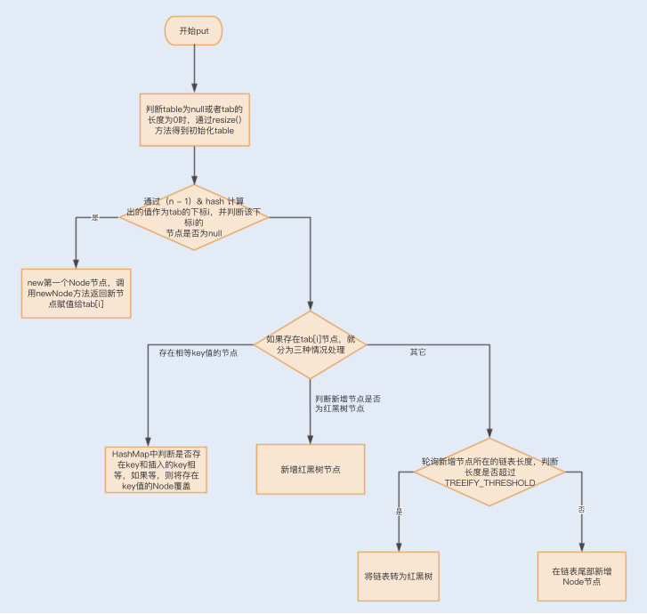

put方法流程解释:

    1.开始put
    2.判断table为null或者tab的长度为0时,通过resize()方法得到初始化table
    3.通过(n - 1) & hash计算出的值作为tab的下标i,并判断该下标i的节点是否为null
    4.如果3为true,则new第一个Node节点,调用newNode方法返回新节点赋值给tab[i]
    5.如果3为false,则分为三种情况处理
        a.HashMap中判断是否存在key和插入的key相等,如果相等,则将存在key值的Node覆盖
        b.判断新增节点是否为红黑树节点,如果是则新增红黑树节点
        c.轮询新增节点所在的链表长度,判断长度是否超过TREEIFY_THRESHOLD
        c1.如果超过,则将链表转为红黑树,否则在链表尾部新增Node节点

```java

public class HashMap{
    /**
     * Associates the specified value with the specified key in this map.
     * If the map previously contained a mapping for the key, the old
     * value is replaced.
     *
     * @param key key with which the specified value is to be associated
     * @param value value to be associated with the specified key
     * @return the previous value associated with <tt>key</tt>, or
     *         <tt>null</tt> if there was no mapping for <tt>key</tt>.
     *         (A <tt>null</tt> return can also indicate that the map
     *         previously associated <tt>null</tt> with <tt>key</tt>.)
     */
    public V put(K key, V value) {
        return putVal(hash(key), key, value, false, true);
    }
    /**
     * Implements Map.put and related methods
     *
     * @param hash hash for key
     * @param key the key
     * @param value the value to put
     * @param onlyIfAbsent if true, don't change existing value
     * @param evict if false, the table is in creation mode.
     * @return previous value, or null if none
     */
 final V putVal(int hash, K key, V value, boolean onlyIfAbsent,boolean evict) {
        Node<K,V>[] tab; Node<K,V> p; int n, i;
        if ((tab = table) == null || (n = tab.length) == 0)
        //1、判断当table为null或者tab的长度为0时，即table尚未初始化，此时通过resize()方法得到初始化的table
            n = (tab = resize()).length;
        if ((p = tab[i = (n - 1) & hash]) == null)
        //1.1、此处通过（n - 1） & hash 计算出的值作为tab的下标i，并另p表示tab[i]，也就是该链表第一个节点的位置。并判断p是否为null
            tab[i] = newNode(hash, key, value, null);
        //1.1.1、当p为null时，表明tab[i]上没有任何元素，那么接下来就new第一个Node节点，调用newNode方法返回新节点赋值给tab[i]
        else {
        //2.1下面进入p不为null的情况，有三种情况：p为链表节点；p为红黑树节点；p是链表节点但长度为临界长度TREEIFY_THRESHOLD，再插入任何元素就要变成红黑树了。
            Node<K,V> e; K k;
            if (p.hash == hash &&
                ((k = p.key) == key || (key != null && key.equals(k))))
        //2.1.1HashMap中判断key相同的条件是key的hash相同，并且符合equals方法。这里判断了p.key是否和插入的key相等，如果相等，则将p的引用赋给e
                e = p;
            else if (p instanceof TreeNode)
        //2.1.2现在开始了第一种情况，p是红黑树节点，那么肯定插入后仍然是红黑树节点，所以我们直接强制转型p后调用TreeNode.putTreeVal方法，返回的引用赋给e
                e = ((TreeNode<K,V>)p).putTreeVal(this, tab, hash, key, value);
            else {
        //2.1.3接下里就是p为链表节点的情形，也就是上述说的另外两类情况：插入后还是链表/插入后转红黑树。另外，上行转型代码也说明了TreeNode是Node的一个子类
                for (int binCount = 0; ; ++binCount) {
        //我们需要一个计数器来计算当前链表的元素个数，并遍历链表，binCount就是这个计数器

                    if ((e = p.next) == null) {
                        p.next = newNode(hash, key, value, null);
                        if (binCount >= TREEIFY_THRESHOLD - 1) 
        // 插入成功后，要判断是否需要转换为红黑树，因为插入后链表长度加1，而binCount并不包含新节点，所以判断时要将临界阈值减1
                            treeifyBin(tab, hash);
        //当新长度满足转换条件时，调用treeifyBin方法，将该链表转换为红黑树
                        break;
                    }
                    if (e.hash == hash &&
                        ((k = e.key) == key || (key != null && key.equals(k))))
                        break;
                    p = e;
                }
            }
            if (e != null) { // existing mapping for key
                V oldValue = e.value;
                if (!onlyIfAbsent || oldValue == null)
                    e.value = value;
                afterNodeAccess(e);
                return oldValue;
            }
        }
        ++modCount;
        if (++size > threshold)
            resize();
        afterNodeInsertion(evict);
        return null;
    }
}
```
HashMap获取元素优化:

    当HashMap中只存在数组,而数组中没有Node链表时,是HashMap查询性能最好的时候.一旦
    发生大量的哈希冲突,就会产生Node链表,这个时候每次查询元素都可能遍历Node链表,从而降低查询数据的性能.特别是在链表
    长度过长的情况下,性能将明显降低,红黑树的使用很好的解决了这个问题,使得查询的平均复杂度降低到了O(log(n)),链表越长,
    使用红黑树替换后的查询效率提升就越明显.
    
HashMap扩容优化:

    在jdk1.8中,HashMap对扩容操作做了优化.由于扩容数组的长度是2倍关系,所以对于假设初始tableSize=4
    要扩容到8来说,就是0100到1000的变化,在扩容中只用判断原来的hash值和左移动的一位(newTable的值)按位与操作是0或1就行,
    0的话索引不便,1的话索引变成原索引加上扩容前数组.
    之所以呢能通过这种"与运算"来重新分配索引,是因为hash值本来就是随机的,而hash按位与上newTable得到的0(扩容前的索引位置)和1(扩容前的索引位置加上扩容前数组长度的数值索引处)
    就是随机的,所以扩容的过程就能把之前哈希冲突的元素再随机分布到不同的索引中去
    
链地址法:

    这种方法的基本思想是将所有哈希地址为i的元素构成一个称为同义词链的单链表，并将单链表的头指针存在哈希表的第i个单元中，  
    因而查找、插入和删除主要在同义词链中进行。链地址法适用于经常进行插入和删除的情况。


3.ConcurrentHashMap如何做到高并发的?

    为什么需要CHM?
    一是因为HashTable本身比较低效,因为它的实现基本就是将put get size等各种方法加上synchronized.简单来说,这就导致了
    所有并发操作都要竞争同一把锁,一个线程在进行同步操作时,其他线程只能等待,大大降低了并发操作的效率
    
    二是HashMap不支持线程的同步，即任一时刻可以有多个线程同时写HashMap;可能会导致数据的不一致
    
    三能不能利用Collections提供的同步包装器来解决问题?同步包装器只是利用输入Map够早了另一个同步版本,所有操作虽然不再声明称为
     synchronized方法,但是还是利用了"this"作为互斥的mutex,没有真正意义上的改进
```java

private static class SynchronizedMap<K,V>
    implements Map<K,V>, Serializable {
    private final Map<K,V> m;     // Backing Map
    final Object      mutex;        // Object on which to synchronize
    // …
    public int size() {
        synchronized (mutex) {return m.size();}
    }
 // 
}
```
所以，Hashtable 或者同步包装版本，都只是适合在非高度并发的场景下

CHM1.7与1.8比较:

    1.7
    put加锁,
    通过分段加锁segment,一个hashmap里有若干个segment,每个segment里有若干个桶,
    桶里存放k-V形式的链表,put数据时通过key哈希得到该元素要添加的segment,然后对segment
    进行加锁,然后在哈希,计算得到给元素要添加到的桶,然后遍历桶中的链表,替换或新增节点到桶中
    
    size:分段计算两次
    
    1.8
    put CAS加锁
    1.8中不依赖与segment加锁,segment数量与桶数量一致
    首先判断容器是否为空,为空则进行初始化,
    initTable()利用volatile的sizeCtl作为互斥手段,如果发现竞争性的初始化,就暂停
    在哪里,等待条件恢复;
    否则初始化时利用CAS设置排他标志sizeCtl;
    否则重试初始化;
    如果容器不为空但节点bin是空的,则利用CAS去进行无锁操作线程
    对key hash计算得到该key存放的的桶位置,判断该桶是否为空,为空则利用CAS设置新节点;
    否则使用synchronized加锁,遍历桶中数据,替换桶中数据,替换或新增加点到桶中;
    最后判断是否需要转为红黑树,转换之前判断是否需要扩容
    
    size:利用LongAdd累计计算
    
    put方法流程
    1.首先判断容器是否为空,为空则进行初始化initTable()
    2.如果容器不为空,但是根据tabAt(table,(n-1)&hash))==null,为true,则利用CAS进行无锁操作,对key进行hash计算
    得到key存放的桶位置,判断该桶是否为空,为空则利用CAS设置新节点
    3.根据tabAt(table,(n-1)&hash))==null,为false,(fh = f.hash) == MOVED为true,则当前线程帮助搬移数据
    4.如果以上都不是,则使用synchronized对该节点加锁,遍历通中数据,替换桶中数据,新增加节点到数据

```java
public class ConcurrentHashMap{
    final V putVal(K key, V value, boolean onlyIfAbsent) {
        if (key == null || value == null) throw new NullPointerException();
        int hash = spread(key.hashCode());
        int binCount = 0;
        for (Node<K,V>[] tab = table;;) {
            Node<K,V> f; int n, i, fh;
            if (tab == null || (n = tab.length) == 0)
                tab = initTable();
            else if ((f = tabAt(tab, i = (n - 1) & hash)) == null) {
                if (casTabAt(tab, i, null,
                             new Node<K,V>(hash, key, value, null)))
                    break;                   // no lock when adding to empty bin
            }
            else if ((fh = f.hash) == MOVED)
                tab = helpTransfer(tab, f);
            else {
                V oldVal = null;
                synchronized (f) {
                    if (tabAt(tab, i) == f) {
                        if (fh >= 0) {
                            binCount = 1;
                            for (Node<K,V> e = f;; ++binCount) {
                                K ek;
                                if (e.hash == hash &&
                                    ((ek = e.key) == key ||
                                     (ek != null && key.equals(ek)))) {
                                    oldVal = e.val;
                                    if (!onlyIfAbsent)
                                        e.val = value;
                                    break;
                                }
                                Node<K,V> pred = e;
                                if ((e = e.next) == null) {
                                    pred.next = new Node<K,V>(hash, key,
                                                              value, null);
                                    break;
                                }
                            }
                        }
                        else if (f instanceof TreeBin) {
                            Node<K,V> p;
                            binCount = 2;
                            if ((p = ((TreeBin<K,V>)f).putTreeVal(hash, key,
                                                           value)) != null) {
                                oldVal = p.val;
                                if (!onlyIfAbsent)
                                    p.val = value;
                            }
                        }
                    }
                }
                if (binCount != 0) {
                    if (binCount >= TREEIFY_THRESHOLD)
                        treeifyBin(tab, i);
                    if (oldVal != null)
                        return oldVal;
                    break;
                }
            }
        }
        addCount(1L, binCount);
        return null;
    }
    private final Node<K,V>[] initTable() {
        Node<K,V>[] tab; int sc;
        while ((tab = table) == null || tab.length == 0) {
            if ((sc = sizeCtl) < 0)
                Thread.yield(); // lost initialization race; just spin
            else if (U.compareAndSwapInt(this, SIZECTL, sc, -1)) {
                try {
                    if ((tab = table) == null || tab.length == 0) {
                        int n = (sc > 0) ? sc : DEFAULT_CAPACITY;
                        @SuppressWarnings("unchecked")
                        Node<K,V>[] nt = (Node<K,V>[])new Node<?,?>[n];
                        table = tab = nt;
                        sc = n - (n >>> 2);
                    }
                } finally {
                    sizeCtl = sc;
                }
                break;
            }
        }
        return tab;
    }
}
```

    **initTable流程**
    利用volatile的sizeCtl作为互斥手段,如果发现竞争性的初始化,就暂停在哪里,等待条件恢复;
    否则初始化时利用CAS设置排他标志sizeCtl;
    否则重试初始化;
    白话解释下:从源码中可以看出table的初始化在一个cas方法中进行,当table为null或者长度为0时,进入之后判断
    sizeCtl的值,如果sizeCtl<0则线程让步,由于初始化状态sizeCtl是等于0的,说明前面已经有线程进入了else if这部分,
    将sizeCtl的值置为-1,表示正在初始化


4.线程池平常怎么用

    线程池原理:在线程池内部,维护了一个阻塞队列workQueue和一组工作线程,工作线程的个数由构造函数中的poolsize来指定.
    用户通过调用execut()方法来提交Runnable任务,execute()方法的内部实现仅仅是将任务加入到workQueue中.线程池内部维护的
    工作线程会消费WorkQueue中的任务并执行任务.

```java
//简化的线程池，仅用来说明工作原理
class MyThreadPool{
  //利用阻塞队列实现生产者-消费者模式
  BlockingQueue<Runnable> workQueue;
  //保存内部工作线程
  List<WorkerThread> threads = new ArrayList<>();
  // 构造方法
  MyThreadPool(int poolSize, BlockingQueue<Runnable> workQueue){
    this.workQueue = workQueue;
    // 创建工作线程
    for(int idx=0; idx<poolSize; idx++){
      WorkerThread work = new WorkerThread();
      work.start();
      threads.add(work);
    }
  }
  // 提交任务
  void execute(Runnable command){
    workQueue.put(command);
  }
  // 工作线程负责消费任务，并执行任务
  class WorkerThread extends Thread{
    public void run() {
      //循环取任务并执行
      while(true){ 
        Runnable task = workQueue.take();
        task.run();
      } 
    }
  }
/** 下面是使用示例 **/
public static void main(String[] args) {
    // 创建有界阻塞队列
    BlockingQueue<Runnable> workQueue = new LinkedBlockingQueue<>(2);
    // 创建线程池  
    MyThreadPool pool = new MyThreadPool(10, workQueue);
    // 提交任务  
    pool.execute(()->{System.out.println("hello"); });
  }
}
```
线程应用的场景:

    普通的场景,使用工厂类Executors创建就可以了.常见的有fix Single cache三种,更多时候,为了更精细的控制,
    会直接对ThreadPoolExecutor类进行定制,我尤其关系其中的阻塞队列和饱和策略
线程池拒绝策略:

        CallerRunsPolicy:提交任务的线程自己去执行该任务
        AbortPolicy:默认的拒绝策略,会抛出异常
        DiscardPolicy:直接丢弃任务,没有异常
        DiscardOldestPolicy:丢弃最老的任务

线程池参数介绍:把线程池类比为一个项目组,而线程就是项目组中的成员

```java
public class ThreadPoolExecutor{
    ThreadPoolExecutor(
      int corePoolSize,// 表示线程池保有的最小线程数.有些项目很闲,但是也不能把人都撤了,至少要保留corePoolSize个人坚守阵地
      int maximumPoolSize,// 表示线程池创建的最大线程数.当项目很忙时,就需要家加人,但是也不能无限加,最多加到maximumPoolSize个人
      long keepAliveTime,// 项目根据忙闲开增减人员,在编程世界里,如何定义忙和闲呢?一个线程如果在一段时间内,都没有执行任务,说明很闲,
      TimeUnit unit,// keepAliveTime&unit就是用来定义这个"一段时间"的参数,也就是说一个线程空闲了keepAliveTime&unit了这么久,
      // 而且线程池的线程数大于corePoolSize,na那么这个空闲的线程就要被回收了
      BlockingQueue<Runnable> workQueue,// 工作队列
      ThreadFactory threadFactory,//通过这个参数可以自定义如何创建线程,例如可以给线程指定一个有意义的名字
      RejectedExecutionHandler handler); //通过这个参数可以自定义任务的拒绝策略.如果线程池中所有的线程都在忙碌,并且工作队列也满了,前提是工作队列是有界队列,name
      // 此时提交任务,线程池就会拒绝接收
  }
```

Executors创建三种线程池的方式:

```java
public class Executors{
    public static ExecutorService newCachedThreadPool() {
        return new ThreadPoolExecutor(0, Integer.MAX_VALUE,
                                      60L, TimeUnit.SECONDS,
                                      new SynchronousQueue<Runnable>());
    }
     public static ExecutorService newFixedThreadPool(int nThreads, ThreadFactory threadFactory) {
        return new ThreadPoolExecutor(nThreads, nThreads,
                                      0L, TimeUnit.MILLISECONDS,
                                      new LinkedBlockingQueue<Runnable>(),
                                      threadFactory);
    }
    public static ExecutorService newSingleThreadExecutor() {
        return new FinalizableDelegatedExecutorService
            (new ThreadPoolExecutor(1, 1,
                                    0L, TimeUnit.MILLISECONDS,
                                    new LinkedBlockingQueue<Runnable>()));
    }
}
```
5.多个线程等到某一节点然后统一放行有几种实现方式?

    **CountDownLatch**:  
    主要用来解决一个线程等待多个线程的场景,可以类比旅游团团长要等待所有的游客到齐才能去下一个景点,
    主线程阻塞在await方法,每个线程调用countDown()
    **CyclicBarrier**: 是一组线程之间互相等待,更像是几个驴友之间不离不弃,每个线程阻塞在await上,达到一定阈值集体放行
    **Future**:实现线程之间的等待

6.数据库索引结构?

    哈希表 有序数组 搜索树
    哈希表这种结构适用于等值查询的场景(处理冲突的方式是链表)
    有序数组在等值查询和范围查询场景中的性能都很非常优秀,优点是查询效率高,缺点是插入一条记录成本高
    有序数组索引只适用静态存储引擎
    二叉搜索树

7.select * from t where a=? and b>? order by c limit 0,100如何加索引

    using index 表示使用了覆盖索引,性能上会快很多,覆盖索引是指索引上的信息足够满足查询请求,不需要再回到主键索引上去取数据
   
    using index condition 与 using index的区别在于,用上了索引(利用索引完成字段的筛选过滤),但是索引列不能够包含要求查询
    要求的所有字段,需要回表补全字段.
    回表是指,根据索引找到满足条件的id后,利用id回到主键索引上取出整行或者取出需要的字段
   
    using filesort 表示的就是需要排序,mysql会给每个线程分配一块内存用于排序,称为sort_buffer.排序这个动作,可能在内存中完成,
    也可能需要使用外部排序, 这取决于排序所需的内存和参数sort_buffer_size
    sort_buffer_size,就是MySQL为排序开辟的内存大小.如果要排序的数据量小于sort_buffer_size,排序就在内存中完成.但如果排序
    数量太大,内存放不下,则不得不利用磁盘临时文件辅助排序
    
    using where 我们知道mysql数据库包含server层与引擎层
    using where 表示server层在收到引擎层返回的行后会进行过滤(即应用where 过滤条件),即会根据查询条件过滤结果集
    
    题目上的sql（select * from t where a=? and b>? order by c limit 0,100 ）
    a为等值比较，所以idx_acb (a,c,b)，将a放在第1位，在比较满足a的条件后，c依旧是有序的，不用专门去排序，接下来只需要依次取出来b的值进行（b>?）比较，满足条件的直接返回，当返回条数达到100条时结束遍历

    数据库索引设计与优化
    一星索引:where 条件等值作为组合索引最开头的列
    二星索引:将order by列加入索引,这样的话,数据会在索引中排序好,避免数据库在访问表的时候再进行排序
    三星索引:将查询语句中的剩余的列加入到索引中,这样只查索引,不会访问表
    如果在查询语句中有范围条件,放在组合索引的最后,因为在数据库优化器中,范围条件为该组合索引的最后一个匹配列,后边的列都为非匹配列

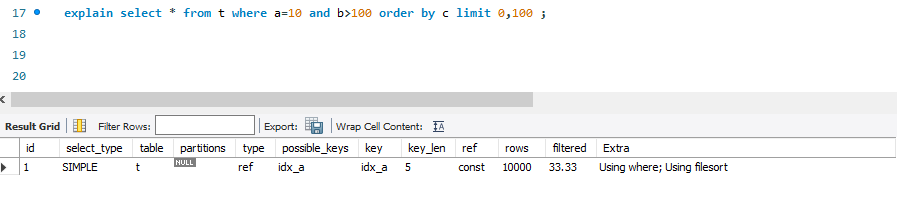

8.什么是聚簇索引和非聚簇索引?

    主键索引的叶子节点存的是整行数据,在InnoDB中,主键索引被称为聚簇索引
    非主键索引的叶子节点内容是主键的值,在InnoDB中,非主键索引也被称为二级索引,也被称为非聚簇索引
    基于主键索引和普通索引的查询有什么区别?
    如果语句是 select * from T where ID=500，即主键查询方式，则只需要搜索 ID 这棵 B+ 树；  
    如果语句是 select * from T where k=5，即普通索引查询方式，则需要先搜索 k 索引树，得到 ID 的值为 500，再到 ID 索引树搜索一次。  
    这个过程称为回表。也就是说，基于非主键索引的查询需要多扫描一棵索引树。因此，我们在应用中应该尽量使用主键查询。

9.了解CAP吗?redis里的CAP是怎样的?

a.什么是CAP?

    结合电商的例子,理解CAP的含义?
    假设某电商在北京 杭州 上海三个城市建立了仓库,同时建立了对应的服务器A B C,用于存储商品信息.比如,某电吹风在北京仓库有20个,在杭州仓库
     有10个,在上海仓库有30个.那么,CAP这三个字母在这个例子中分别代表什么呢?
    C 代表Consistency,一致性,是指所有节点在同一时刻的数据时相同的,即更新操作执行结束并响应用户完成后,所有节点存储的数据会保持相同.
    在电商系统中,A B C 中存储的该电吹风的数量应该是20+10+30=60.假设,现在有一个北京用户买走一个电吹风,服务器A会更新数据为60-1=59,
    与此同时要求B和C也更新为59,以保证在同一时刻,无论访问A B C 中的哪个服务器,得到的数据均是59;
    A代表Availability,可用性,是指系统提供的服务一直处于可用状态,对于用户的请求可即时响应
    在电商系统中,用户在任一时刻向A B C中的任一服务器发出请求时,均可得到即时响应,比如查询商品信息等.
    P代表Partition Tolerance,分区容错性,是指在分布式系统遇到网路分区的情况下,仍然可以响应用户的请求.网络分区是指因为网络故障不连通,不同节点分布在不同的子网络
    中,各个子网络内网络正常.
    在电商系统中,假设C和A B的网络都不通了,A和B是相通的.也就是说,形成了两个分区{A,B}和{C},在这种情况下,系统仍能响应用户请求.
    一致性 可用性 分区容错性是分布式系统的三个特征,那么我们平时所说的CAP理论又是什么呢?

b.CAP理论指的就是在分布式系统中C A P这三个特征不能同时满足,只能满足其中两个
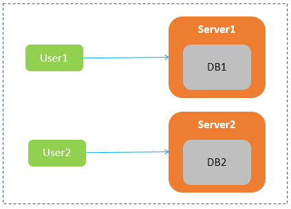

    对这个系统来说.分别满足C A P指的是
    在满足一致性C的情况下,Server1和Server2中的数据库始终保持一致,即DB1和DB2内容要始终保持相同
    在满足可用性A的情况下,用户无论访问Server1还是Server2,都会得到即时响应;
    在满足分区容错性P的情况下,Server1和Server2之间即使出现网路故障也不会影响Server1和Server2分别处理用户的请求

    在实际场景中,网络环境不可能100%不出故障,比如网络拥塞 网卡故障等,会导致网络故障或不通,从而导致节点之间无法通信,
    或者集群中节点被划分为多个分区,分区中节点之间可通信,分区间不可通信,这种由网络故障导致的集群分区情况,被称为"网络分区"

    在分布式系统中,网络分区不可避免,因此分区容错性P必须满足.
    在满足分区容错性P的情况下,一致性C和可用性A是否可以同时满足
    User2向Server2发送读取数据a的请求时,Server2无法给用户返回最新数据,那么该如何处理呢?
    第一种处理方式,保证一致性C,牺牲可用性A:Server2选择让User2的请求阻塞,一直等到网络恢复正常,Server1被修改的数据同步更新
    到Server2之后,即DB2中数据a修改成最新值2后,再给用户User2响应;
    第二种处理方式是,保证可用性A,牺牲一致性C:Server2选择将旧的数据a=1返回给用户,等到网络恢复,再进行数据同步
    除了以上这两种方案,没有其他方案可以选择,可以看出:在满足分区容错性P的前提下,一致性C和可用性A只能选择一个,无法同时满足;

c.CAP的选择策略和应用,在无法同时满足CAP这三个特性,那该如何进行取舍呢?

    其实,C A P,没有谁优谁劣,只是不同的分布式场景适合不同的策略,接下来,针对一些场景为例,分别于你介绍CA弃P 保CP弃A
    保AP弃C这三种策略,分析面对不同的分布式场景时,知道如何权衡这三个特征.
    
    保 CA 弃 P
    在分布式系统中,现在的网络基础设施无法做到始终保持稳定,网络分区难易避免,牺牲分区容错性,就相当于放弃使用分布式系统.因此
    在分布式系统中,这种策略不需要过多讨论.
    
    既然分布式系统不能采用这种策略,那单点系统毫无疑问就需要满足CA特性了,比如关系型数据库部署在单台机器上,因此不存在网络通信问题,所以保证CA就可以了
    
    保 CP 弃 A
    如果一个分布式场景需要很强的数据一致性,或者该场景可以容忍系统长时间无响应的情况下,保CP弃A这个策略就比较合适
    一个保证CP而舍弃A的分布式系统,一旦发生网络分区会导致无法同步情况,就要牺牲系统的可用性,降低用户体验,直到节点数据达到一致后再响应用户.
    这种策略通常用在涉及金钱交易的分布式场景下,因为它任何时候都不允许出现数据不一致的情况,否则就会给用户造成损失.因此这种场景下必须保证CP
    保证CP的系统有很多,典型的有Redis Hbase Zookeeper.
    以zookeeper为例,带你了解它是如何保证CP的
    下面是zookeeper的架构图
    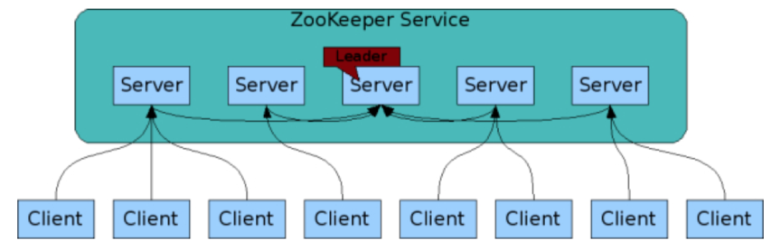
    zookeeper集群包含多个节点(Server),这些节点会通过分布式选举算法选出一个Leader节点.在Zookeeper中选举Leader节点采用的是ZAB算法
    在Zookeeper集群中,Leader节点之外的节点被称为Follower节点,Leader节点会专门负责处理用户的写请求:
    当用户想节点发送写请求的时候,如果请求的节点刚好是Leader,那就直接处理该请求;
    如果请求的是follower节点,那该节点会将请求转给Leader,然后Leader会先向所有的Follower发出一个Proposal,等超过一半的节点同意后,
    Leader才会提交这次写操作,从而保证了数据的一致性.
    当出现网络分区时,如果其中一个分区的节点数大于集群总节点数的一半,那么这个分区可以再选出一个Leader,仍然对用户提供服务,但在选出Leader
    之前,不能正常为用户提供服务;如果形成的分区中,没有一分区的节点数大于集群总节点数的一半,那么系统不能正常为用户提供服务,必须待网络恢复后,  
    才能正常提供服务.
    这种设计方式保证了分区容错性,但是牺牲了一定的系统可用性;
    
    保AP弃C
    如果一个分布式场景需要很高的可用性,或者说在网络状况不太好的情况下,该场景允许数据暂时不一致,那这种情况下就可以牺牲一定的一致性了.
    网络分区出现后,各个节点之间数据无法马上同步,为了保证高可用,分布式系统需要即刻响应用户的请求.但是此时可能某些节点还没有拿到最新数据,只能将本地旧的数据  
    返回给用户,从而导致数据不一致的情况.
    适合保证AP放弃C的场景有很多.比如,很多查询网站 电商系统中的商品查询等,用户体验非常重要,所以大多会保证系统的可用性,而牺牲一定的数据一致性;

d.三种策略的对比

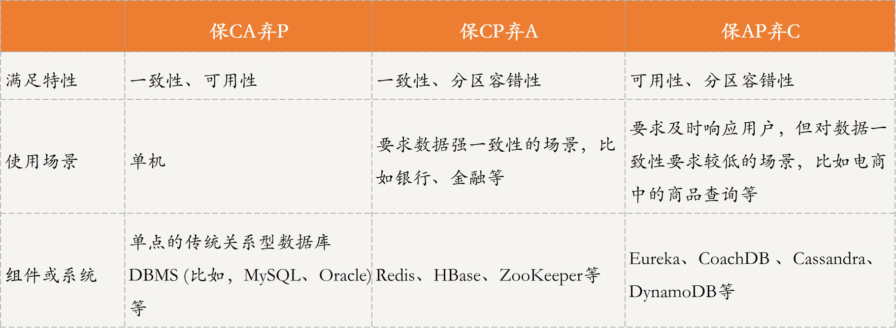

CAP和ACID的"C" "A"是一样的吗?

    首先看C:
    CAP中的C强调的是数据一致性,也就是集群中节点之间通过复制技术保证每个节点上数据在同一时刻是相同的;
    ACID中的C强调的是事务执行前后,数据的完整性保持一致或满足完整性约束.也就是不管在什么时候,不管并发事务有多少,事务在分布式系统中的状态始终保持一致;
    再来看A:
    CAP中的A指的是可用性Availablity,也就是系统提供的服务一直处于可用状态,即对于用户的请求可即时响应.
    ACID中的A指的是原子性Atomicity,强调的是事务要么执行成功,要么执行失败
    因此,CAP和ACID的C和A是不一样的,不能混为一谈.
    redis简单主从模式侧重于CP的,即对于一致性要求较高.redis-cluster,则属于AP类型,更加强调可用性

BASE理论

10.如何理解幂等?项目中接口的幂等是如何做的?
幂等是指多次执行,影响相同.
> 比如大多数Post操作,重复提交订单等,最终只会有一个订单生成成功.
> 还有一种情况是消息,由于大多数MQ只保证at least once,所以消息有时会重复
> 对于Post请求,一般在请求成功后,强制跳转到其他页面,避免刷新提交.
> 复杂的操作一般使用流水号来实现
> 某些不带流水号的消息,处理的时候,就要进行多次校验,甚至引入消息状态表,来保证幂等

11.算法题:两个有序的list,求交集

-------------------------------------------------

1.解释下乐观锁和悲观锁

    悲观锁总是假设情况最坏,每次操作数据都认为别人会来修改,就加锁来保证安全.后面的访问者只能等待.
    数据库中的行锁 表锁,java中的同步关键字等,都属于悲观锁
    乐观锁正好相反,总是假设最好的情况,不用对数据加锁,但是多了一次额外的判断.比如并发包中大量的CAS操作 判断新旧版本号机制等
    ***悲观锁是老婆,由你独占;乐观锁是炮友,按预约规划***
2.jvm判断对象是否回收?

    一般一个对象不再被引用,就代表该对象可以被回收?目前根据可达性分析算法判断该对象是否可以被回收.
    可达性分析算法:GCRoots是该算法的基础,GCRoots是所有对象的根对象,在jvm加载时,会创建一些普通对象引用正常对象.
    这些对象作为正常对象的起始点,在垃圾回收时,会从这些GCRoots开始向下搜索,当一个对象到GCRoots没有任何引用链相连时,
    就证明此对象是不可用的.
    GCRoots有哪些?
    a.虚拟机栈中引用的对象
    b.本地方法栈中jni引用的对象
    c.方法区中的静态变量和常量引用的对象
    d.活跃线程引用的对象

3.反射能获得类里面方法的名称吗?参数名称呢?参数类型呢?

    都可以.jdk8以后通过Parameter类获取参数名称.但有前提,需要加编译开关
    javac -parameters
    默认是关闭的

4.动态代理的实现方式?cglib和jdk的代理有什么区别?

    1.通过实现InvocationHandler接口创建自己的调用处理器
    2.通过为Proxy类指定ClassLoader对象和一组interface以及自己的调用处理器,来创建动态代理类
    3.通过反射机制获得动态代理类的构造函数,其唯一参数类型是调用处理器接口类型
    4.通过构造函数创建动态代理类实例,构造时调用处理器对象作为参数传入
    
    **jdkProxy的优势**:
        最小化依赖关系,减少依赖意味着简化开发和维护,jdk本身的支持,可能比cglib更加可靠
        平滑进行jdk版本升级,而字节码类库通常需要进行更新以保证在新版java上能够使用
        代码实现更简单
    **CGLib的优势**:  
        有的时候调用目标不便实现额外接口,从某种角度看,限定调用者实现接口是有些侵入性的实践,类似cglib动态代理就没有这种限制  
        只操作我们关心的类,而不必为其他相关类增加工作量  
        高性能  
    **总结**:
        静态代理:事先写好代理类,可以手工编写,也可以用工具生成.缺点是每个业务类都要对应一个代理类,非常不灵活  
        动态代理:运行时自动生成代理对象.缺点是生成代理对象和调用代理方法都要额外花费时间  
            jdk动态代理:基于java反射机制实现,必须要实现了接口的业务类才能用这种办法生成代理对象,新版本也开始结合ASM机制  
            cglib动态代理:基于ASM机制实现,通过生成业务类的子类作为代理类  
            ASM机制:ASM是被设计用于运行时的，离线的类生成和转换，作用于已编译好的Java class，并且被设计的尽可能的小巧快速，  
            其目的是生成、转换和分析以字节数组表示的已编译 Java 类(它们在磁盘中的存储 和在 Java 虚拟机中的加载都采用这种字节数组形式)。  
            为此，ASM 提供了一些工具，使用高于字节级别的概念来读写和转换这种字节数组，这些概念包括数值常数、字符串、Java 标识符、Java  
            类型、Java 类结构元素，等等。注意，ASM 库的范围严格限制于类的读、写、转换和分析。具体来说，类的加载过程就超出了它的范围之外

5.分布式锁有哪些主流实现方式?Redis和zk锁有什么区别?

    大体分为两类
    乐观锁:
        基于版本号机制和CAS实现,与存放版本号的存储无关
    悲观锁:  
        1.基于数据库记录,进入时写数据,退出时删除记录  
        2.数据库行锁,它是一把排他锁  
        3.基于Redis的setNx函数  
        4.基于zookeeper  
        区别:redis获取锁是轮询机制.锁释放后会有多个调用者争抢,某些任务可能会饿死  
        zk是监听机制,有变动会接到通知.除了非公平锁,也可以实现公平锁

6.ThreadLocal作用是什么?说下用法

    ThreadLocal用来隔离数据
    ThreadLocal中存放的是与线程相关的数据,底层实际上是一个map,通过线程可以获取存储数据的相关信息
    一些需要绑定到线程的数据,比如一些线程的统计数据,就可以放在这里

    (java并发编程实战)ThreadLocal的实现里面有一个Map,叫做ThreadLocalMap,不过持有ThreadLocalMap的不是ThreadLocal,
    而是Thread. Thread这个类内部有一个私有属性threadLocals,其类型就是ThreadLocalMap,ThreadLocalMap的key就是是ThreadLocal.
    为何这样设计?
    一是ThreadLocal仅仅是一个代理工具类,内部并不持有任何与线程相关的数据,所有和线程相关的数据都存储在Thread里面,这样的设计更容易理解.
    并且从数据的亲缘性上来讲,ThreadLocalMap属于Thread也更加合理
    二是不容易产生内存泄漏,Thread持有ThreadLocalMap,ThreadLocalMap里对ThreadLocal的引用还是弱引用(WeakReference),
    所以只要Thread对象可以被回收,那么ThreadLocalMap就能被回收
    
    ThreadLocal与内存泄漏
    在线程池中使用ThreadLocal为什么可能导致内存泄漏?
    原因就出在线程池中线程的存活时间太长,往往都是和程序同生共死的,这就意味着Thread持有的ThreadLocalMap一直都不会被回收,
    再加上ThreadLocalMap中的Entry对ThreadLocal是弱引用,所以只要ThreadLocal结束了自己的生命周期是可以被回收掉的,但是Entry中的value
    却是被Entry强引用的,所以即便value的生命周期结束了,value也是无法被回收的,从而导致内存泄漏
    那在线程池中,该如何正确使用ThreadLocal呢?其实很简单,既然jvm不能做到自动释放对value的强引用,那我们手动释放就可以了.如何能做到手动释放呢?
    try{} finally{}方案,手动释放资源利器
    
    ThreadLocal的优化方式FastThreadLocal
    FastThreadLocal使用了单纯的数组来替代ThreadLocal的hash表操作,索引在高并发的情况下,FastThreadLocal更快
    set操作:FastThreadLocal直接根据index进行数组set,而 ThreadLocal 需要先根据ThreadLocal的hashcode计算数组下标,然后
    再根据线性探测法进行set操作,期间如果发生hash冲突且有无效的Entry时,还要进行entry的清理和整理操作.最后不管是否冲突,都要进行
    一次log级别的Entry回收操作,所以慢了
    get操作:ftl直接根据index进行获取,而tl需要先根据tl的hashcode计算数组下标,然后再根据线性探测法进行get操作,如果不能根据直接索引索引获取
    到value的话,并且在向后循环遍历的过程中发现了无效的Entry,则会进行无效的Entry的清理和整理工作.
    remove操作:ftl直接根据index从数组中删除当前的ftl的value,然后从Set集合中删除当前的ftl,之后还可以进行删除回调操作(功能增强);
    而tl需要先根据tl的hashCode计算数组下标,然后再根据线性探测法进行remove操作,最后还需要进行无效的Entry的整理和清理工作;


```java
    public class Demo{
        ExecutorService es;
        ThreadLocal tl;
        Object obj;
        es.execute(()->{
            // ThreadLocal增加变量
            tl.set(obj);
            try{
                
            }finally{
                tl.remove();
            }
        });
    }    
```


7.设计秒杀系统要考虑哪些点? 数据预热,CDN缓存,超卖问题,流量削峰
a.秒杀系统架构设计都有哪些关键点?

        如何才能更好的理解秒杀系统呢?我觉得作为一个程序员,首先需要从高纬度出发,从整体上个思考问题.
    在我看来,秒杀其实主要解决两个问题,一个是并发读,一个是并发写.并发读的核心优化理念是尽量减少用户到服务端来"读"数据,
    或者让他们读更少的数据;并发写的处理原则也一样,她要求我们在数据层面独立出来一个库,做特殊的处理.另外,我们还要
    针对秒杀系统做一些保护,针对意料之外的情况设计兜底方案,防止最坏的情况发生.
        而从一个架构师的角度来看,要想打造并维护一个超大流量并发读写 高性能 高可用的系统,在整个用户请求路径上从浏览器
    到服务端我们要遵循几个原则,就是要保证用户请求的数据尽量少 请求数尽量少 路径尽量短 依赖尽量少,并且不要有单点.
        其实,秒杀的整体架构可以概括为"稳" "准" "快"几个关键字.
        所谓"稳",就是整个系统架构要满足高可用,流量符合预期时肯定要稳定,就是超出预期时也同样不能掉链子,你要保证秒杀活动顺利
    完成,即秒杀商品顺利的卖出去,这个是最基本的前提.
        然后就是"准",就是秒杀10台iPhone,那就只能成交10台,多一台少一台都不行,一旦库存不对,那平台就要承担损失,所以"准"
    就是要求保证数据的一致性.
        最后再看"快",就是系统的性能要足够高,否则怎么支撑这么大的流量?不光是服务端要做极致的性能优化,而且在整个请求链路上都要
    做协同的优化,每个地方快一点,整个系统就完美了.
        所以从技术角度上看"稳" "准" "快",就对应了我们架构上的高可用 一致性和高性能的要求.
        高性能:秒杀涉及大量的并发读和并发写,因此支持高并发访问这点非常关键.将从设计数据的动静分离 热点的发现与隔离 请求的削峰与分层过滤
    服务端的极致优化这4个方面重点分析
        一致性:秒杀中商品减库存的实现方式同样关键.可想而知,有限数量的商品在同一时刻被很多倍的请求同时来减库存,减库存又分为"拍下减库存"
    "付款减库存"以及预扣等几种,在大并发更新的过程中都要保证数据的准确性,其难度可想而知.
        高可用:现实中总难免出现一些我们考虑不到的情况,所以要保证系统的高可用和正确性,我们还需要设计一个PlanB;来兜底,以便在最坏情况发生
    时仍然能够从容应对                       
b.设计秒杀系统时应该注意的5个架构原则

        秒杀系统本质上就是一个满足大并发 高性能和高可用的分布式系统.现在我们就来聊聊,如何在满足一个良好架构的分布式系统基础上,针对秒杀这种业务
    做到极致的性能改进
        架构原则4要1不要
    1.数据要尽量少
        所谓数据要尽量少,首先是指用户请求的数据能少就少.请求的数据包括上传给系统的数据和系统返回给用户的数据(通常就是网页);
    为啥“数据要尽量少”呢？因为首先这些数据在网络上传输需要时间，其次不管是请求数据还是返回数据都需要服务器做处理，而服务器在写网络时通常都要做压缩和字符编码，
    这些都非常消耗 CPU，所以减少传输的数据量可以显著减少 CPU 的使用。例如，我们可以简化秒杀页面的大小，去掉不必要的页面装修效果
         其次，“数据要尽量少”还要求系统依赖的数据能少就少，包括系统完成某些业务逻辑需要读取和保存的数据，这些数据一般是和后台服务以及数据库打交道的。
     调用其他服务会涉及数据的序列化和反序列化，而这也是 CPU 的一大杀手，同样也会增加延时。而且，数据库本身也容易成为一个瓶颈，所以和数据库打交道越少越好，数据越简单、越小则越好。
    2.请求数要尽量少
         用户请求的页面返回后，浏览器渲染这个页面还要包含其他的额外请求，比如说，这个页面依赖的 CSS/JavaScript、图片，以及 Ajax 请求等等都定义为“额外请求”，
    这些额外请求应该尽量少。因为浏览器每发出一个请求都多少会有一些消耗，例如建立连接要做三次握手，有的时候有页面依赖或者连接数限制，一些请求（例如 JavaScript）
    还需要串行加载等。另外，如果不同请求的域名不一样的话，还涉及这些域名的 DNS 解析，可能会耗时更久。所以你要记住的是，减少请求数可以显著减少以上这些因素导致的资源消耗。 
    例如，减少请求数最常用的一个实践就是合并 CSS 和 JavaScript 文件，把多个 JavaScript 文件合并成一个文件，
    在 URL 中用逗号隔开（https://g.xxx.com/tm/xx-b/4.0.94/mods/??module-preview/index.xtpl.js,module-jhs/index.xtpl.js,module-focus/index.xtpl.js）。
    这种方式在服务端仍然是单个文件各自存放，只是服务端会有一个组件解析这个 URL，然后动态把这些文件合并起来一起返回。
    3.路径要尽量短
    所谓“路径”，就是用户发出请求到返回数据这个过程中，需求经过的中间的节点数。通常，这些节点可以表示为一个系统或者一个新的 Socket 连接
    （比如代理服务器只是创建一个新的 Socket 连接来转发请求）。每经过一个节点，一般都会产生一个新的 Socket 连接。然而，每增加一个连接
    都会增加新的不确定性。从概率统计上来说，假如一次请求经过 5 个节点，每个节点的可用性是 99.9% 的话，那么整个请求的可用性是：99.9% 的 5 次方，
    约等于 99.5%。所以缩短请求路径不仅可以增加可用性，同样可以有效提升性能（减少中间节点可以减少数据的序列化与反序列化），
    并减少延时（可以减少网络传输耗时）。要缩短访问路径有一种办法，就是多个相互强依赖的应用合并部署在一起，把远程过程调用（RPC）变成 JVM 内部之间的方法调用
    4.依赖要尽量少
    所谓依赖，指的是要完成一次用户请求必须依赖的系统或者服务，这里的依赖指的是强依赖。举个例子，比如说你要展示秒杀页面，而这个页面必须强依赖商品信息、用户信息，
    还有其他如优惠券、成交列表等这些对秒杀不是非要不可的信息（弱依赖），这些弱依赖在紧急情况下就可以去掉。要减少依赖，我们可以给系统进行分级，比如 0 级系统、
    1 级系统、2 级系统、3 级系统，0 级系统如果是最重要的系统，那么 0 级系统强依赖的系统也同样是最重要的系统，以此类推。注意，0 级系统要尽量减少对 1 级系统的强依赖，
    防止重要的系统被不重要的系统拖垮。例如支付系统是 0 级系统，而优惠券是 1 级系统的话，在极端情况下可以把优惠券给降级，防止支付系统被优惠券这个 1 级系统给拖垮。
    5.不要有单点
    系统中的单点可以说是系统架构上的一个大忌，因为单点意味着没有备份，风险不可控，我们设计分布式系统最重要的原则就是“消除单点”。那如何避免单点呢？我认为关键点是
    避免将服务的状态和机器绑定，即把服务无状态化，这样服务就可以在机器中随意移动。如何那把服务的状态和机器解耦呢？这里也有很多实现方式。
    例如把和机器相关的配置动态化，这些参数可以通过配置中心来动态推送，在服务启动时动态拉取下来，我们在这些配置中心设置一些规则来方便地改变这些映射关系。应用无状态化
    是有效避免单点的一种方式，但是像存储服务本身很难无状态化，因为数据要存储在磁盘上，本身就要和机器绑定，那么这种场景一般要通过冗余多个备份的方式来解决单点问题。
    架构是一种平衡的艺术,而最好的架构一旦脱离了它所适应的场景,一切都是空谈.
不同场景下的不同架构实例

    秒杀架构演进
    架构1.如果你想快速搭建一个简单的秒杀系统，只需要把你的商品购买页面增加一个“定时上架”功能，仅在秒杀开始时才让用户看到购买按钮，当商品的库存卖完了也就结束了
    架构2.随着请求量的加大(比如从1w/s到了10w/s),这个简单的架构很快就遇到了瓶颈,因此需要做架构改造来提升系统性能.这些架构改造包括:
        1.把秒杀系统独立出来单独打造一个系统，这样可以有针对性地做优化，例如这个独立出来的系统就减少了店铺装修的功能，减少了页面的复杂度；
        2.在系统部署上也独立做一个机器集群，这样秒杀的大流量就不会影响到正常的商品购买集群的机器负载；
        3.将热点数据（如库存数据）单独放到一个缓存系统中，以提高“读性能”；
        4.增加秒杀答题，防止有秒杀器抢单
    架构3.然而这个架构仍然支持不了超过 100w/s 的请求量，所以为了进一步提升秒杀系统的性能，我们又对架构做进一步升级
        1.对页面进行彻底的动静分离，使得用户秒杀时不需要刷新整个页面，而只需要点击抢宝按钮，借此把页面刷新的数据降到最少
        2.在服务端对秒杀商品进行本地缓存，不需要再调用依赖系统的后台服务获取数据，甚至不需要去公共的缓存集群中查询数据，这样不仅可以减少系统调用，而且能够避免压垮公共缓存集群
        3.增加系统限流保护，防止最坏情况发生            
架构2示意图
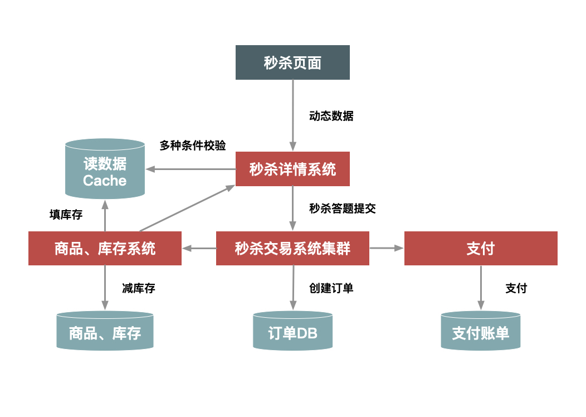
架构3示意图
经过这些优化，系统架构变成了下图中的样子。在这里，我们对页面进行了进一步的静态化，秒杀过程中不需要刷新整个页面，而只需要向服务端请求很少的动态数据。而且，最关键的详情和交易系统都增加了本地缓存，来提前缓存秒杀商品的信息，热点数据库也做了独立部署，等等
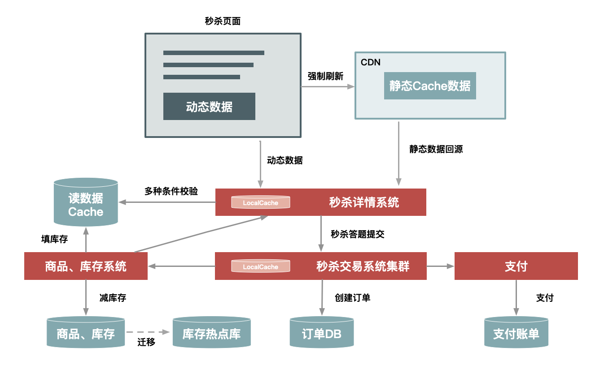


8.从性能角度上如何保证秒杀系统稳定?预热,削峰.减少数据库的访问,缓存

9.A B系统转账如何保证分布式数据一致性?

10.你有什么想问的?

---------------------------------------------------------

1.简单介绍下自己的近况

2.对kafka了解吗?RocketMq事务性消息怎么实现的?

    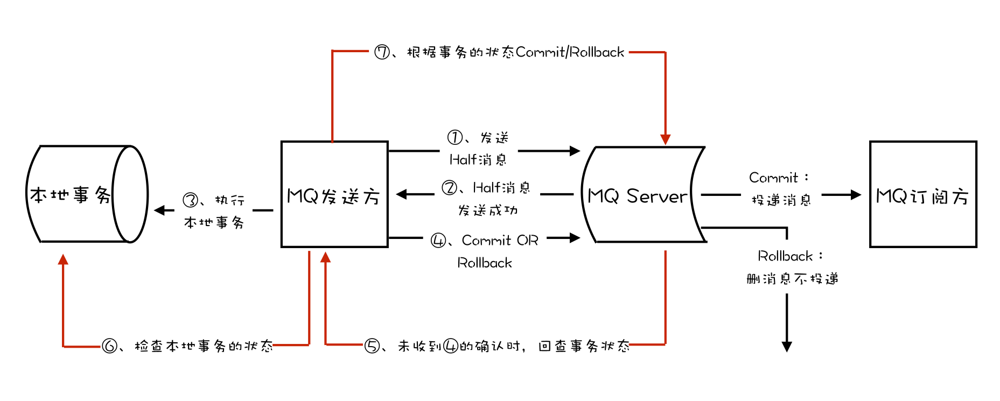
    消息队列中的"事务",主要解决的是消息生产者和消息消费者的数据一致性问题
    1.发送Half消息
    2.Half消息发送成功
    3.执行本地事务
    4.提交或回滚事务
    5.网络异常，Broker没有收到commit or rollback，回查本地事务状态
    6.检查本地事务状态
    7.根据本地事务状态执行commit or rollback
    8.根据 4 或 7 投递消息到MQ订阅方，或者取消不投递

3.假设事务提交的消息丢了,没有发到broker上面,会怎么处理?

    我们可以消息队列的有序性来验证是否有消息丢失.原理非常简单,在Producer端,我们给每个发出的消息附加一个连续递增的序号,  
    然后在Consumer端来检查这个序号的连续性.
    一条消息从生产到消费完成这个过程,可以划分为三个阶段
    在生产阶段:你需要捕获消息发送的错误,并重发消息
    [
        在生產阶段,消息队列通过最常用的请求确认机制,来保证消息的可靠传递:当你的代码调用发送消息方法时,消息队列的客户端
        会把消息发送Broker,Broker收到消息后,会给客户端返回一个确认响应,表明消息已经收到了.客户端收到响应后,完成了一次
        正常消息的发送.
        只要Producer收到了Broker的确认响应,就可以保证消息在生产阶段不会丢失.有些消息队列在长时间没收到发送确认响应后,
        会自动重试,如果重试再失败,就会议返回值或者抛出异常的方式告知用户
        你在编写发送消息代码时,需要注意,正确处理返回值或者捕获异常,就可以保证这个阶段的消息不会丢失.
        以kafka为例,看下如何可靠的发送消息

        try {
            RecordMetadata metadata = producer.send(record).get();
            System.out.println("消息发送成功。");
        } catch (Throwable e) {
            System.out.println("消息发送失败！");
            System.out.println(e);
        }
    
        异步发送时,则需要在回调方法里进行检查    
        producer.send(record, (metadata, exception) -> {
            if (metadata != null) {
                System.out.println("消息发送成功。");
            } else {
                System.out.println("消息发送失败！");
                System.out.println(exception);
            }
        });    
    ]

    在存储阶段:你可以通过配置刷盘和复制相关的参数,让消息写入到多个副本的磁盘上,来确保消息不会因为某个broker宕机,或者磁盘
    损坏而丢失.
    [
        在存储阶段正常情况下,只要broker在正常运行,就不会出现消息丢失的问题,但是如果Broker出现了故障,比如进程死掉了或者服务器
    宕机,还是可能会丢失消息的
    如果对消息的可靠性要求非常高,可以通过配置Broker参数来避免因为宕机丢失消息
       对于单个节点的Broker,需要配置Broker参数,在收到消息后,将消息写入磁盘后再给Producer返回确认机制,这样即使发生宕机,由于
    消息已经被写入磁盘,就不会丢失消息,恢复后还可以继续消费.在RocketMQ中,需要将双排方式FlushDiskType配置为SYNC_Flush同步刷盘
       如果是Broker是由多个节点组成的集群,需要将Broker集群配置成:至少将消息发送到2个以上的节点,再给客户端恢复发送确认响应.
    这样当某个Broker宕机时,其他的Broker可以替代宕机的Broker,也不会发生消息丢失            
    ]
      
    在消费阶段:你需要在处理完全部消费业务逻辑之后,再发送消费确认
    [
        消费阶段采用和生产阶段类似的确认机制来保证消息的可靠性,客户端从Broker拉取消息后,执行用户的消费业务逻辑,成功后,才会给Broker发送消费确认响应.
        如果Broker没有收到消费确认响应,下次拉消息的时候还会返回同一条消息,确保消息不会在网络传输过程中丢失,也不会因为客户端在执行消费逻辑中出错导致丢失.
        注意:不要在收到消息后就立即发送消费确认,而是应该在执行完成所有消费业务逻辑之后,再发送消费确认    
    ]

4.分布式事务一致性如何保证
分布式事务解决方案

       在单个数据库的情况下,数据事务操作具有ACID四个特性,但是如果在一个事务中操作多个数据库,则无法使用数据库事务
    来保证一致性.也就是说,当两个数据库操作数据时,可能存在一个数据库操作成功,而另一个数据库操作失败的情况,我们无法通过  
    单个数据库事务来回滚两个数据操作.  
       而分布式事务就是为了解决在同一个事务下,不同节点的数据库操作数据不一致的问题.在一个事务操作请求多个服务或者多个数据库  
    节点时,要么所有请求成功,要么所有请求都失败回滚回去.  
       通常分布式事务的实现有多种方式,例如XA协议实现的二阶段提交2PC 三阶段提交3PC,以及TCC补偿性事务
    什么是XA协议?XA协议是由X/Open组织提出的一个分布式事务处理规范,目前MySql中只有InnoDB存储引擎支持XA协议
a.XA规范

    在XA规范之前,存在一个DTP模型,该模型规范了分布式事务的模型设计.
    DTP规范中主要包含了AP RM TM三个部分,其中AP是应用程序,是事务发起和结束的地方;RM是资源管理器,主要负责管理每个数据库的
    连接数据源;TM是事务管理器,负责事务的全局管理,包括事务的生命周期管理和资源的分配协调等 
    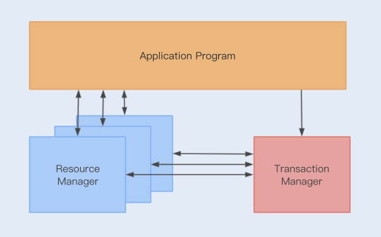
    XA则规范了TM与RM之间的通信接口,在TM与多个RM之间形成一个双向通信桥梁,从而在多个数据库资源下保证ACID特性;
    (JTA是基于XA规范实现的一套java事务编程接口,是一种2pc事务)
    
b.二阶段提交和三阶段提交

        XA规范实现的分布式事务属于二阶提交事务,就是通过两个阶段来实现事务的提交.
    在第一阶段,应用程序向事务管理器(TM)发起事务请求,而事务管理器则会分别向参与的各个资源管理器(RM)发送事务预处理请求(prepare)
        ,此时这些资源管理器会打开本地数据库事务,然后开始执行数据库事务,但是执行完成后并不会立即提交事务,而是向事务管理器返回就绪(Ready)  
    或者未就绪(Not Ready)状态,如果各个参与节点都返回状态,就会进入第二阶段
    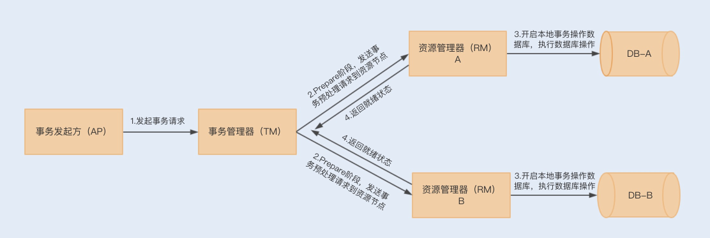
        到了第二阶段,如果资源管理器返回的都是就绪状态,事务管理器则会向各个资源管理器发送提交(Commit)通知,资源管理器则会完成本地数据库的
    事务提交,最终返回提交结果给事务管理器
     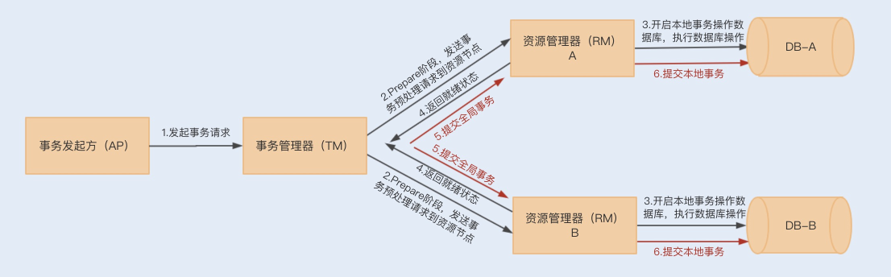  
         在第二阶段中,如果任意资源管理器返回了未就绪状态,此时事务管理器会向所有资源管理器发送事务回滚(Rollback)通知,此时各个资源管理器就会
    回滚本地数据事务,释放资源,并返回结果通知;  
    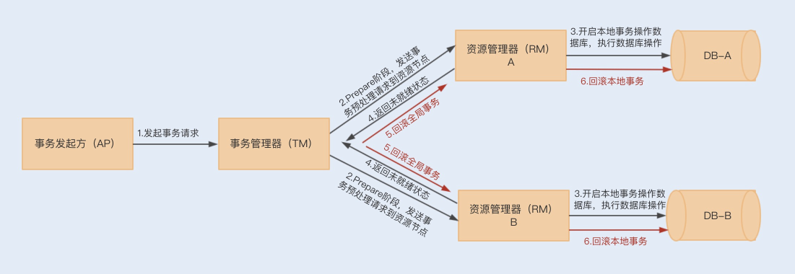

    **2PC事务存在的缺陷**
        第一,在整个流程中,我们会发现各个资源管理器节点存在阻塞,只有当所有的节点都准备完成之后,事务管理器才会发出进行全局事务提交的通知,
    这个过程如果很长,则会有很多节点长时间占用资源,从而影响整个节点的性能.
        (一旦资源管理器挂了,就会出现一致阻塞等待的情况,类似问题,我们可以通过设置事务超时时间来解决)
        第二,仍然存在数据不一致的可能性,例如,在最后通知提交全局事务时,由于网络故障,部分节点有可能收不到通知,由于这部分节点没有提交事务,就
    会导致数据不一致的情况出现.  
        而3PC事务的出现就是为了减少此类问题的发生.
        3PC把2PC的准备阶段分为了准备阶段和预处理阶段,在第一阶段只是询问各个资源节点是否可以执行事务,而在第二阶段,所有的节点反馈可以执行事务,
    才开始执行事务操作,最后在第三阶段执行提交或回滚操作.并且在事务管理器和资源管理器中都引入超时机制,如果在第三阶段,资源节点一直无法收到  
    来自资源管理器的提交或回滚请求,它就会在超时之后,继续提交事务
        所以3PC可以通过超时机制,避免管理器挂掉所造成的长时间阻塞问题,但是其实这样还是无法解决在最后提交全局事务时,由于网络故障无法通知
    到一些节点的问题,特别是回滚通知,这样会导致事务等待超时从而默认提交.

c.事务补偿机制(TCC)  

        以上这种基于XA规范实现的事务提交,由于阻塞等性能问题,有着比较明显的低性能 低吞吐的特性.所以在抢购活动中使用该事务,
    很难满足系统的并发性能.  
        除了性能问题,JTA只能解决同一服务下操作多数据源的分布式事务问题,换到微服务架构下,可能存在同一个事务操作,分别在不同服务上连接  
    数据源,提交数据库操作.
        而TCC正是为了解决以上问题而出现的一种分布式事务解决方案.TCC采用最终一致性方式实现了一种柔性分布式事务,与XA规范实现的二阶事务不同的是,TCC
    的实现是基于服务层实现的一种二阶事务提交

d.TCC分为三个阶段,即Try Confirm Cancel三个阶段
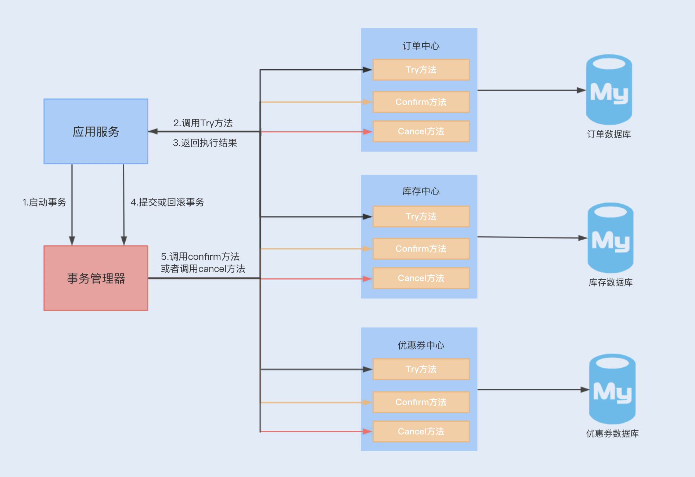

    Try阶段:主要尝试执行业务,执行各个服务中的Try方法,主要包括预留操作
    Confirm阶段:确认Try中的各个方法执行成功,然后通过TM调用各个服务的Confirm方法,这个阶段是提交阶段
    Cancel阶段:当在Try阶段发现其中一个Try方法失败,例如预留资源失败 代码异常等,则会触发TM调用各个服务的Cancel方法,对全局事务进行回滚,取消执行业务.
    
    以上执行只是保证Try阶段执行时成功或失败的提交和回滚操作,你肯定会想到,如果在Confirm和Cancel阶段出现异常情况,那TCC该如何处理呢?
    此时TCC会不停的重试调用失败的Confirm或Cancel方法,直到成功为止.

e.TCC的缺点

    但是TCC补偿性事务也有比较明显的缺点,那就是对业务的侵入性非常大
    首先,我们需要在业务设计的时候考虑预留资源.
    然后,我们要编写大量业务线代码,例如Try Confirm Cancel方法
    最后,我们还需要为每个方法考虑幂等性.
    这种事务的实现和维护成本非常高,但综合来看,这种实现是目前大家最常用的分布式事务解决方案.

5.2pc 3pc tcc

6.TCC对异常流式如何操作的?

7.为什么要看源码?

    a.通过学习开源框架 开源项目的源码,我们可以学习到多种场景 多种技术的解决方案,快速增加经验
    b.在使用某个框架或工具进行开发时,如果你对其源码有所了解,可以最大化的减少出故障的可能
    c.有利于你研究一个新系统的代码逻辑,快速接手一个新系统
    d.最大的好处是可以开阔思维,提升架构设计能力,通过看源码,看别人如何设计,然后思考为何这样设计才能领悟到

问题扩展:如何阅读源码

    Google查找这个开源框架的官方介绍，了解以下信息
    框架有几个模块
    模块的作用
    模块之间的联系
    每个模块的核心类（在阅读源码的过程中，着重看核心类）
    对哪个模块感兴趣就去写个小demo，先了解一下这个模块的具体作用。
    debug进入看具体实现。（这里面可以充分使用IDEA的调试功能）
    第一遍是走马观花，简略看一下调用逻辑，都用了哪些类；
    第二遍需有重点地debug，看看这些类担任了架构图里的哪些功能，使用了哪些设计模式。
    第三遍debug，把主要类的调用时序图以及类图结构画出来，对着时序图分析调用流程   
8.最终一致性如何实现的?

9.有没有遇到过死锁?
    没有
10.A往B转钱,B往A转钱,同时转会死锁吗?如何解决死锁?
账户转账代码
```java
class Account{
    private int balance;
    // 转账
    void transfer(Account target,int amt){
        // 锁定转出账户
        synchronized(this){ //  ①
            // 锁定转入账户
            synchronized (target){ // ② 
                if (this.balance>amt){
                    this.balance-=amt;
                    target.balance+=amt;
                }
            }
        }
    }
}
```
上面转账的代码是怎么发生死锁的呢?

    1.我们假设线程T1执行账户A转账户B的操作,账户A.transfer(账户B);同时线程T2执行账户B转账户A的操作,账户B.transfer(账户A);
    2.当T1和T2同时执行完①处的代码时,T1获得了账户A的锁(对于T1,this是账户A),而T2获得了账户B的锁(对于T2,this是账户B).
    3.当T1和T2在执行②处的代码时,T1视图获取账户B的锁时,发现账户B已经被锁定(被T2锁定),所以T1开始等待;T2则视图获取账户A的锁时候,
    发现账户已经被锁定(被T1锁定),所以T2也开始等待.
    4.于是T1和T2会无限期的等待下去,也就是我们所说的死锁了
如何预防死锁?

    并发程序一旦发生死锁,一般没有特别好的方法,很多时候我们只能重启应用.因此,解决死锁问题最好的办法还是规避死锁.  
    那如何避免死锁呢?要避免死锁就需要分析死锁发生的条件,有个叫Coffman的牛人总结过了,只有一下四个条件都发生时才会出现死锁:
        1.互斥,共享资源X和Y只能被一个线程占用
        2.占有且等待,线程T1已经取得共享资源X,在等待共享资源Y的时候,不释放共享资源X
        3.不可抢占,其他线程不能强行抢占线程T1占有的资源
        4.循环等待,线程T1等待线程T2占有的资源,线程T2等待线程T1占有的资源,就是循环等待.
    反过来分析,只要我们破坏其中一个,就可以成功避免死锁的发生.
    其中,互斥这个条件我们没有办法破坏,因为我们用锁为的就是互斥,不过其他三个条件都是有办法破坏掉的,到底该如何做呢?
        1.对于"占有且等待"这个条件,我们可以一次性申请所有的资源,这样就不存在等待了
        2.对于"不可抢占"这个条件,占用部分资源的线程进一步申请其他资源时,如果申请不到,可以主动释放它占有的资源,这样不可抢占这个条件就
            破坏掉了
        3.对于"循环等待"这个条件,可以靠按序申请资源来预防.所谓按序申请,是指资源是有线性顺序的,申请的时候可以先申请资源序号小的,再申请资源序号大的,
        这样线性化后自然就不存在循环了.

代码实现
a.破坏占有且等待
```java

class Allocator {
  private List<Object> als = new ArrayList<>();
  // 一次性申请所有资源
  synchronized boolean apply(Object from, Object to){
    if(als.contains(from) ||als.contains(to)){
      return false;  
    } else {
      als.add(from);
      als.add(to);  
    }
    return true;
  }
  // 归还资源
  synchronized void free(Object from, Object to){
    als.remove(from);
    als.remove(to);
  }
}

class Account {
  // actr应该为单例
  private Allocator actr;
  private int balance;
  // 转账
  void transfer(Account target, int amt){
    // 一次性申请转出账户和转入账户，直到成功
    while(!actr.apply(this, target));
    try{
      // 锁定转出账户
      synchronized(this){              
        // 锁定转入账户
        synchronized(target){           
          if (this.balance > amt){
            this.balance -= amt;
            target.balance += amt;
          }
        }
      }
    } finally {
      actr.free(this, target)
    }
  } 
}
```
b.破坏不可抢占条件

    破坏不可抢占条件看上去很简单，核心是要能够主动释放它占有的资源，这一点 synchronized 是做不到的。
    原因是 synchronized 申请资源的时候，如果申请不到，线程直接进入阻塞状态了，而线程进入阻塞状态，
    啥都干不了，也释放不了线程已经占有的资源。
    java.util.concurrent 这个包下面提供的 Lock 是可以轻松解决这个问题的
c.破坏循环等待条件

    破坏这个条件，需要对资源进行排序，然后按序申请资源。这个实现非常简单，我们假设每个账户都有不同的属性 id，  
    这个 id 可以作为排序字段，申请的时候，我们可以按照从小到大的顺序来申请。比如下面代码中，①~⑥处的代码对转出账户（this）  
    和转入账户（target）排序，然后按照序号从小到大的顺序锁定账户。这样就不存在“循环”等待了
```java
class Account {
  private int id;
  private int balance;
  // 转账
  void transfer(Account target, int amt){
    Account left = this;       // ①
    Account right = target;    // ②
    if (this.id > target.id) { // ③
      left = target;           // ④
      right = this;            // ⑤
    }                          // ⑥
    // 锁定序号小的账户
    synchronized(left){
      // 锁定序号大的账户
      synchronized(right){ 
        if (this.balance > amt){
          this.balance -= amt;
          target.balance += amt;
        }
      }
    }
  } 
}
```
关于死锁的问题拓展:

    除了死锁外,还有两种情况,分别是"活锁"和"饥饿"
    发生死锁后线程会互相等待,而且会一直等待下去,在技术上的表现形式是线程永久的阻塞了.
活锁

       但有时线程虽然没有发生阻塞,但仍然会存在执行不下去的情况,这就是所谓的"活锁".
    可以类比现实世界里的例子，路人甲从左手边出门，路人乙从右手边进门，两人为了不相撞，互相谦让，  
    路人甲让路走右手边，路人乙也让路走左手边，结果是两人又相撞了。这种情况，基本上谦让几次就解决了，  
    因为人会交流啊。可是如果这种情况发生在编程世界了，就有可能会一直没完没了地“谦让”下去，成为没有  
    发生阻塞但依然执行不下去的“活锁”.
        解决"活锁"的方案很简单,谦让时,尝试等待一个随机的时间就可以了.
饥饿

        "饥饿":所谓饥饿指的是线程因为无法访问所需资源而无法执行下去的情况.
    发生饥饿的场景:"不患寡,而患不均",如果线程优先级不均,在cpu繁忙的情况下,优先级低的线程得到执行的机会很小,就可能发生线程饥饿;
    持有锁的线程,如果执行的时间过长,也可能导致饥饿问题.
    
    解决饥饿问题的方案,有三种:
    一是保证资源充足;
    二是公平的分配资源;
    三是避免持有锁的线程长时间执行;
    这三个方案中，方案一和方案三的适用场景比较有限，因为很多场景下，资源的稀缺性是没办法解决的，持有锁的线程执行的时间也很难缩短。
    倒是方案二的适用场景相对来说更多一些。那如何公平地分配资源呢？在并发编程里，主要是使用公平锁。所谓公平锁，是一种先来后到的方案，
    线程的等待是有顺序的，排在等待队列前面的线程会优先获得资源。

11.设计一个全局唯一流水号?

    1.设置数据库sequence或者表自增字段步长
        可以通过设置数据库sequence或者表的自增字段步长来进行水平伸缩.比如说,现在有8个服务节点,每个服务节点使用一个sequence功能来产生
    id,每个sequence的起始id不同,并且依次递增,步长都是8.这种设计方式适合的场景:防止id重复,这种方案实现起来比较简单,也能达到
    性能目标.但是服务节点固定,步长也固定,将来如果还要增加服务节点,就不好搞了.
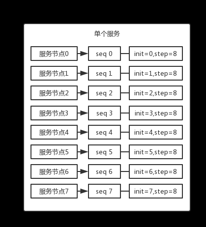

    2.Redis生成id
    当使用数据库来生成id性能不够要求的时候,我们可以尝试使用Redis来生成id,这主要依赖于Redis是单线程的,所以也可以用来生成全局唯一的id.
    可以用Redis的原子操作INCR和INCRBY来实现.
    可以使用Redis集群来获取更高的吞吐量.假如一个集群中有5台Redis.可以初始化每台Redis的值分别是1,2,3,4,5,然后步长都是5.各个Redis生成
    的id为:
            A：1,6,11,16,21
        
            B：2,7,12,17,22
            
            C：3,8,13,18,23
            
            D：4,9,14,19,24
            
            E：5,10,15,20,25
    优点:不依赖与数据库,灵活方便,且性能优于数据库.数字id天然排序,对分页或者需要排序的结果很有帮助,使用Redis集群可以防止单点故障的问题.
    缺点:如果系统中没有Redis,还需要引入新的组件,增加系统复杂度,需要编码和配置的工作量比较大,多环境运维很麻烦.
    
    3.Flicker的解决方案    
    MySQL中id自增的特性，可以借此来生成全局的序列号，Flicker在解决全局ID生成方案里就采用了MySQL自增长ID的机制（auto_increment + replace into + MyISAM）。一个生成64位ID方案具体就是这样的： 先创建单独的数据库，然后创建一个表：
```mysql
    CREATE TABLE borrow_order (
    id bigint(20) unsigned NOT NULL auto_increment,
    stub char(1) NOT NULL default '',
    PRIMARY KEY (id),
    UNIQUE KEY stub (stub)
    ) ENGINE=MyISAM
```
    当我们插入记录后，执行SELECT * from borrow_order ，查询结果就是这样的：
    +-------------------+------+
    | id | stub |
    +-------------------+------+
    | 1 | 192.168.100.102      |
    +-------------------+------+
    在我们的应用端需要做下面这两个操作，在一个事务会话里提交：
    REPLACE INTO borrow_order (stub) VALUES ('192.168.100.102');
    SELECT LAST_INSERT_ID();
    上述操作，通过 replace into 操作，首先尝试插入数据到表中，如果发现表中已经有此行数据则先删除此行数据，然后插入新的数据。 如果没有此行数据的话，直接插入新数据。注意：插入的行字段需要有主键索引或者唯一索引，否则会出错
    通过上述方式，就可以拿到不重复且自增的ID了。 到上面为止，我们只是在单台数据库上生成ID，从高可用角度考虑，接下来就要解决单点故障问题：Flicker启用了两台数据库服务器来生成ID，通过区分auto_increment的起始值和步长来生成奇偶数的ID。
    DBServer1:
    auto-increment-increment = 2
    auto-increment-offset = 1
     
    DBServer2:
    auto-increment-increment = 2
    auto-increment-offset = 2
    最后，在客户端只需要通过轮询方式取ID就可以了。
    优点：充分借助数据库的自增ID机制，提供高可靠性，生成的ID有序。 缺点：占用两个独立的MySQL实例，有些浪费资源，成本较高 数据库中记录过多，每次生成id都需要请求数据库
12.设计幂等方案防止重复提交

    1.利用数据库的唯一约束实现幂等
    2.为更新的数据设置前置条件,通用办法是:给你的数据增加一个版本号属性,每次更新数据前,
    比较当前数据的版本号是否和消息中版本号一致,如果不一致就拒绝更新数据,如果相等就更新数据,同时将版本号+1
    3.记录并检查操作(Token机制):在执行数据更新操作之前,先检查一下是否执行过这个更新操作.
    原理和实现是不是很简单？其实一点儿都不简单，在分布式系统中，这个方法其实是非常难实现的。首先，给每个消息指定一个全局唯一的 ID 就是一件不那么简单的事儿，
    方法有很多，但都不太好同时满足简单、高可用和高性能，或多或少都要有些牺牲。更加麻烦的是，在“检查消费状态，然后更新数据并且设置消费状态”中，三个操作必须作为一组操作保证原子性，
    才能真正实现幂等，否则就会出现 Bug。比如说，对于同一条消息：“全局 ID 为 8，操作为：给 ID 为 666 账户增加 100 元”，有可能出现这样的情况：t0 时刻：Consumer A 收到条消息，
    检查消息执行状态，发现消息未处理过，开始执行“账户增加 100 元”；t1 时刻：Consumer B 收到条消息，检查消息执行状态，发现消息未处理过，因为这个时刻，Consumer A 还未来得及更
    新消息执行状态。这样就会导致账户被错误地增加了两次 100 元，这是一个在分布式系统中非常容易犯的错误，一定要引以为戒。对于这个问题，当然我们可以用事务来实现，也可以用锁来实现，
    但是在分布式系统中，无论是分布式事务还是分布式锁都是比较难解决问题。


13.大数相加

    该思路是:
    1.反转两个字符串，便于从低位到高位相加和最高位的进位导致和的位数增加；
    2.对齐两个字符串，即短字符串的高位用‘0’补齐，便于后面的相加；
    3.从头遍历，把两个正整数的每一位都相加，并加上进位；
    4.最高位有进位则补上进位；
    5.逆序输出；
    
    在这里需要说明一点的是，string 类是没有reverse()方法的，所以，为了便利，在这里我们用了StringBuffer，可以使用它自带的reverse()方法，很方便。
```java
public class Demo2 {
    public static void main(String[] args) {
        Scanner sc = new Scanner(System.in);
        String s1 = sc.nextLine();
        String s2 = sc.nextLine();

        //反转字符串
        String n1 = new StringBuffer(s1).reverse().toString();
        String n2 = new StringBuffer(s2).reverse().toString();
        int l1 = n1.length();
        int l2 = n2.length();
        int maxL = l1 > l2 ? l1 : l2;

        //补齐0
        if (l1 < l2) {
            for (int i = l1; i < l2; i++) {
                n1 += "0";
            }
        } else {
            for (int i = l2; i < l1; i++) {
                n2 += "0";
            }
        }
        StringBuffer res = new StringBuffer();//存放的结果
        int c = 0;//进位

        for (int i = 0; i < maxL; i++) {
            int nSum = Integer.parseInt(n1.charAt(i) + "") + Integer.parseInt(n2.charAt(i) + "") + c;
            int ap = nSum % 10;
            res.append(ap);
            c = nSum / 10;
        }
        if (c > 0) {
            res.append(c);
        }
        System.out.println(res.reverse());
    }
}
```

14.设计模式
一.创建型设计模式

    创建型设计模式包括:单例模式 工厂模式 建造者模式 原型模型,它主要解决对象的创建问题,封装复杂的创建过程,解耦对象的创建代码和使用代码.  
    1.单例模式
    单例模式用来创建全局唯一的对象.一个类只允许创建一个对象(或者叫实例),那这个类就是一个单例类,这种设计模式叫做单例模式.单例有几种经典的实现
    方式:饿汉式 懒汉式 双重检测 静态内部类 枚举
    
    2.工厂模式包括简单工厂 工厂方法 抽象工厂这3种细分模式.其中,简单工厂和工厂方法比较常用,抽象工厂的应用场景比较特殊,很少用到
    工厂模式用来创建不同但是相关类型的对象(继承同一父类或者接口的一组来自类),由给定的参数来决定哪种类型的对象.实际上,如果创建对象的逻辑
    并不复杂,那我们直接通过new来创建对象就可以了,不需要使用工厂模式.当创建逻辑比较复杂,是一个大工程的时候,我们就考虑使用工厂模式,封装对象的
    创建过程,将对象的创建和使用分离.
    当每个对象的创建逻辑都比较简单的时候,我推荐使用简单工厂模式,将多个对象的创建逻辑放到一个工厂类中.当每个对象的创建逻辑都比较复杂的时候,为了
    避免设计一个过于庞大的工厂类,我推荐使用工厂方法模式,将创建逻辑拆分的更细,每个对象的创建逻辑独立到各自的工厂类中.
    详细点说,工厂模式的左右有下面4个,这也是判断要不要使用工厂模式最本质的参考标准.
        封装变化:创建逻辑有可能变化,封装成工厂类之后,创建逻辑的变更对调用者透明
        代码复用:创建代码抽离到独立的工厂类之后可以复用
        隔离复杂性:封装复杂的创建逻辑,调用者无需了解如何创建对象
        控制复杂度:将创建代码抽离出来,让原本的函数或类职责更单一,代码更简洁  
    工厂模式一个非常经典的应用场景:依赖注入框架,比如Spring IOC,它用来集中创建 组装 管理对象,跟具体业务代码解耦,让程序员聚焦在业务代码的开发商.
    
    3.建造者模式
         建造者模式用来创建复杂对象,可以通过设置不同的可选参数,定制化的创建不同的对象.建造者模式的原理和实现比较简单,重点是掌握应用场景,避免
     过度使用.
        如果一个类中有很多属性,为了避免构造函数的参数列表过长,影响代码的可读性和易用性,我们可以通过构造函数配合set()方法来解决.但是如果存在下面情况
    中的任意一种,我们就要考虑使用建造者模式了
        a.我们把类的必填属性放到构造函数中,强制创建对象的时候就设置.如果必填的属性有很多,把这些必填属性都放到构造函数中设置,那构造函数就又会出现
    参数列表很长的问题.如果我们把必填属性通过set()方法设置,那校验这些必填属性是否已经填写的逻辑就无处安放了
        b.如果类的属性之间有一定的依赖关系或者约束条件,我们继续使用构造函数配合set()方法的设计思路,那这些依赖关系或约束条件的校验逻辑就无处安放了.
        c.如果我们希望创建不可变对象,也就是说,对象在创建好之后,就不能再修改内部的属性值,要实现这个功能,我们就不能再类中暴露set()方法.构造函数配合set()
    方法来设置属性值的方式就不适用了.
    
    4.原型模式
        如果对象的创建成本比较大,而同一个类的不同对象之间差别不大(大部分字段都相同),在这种情况下,我们可以利用对已有对象(原型)进行复制(或者叫拷贝)的方式,
    来创建对象,以达到节省创建时间的目的.这种基于原型来创建对象的方式叫做原型模式
        原型模式有两种实现方法,深拷贝和浅拷贝.浅拷贝只会复制对象中基本数据类型数据和引用对象的内存地址,不会递归的复制引用对象,以及引用对象的引用对象,而
    深拷贝得到的是一份完完全全独立的对象.索引,深拷贝比起浅拷贝来说,更加耗时,更加耗内存空间
        如果要拷贝的对象是不可变对象,浅拷贝共享不可变对象是没有问题,但对于可变对象来说,浅拷贝得到的对象和原始对象会共享部分数据,就有可能出现数据被修改的风险,
    也就变得复杂多了.操作非常耗时的情况下,我们比较推荐使用浅拷贝,否则,没有充分的理由,不要为了一点点的性能提升而使用浅拷贝.
二.结构性设计模式
结构型模式主要总结了一些类或对象组合在一起的经典结构,这些经典的结构可以解决特定应用场景的问题.结构型模式包括:代理模式 桥接模式
装饰器模式 适配器模式 门面模式 组合模式 享元模式

    1.代理模式
        它在不改变原始类（或叫被代理类）代码的情况下，通过引入代理类来给原始类附加功能
        代理模式在不改变原始类接口的条件下,为原始类定义一个代理类,主要目的是控制访问,而非加强功能,这是它跟装饰器模式最大
    的不同.一般情况下,我们让代理类和原始类实现同样的接口,但是原始类并没有定义接口,并且原始类并不是我们开发和维护的.在这种
    情况,我们可以通过让代理类继承原始类的方法来实现代理模式
        静态代理需要针对每个类都创建一个代理类,并且每个代理类中的代码都有点像模板模式的"重复"代码,增加了维护成本和开发成
    本.对于静态代理存在的问题,我们可以通过动态代理来解决.我们不事先为每个原始类编写代理类,而是在运行时动态的创建原始类对
    应的代理类,然后再系统中用代理类替换掉原始类.
        代理模式常用在业务系统中开发一些非公能性需求,比如:监控 统计 鉴权 限流 事务 幂等 日志.我们将这些附加功能与业务功
    能解耦,放到代理类统一处理,让程序员只需要关注业务方面的开发;

    2.桥接模式
        gof定义:将抽象和实现解耦，让它们可以独立变化
        桥接模式有两种理解方式.第一种理解方式是"将抽象和实现解耦,让他们能独立开发".这种理解方式比较特别,应用场景也不多. 
    另一种理解方式更加简单,等同于"组合优于继承"设计原则,这种理解方式更加通用,应用场景比较多.不管是哪种理解方式,他们的代码
    结构都是相同的,都是一种类之间的组合关系.
        对于第一种理解方式,定义中的抽象,指的并非抽象类或接口,而是被抽象出来的一套类库,它只包含骨架代码,真正的业务逻辑需要
    委派给定义中的"实现"来完成,而定义中的"实现",也并非"接口的实现类",而是一套独立的类库.抽象和实现独立开发,通过对象之间的组合
    关系组装在一起
    
    3.装饰器模式
        装饰器模式主要解决继承关系过于复杂的问题，通过组合来替代继承，给原始类添加增强功能。这也是判断是否该用装饰器模式的一个重要
    的依据。除此之外，装饰器模式还有一个特点，那就是可以对原始类嵌套使用多个装饰器。为了满足这样的需求，在设计的时候，装饰器类
    需要跟原始类继承相同的抽象类或者接口                      

    4.适配器模式
        代理模式、装饰器模式提供的都是跟原始类相同的接口，而适配器提供跟原始类不同的接口。适配器模式是用来做适配的，它将不兼容
    的接口转换为可兼容的接口，让原本由于接口不兼容而不能一起工作的类可以一起工作。适配器模式有两种实现方式：类适配器和对象适配
    器。其中，类适配器使用继承关系来实现，对象适配器使用组合关系来实现
    
    5.门面模式
        gof定义:门面模式为子系统提供一组统一的接口，定义一组高层接口让子系统更易用。
    门面模式原理和实现都非常简单,应用场景比较明确.它通过封装细粒度的接口,提供组合各个细粒度接口的高层次接口,来提高接口的易用性,
    或者解决性能 分布式事务等问题
    
    6.组合模式
        主要是用来处理树形结构数据.正因为其应用场景的特殊性,数据必须能表示成树形结构,这也导致了这种模式在实际的项目开发中并不
    那么常用.但是一旦数据满足树形结构,应用这种模式就能发挥很大的作用,能让代码变得非常简洁
    
    7.享元模式
        所谓享元,顾名思义就是被共享的单元.享元模式的意图是复用对象.节省内存,前提是享元对象是不可变对象.
    具体来讲,当一个系统中存在大量重复对象的时候,我们就可以利用享元模式,将对象设计成享元,在内存中只保留一份实例,供多处代码引用,
    这样可以减少内存中对象的数量,以起到节省内存的目的.实际上,不仅仅相同对象可以设计成享元,对于相似对象,我们也可以将这些对象中
    相同的部分(字段),提取出来设计成享元,让这些大量相似对象引用这些享元.        


15.分布式选举:国不可一日无君
a.为什么要有分布式选举?

        主节点,在一个分布式集群中负责对其他节点的协调和管理,也就是说,其他节点必须听从主节点的安排.
        主节点的存在,就可以保证其他节点的有序运行,以及数据库集群中的写入数据在每个节点上的一致性.这里的一致性是指,数据在每个集群节点中
    都是一样的,不存在不同的情况.
        当然,如果主节点发生故障,集群就会天下大乱,就好比一个国家的皇帝驾崩了,国家大乱一样.比如,数据库集群中主节点故障后,可能导致每个节点上的
    数据不一致.
        这就应了那句话"国不可一日无君",对应到分布式系统中就是"集群不可一日无主",总结来说,选举的作用就是选出一个主节点,由它来协调和管理其他节点,
    保证集群有序运行和节点间数据的一致性.
b.分布式选举的算法

    目前常见的选主方法有基于序号选举的算法(Bully算法) 多数派算法(Raft算法 ZAB算法)等  

长者为大:Bully算法

    Bully 算法是一种霸道的集群选主算法，为什么说是霸道呢？因为它的选举原则是“长者”为大，即在所有活着的节点中，选取 ID 最大的节点作为主节点。
    在 Bully 算法中，节点的角色有两种：普通节点和主节点。初始化时，所有节点都是平等的，都是普通节点，并且都有成为主的权利。但是，当选主成功后，
    有且仅有一个节点成为主节点，其他所有节点都是普通节点。当且仅当主节点故障或与其他节点失去联系后，才会重新选主。       
    
    Bully 算法在选举过程中，需要用到以下 3 种消息：
    Election 消息，用于发起选举；
    Alive 消息，对 Election 消息的应答；
    Victory 消息，竞选成功的主节点向其他节点发送的宣誓主权的消息
    
    Bully 算法选举的原则是“长者为大”，意味着它的假设条件是，集群中每个节点均知道其他节点的 ID。在此前提下，其具体的选举过程是：
    1.集群中每个节点判断自己的 ID 是否为当前活着的节点中 ID 最大的，如果是，则直接向其他节点发送 Victory 消息，宣誓自己的主权
    2.如果自己不是当前活着的节点中 ID 最大的，则向比自己 ID 大的所有节点发送 Election 消息，并等待其他节点的回复；
    3.若在给定的时间范围内，本节点没有收到其他节点回复的 Alive 消息，则认为自己成为主节点，并向其他节点发送 Victory 消息，宣誓自己成为主节点；
        若接收到来自比自己 ID 大的节点的 Alive 消息，则等待其他节点发送 Victory 消息
    4.若本节点收到比自己 ID 小的节点发送的 Election 消息，则回复一个 Alive 消息，告知其他节点，我比你大，重新选举。    
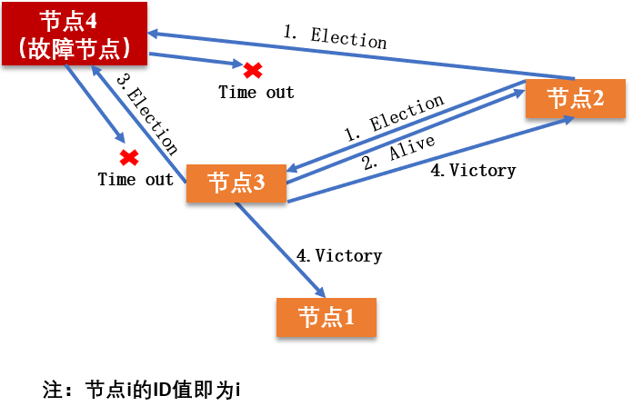

    小结一下。Bully 算法的选择特别霸道和简单，谁活着且谁的 ID 最大谁就是主节点，其他节点必须无条件服从。这种算法的优点是，选举速度快、算法复杂度低、简单易实现。
    但这种算法的缺点在于，需要每个节点有全局的节点信息，因此额外信息存储较多；其次，任意一个比当前主节点 ID 大的新节点或节点故障后恢复加入集群的时候，都可能会触
    发重新选举，成为新的主节点，如果该节点频繁退出、加入集群，就会导致频繁切主

民主投票:Raft算法

    Raft 算法是典型的多数派投票选举算法，其选举机制与我们日常生活中的民主投票机制类似，核心思想是“少数服从多数”。也就是说，Raft 算法中，获得投票最多的节点成为主。
    采用 Raft 算法选举，集群节点的角色有 3 种：
    Leader，即主节点，同一时刻只有一个 Leader，负责协调和管理其他节点；
    Candidate，即候选者，每一个节点都可以成为 Candidate，节点在该角色下才可以被选为新的 Leader；
    Follower，Leader 的跟随者，不可以发起选举。
    
    Raft 选举的流程，可以分为以下几步：
        1.初始化时，所有节点均为 Follower 状态。
        2.开始选主时，所有节点的状态由 Follower 转化为 Candidate，并向其他节点发送选举请求。
        3.其他节点根据接收到的选举请求的先后顺序，回复是否同意成为主。这里需要注意的是，在每一轮选举中，一个节点只能投出一张票。
        4.若发起选举请求的节点获得超过一半的投票，则成为主节点，其状态转化为 Leader，其他节点的状态则由 Candidate 降为 Follower。
            Leader 节点与 Follower 节点之间会定期发送心跳包，以检测主节点是否活着。 
        5.当 Leader 节点的任期到了，即发现其他服务器开始下一轮选主周期时，Leader 节点的状态由 Leader 降级为 Follower，进入新一轮选主。
节点的状态迁移如下所示（图中的 term 指的是选举周期）：
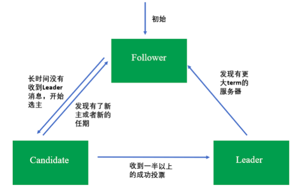

        请注意，每一轮选举，每个节点只能投一次票。这种选举就类似人大代表选举，正常情况下每个人大代表都有一定的任期，任期到后会触发重新选举，
        且投票者只能将自己手里唯一的票投给其中一个候选者。对应到 Raft 算法中，选主是周期进行的，包括选主和任值两个时间段，选主阶段对应投票阶段，
        任值阶段对应节点成为主之后的任期。但也有例外的时候，如果主节点故障，会立马发起选举，重新选出一个主节点。

        小结一下。Raft 算法具有选举速度快、算法复杂度低、易于实现的优点；缺点是，它要求系统内每个节点都可以相互通信，且需要获得过半的
        投票数才能选主成功，因此通信量大。该算法选举稳定性比 Bully 算法好，这是因为当有新节点加入或节点故障恢复后，会触发选主，
        但不一定会真正切主，除非新节点或故障后恢复的节点获得投票数过半，才会导致切主
  具有优先级的民主投票：ZAB 算法

        ZAB（ZooKeeper Atomic Broadcast）选举算法是为 ZooKeeper 实现分布式协调功能而设计的。相较于 Raft 算法的投票机制，ZAB 算法增加了通过节点 ID 和数据 ID 作为参考进行选主，
        节点 ID 和数据 ID 越大，表示数据越新，优先成为主。相比较于 Raft 算法，ZAB 算法尽可能保证数据的最新性。所以，ZAB 算法可以说是对 Raft 算法的改进。

        使用 ZAB 算法选举时，集群中每个节点拥有 3 种角色：
        Leader，主节点；Follower，跟随者节点；Observer，观察者，无投票权

        选举过程中，集群中的节点拥有 4 个状态：
        Looking 状态，即选举状态。当节点处于该状态时，它会认为当前集群中没有 Leader，因此自己进入选举状态。
        Leading 状态，即领导者状态，表示已经选出主，且当前节点为 Leader。
        Following 状态，即跟随者状态，集群中已经选出主后，其他非主节点状态更新为 Following，表示对 Leader 的追随。
        Observing 状态，即观察者状态，表示当前节点为 Observer，持观望态度，没有投票权和选举权。
    
        投票过程中，每个节点都有一个唯一的三元组 (server_id, server_zxID, epoch)，
        其中 server_id 表示本节点的唯一 ID；
        server_zxID 表示本节点存放的数据 ID，数据 ID 越大表示数据越新，选举权重越大；
        epoch 表示当前选取轮数，一般用逻辑时钟表示。    
    
        ZAB 选举算法的核心是“少数服从多数，ID 大的节点优先成为主”，因此选举过程中通过 (vote_id, vote_zxID) 
        来表明投票给哪个节点，其中 vote_id 表示被投票节点的 ID，vote_zxID 表示被投票节点的服务器 zxID。
        ZAB 算法选主的原则是：server_zxID 最大者成为 Leader；若 server_zxID 相同，则 server_id 最大者成为 Leader。    
        
        小结一下。ZAB 算法性能高，对系统无特殊要求，采用广播方式发送信息，若节点中有 n 个节点，每个节点同时广播，
        则集群中信息量为 n*(n-1) 个消息，容易出现广播风暴；且除了投票，还增加了对比节点 ID 和数据 ID，
        这就意味着还需要知道所有节点的 ID 和数据 ID，所以选举时间相对较长。但该算法选举稳定性比较好，当有新节点
        加入或节点故障恢复后，会触发选主，但不一定会真正切主，除非新节点或故障后恢复的节点数据 ID 和节点 ID 
        最大，且获得投票数过半，才会导致切主。
三种选举算法的对比  
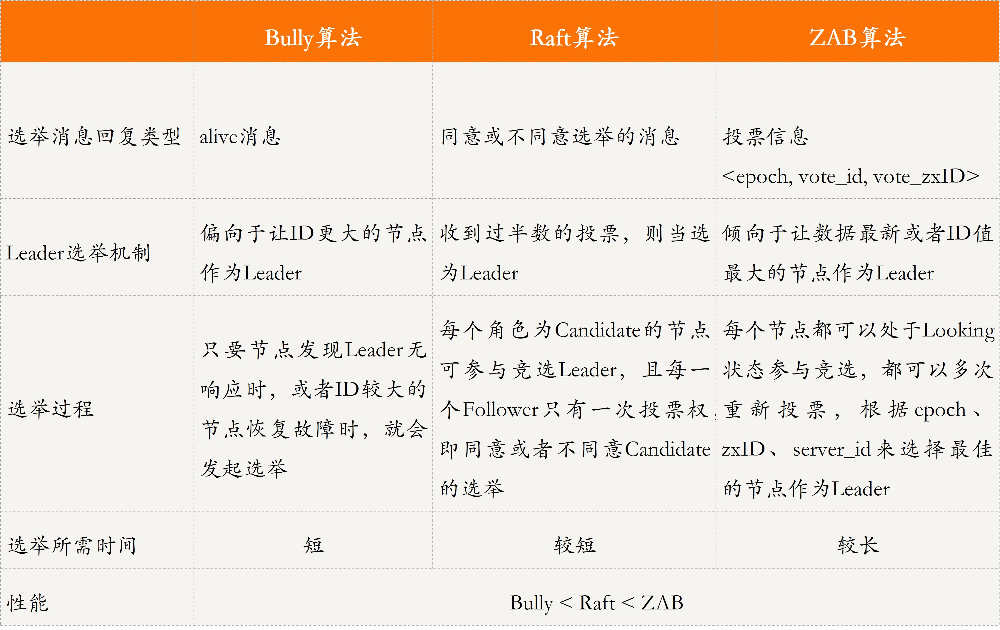
思维导图
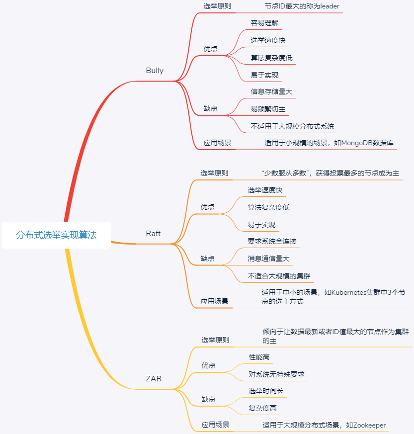


17.再答一次秒杀系统

18.写金融类的系统有什么需要关注的地方

19.非功能性的设计关注那些?日志规范,代码规范

20.你有什么想问的

21.TCP的三次握手?

        我对TCP,甚至整个网络知识,喜欢用[信息论]中的一些理论去推演他们.我觉得在现在和未来的时代,[信息论]是一把利器信息论中,  
        有个很重要的思想:要想消除信息的不确定性,就得引入信息.将这个思想应用到TCP中,很容易理解TCP的三次握手和四次挥手的必要  
        性:他们的存在以复杂度, 就是为了消除不确定性,这里我们叫[不可靠性],拿三次握手举例:
        为了描述方便,将通信的两端用字母A和B替代.A要往B发数据,A要确定两件事:
            1.B在那儿,并且能接受数据---B确实存在,并且是个活人,能听得见
            2.B能回应---B能发数据,能说话
        为了消除这两个不确定性,所以必须有两次握手,即A发送了数据,B收到了,并且能回应----"ACK"
        同样的,对于B来说,他也要消除以上两个不确定性,通过前两次握手,B知道了A能说,但是还不能确定A能不能听,这就是第三握手的必
        要性.
        当然你可能会问,增加第四次握手有没有必要?从信息论的角度来说,已经不需要了,因为它的增加也无法再提高[确定性]                            

        因为TCP的第二次握手，是相当于同时收到了B的ACK应答包和SYN请求包，这里能够合并是B已经准备好了要连接。但是断开的时候，
        A发送FIN包，B只能先发送ACK包，不发送FIN包，因为它不一定就准备好了断开，它可能还有一些A传过来的包在处理当中，所以B的
        FIN包要等它自己准备好断开后，才发，这时候就需要四次了。总结来说，三次握手是因为简少了一次握手步骤，把三次握手拆开来看
        ，其实也是发了四个包。

-----------------------------------------------------

1.如何提前发现你的数据有问题,而不是等到用户反馈才知道?

2.如何防止超卖?

3.为什么要用Redis?为什么没有用db?
    redis专题
4.有没有QPS?

5.如何部署?

6.rocketmq?
    rocketmq专题
7.项目过程中哪个点比较难?

8.项目中为什么要用ThreadLocal去做租户的隔离?

9.项目有什么缺点?

10.100亿行数据,每个数字32位,取最小的数字

11.有没有碰到特别难的事情,如何解决的?

12.业界中间件有什么了解吗?将一个你深度理解原理的
    redis专题
13.高并发的问题有遇到过吗,谈谈你理解的并发?
在我看来,并发编程领域可以抽象成三个核心问题:分工 同步和互斥

        所谓分工,类似于现实中一个组织完成一个项目,项目经理要拆分任务,安排合适的成员去完成
        在并发编程领域里的同步,主要指的是就是线程间的写作,本质上和现实生活中写作没有区别,不过
            是一个线程执行完了一个任务,如何通知执行后续任务的线程开工而已
        互斥,所谓互斥,指的是同一时刻,只允许一个线程访问共享变量.
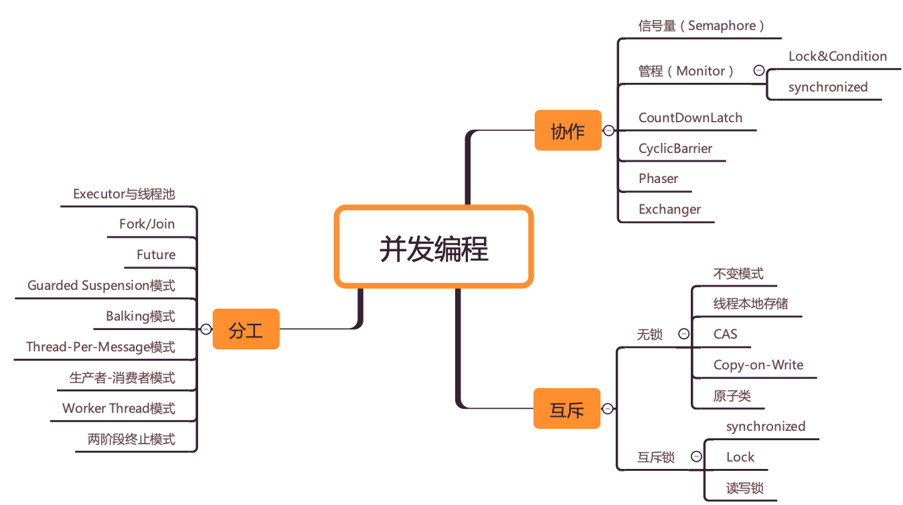

        从性能角度讲,我们为了提高执行一定计算机任务的效率,所以io等待的时候,不能让cpu闲着,所以我们把任务拆分交替执行,有了分时
    操作系统,出现了并发,后来CPU多核了又有了并行计算.这里也就是"分工"
        分工以后我们为了进一步提升效率和更加灵活的达到目的,所以我们要对任务进行组织编排,也就是对线程组织编排,于是线程之间需要通信,  
    因此操作系统提供了一些让进程,线程之间通信的方式,也就是"同步"  
        但是事物总不是完美的,并发和通信带来了较高的编程复杂度,同时也出现了多线程并发操作共享资源的问题.于是天下大势,分久必合,我们又  
    要将对共享资源的访问串行化,所以我们根据现实世界的做法设计了锁,信号量等补充这套体系,也就是互斥.
并发编程bug的源头

        这些年,我们的cpu 内存 i/o设备都在不断在迭代,不断朝着更快的方向努力,但是在这个快速发展的过程中,有一个核心矛盾一直存在,就是三者之间速度
     差异,cpu是天上一天,内存是地上一年;内存是天上一年,io设备是地上十年.
        为了合理利用cpu的高性能,平衡三者的速度差异,计算机体系结构 操作系统 编译程序都做出了贡献,主要体现为:
        1.cpu增加了缓存,以均衡与内存的速度差异
        2.操作系统添加了进程 线程,以分时复用cpu,进而均衡cpu与io设备的速度差异
        3.编译程序优化指令执行次序,使得缓存能够得到更加合理的利用.
        现在我们几乎所有的程序都默默地享受着这些成果，但是天下没有免费的午餐，并发程序很多诡异问题的根源也在这里。
        源头1:缓存导致的可见性问题
        源头2:线程切换带来的原子性问题
        源头3:编译优化带来的有序性问题
java如何解决有序性和可见性

互斥锁解决原子性问题

14.有遇到过很大的流量吗?

15.描述产生一次FullGC的整个过程

16.平时通过什么来提升自己?
    技术博客 极客时间
17.你有什么问题?你觉得我的短板在于?

------------------------------------------------------------------------

1.简单介绍下自己和项目
自我介绍:面试官你好,我叫李昭文,本科毕业于安徽巢湖学院,现居苏州吴江,从Boss招聘上看到公司招聘的这个java职位,  
我觉得自己比较适合公司的这个岗位,对自己的发展也有帮助,所以来争取下这份工作.
本人从事java开发有将近6年的开发经验,从事过不同业务场景开发,例如互联网金融 微信公众号 共享仓库存储等场景,可以适应不同场景的开发工作;  
期间解决了许多疑难问题,(本人总结了解决问题的三个步骤:首先,许多bug在于理解需求不清,因此写代码时有疑问的地方要多和产品 开发leader沟通好,  
其次代码层次要简洁明了,逻辑清楚,多测试,出了bug,自己能做到心中有数;再次要和测试人员加强沟通)
本人的优势在于痴迷技术,学习能力强,为人谦和,缺点在于非计算机专业,有时考虑问题不够全面.
谢谢面试官

项目介绍:目前本人在开发的项目,是一款既有web端,也有安卓端,还有小程序的项目,叫做任意仓,任意仓就是负责电商卖家的仓储租赁+配送的业务.
本人负责云仓出入库单 物流单模块中接口的定义,利用设计模式优化代码(观察者模式),确保接口访问的幂等性,优化出入库单请求响应参数

2.你觉得项目里最大的挑战是什么?项目的设计和推动

3.为什么选择rocketmq?

4.对rocketMQ的了解?
基本原理 发布订阅 服务注册 消息丢失

5.消息如何保证顺序消费?

6.rocketmq事务消息

7.rocketmq是强一致性还是还是弱一致性?

8.消息重复如何解决?可以在中间件层解决吗?MQ体系一些了解吗?业务幂等等

9.ThreadLocal是怎么样概念?如何实现线程隔离的?基于这个原理有没有更加优化的方式

10.线程池用ThreadLocal有什么问题?有什么思路来让业务不去关注ThreadLocal的set ThreadLocal在线程复用的时候
值可能不是最新的,需要每次都set

11.你说你用过dubbo,那看过netty源码吗?

12.Netty中FastThreadLocal对ThreadLocal的优化
    FastThreadLocal使用了单纯的数组来替代ThreadLocal的hash表操作,索引在高并发的情况下,FastThreadLocal更快
    set操作:FastThreadLocal直接根据index进行数组set,而 ThreadLocal 需要先根据ThreadLocal的hashcode计算数组下标,然后
    再根据线性探测法进行set操作,期间如果发生hash冲突且有无效的Entry时,还要进行entry的清理和整理操作.最后不管是否冲突,都要进行
    一次log级别的Entry回收操作,所以慢了
    get操作:ftl直接根据index进行获取,而tl需要先根据tl的hashcode计算数组下标,然后再根据线性探测法进行get操作,如果不能根据直接索引索引获取
    到value的话,并且在向后循环遍历的过程中发现了无效的Entry,则会进行无效的Entry的清理和整理工作.
    remove操作:ftl直接根据index从数组中删除当前的ftl的value,然后从Set集合中删除当前的ftl,之后还可以进行删除回调操作(功能增强);
    而tl需要先根据tl的hashCode计算数组下标,然后再根据线性探测法进行remove操作,最后还需要进行无效的Entry的整理和清理工作;
13.讲讲dubbo的基本原理

14.JVM调优?

15.频繁YGC如何排查
cpu占用过高排查思路
    top 查看占用cpu的进程 pid
    top -Hp pid 查看进程中占用cpu过高的线程id  tid
    printf '%x/n' tid 转化为十六进制
    jstack pid |grep tid的十六进制 -A 30 查看堆栈信息定位

jvm old区占用过高排查思路
    top查看占用cpu高的进程
    jstat -gcutil pid 时间间隔 查看gc状况
    jmap -dump:format=b,file=name.dump pid  导出dump文件
    用visualVM分析dump文件

16.为什么会发生YGC

19.堆和栈的区别,什么时候会压栈?什么时候会出栈?

    堆是 JVM 内存中最大的一块内存空间，该内存被所有线程共享，几乎所有对象和数组都被分配到了堆内存中。  
    堆被划分为新生代和老年代，新生代又被进一步划分为 Eden 和 Survivor 区，最后 Survivor 由 
    From Survivor 和 To Survivor 组成。
    
    Java 虚拟机栈是线程私有的内存空间，它和 Java 线程一起创建。当创建一个线程时，会在虚拟机栈中申请
    一个线程栈，用来保存方法的局部变量、操作数栈、动态链接方法和返回地址等信息，并参与方法的调用和返回。
    每一个方法的调用都伴随着栈帧的入栈操作，方法的返回则是栈帧的出栈操作。


22.HashMap如何实现?为什么会变红黑树?如何扩容?为什么是两倍?什么时候用到位运算?
    HashMap使用了数组+链表这两种数据结构相结合的方式实现了链地址法,当有哈希值冲突时,就可以将冲突的键值对链成一个链表.
    但是这种方式存在一个性能问题,如果链表过长,查询数据的时间复杂度就会增加.HashMap就在java8中使用了红黑树来解决链表  
    过长导致的查询性能下降问题;
    如何扩容?由于扩容数组的长度是2倍的关系,所以对于假设初始tableSize=4要扩容到8来说就是0100到1000的变化(左移一位就是2倍)
    在扩容中只用判断原来的hash值和左移动的一位(newTable的值)按位与操作是0或1,0的话索引不变,1的话索引变成原索引加上扩容前数组
    之所以能通过这种"与运算"来重新分配索引,是因为hash值本来就是随机的,而hash按位与上newTable得到的0和1就是随机的,索引
    扩容的过程就能把之前哈希冲突的元素再随机分到不同的索引中
    为什么是2倍?容量n为2的幂次方,n-1的二进制会全为1,位运算时可以重复散列,避免不必要的哈希冲突,因此扩容必须是2倍就是为了
    维持容量始终为2的幂次方.
    什么时候用到位预算?
23.你有什么想问的?

24.如何设计一个类似Redis缓存数据库?谈谈你的看法?


---------------------------------------------------------------------

1.Spring Bean 的生命周期
创建Bean的过程

    a.实例化Bean
    b.设置Bean属性
    c.如果我们通过各种Aware接口声明了依赖关系,则会注入Bean对容器基础设施层面的依赖.具体包括BeanNameAware
    BeanFactoryAware和ApplicationContextAware,分别注入BeanId BeanFactory或者ApplicationContext
    d.调用BeanPostProcessor的前置初始化方法postProcessBeforeInitialization
    e.如果实现了InitializingBean接口,则会调用afterPropertiesSet方法
    f.调用Bean自身定义的init方法
    g.调用BeanPostProcessor的后置初始化方法postProcessAfterInitialization
    h.创建过程完毕
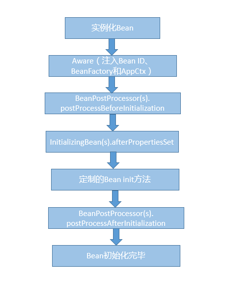
销毁Bean的过程

    a.调用DisposableBean的destroy方法
    b.调用Bean定制的destroy方法
2.Spring Bean的五个作用域

    Singleton,这是Spring的默认作用域,也就是为每个IOC容器创建唯一的一个Bean实例
    Prototype,针对每个getBean请求,容器都会单独创建一个Bean实例
如果是Web容器,则支持另外三种作用域:

    Request,为每个Http请求创建单独的Bean实例
    Session,很显然Bean实例的作用域是Session范围
    GlobalSession用于Portlet容器,因为每个Portlet有单独的Session,GlobalSession提供一个全局性的HttpSession


3.Spring IOC

        a.ioc是指容器控制程序对象之间的一种关系,而非传统实现中,由程序代码直接操控.控制权由应用代码转到了外部容器,控制权的转移称为反转.
        对于Spring而言,就是由Spring来控制对象的生命周期和对象之间的关系.ioc还有另外一个名字"依赖注入(DI)",所谓依赖注入,即组件之间的
        依赖关系由容器在运行期间决定,即由容器动态的将某种依赖关系注入到组件之中
        b.在spring的工作方式中,所有的类都会再spring容器中登记注册,告诉spring这是个什么东西,然后spring会在系统运行到适当的时候,把你要的
        东西主动给你.所有类的创建 销毁都由spring来控制,也就是说控制对象生命周期的不再是引用它的对象,而是spring.对于某个具体的对象而言,以  
        前是它控制其他对象,现在则是所有对象都被spring控制,所以叫做控制反转
        c.在系统运行中,动态的向某个对象提供它所需要的其他对象
        d.从Bean创建过程可以看到,它的依赖关系都是由容器负责注入,具体实现方式包括带参数的构造函数 setter方法或者@Autowired方式来显
        e.ioc的优点:降低了组件之间的耦合,降低业务对象之间替换的复杂性,使之能够灵活的管理对象


4.Spring AOP

        (1). AOP面向方面编程基于IoC，是对OOP的有益补充；
        (2). AOP利用一种称为“横切”的技术，剖解开封装的对象内部，并将那些影响了 多个类的公共行为封装到一个可重用模块，并将其名为“Aspect”，即方面。所谓“方面”，简单地说，就是将那些与业务无关，却为业务模块所共同调用的 逻辑或责任封装起来，比如日志记录，便于减少系统的重复代码，降低模块间的耦合度，并有利于未来的可操作性和可维护性。
        (3). AOP代表的是一个横向的关 系，将“对象”比作一个空心的圆柱体，其中封装的是对象的属性和行为；则面向方面编程的方法，就是将这个圆柱体以切面形式剖开，选择性的提供业务逻辑。而 剖开的切面，也就是所谓的“方面”了。然后它又以巧夺天功的妙手将这些剖开的切面复原，不留痕迹，但完成了效果。
        (4). 实现AOP的技术，主要分为两大类：
        一是采用动态代理技术，利用截取消息的方式，对该消息进行装饰，以取代原有对象行为的执行；
        二是采用静态织入的方式，引入特定的语法创建“方面”，从而使得编译器可以在编译期间织入有关“方面”的代码。
        (5). Spring实现AOP：JDK动态代理和CGLIB代理
        JDK动态代理：其代理对象必须是某个接口的实现，它是通过在运行期间创建一个接口的实现类来完成对目标对象的代理；
        其核心的两个类是InvocationHandler和Proxy。
        
        CGLIB代理：实现原理类似于JDK动态代理，只是它在运行期间生成的代理对象是针对目标类扩展的子类。CGLIB是高效的代码生成包，底层是依靠ASM（开源的java字节码编辑类库）操作字节码实现的，性能比JDK强；需要引入包asm.jar和cglib.jar。
        使用AspectJ注入式切面和@AspectJ注解驱动的切面实际上底层也是通过动态代理实现的。
        (6). AOP使用场景：
        Authentication 权限检查
        Caching 缓存
        Context passing 内容传递
        Error handling 错误处理
        Lazy loading　延迟加载
        Debugging　　调试
        logging, tracing, profiling and monitoring　日志记录，跟踪，优化，校准
        Performance optimization　性能优化，效率检查
        Persistence　　持久化
        Resource pooling　资源池
        Synchronization　同步
        Transactions 事务管理

------------------------------------------------------------------------
MySQL优化
1.MySQL调优之SQL语句:如何写出高性能SQL语句?

a.应该尽量避免一些慢SQL语句的出现

    慢SQL语句的几种常见诱因
        1.无索引 索引失效导致慢查询
        如果在一张几千万数据的表中以一个没有索引的列作为查询条件,大部分情况下查询会非常耗时,这种查询毫无疑问是一个慢SQL查询,
    所以对于大数据量的查询,我们需要建立适合的索引来优化查询
        虽然我们很多时候建立了索引,但在一些特定的场景下,索引还有可能会失效,所以索引失效也是导致慢查询的主要原因之一
        2.锁等待
        我们常用的存储引擎有InnoDB和MyISAM,前者支持行锁和表锁,后者只支持表锁.
        如果数据库操作是基于表锁实现的,试想下,如果一张订单表在更新时,需要锁住整张表,那么其他大量数据库操作(包括查询)都将处于等待
    状态,这将严重影响到系统的并发功能
        这时,InnoDB存储引擎支持的行锁更适合高并发的场景,但是在使用InnoDB存储引擎时,我们要特别注意行锁升级为表锁的可能.在批量更新
    操作时,行锁就很可能会升级为表锁.
        MySQL认为如果对一张表使用大量行锁,会导致事务执行效率下降,从而可能造成其他事务长时间所等待和更多的锁冲突问题发生,致使性能严重下降,
    所以MySql会将行锁升级为表锁.还有,行锁是基于索引加的锁,如果我们在更新操作时,条件索引失效,那么行锁也会升级为表锁.
        因此,基于表锁的数据库操作,会导致SQL阻塞等待,从而影响执行速度.在一些更新操作(insert/update/delete)大于或等于读操作的情况下,mysql
    不建议使用MyISAM存储引擎.
        除了锁升级之外,行锁相对表锁来说,虽然粒度更细,并发能力提升了,但是也带来了新的问题,那就是死锁,因此,在使用行锁时,我们要注意避免死锁
        
        3.不恰当的sql语句
        使用不恰当的SQL语句也是慢sql最常见的诱因之一.例如习惯使用<select *>,<select count(*)> sql语句,在大数据表中使用<limit m,n>分页查询,
    以及对非索引字段进行排序等等
b.优化sql语句的步骤

        通常,我们在执行一条sql语句时,要想知道这个sql先后查询了那些表,是否使用了索引,这些数据从哪里获取到,获取到了数据遍历了多少行数据等等,我们可以通过
    EXPLAIN命令来查看这些执行信息.这些执行信息被统称为执行计划
        1.通过explain分析sql执行计划
        2.通过show profiles分析sql执行性能 
            通过explain分析执行计划,仅仅是停留在分析sql的外部执行情况,如果我们想要深入到MySQL内核中,从执行线程的状态和时间来分析的话,这个时候我们就看
    选择profile;show profiles只显示最近发给服务器的SQL语句,默认情况下是记录最近已执行的15条记录,我们可以重新设置profiling_history_size
    增大该存储记录,最大值为100;获取到query_id,再通过show profile for query_id,就能够查询到对应的query_id的sql
    语句在执行过程中线程的每个状态所消耗的时间了
c.常用的SQL优化

    1.优化分页查询
    通常我们使用<limit m,n> + 合适的order by来实现分页查询,这种实现方式在没有任何索引条件支持的情况下,需要做大量的文件排序索引,
    性能将会非常槽糕,如果有对应的索引,通常刚开始的分页查询效率会比较理想,但越往后,分页查询的性能就越差.
    这是因为我们在使用limit的时候,偏移量m在分页越靠后的时候,值就越大,数据库检索的数据也就越多.例如limit 10000,10这样的查询,数据库需要查询
    10010条记录,最后返回10条记录.也就是说将会有10000条记录被查询出来没有被使用到
        利用子查询优化分页查询:我们可以先查询出所需要的10行数据中的最小id值,然后通过偏移量返回所需要的10行数据给我们
    select * from `demo`.`order` where id> (select id from `demo`.`order` order by order_no limit 10000, 1)  limit 20;    
    2.优化select count(*)
    COUNT() 是一个聚合函数，主要用来统计行数，有时候也用来统计某一列的行数量（不统计 NULL 值的行）。我们平时最常用的就是 COUNT(*) 和 COUNT(1) 这两种方式了，
    其实两者没有明显的区别，在拥有主键的情况下，它们都是利用主键列实现了行数的统计。但 COUNT() 函数在 MyISAM 和 InnoDB 存储引擎所执行的原理是不一样的，
    通常在没有任何查询条件下的 COUNT(*)，MyISAM 的查询速度要明显快于 InnoDB。这是因为 MyISAM 存储引擎记录的是整个表的行数，在 COUNT(*) 查询操作时无需遍历表计算，
    直接获取该值即可。而在 InnoDB 存储引擎中就需要扫描表来统计具体的行数。而当带上 where 条件语句之后，MyISAM 跟 InnoDB 就没有区别了，它们都需要扫描表来进行行数的统计。
    如果对一张大表经常做 SELECT COUNT(*) 操作，这肯定是不明智的。那么我们该如何对大表的 COUNT() 进行优化呢？
    
    使用近似值
    有时候某些业务场景并不需要返回一个精确的 COUNT 值，
    此时我们可以使用近似值来代替。我们可以使用 EXPLAIN 对表进行估算，要知道，执行 EXPLAIN 并不会真正去执行查询，而是返回一个估算的近似值。
    
    增加汇总统计
    如果需要一个精确的 COUNT 值，我们可以额外新增一个汇总统计表或者缓存字段来统计需要的 COUNT 值，这种方式在新增和删除时有一定的成本，但却可以大大提升 COUNT() 的性能。
    2.优化select *
    MySQL 常用的存储引擎有 MyISAM 和 InnoDB，其中 InnoDB 在默认创建主键时会创建主键索引，而主键索引属于聚簇索引，
    即在存储数据时，索引是基于 B + 树构成的，具体的行数据则存储在叶子节点           
                                                       
    假设我们的订单表是基于 InnoDB 存储引擎创建的，且存在 order_no、status 两列组成的组合索引。此时，我们需要根据订单号查询一张订单表的 status，
    如果我们使用 select * from order where order_no='xxx’来查询，则先会查询组合索引，通过组合索引获取到主键 ID，再通过主键 ID 去主键索引中获取对应行所有列的值。
    如果我们使用 select order_no, status from order where order_no='xxx’来查询，则只会查询组合索引，通过组合索引获取到对应的 order_no 和 status 的值。
d.开启慢sql配置项

    在开发中，我们要尽量写出高性能的 SQL 语句，但也无法避免一些慢 SQL 语句的出现，或因为疏漏，或因为实际生产环境与开发环境有所区别，这些都是诱因。面对这种情况，
    我们可以打开慢 SQL 配置项，记录下都有哪些 SQL 超过了预期的最大执行时间。
    set global slow_query_log='ON'; //开启慢SQL日志
    set global slow_query_log_file='/var/lib/mysql/test-slow.log';//记录日志地址
    set global long_query_time=1;//最大执行时间

