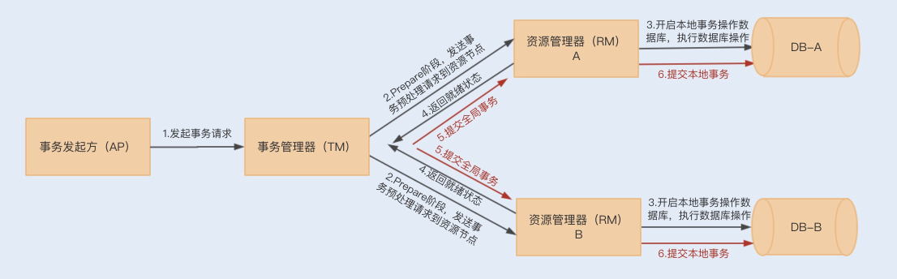
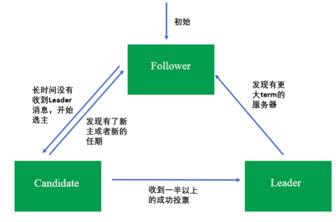
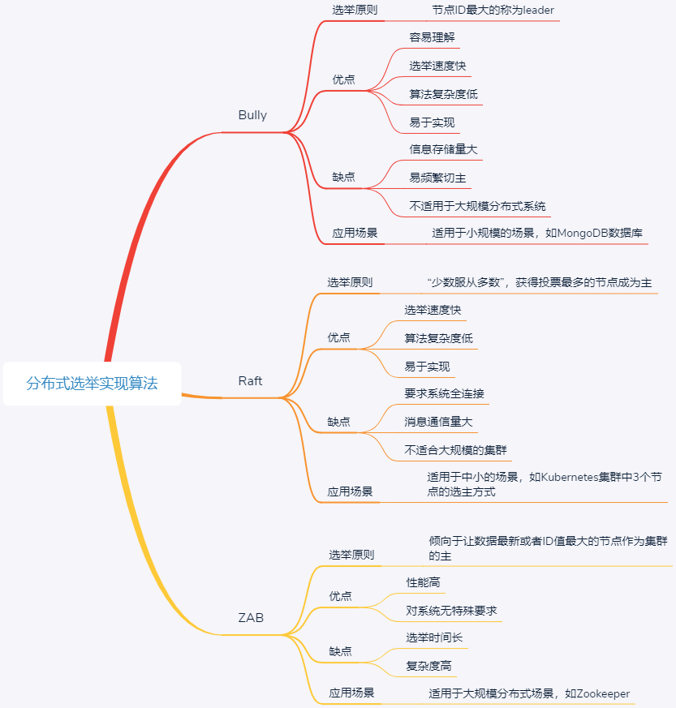

1.简单介绍下自己的近况

2.对kafka了解吗?RocketMq事务性消息怎么实现的?

    
    消息队列中的"事务",主要解决的是消息生产者和消息消费者的数据一致性问题
    1.发送Half消息
    2.Half消息发送成功
    3.执行本地事务
    4.提交或回滚事务
    5.网络异常，Broker没有收到commit or rollback，回查本地事务状态
    6.检查本地事务状态
    7.根据本地事务状态执行commit or rollback
    8.根据 4 或 7 投递消息到MQ订阅方，或者取消不投递

3.假设事务提交的消息丢了,没有发到broker上面,会怎么处理?

    我们可以消息队列的有序性来验证是否有消息丢失.原理非常简单,在Producer端,我们给每个发出的消息附加一个连续递增的序号,  
    然后在Consumer端来检查这个序号的连续性.
    一条消息从生产到消费完成这个过程,可以划分为三个阶段
    在生产阶段:你需要捕获消息发送的错误,并重发消息
    [
        在生產阶段,消息队列通过最常用的请求确认机制,来保证消息的可靠传递:当你的代码调用发送消息方法时,消息队列的客户端
        会把消息发送Broker,Broker收到消息后,会给客户端返回一个确认响应,表明消息已经收到了.客户端收到响应后,完成了一次
        正常消息的发送.
        只要Producer收到了Broker的确认响应,就可以保证消息在生产阶段不会丢失.有些消息队列在长时间没收到发送确认响应后,
        会自动重试,如果重试再失败,就会议返回值或者抛出异常的方式告知用户
        你在编写发送消息代码时,需要注意,正确处理返回值或者捕获异常,就可以保证这个阶段的消息不会丢失.
        以kafka为例,看下如何可靠的发送消息

        try {
            RecordMetadata metadata = producer.send(record).get();
            System.out.println("消息发送成功。");
        } catch (Throwable e) {
            System.out.println("消息发送失败！");
            System.out.println(e);
        }
    
        异步发送时,则需要在回调方法里进行检查    
        producer.send(record, (metadata, exception) -> {
            if (metadata != null) {
                System.out.println("消息发送成功。");
            } else {
                System.out.println("消息发送失败！");
                System.out.println(exception);
            }
        });    
    ]

    在存储阶段:你可以通过配置刷盘和复制相关的参数,让消息写入到多个副本的磁盘上,来确保消息不会因为某个broker宕机,或者磁盘
    损坏而丢失.
    [
        在存储阶段正常情况下,只要broker在正常运行,就不会出现消息丢失的问题,但是如果Broker出现了故障,比如进程死掉了或者服务器
    宕机,还是可能会丢失消息的
    如果对消息的可靠性要求非常高,可以通过配置Broker参数来避免因为宕机丢失消息
       对于单个节点的Broker,需要配置Broker参数,在收到消息后,将消息写入磁盘后再给Producer返回确认机制,这样即使发生宕机,由于
    消息已经被写入磁盘,就不会丢失消息,恢复后还可以继续消费.在RocketMQ中,需要将双排方式FlushDiskType配置为SYNC_Flush同步刷盘
       如果是Broker是由多个节点组成的集群,需要将Broker集群配置成:至少将消息发送到2个以上的节点,再给客户端恢复发送确认响应.
    这样当某个Broker宕机时,其他的Broker可以替代宕机的Broker,也不会发生消息丢失            
    ]
      
    在消费阶段:你需要在处理完全部消费业务逻辑之后,再发送消费确认
    [
        消费阶段采用和生产阶段类似的确认机制来保证消息的可靠性,客户端从Broker拉取消息后,执行用户的消费业务逻辑,成功后,才会给Broker发送消费确认响应.
        如果Broker没有收到消费确认响应,下次拉消息的时候还会返回同一条消息,确保消息不会在网络传输过程中丢失,也不会因为客户端在执行消费逻辑中出错导致丢失.
        注意:不要在收到消息后就立即发送消费确认,而是应该在执行完成所有消费业务逻辑之后,再发送消费确认    
    ]

4.分布式事务一致性如何保证
分布式事务解决方案

       在单个数据库的情况下,数据事务操作具有ACID四个特性,但是如果在一个事务中操作多个数据库,则无法使用数据库事务
    来保证一致性.也就是说,当两个数据库操作数据时,可能存在一个数据库操作成功,而另一个数据库操作失败的情况,我们无法通过  
    单个数据库事务来回滚两个数据操作.  
       而分布式事务就是为了解决在同一个事务下,不同节点的数据库操作数据不一致的问题.在一个事务操作请求多个服务或者多个数据库  
    节点时,要么所有请求成功,要么所有请求都失败回滚回去.  
       通常分布式事务的实现有多种方式,例如XA协议实现的二阶段提交2PC 三阶段提交3PC,以及TCC补偿性事务
    什么是XA协议?XA协议是由X/Open组织提出的一个分布式事务处理规范,目前MySql中只有InnoDB存储引擎支持XA协议
a.XA规范

    在XA规范之前,存在一个DTP模型,该模型规范了分布式事务的模型设计.
    DTP规范中主要包含了AP RM TM三个部分,其中AP是应用程序,是事务发起和结束的地方;RM是资源管理器,主要负责管理每个数据库的
    连接数据源;TM是事务管理器,负责事务的全局管理,包括事务的生命周期管理和资源的分配协调等 
    
    XA则规范了TM与RM之间的通信接口,在TM与多个RM之间形成一个双向通信桥梁,从而在多个数据库资源下保证ACID特性;
    (JTA是基于XA规范实现的一套java事务编程接口,是一种2pc事务)

b.二阶段提交和三阶段提交

        XA规范实现的分布式事务属于二阶提交事务,就是通过两个阶段来实现事务的提交.
    在第一阶段,应用程序向事务管理器(TM)发起事务请求,而事务管理器则会分别向参与的各个资源管理器(RM)发送事务预处理请求(prepare)
        ,此时这些资源管理器会打开本地数据库事务,然后开始执行数据库事务,但是执行完成后并不会立即提交事务,而是向事务管理器返回就绪(Ready)  
    或者未就绪(Not Ready)状态,如果各个参与节点都返回状态,就会进入第二阶段
    
        到了第二阶段,如果资源管理器返回的都是就绪状态,事务管理器则会向各个资源管理器发送提交(Commit)通知,资源管理器则会完成本地数据库的
    事务提交,最终返回提交结果给事务管理器
       
         在第二阶段中,如果任意资源管理器返回了未就绪状态,此时事务管理器会向所有资源管理器发送事务回滚(Rollback)通知,此时各个资源管理器就会
    回滚本地数据事务,释放资源,并返回结果通知;  
    

    **2PC事务存在的缺陷**
        第一,在整个流程中,我们会发现各个资源管理器节点存在阻塞,只有当所有的节点都准备完成之后,事务管理器才会发出进行全局事务提交的通知,
    这个过程如果很长,则会有很多节点长时间占用资源,从而影响整个节点的性能.
        (一旦资源管理器挂了,就会出现一致阻塞等待的情况,类似问题,我们可以通过设置事务超时时间来解决)
        第二,仍然存在数据不一致的可能性,例如,在最后通知提交全局事务时,由于网络故障,部分节点有可能收不到通知,由于这部分节点没有提交事务,就
    会导致数据不一致的情况出现.  
        而3PC事务的出现就是为了减少此类问题的发生.
        3PC把2PC的准备阶段分为了准备阶段和预处理阶段,在第一阶段只是询问各个资源节点是否可以执行事务,而在第二阶段,所有的节点反馈可以执行事务,
    才开始执行事务操作,最后在第三阶段执行提交或回滚操作.并且在事务管理器和资源管理器中都引入超时机制,如果在第三阶段,资源节点一直无法收到  
    来自资源管理器的提交或回滚请求,它就会在超时之后,继续提交事务
        所以3PC可以通过超时机制,避免管理器挂掉所造成的长时间阻塞问题,但是其实这样还是无法解决在最后提交全局事务时,由于网络故障无法通知
    到一些节点的问题,特别是回滚通知,这样会导致事务等待超时从而默认提交.

c.事务补偿机制(TCC)

        以上这种基于XA规范实现的事务提交,由于阻塞等性能问题,有着比较明显的低性能 低吞吐的特性.所以在抢购活动中使用该事务,
    很难满足系统的并发性能.  
        除了性能问题,JTA只能解决同一服务下操作多数据源的分布式事务问题,换到微服务架构下,可能存在同一个事务操作,分别在不同服务上连接  
    数据源,提交数据库操作.
        而TCC正是为了解决以上问题而出现的一种分布式事务解决方案.TCC采用最终一致性方式实现了一种柔性分布式事务,与XA规范实现的二阶事务不同的是,TCC
    的实现是基于服务层实现的一种二阶事务提交

d.TCC分为三个阶段,即Try Confirm Cancel三个阶段


    Try阶段:主要尝试执行业务,执行各个服务中的Try方法,主要包括预留操作
    Confirm阶段:确认Try中的各个方法执行成功,然后通过TM调用各个服务的Confirm方法,这个阶段是提交阶段
    Cancel阶段:当在Try阶段发现其中一个Try方法失败,例如预留资源失败 代码异常等,则会触发TM调用各个服务的Cancel方法,对全局事务进行回滚,取消执行业务.
    
    以上执行只是保证Try阶段执行时成功或失败的提交和回滚操作,你肯定会想到,如果在Confirm和Cancel阶段出现异常情况,那TCC该如何处理呢?
    此时TCC会不停的重试调用失败的Confirm或Cancel方法,直到成功为止.

e.TCC的缺点

    但是TCC补偿性事务也有比较明显的缺点,那就是对业务的侵入性非常大
    首先,我们需要在业务设计的时候考虑预留资源.
    然后,我们要编写大量业务线代码,例如Try Confirm Cancel方法
    最后,我们还需要为每个方法考虑幂等性.
    这种事务的实现和维护成本非常高,但综合来看,这种实现是目前大家最常用的分布式事务解决方案.

5.2pc 3pc tcc

6.TCC对异常流式如何操作的?

7.为什么要看源码?

    a.通过学习开源框架 开源项目的源码,我们可以学习到多种场景 多种技术的解决方案,快速增加经验
    b.在使用某个框架或工具进行开发时,如果你对其源码有所了解,可以最大化的减少出故障的可能
    c.有利于你研究一个新系统的代码逻辑,快速接手一个新系统
    d.最大的好处是可以开阔思维,提升架构设计能力,通过看源码,看别人如何设计,然后思考为何这样设计才能领悟到

问题扩展:如何阅读源码

    Google查找这个开源框架的官方介绍，了解以下信息
    框架有几个模块
    模块的作用
    模块之间的联系
    每个模块的核心类（在阅读源码的过程中，着重看核心类）
    对哪个模块感兴趣就去写个小demo，先了解一下这个模块的具体作用。
    debug进入看具体实现。（这里面可以充分使用IDEA的调试功能）
    第一遍是走马观花，简略看一下调用逻辑，都用了哪些类；
    第二遍需有重点地debug，看看这些类担任了架构图里的哪些功能，使用了哪些设计模式。
    第三遍debug，把主要类的调用时序图以及类图结构画出来，对着时序图分析调用流程   
8.最终一致性如何实现的?

9.有没有遇到过死锁?
    没有
10.A往B转钱,B往A转钱,同时转会死锁吗?如何解决死锁?
账户转账代码
```java
class Account{
    private int balance;
    // 转账
    void transfer(Account target,int amt){
        // 锁定转出账户
        synchronized(this){ //  ①
            // 锁定转入账户
            synchronized (target){ // ② 
                if (this.balance>amt){
                    this.balance-=amt;
                    target.balance+=amt;
                }
            }
        }
    }
}
```
上面转账的代码是怎么发生死锁的呢?

    1.我们假设线程T1执行账户A转账户B的操作,账户A.transfer(账户B);同时线程T2执行账户B转账户A的操作,账户B.transfer(账户A);
    2.当T1和T2同时执行完①处的代码时,T1获得了账户A的锁(对于T1,this是账户A),而T2获得了账户B的锁(对于T2,this是账户B).
    3.当T1和T2在执行②处的代码时,T1视图获取账户B的锁时,发现账户B已经被锁定(被T2锁定),所以T1开始等待;T2则视图获取账户A的锁时候,
    发现账户已经被锁定(被T1锁定),所以T2也开始等待.
    4.于是T1和T2会无限期的等待下去,也就是我们所说的死锁了
如何预防死锁?

    并发程序一旦发生死锁,一般没有特别好的方法,很多时候我们只能重启应用.因此,解决死锁问题最好的办法还是规避死锁.  
    那如何避免死锁呢?要避免死锁就需要分析死锁发生的条件,有个叫Coffman的牛人总结过了,只有一下四个条件都发生时才会出现死锁:
        1.互斥,共享资源X和Y只能被一个线程占用
        2.占有且等待,线程T1已经取得共享资源X,在等待共享资源Y的时候,不释放共享资源X
        3.不可抢占,其他线程不能强行抢占线程T1占有的资源
        4.循环等待,线程T1等待线程T2占有的资源,线程T2等待线程T1占有的资源,就是循环等待.
    反过来分析,只要我们破坏其中一个,就可以成功避免死锁的发生.
    其中,互斥这个条件我们没有办法破坏,因为我们用锁为的就是互斥,不过其他三个条件都是有办法破坏掉的,到底该如何做呢?
        1.对于"占有且等待"这个条件,我们可以一次性申请所有的资源,这样就不存在等待了
        2.对于"不可抢占"这个条件,占用部分资源的线程进一步申请其他资源时,如果申请不到,可以主动释放它占有的资源,这样不可抢占这个条件就
            破坏掉了
        3.对于"循环等待"这个条件,可以靠按序申请资源来预防.所谓按序申请,是指资源是有线性顺序的,申请的时候可以先申请资源序号小的,再申请资源序号大的,
        这样线性化后自然就不存在循环了.

代码实现
a.破坏占有且等待
```java

class Allocator {
  private List<Object> als = new ArrayList<>();
  // 一次性申请所有资源
  synchronized boolean apply(Object from, Object to){
    if(als.contains(from) ||als.contains(to)){
      return false;  
    } else {
      als.add(from);
      als.add(to);  
    }
    return true;
  }
  // 归还资源
  synchronized void free(Object from, Object to){
    als.remove(from);
    als.remove(to);
  }
}

class Account {
  // actr应该为单例
  private Allocator actr;
  private int balance;
  // 转账
  void transfer(Account target, int amt){
    // 一次性申请转出账户和转入账户，直到成功
    while(!actr.apply(this, target));
    try{
      // 锁定转出账户
      synchronized(this){              
        // 锁定转入账户
        synchronized(target){           
          if (this.balance > amt){
            this.balance -= amt;
            target.balance += amt;
          }
        }
      }
    } finally {
      actr.free(this, target);
    }
  } 
}
```
b.破坏不可抢占条件

    破坏不可抢占条件看上去很简单，核心是要能够主动释放它占有的资源，这一点 synchronized 是做不到的。
    原因是 synchronized 申请资源的时候，如果申请不到，线程直接进入阻塞状态了，而线程进入阻塞状态，
    啥都干不了，也释放不了线程已经占有的资源。
    java.util.concurrent 这个包下面提供的 Lock 是可以轻松解决这个问题的
c.破坏循环等待条件

    破坏这个条件，需要对资源进行排序，然后按序申请资源。这个实现非常简单，我们假设每个账户都有不同的属性 id，  
    这个 id 可以作为排序字段，申请的时候，我们可以按照从小到大的顺序来申请。比如下面代码中，①~⑥处的代码对转出账户（this）  
    和转入账户（target）排序，然后按照序号从小到大的顺序锁定账户。这样就不存在“循环”等待了
```java
class Account {
  private int id;
  private int balance;
  // 转账
  void transfer(Account target, int amt){
    Account left = this;       // ①
    Account right = target;    // ②
    if (this.id > target.id) { // ③
      left = target;           // ④
      right = this;            // ⑤
    }                          // ⑥
    // 锁定序号小的账户
    synchronized(left){
      // 锁定序号大的账户
      synchronized(right){ 
        if (this.balance > amt){
          this.balance -= amt;
          target.balance += amt;
        }
      }
    }
  } 
}
```
关于死锁的问题拓展:

    除了死锁外,还有两种情况,分别是"活锁"和"饥饿"
    发生死锁后线程会互相等待,而且会一直等待下去,在技术上的表现形式是线程永久的阻塞了.
活锁

       但有时线程虽然没有发生阻塞,但仍然会存在执行不下去的情况,这就是所谓的"活锁".
    可以类比现实世界里的例子，路人甲从左手边出门，路人乙从右手边进门，两人为了不相撞，互相谦让，  
    路人甲让路走右手边，路人乙也让路走左手边，结果是两人又相撞了。这种情况，基本上谦让几次就解决了，  
    因为人会交流啊。可是如果这种情况发生在编程世界了，就有可能会一直没完没了地“谦让”下去，成为没有  
    发生阻塞但依然执行不下去的“活锁”.
        解决"活锁"的方案很简单,谦让时,尝试等待一个随机的时间就可以了.
饥饿

        "饥饿":所谓饥饿指的是线程因为无法访问所需资源而无法执行下去的情况.
    发生饥饿的场景:"不患寡,而患不均",如果线程优先级不均,在cpu繁忙的情况下,优先级低的线程得到执行的机会很小,就可能发生线程饥饿;
    持有锁的线程,如果执行的时间过长,也可能导致饥饿问题.
    
    解决饥饿问题的方案,有三种:
    一是保证资源充足;
    二是公平的分配资源;
    三是避免持有锁的线程长时间执行;
    这三个方案中，方案一和方案三的适用场景比较有限，因为很多场景下，资源的稀缺性是没办法解决的，持有锁的线程执行的时间也很难缩短。
    倒是方案二的适用场景相对来说更多一些。那如何公平地分配资源呢？在并发编程里，主要是使用公平锁。所谓公平锁，是一种先来后到的方案，
    线程的等待是有顺序的，排在等待队列前面的线程会优先获得资源。

11.设计一个全局唯一流水号?

    1.设置数据库sequence或者表自增字段步长
        可以通过设置数据库sequence或者表的自增字段步长来进行水平伸缩.比如说,现在有8个服务节点,每个服务节点使用一个sequence功能来产生
    id,每个sequence的起始id不同,并且依次递增,步长都是8.这种设计方式适合的场景:防止id重复,这种方案实现起来比较简单,也能达到
    性能目标.但是服务节点固定,步长也固定,将来如果还要增加服务节点,就不好搞了.


    2.Redis生成id
    当使用数据库来生成id性能不够要求的时候,我们可以尝试使用Redis来生成id,这主要依赖于Redis是单线程的,所以也可以用来生成全局唯一的id.
    可以用Redis的原子操作INCR和INCRBY来实现.
    可以使用Redis集群来获取更高的吞吐量.假如一个集群中有5台Redis.可以初始化每台Redis的值分别是1,2,3,4,5,然后步长都是5.各个Redis生成
    的id为:
            A：1,6,11,16,21
        
            B：2,7,12,17,22
            
            C：3,8,13,18,23
            
            D：4,9,14,19,24
            
            E：5,10,15,20,25
    优点:不依赖与数据库,灵活方便,且性能优于数据库.数字id天然排序,对分页或者需要排序的结果很有帮助,使用Redis集群可以防止单点故障的问题.
    缺点:如果系统中没有Redis,还需要引入新的组件,增加系统复杂度,需要编码和配置的工作量比较大,多环境运维很麻烦.
    
    3.Flicker的解决方案    
    MySQL中id自增的特性，可以借此来生成全局的序列号，Flicker在解决全局ID生成方案里就采用了MySQL自增长ID的机制（auto_increment + replace into + MyISAM）。一个生成64位ID方案具体就是这样的： 先创建单独的数据库，然后创建一个表：
```mysql
    CREATE TABLE borrow_order (
    id bigint(20) unsigned NOT NULL auto_increment,
    stub char(1) NOT NULL default '',
    PRIMARY KEY (id),
    UNIQUE KEY stub (stub)
    ) ENGINE=MyISAM
```
    当我们插入记录后，执行SELECT * from borrow_order ，查询结果就是这样的：
    +-------------------+------+
    | id | stub |
    +-------------------+------+
    | 1 | 192.168.100.102      |
    +-------------------+------+
    在我们的应用端需要做下面这两个操作，在一个事务会话里提交：
    REPLACE INTO borrow_order (stub) VALUES ('192.168.100.102');
    SELECT LAST_INSERT_ID();
    上述操作，通过 replace into 操作，首先尝试插入数据到表中，如果发现表中已经有此行数据则先删除此行数据，然后插入新的数据。 如果没有此行数据的话，直接插入新数据。注意：插入的行字段需要有主键索引或者唯一索引，否则会出错
    通过上述方式，就可以拿到不重复且自增的ID了。 到上面为止，我们只是在单台数据库上生成ID，从高可用角度考虑，接下来就要解决单点故障问题：Flicker启用了两台数据库服务器来生成ID，通过区分auto_increment的起始值和步长来生成奇偶数的ID。
    DBServer1:
    auto-increment-increment = 2
    auto-increment-offset = 1
     
    DBServer2:
    auto-increment-increment = 2
    auto-increment-offset = 2
    最后，在客户端只需要通过轮询方式取ID就可以了。
    优点：充分借助数据库的自增ID机制，提供高可靠性，生成的ID有序。 缺点：占用两个独立的MySQL实例，有些浪费资源，成本较高 数据库中记录过多，每次生成id都需要请求数据库
12.设计幂等方案防止重复提交

    1.利用数据库的唯一约束实现幂等
    2.为更新的数据设置前置条件,通用办法是:给你的数据增加一个版本号属性,每次更新数据前,
    比较当前数据的版本号是否和消息中版本号一致,如果不一致就拒绝更新数据,如果相等就更新数据,同时将版本号+1
    3.记录并检查操作(Token机制):在执行数据更新操作之前,先检查一下是否执行过这个更新操作.
    原理和实现是不是很简单？其实一点儿都不简单，在分布式系统中，这个方法其实是非常难实现的。首先，给每个消息指定一个全局唯一的 ID 就是一件不那么简单的事儿，
    方法有很多，但都不太好同时满足简单、高可用和高性能，或多或少都要有些牺牲。更加麻烦的是，在“检查消费状态，然后更新数据并且设置消费状态”中，三个操作必须作为一组操作保证原子性，
    才能真正实现幂等，否则就会出现 Bug。比如说，对于同一条消息：“全局 ID 为 8，操作为：给 ID 为 666 账户增加 100 元”，有可能出现这样的情况：t0 时刻：Consumer A 收到条消息，
    检查消息执行状态，发现消息未处理过，开始执行“账户增加 100 元”；t1 时刻：Consumer B 收到条消息，检查消息执行状态，发现消息未处理过，因为这个时刻，Consumer A 还未来得及更
    新消息执行状态。这样就会导致账户被错误地增加了两次 100 元，这是一个在分布式系统中非常容易犯的错误，一定要引以为戒。对于这个问题，当然我们可以用事务来实现，也可以用锁来实现，
    但是在分布式系统中，无论是分布式事务还是分布式锁都是比较难解决问题。


13.大数相加

    该思路是:
    1.反转两个字符串，便于从低位到高位相加和最高位的进位导致和的位数增加；
    2.对齐两个字符串，即短字符串的高位用‘0’补齐，便于后面的相加；
    3.从头遍历，把两个正整数的每一位都相加，并加上进位；
    4.最高位有进位则补上进位；
    5.逆序输出；
    
    在这里需要说明一点的是，string 类是没有reverse()方法的，所以，为了便利，在这里我们用了StringBuffer，可以使用它自带的reverse()方法，很方便。
```java
public class Demo2 {
    public static void main(String[] args) {
        Scanner sc = new Scanner(System.in);
        String s1 = sc.nextLine();
        String s2 = sc.nextLine();

        //反转字符串
        String n1 = new StringBuffer(s1).reverse().toString();
        String n2 = new StringBuffer(s2).reverse().toString();
        int l1 = n1.length();
        int l2 = n2.length();
        int maxL = l1 > l2 ? l1 : l2;

        //补齐0
        if (l1 < l2) {
            for (int i = l1; i < l2; i++) {
                n1 += "0";
            }
        } else {
            for (int i = l2; i < l1; i++) {
                n2 += "0";
            }
        }
        StringBuffer res = new StringBuffer();//存放的结果
        int c = 0;//进位

        for (int i = 0; i < maxL; i++) {
            int nSum = Integer.parseInt(n1.charAt(i) + "") + Integer.parseInt(n2.charAt(i) + "") + c;
            int ap = nSum % 10;
            res.append(ap);
            c = nSum / 10;
        }
        if (c > 0) {
            res.append(c);
        }
        System.out.println(res.reverse());
    }
}
```

14.设计模式
一.创建型设计模式

    创建型设计模式包括:单例模式 工厂模式 建造者模式 原型模型,它主要解决对象的创建问题,封装复杂的创建过程,解耦对象的创建代码和使用代码.  
    1.单例模式
    单例模式用来创建全局唯一的对象.一个类只允许创建一个对象(或者叫实例),那这个类就是一个单例类,这种设计模式叫做单例模式.单例有几种经典的实现
    方式:饿汉式 懒汉式 双重检测 静态内部类 枚举
    
    2.工厂模式包括简单工厂 工厂方法 抽象工厂这3种细分模式.其中,简单工厂和工厂方法比较常用,抽象工厂的应用场景比较特殊,很少用到
    工厂模式用来创建不同但是相关类型的对象(继承同一父类或者接口的一组来自类),由给定的参数来决定哪种类型的对象.实际上,如果创建对象的逻辑
    并不复杂,那我们直接通过new来创建对象就可以了,不需要使用工厂模式.当创建逻辑比较复杂,是一个大工程的时候,我们就考虑使用工厂模式,封装对象的
    创建过程,将对象的创建和使用分离.
    当每个对象的创建逻辑都比较简单的时候,我推荐使用简单工厂模式,将多个对象的创建逻辑放到一个工厂类中.当每个对象的创建逻辑都比较复杂的时候,为了
    避免设计一个过于庞大的工厂类,我推荐使用工厂方法模式,将创建逻辑拆分的更细,每个对象的创建逻辑独立到各自的工厂类中.
    详细点说,工厂模式的左右有下面4个,这也是判断要不要使用工厂模式最本质的参考标准.
        封装变化:创建逻辑有可能变化,封装成工厂类之后,创建逻辑的变更对调用者透明
        代码复用:创建代码抽离到独立的工厂类之后可以复用
        隔离复杂性:封装复杂的创建逻辑,调用者无需了解如何创建对象
        控制复杂度:将创建代码抽离出来,让原本的函数或类职责更单一,代码更简洁  
    工厂模式一个非常经典的应用场景:依赖注入框架,比如Spring IOC,它用来集中创建 组装 管理对象,跟具体业务代码解耦,让程序员聚焦在业务代码的开发商.
    
    3.建造者模式
         建造者模式用来创建复杂对象,可以通过设置不同的可选参数,定制化的创建不同的对象.建造者模式的原理和实现比较简单,重点是掌握应用场景,避免
     过度使用.
        如果一个类中有很多属性,为了避免构造函数的参数列表过长,影响代码的可读性和易用性,我们可以通过构造函数配合set()方法来解决.但是如果存在下面情况
    中的任意一种,我们就要考虑使用建造者模式了
        a.我们把类的必填属性放到构造函数中,强制创建对象的时候就设置.如果必填的属性有很多,把这些必填属性都放到构造函数中设置,那构造函数就又会出现
    参数列表很长的问题.如果我们把必填属性通过set()方法设置,那校验这些必填属性是否已经填写的逻辑就无处安放了
        b.如果类的属性之间有一定的依赖关系或者约束条件,我们继续使用构造函数配合set()方法的设计思路,那这些依赖关系或约束条件的校验逻辑就无处安放了.
        c.如果我们希望创建不可变对象,也就是说,对象在创建好之后,就不能再修改内部的属性值,要实现这个功能,我们就不能再类中暴露set()方法.构造函数配合set()
    方法来设置属性值的方式就不适用了.
    
    4.原型模式
        如果对象的创建成本比较大,而同一个类的不同对象之间差别不大(大部分字段都相同),在这种情况下,我们可以利用对已有对象(原型)进行复制(或者叫拷贝)的方式,
    来创建对象,以达到节省创建时间的目的.这种基于原型来创建对象的方式叫做原型模式
        原型模式有两种实现方法,深拷贝和浅拷贝.浅拷贝只会复制对象中基本数据类型数据和引用对象的内存地址,不会递归的复制引用对象,以及引用对象的引用对象,而
    深拷贝得到的是一份完完全全独立的对象.索引,深拷贝比起浅拷贝来说,更加耗时,更加耗内存空间
        如果要拷贝的对象是不可变对象,浅拷贝共享不可变对象是没有问题,但对于可变对象来说,浅拷贝得到的对象和原始对象会共享部分数据,就有可能出现数据被修改的风险,
    也就变得复杂多了.操作非常耗时的情况下,我们比较推荐使用浅拷贝,否则,没有充分的理由,不要为了一点点的性能提升而使用浅拷贝.
二.结构性设计模式
结构型模式主要总结了一些类或对象组合在一起的经典结构,这些经典的结构可以解决特定应用场景的问题.结构型模式包括:代理模式 桥接模式
装饰器模式 适配器模式 门面模式 组合模式 享元模式

    1.代理模式
        它在不改变原始类（或叫被代理类）代码的情况下，通过引入代理类来给原始类附加功能
        代理模式在不改变原始类接口的条件下,为原始类定义一个代理类,主要目的是控制访问,而非加强功能,这是它跟装饰器模式最大
    的不同.一般情况下,我们让代理类和原始类实现同样的接口,但是原始类并没有定义接口,并且原始类并不是我们开发和维护的.在这种
    情况,我们可以通过让代理类继承原始类的方法来实现代理模式
        静态代理需要针对每个类都创建一个代理类,并且每个代理类中的代码都有点像模板模式的"重复"代码,增加了维护成本和开发成
    本.对于静态代理存在的问题,我们可以通过动态代理来解决.我们不事先为每个原始类编写代理类,而是在运行时动态的创建原始类对
    应的代理类,然后再系统中用代理类替换掉原始类.
        代理模式常用在业务系统中开发一些非公能性需求,比如:监控 统计 鉴权 限流 事务 幂等 日志.我们将这些附加功能与业务功
    能解耦,放到代理类统一处理,让程序员只需要关注业务方面的开发;

    2.桥接模式
        gof定义:将抽象和实现解耦，让它们可以独立变化
        桥接模式有两种理解方式.第一种理解方式是"将抽象和实现解耦,让他们能独立开发".这种理解方式比较特别,应用场景也不多. 
    另一种理解方式更加简单,等同于"组合优于继承"设计原则,这种理解方式更加通用,应用场景比较多.不管是哪种理解方式,他们的代码
    结构都是相同的,都是一种类之间的组合关系.
        对于第一种理解方式,定义中的抽象,指的并非抽象类或接口,而是被抽象出来的一套类库,它只包含骨架代码,真正的业务逻辑需要
    委派给定义中的"实现"来完成,而定义中的"实现",也并非"接口的实现类",而是一套独立的类库.抽象和实现独立开发,通过对象之间的组合
    关系组装在一起
    
    3.装饰器模式
        装饰器模式主要解决继承关系过于复杂的问题，通过组合来替代继承，给原始类添加增强功能。这也是判断是否该用装饰器模式的一个重要
    的依据。除此之外，装饰器模式还有一个特点，那就是可以对原始类嵌套使用多个装饰器。为了满足这样的需求，在设计的时候，装饰器类
    需要跟原始类继承相同的抽象类或者接口                      

    4.适配器模式
        代理模式、装饰器模式提供的都是跟原始类相同的接口，而适配器提供跟原始类不同的接口。适配器模式是用来做适配的，它将不兼容
    的接口转换为可兼容的接口，让原本由于接口不兼容而不能一起工作的类可以一起工作。适配器模式有两种实现方式：类适配器和对象适配
    器。其中，类适配器使用继承关系来实现，对象适配器使用组合关系来实现
    
    5.门面模式
        gof定义:门面模式为子系统提供一组统一的接口，定义一组高层接口让子系统更易用。
    门面模式原理和实现都非常简单,应用场景比较明确.它通过封装细粒度的接口,提供组合各个细粒度接口的高层次接口,来提高接口的易用性,
    或者解决性能 分布式事务等问题
    
    6.组合模式
        主要是用来处理树形结构数据.正因为其应用场景的特殊性,数据必须能表示成树形结构,这也导致了这种模式在实际的项目开发中并不
    那么常用.但是一旦数据满足树形结构,应用这种模式就能发挥很大的作用,能让代码变得非常简洁
    
    7.享元模式
        所谓享元,顾名思义就是被共享的单元.享元模式的意图是复用对象.节省内存,前提是享元对象是不可变对象.
    具体来讲,当一个系统中存在大量重复对象的时候,我们就可以利用享元模式,将对象设计成享元,在内存中只保留一份实例,供多处代码引用,
    这样可以减少内存中对象的数量,以起到节省内存的目的.实际上,不仅仅相同对象可以设计成享元,对于相似对象,我们也可以将这些对象中
    相同的部分(字段),提取出来设计成享元,让这些大量相似对象引用这些享元.        
三.行为型设计模式  
行为型设计模式主要解决的就是类或对象之间的交互问题

    1.观察者模式
    gof定义:在对象之间定义一个一对多的依赖,当一个对象状态改变的时候,所有依赖的对象都会自动收到通知.
        观察者模式将观察者和被观察者代码解耦.
    不同的应用场景和需求下,这个模式也有截然不同的实现方式:有同步阻塞的实现方式,也有异步非阻塞的实现方式;有进程内的实现方式,也
    跨进程的实现方式.同步阻塞式最经典的实现方式,主要是为了代码解耦;异步非阻塞除了能实现代码解耦之外,还能提高代码的执行效率;进
    程间的观察者模式解耦更加彻底,一般是基于消息队列来实现,用来实现不同进程间的被观察者和观察者之间的交互.
        观察者模式的应用场景非常广泛,小到代码层面的解耦,大到架构层面的系统解耦,都有这种模式的影子,比如邮件订阅 RSS Feeds,本
    质上都是观察者模式
    
    2.模板模式
        模板方法模式在一个方法中定义一个算法骨架,并将某些步骤推迟到子类中实现.模板方法模式可以让子类在不改变算法整体结构的情
    况下,重新定义算法中的某些步骤.这里的算法,可以理解为广义上的业务逻辑,并不特指数据结构和算法中的算法.这里的算法骨架就是模板,
    包含算法骨架的方法就是模板方法,这也是模板方法模式名字的由来.
        模板模式有两大作用:复用和扩展.其中复用指的是,所有的子类可以复用父类中提供的模板方法的代码.扩展是指,框架通过模板模式
    提供功能扩展点,让框架用户可以在不修改框架源码的情况下,基于扩展点定制化框架的功能.
    
    3.策略模式
        策略模式定义一族算法类,将每个算法分别封装起来,让他们可以互相替换.策略模式可以使得算法的变化独立于使用他们的客户端(这里
    的客户端代指使用算法的代码).策略模式用来解耦策略的定义 创建 使用
        策略类的定义比较简单,包含一个策略接口和一组实现这个接口的策略类.
        策略的创建由工厂类来完成,封装策略创建的细节.
        策略模式包含一组策略可选,客户端代码选择使用哪个策略,有两种确定方法:编译时静态确定和运行时动态确定.其中,"运行时动态确
    定"才是策略模式最典型的应用场景.
        在实际的项目开发中,策略模式也比较常用.最常见的应用场景是,利用它来避免冗长的if else 或switch分支判断.不过它的作用还
    不止如此.它也可以像模板模式那样，提供框架的扩展点等等。实际上，策略模式主要的作用还是解耦策略的定义、创建和使用，控制代码的
    复杂度，让每个部分都不至于过于复杂、代码量过多。除此之外，对于复杂代码来说，策略模式还能让其满足开闭原则，添加新策略的时候，
    最小化、集中化代码改动，减少引入 bug 的风险。                    


15.分布式选举:国不可一日无君
a.为什么要有分布式选举?

        主节点,在一个分布式集群中负责对其他节点的协调和管理,也就是说,其他节点必须听从主节点的安排.
        主节点的存在,就可以保证其他节点的有序运行,以及数据库集群中的写入数据在每个节点上的一致性.这里的一致性是指,数据在每个集群节点中
    都是一样的,不存在不同的情况.
        当然,如果主节点发生故障,集群就会天下大乱,就好比一个国家的皇帝驾崩了,国家大乱一样.比如,数据库集群中主节点故障后,可能导致每个节点上的
    数据不一致.
        这就应了那句话"国不可一日无君",对应到分布式系统中就是"集群不可一日无主",总结来说,选举的作用就是选出一个主节点,由它来协调和管理其他节点,
    保证集群有序运行和节点间数据的一致性.
b.分布式选举的算法

    目前常见的选主方法有基于序号选举的算法(Bully算法) 多数派算法(Raft算法 ZAB算法)等  

长者为大:Bully算法

    Bully 算法是一种霸道的集群选主算法，为什么说是霸道呢？因为它的选举原则是“长者”为大，即在所有活着的节点中，选取 ID 最大的节点作为主节点。
    在 Bully 算法中，节点的角色有两种：普通节点和主节点。初始化时，所有节点都是平等的，都是普通节点，并且都有成为主的权利。但是，当选主成功后，
    有且仅有一个节点成为主节点，其他所有节点都是普通节点。当且仅当主节点故障或与其他节点失去联系后，才会重新选主。       
    
    Bully 算法在选举过程中，需要用到以下 3 种消息：
    Election 消息，用于发起选举；
    Alive 消息，对 Election 消息的应答；
    Victory 消息，竞选成功的主节点向其他节点发送的宣誓主权的消息
    
    Bully 算法选举的原则是“长者为大”，意味着它的假设条件是，集群中每个节点均知道其他节点的 ID。在此前提下，其具体的选举过程是：
    1.集群中每个节点判断自己的 ID 是否为当前活着的节点中 ID 最大的，如果是，则直接向其他节点发送 Victory 消息，宣誓自己的主权
    2.如果自己不是当前活着的节点中 ID 最大的，则向比自己 ID 大的所有节点发送 Election 消息，并等待其他节点的回复；
    3.若在给定的时间范围内，本节点没有收到其他节点回复的 Alive 消息，则认为自己成为主节点，并向其他节点发送 Victory 消息，宣誓自己成为主节点；
        若接收到来自比自己 ID 大的节点的 Alive 消息，则等待其他节点发送 Victory 消息
    4.若本节点收到比自己 ID 小的节点发送的 Election 消息，则回复一个 Alive 消息，告知其他节点，我比你大，重新选举。    


    小结一下。Bully 算法的选择特别霸道和简单，谁活着且谁的 ID 最大谁就是主节点，其他节点必须无条件服从。这种算法的优点是，选举速度快、算法复杂度低、简单易实现。
    但这种算法的缺点在于，需要每个节点有全局的节点信息，因此额外信息存储较多；其次，任意一个比当前主节点 ID 大的新节点或节点故障后恢复加入集群的时候，都可能会触
    发重新选举，成为新的主节点，如果该节点频繁退出、加入集群，就会导致频繁切主

民主投票:Raft算法

    Raft 算法是典型的多数派投票选举算法，其选举机制与我们日常生活中的民主投票机制类似，核心思想是“少数服从多数”。也就是说，Raft 算法中，获得投票最多的节点成为主。
    采用 Raft 算法选举，集群节点的角色有 3 种：
    Leader，即主节点，同一时刻只有一个 Leader，负责协调和管理其他节点；
    Candidate，即候选者，每一个节点都可以成为 Candidate，节点在该角色下才可以被选为新的 Leader；
    Follower，Leader 的跟随者，不可以发起选举。
    
    Raft 选举的流程，可以分为以下几步：
        1.初始化时，所有节点均为 Follower 状态。
        2.开始选主时，所有节点的状态由 Follower 转化为 Candidate，并向其他节点发送选举请求。
        3.其他节点根据接收到的选举请求的先后顺序，回复是否同意成为主。这里需要注意的是，在每一轮选举中，一个节点只能投出一张票。
        4.若发起选举请求的节点获得超过一半的投票，则成为主节点，其状态转化为 Leader，其他节点的状态则由 Candidate 降为 Follower。
            Leader 节点与 Follower 节点之间会定期发送心跳包，以检测主节点是否活着。 
        5.当 Leader 节点的任期到了，即发现其他服务器开始下一轮选主周期时，Leader 节点的状态由 Leader 降级为 Follower，进入新一轮选主。
节点的状态迁移如下所示（图中的 term 指的是选举周期）：


        请注意，每一轮选举，每个节点只能投一次票。这种选举就类似人大代表选举，正常情况下每个人大代表都有一定的任期，任期到后会触发重新选举，
        且投票者只能将自己手里唯一的票投给其中一个候选者。对应到 Raft 算法中，选主是周期进行的，包括选主和任值两个时间段，选主阶段对应投票阶段，
        任值阶段对应节点成为主之后的任期。但也有例外的时候，如果主节点故障，会立马发起选举，重新选出一个主节点。

        小结一下。Raft 算法具有选举速度快、算法复杂度低、易于实现的优点；缺点是，它要求系统内每个节点都可以相互通信，且需要获得过半的
        投票数才能选主成功，因此通信量大。该算法选举稳定性比 Bully 算法好，这是因为当有新节点加入或节点故障恢复后，会触发选主，
        但不一定会真正切主，除非新节点或故障后恢复的节点获得投票数过半，才会导致切主
  具有优先级的民主投票：ZAB 算法

        ZAB（ZooKeeper Atomic Broadcast）选举算法是为 ZooKeeper 实现分布式协调功能而设计的。相较于 Raft 算法的投票机制，ZAB 算法增加了通过节点 ID 和数据 ID 作为参考进行选主，
        节点 ID 和数据 ID 越大，表示数据越新，优先成为主。相比较于 Raft 算法，ZAB 算法尽可能保证数据的最新性。所以，ZAB 算法可以说是对 Raft 算法的改进。

        使用 ZAB 算法选举时，集群中每个节点拥有 3 种角色：
        Leader，主节点；Follower，跟随者节点；Observer，观察者，无投票权

        选举过程中，集群中的节点拥有 4 个状态：
        Looking 状态，即选举状态。当节点处于该状态时，它会认为当前集群中没有 Leader，因此自己进入选举状态。
        Leading 状态，即领导者状态，表示已经选出主，且当前节点为 Leader。
        Following 状态，即跟随者状态，集群中已经选出主后，其他非主节点状态更新为 Following，表示对 Leader 的追随。
        Observing 状态，即观察者状态，表示当前节点为 Observer，持观望态度，没有投票权和选举权。
    
        投票过程中，每个节点都有一个唯一的三元组 (server_id, server_zxID, epoch)，
        其中 server_id 表示本节点的唯一 ID；
        server_zxID 表示本节点存放的数据 ID，数据 ID 越大表示数据越新，选举权重越大；
        epoch 表示当前选取轮数，一般用逻辑时钟表示。    
    
        ZAB 选举算法的核心是“少数服从多数，ID 大的节点优先成为主”，因此选举过程中通过 (vote_id, vote_zxID) 
        来表明投票给哪个节点，其中 vote_id 表示被投票节点的 ID，vote_zxID 表示被投票节点的服务器 zxID。
        ZAB 算法选主的原则是：server_zxID 最大者成为 Leader；若 server_zxID 相同，则 server_id 最大者成为 Leader。    
        
        小结一下。ZAB 算法性能高，对系统无特殊要求，采用广播方式发送信息，若节点中有 n 个节点，每个节点同时广播，
        则集群中信息量为 n*(n-1) 个消息，容易出现广播风暴；且除了投票，还增加了对比节点 ID 和数据 ID，
        这就意味着还需要知道所有节点的 ID 和数据 ID，所以选举时间相对较长。但该算法选举稳定性比较好，当有新节点
        加入或节点故障恢复后，会触发选主，但不一定会真正切主，除非新节点或故障后恢复的节点数据 ID 和节点 ID 
        最大，且获得投票数过半，才会导致切主。
三种选举算法的对比  

思维导图



17.再答一次秒杀系统

18.写金融类的系统有什么需要关注的地方

19.非功能性的设计关注那些?日志规范,代码规范

20.你有什么想问的

21.TCP的三次握手?

        我对TCP,甚至整个网络知识,喜欢用[信息论]中的一些理论去推演他们.我觉得在现在和未来的时代,[信息论]是一把利器信息论中,  
        有个很重要的思想:要想消除信息的不确定性,就得引入信息.将这个思想应用到TCP中,很容易理解TCP的三次握手和四次挥手的必要  
        性:他们的存在以复杂度, 就是为了消除不确定性,这里我们叫[不可靠性],拿三次握手举例:
        为了描述方便,将通信的两端用字母A和B替代.A要往B发数据,A要确定两件事:
            1.B在那儿,并且能接受数据---B确实存在,并且是个活人,能听得见
            2.B能回应---B能发数据,能说话
        为了消除这两个不确定性,所以必须有两次握手,即A发送了数据,B收到了,并且能回应----"ACK"
        同样的,对于B来说,他也要消除以上两个不确定性,通过前两次握手,B知道了A能说,但是还不能确定A能不能听,这就是第三握手的必
        要性.
        当然你可能会问,增加第四次握手有没有必要?从信息论的角度来说,已经不需要了,因为它的增加也无法再提高[确定性]                            

        因为TCP的第二次握手，是相当于同时收到了B的ACK应答包和SYN请求包，这里能够合并是B已经准备好了要连接。但是断开的时候，
        A发送FIN包，B只能先发送ACK包，不发送FIN包，因为它不一定就准备好了断开，它可能还有一些A传过来的包在处理当中，所以B的
        FIN包要等它自己准备好断开后，才发，这时候就需要四次了。总结来说，三次握手是因为简少了一次握手步骤，把三次握手拆开来看
        ，其实也是发了四个包。
22.内存持续上升,我该如何排查?  
常用的监控和诊断内存工具  
1.Linux命令行工具之top命令  
他可以实时显示正在执行进程的cpu使用率 内存使用率以及系统负载等信息  
  
还可以通过 top -Hp pid查看具体线程使用系统资源情况


2.Linux命令行工具之vmstat命令
vmstat是一款指定采样周期和次数的功能性监测工具,我们可以看到,他不仅可以统计内存的使用情况,还可以观测到cpu的使用率 swap的使用
情况.但是vmstat一般很少用来查看内存的使用情况,而是经常被用来观测进程的上下文切换.


    r：等待运行的进程数；
    b：处于非中断睡眠状态的进程数；
    swpd：虚拟内存使用情况；
    free：空闲的内存；
    buff：用来作为缓冲的内存数；
    si：从磁盘交换到内存的交换页数量；
    so：从内存交换到磁盘的交换页数量；
    bi：发送到块设备的块数；
    bo：从块设备接收到的块数；
    in：每秒中断数；
    cs：每秒上下文切换次数；
    us：用户 CPU 使用时间；
    sy：内核 CPU 系统使用时间；
    id：空闲时间；
    wa：等待 I/O 时间；
    st：运行虚拟机窃取的时间

步骤1:首先通过Linux系统命令查看进程在整个系统中内存的使用率是多少,最简单就是top命令了
步骤2:再通过top -Hp pid查看具体线程占用系统资源
步骤3:再通过jstack pid 查看具体线程的堆栈信息
步骤4:通过jmap查看堆内存的使用情况
步骤5:可以使用 jmap -histo live pid 查看堆内存中的对象数目、大小统计直方图，如果带上 live 则只统计活对象
步骤6:通过 jmap 命令把堆内存的使用情况 dump 到文件中
步骤7:使用MAT工具打开文件进行分析
