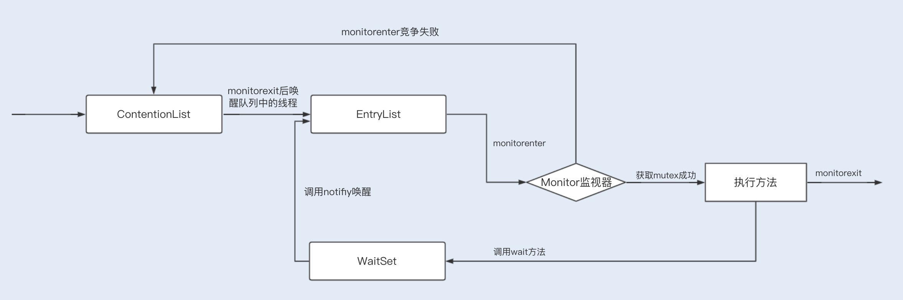
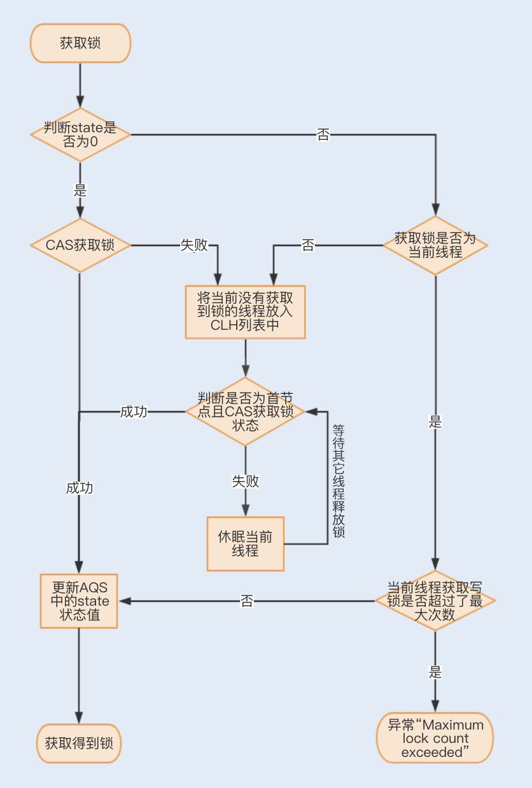
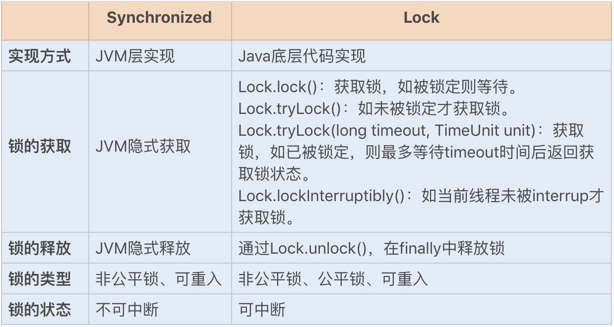

1.如何提前发现你的数据有问题,而不是等到用户反馈才知道?

2.如何防止超卖?

3.为什么要用Redis?为什么没有用db?
    redis专题
4.有没有QPS?

5.如何部署?

6.rocketmq?
    rocketmq专题
7.项目过程中哪个点比较难?

8.项目中为什么要用ThreadLocal去做租户的隔离?

9.项目有什么缺点?

10.100亿行数据,每个数字32位,取最小的数字

        类似于 100亿数据找出最大的1000个数字（top K问题）
        在大规模数据处理中，经常会遇到的一类问题：在海量数据中找出出现频率最好的前k个数，或者从海量数据中找出最大的前k个数，
        这类问题通常被称为top K问题。例如，在搜索引擎中，统计搜索最热门的10个查询词；在歌曲库中统计下载最高的前10首歌等。
        1、最容易想到的方法是将数据全部排序。该方法并不高效，因为题目的目的是寻找出最大的10000个数即可，而排序却是将所有的元
        素都排序了，做了很多的无用功。
        
        2、局部淘汰法。用一个容器保存前1000个数，然后将剩余的所有数字一一与容器内的最小数字相比，如果所有后续的元素都比容器
        内的10000个数还小，那么容器内这个1000个数就是最大1000个数。如果某一后续元素比容器内最小数字大，则删掉容器内最小
        元素，并将该元素插入容器，最后遍历完这100亿-1000个数，得到的结果容器中保存的数即为最终结果了。此时的时间复杂度为O
        （n+m^2），其中m为容器的大小。
        
        这个容器可以用（小顶堆）最小堆来实现。我们知道完全二叉树有几个非常重要的特性，就是假如该二叉树中总共有N个节点，那么该
        二叉树的深度就是log2N，对于小顶堆来说移动根元素到 底部或者移动底部元素到根部只需要log2N，相比N来说时间复杂度优化太
        多了（1亿的logN值是26-27的一个浮点数）。基本的思路就是先从文件中取出1000个元素构建一个小顶堆数组k，然后依次对剩下
        的100亿-1000个数字进行遍历m，如果m大于小顶堆的根元素，即k[0]，那么用m取代k[0]，对新的数组进行重新构建组成一个新的
        小顶堆。这个算法的时间复杂度是O((100亿-1000)log(1000))，即O((N-M)logM)，空间复杂度是M
        这个算法优点是性能尚可，空间复杂度低，IO读取比较频繁，对系统压力大。
        
        3、第三种方法是分治法，即大数据里最常用的MapReduce。
        a、将100亿个数据分为1000个大分区，每个区1000万个数据
        
        b、每个大分区再细分成100个小分区。总共就有1000*100=10万个分区
        
        c、计算每个小分区上最大的1000个数。
        
        为什么要找出每个分区上最大的1000个数？举个例子说明，全校高一有100个班，我想找出全校前10名的同学，很傻的办法就是，把
        高一100个班的同学成绩都取出来，作比较，这个比较数据量太大了。应该很容易想到，班里的第11名，不可能是全校的前10名。也
        就是说，不是班里的前10名，就不可能是全校的前10名。因此，只需要把每个班里的前10取出来，作比较就行了，这样比较的数据量
        就大大地减少了。我们要找的是100亿中的最大1000个数，所以每个分区中的第1001个数一定不可能是所有数据中的前1000个。
        
        d、合并每个大分区细分出来的小分区。每个大分区有100个小分区，我们已经找出了每个小分区的前1000个数。将这100个分区的
        1000*100个数合并，找出每个大分区的前1000个数。
        
        e、合并大分区。我们有1000个大分区，上一步已找出每个大分区的前1000个数。我们将这1000*1000个数合并，找出前1000.这
        1000个数就是所有数据中最大的1000个数。
        
        （a、b、c为map阶段，d、e为reduce阶段）
        
        4、Hash法。如果这1亿个书里面有很多重复的数，先通过Hash法，把这1亿个数字去重复，这样如果重复率很高的话，会减少很大的
        内存用量，从而缩小运算空间，然后通过分治法或最小堆法查找最大的10000个数。
        
        对于海量数据处理，思路基本上是：必须分块处理，然后再合并起来。

11.有没有碰到特别难的事情,如何解决的?

12.业界中间件有什么了解吗?将一个你深度理解原理的
    redis专题
13.高并发的问题有遇到过吗,谈谈你理解的并发?
在我看来,并发编程领域可以抽象成三个核心问题:分工 同步和互斥

        所谓分工,类似于现实中一个组织完成一个项目,项目经理要拆分任务,安排合适的成员去完成
        在并发编程领域里的同步,主要指的是就是线程间的写作,本质上和现实生活中写作没有区别,不过
            是一个线程执行完了一个任务,如何通知执行后续任务的线程开工而已
        互斥,所谓互斥,指的是同一时刻,只允许一个线程访问共享变量.


        从性能角度讲,我们为了提高执行一定计算机任务的效率,所以io等待的时候,不能让cpu闲着,所以我们把任务拆分交替执行,有了分时
    操作系统,出现了并发,后来CPU多核了又有了并行计算.这里也就是"分工"
        分工以后我们为了进一步提升效率和更加灵活的达到目的,所以我们要对任务进行组织编排,也就是对线程组织编排,于是线程之间需要通信,  
    因此操作系统提供了一些让进程,线程之间通信的方式,也就是"同步"  
        但是事物总不是完美的,并发和通信带来了较高的编程复杂度,同时也出现了多线程并发操作共享资源的问题.于是天下大势,分久必合,我们又  
    要将对共享资源的访问串行化,所以我们根据现实世界的做法设计了锁,信号量等补充这套体系,也就是互斥.
并发编程bug的源头

        这些年,我们的cpu 内存 i/o设备都在不断在迭代,不断朝着更快的方向努力,但是在这个快速发展的过程中,有一个核心矛盾一直存在,就是三者之间速度
     差异,cpu是天上一天,内存是地上一年;内存是天上一年,io设备是地上十年.
        为了合理利用cpu的高性能,平衡三者的速度差异,计算机体系结构 操作系统 编译程序都做出了贡献,主要体现为:
        1.cpu增加了缓存,以均衡与内存的速度差异
        2.操作系统添加了进程 线程,以分时复用cpu,进而均衡cpu与io设备的速度差异
        3.编译程序优化指令执行次序,使得缓存能够得到更加合理的利用.
        现在我们几乎所有的程序都默默地享受着这些成果，但是天下没有免费的午餐，并发程序很多诡异问题的根源也在这里。
        源头1:缓存导致的可见性问题
        源头2:线程切换带来的原子性问题
        源头3:编译优化带来的有序性问题
java如何解决有序性和可见性

    1.什么是java内存模型
    我们已经知道,导致可见性的原因是缓存,导致有序性的原因是编译优化,那解决可见性 有序性最直接的办法是禁用缓存和编译优化,但是这
    样问题虽然解决了,我们程序的性能可就堪忧了.
    合理的方案应该是按需禁用缓存以及编译优化
    java内存模型是个很复杂的规范,可以从不同的视角来解读,站在我们这些程序员的视角,本质上可以理解为,java内存模型规范了JVM如何
    如何提供按需禁用缓存和编译优化的方法。具体来说，这些方法包括 volatile、synchronized 和 final 三个关键字，以及六项 
    Happens-Before 规则
    
    2.volatile
    我们声明一个 volatile 变量 volatile int x = 0，它表达的是：告诉编译器，对这个变量的读写，不能使用 CPU 缓存，必须从
    内存中读取或者写入
    
    3.happens-before规则
    如何理解happens-before规则?前面一个操作的结果对后续操作是可见的.Happens-Before约束了编译器的优化行为,虽然允许编译器
    优化,但是要求编译器优化后一定遵守happens-before规则
        1.程序的顺序性规则:这条规则是指在一个程序中,按照程序顺序,前面的操作hb于后续的任意操作
        2.volatile变量规则:这条规则是指对一个volatile变量的写操作,hb于后续对这个volatile变量的读操作
        3.传递性:这条规则是指如果A hb B,且B hb C,那么A hb C
        4.管程中的锁的规则:这条规则是指对一个锁的解锁 HB 于后续对这个锁的加锁
        5.线程start()规则:这条规则是指主线程A启动子线程B后,子线程B能够看到主线程在启动子线程B前的操作
        6.线程join()规则:这条规则是指主线程A等待子线程B完成(主线程A通过调用子线程B的join()方法实现),当子线程B完成后(主线
        程A中join()方法返回),主线程能够看到子线程的操作.当然所谓的看到,指的是对共享变量的操作.
        换句话说就是，如果在线程 A 中，调用线程 B 的 join() 并成功返回，那么线程 B 中的任意操作 Happens-Before 于该 
        join() 操作的返回 
    4.final关键字
    final 修饰变量时，初衷是告诉编译器：这个变量生而不变，可以可劲儿优化。
    final修饰的实例字段则是涉及到新建对象的发布问题。当一个对象包含final修饰的实例字段时，其他线程能够看到已经初始化的final
    实例字段，这是安全的                        


互斥锁解决原子性问题  
Synchronized同步锁实现原理 通常Synchronized实现同步锁的方式有两种,一种是修饰方法,一种是修饰方法块
```java
public class SyncTest{
    // 关键字在实例方法上,锁为当前实例
    public synchronized void method1(){
        
    }
    // 关键字在代码块上,锁为括号里面的对象
    public void method2(){
        Object obj = new Object();
        synchronized(obj){
            // code
        }
    }
}
```
        通过反编译
        javac -encoding UTF-8 SyncTest.java  //先运行编译class文件命令
        javap -v SyncTest.class //再通过javap打印出字节文件
        通过输出的字节码,我们会发现:Synchronized在修饰同步代码块时,是由monitorenter和monitorexit指令来实现同步的.进入
    monitorenter指令后,线程持有Monitor对象,退出monitorexit指令后,线程将释放该Monitor对象
        当Synchronized修饰同步方法时,并没有发现monitorenter和monitorexit指令,而是出现了一个ACC_SYNCHRONIZED标志.
    这是因为jvm使用了ACC_SYNCHRONIZED访问标志来区分一个方法是否是同步方法.当方法调用时,调用指令将会检查该方法是否被设置
    ACC_SYNCHRONIZED访问标志.如果设置了该标志,执行线程将先持有Monitor对象,然后再执行方法.在该方法运行期间,其他线程将无法
    获取到该Monitor对象,当方法执行完成后,再释放该Monitor对象.
        现在看看Synchronized修饰方法时怎么实现锁原理的?
    JVM中的同步是基于进入和退出管程对象实现的.每个对象实例都会有一个Monitor,Monitor可以和对象一起创建 销毁.Monitor是由
    ObjectMonitor实现的,而ObjectMonitor是由C++的ObjectMonitor.hpp文件实现的 
    
    ObjectMonitor() {
       _header = NULL;
       _count = 0; //记录个数
       _waiters = 0,
       _recursions = 0;
       _object = NULL;
       _owner = NULL;
       _WaitSet = NULL; //处于wait状态的线程，会被加入到_WaitSet
       _WaitSetLock = 0 ;
       _Responsible = NULL ;
       _succ = NULL ;
       _cxq = NULL ;
       FreeNext = NULL ;
       _EntryList = NULL ; //处于等待锁block状态的线程，会被加入到该列表
       _SpinFreq = 0 ;
       _SpinClock = 0 ;
       OwnerIsThread = 0 ;
    }          
        当多个线程同时访问一段同步代码时,多个线程会先被存放在ContentionLst和EntryList集合中,处于block状态的线程,都会被
    加入到该列表.接下来当线程获取到对象的Monitor时,Monitor是依靠底层操作系统的Mutex Lock来实现互斥的,线程申请Mutex 成功,
    则持有该Mutex,其他线程将无法获取到该Mutex,竞争失败的线程会再次进入ContentionList被挂起
        如果线程调用wait()方法,就会释放当前持有的Mutex,并且该线程会进入WaitSet集合中,等待下一次被唤醒.如果当前线程顺利
    执行完方法,也将释放Mutex;
            
        总结来说就是，同步锁在这种实现方式中，因 Monitor 是依赖于底层的操作系统实现，存在用户态与内核态之间的切换，所以增
        加了性能开销。
锁升级优化

    在 JDK1.6 JVM 中，对象实例在堆内存中被分为了三个部分：对象头、实例数据和对齐填充。其中 Java 对象头由 Mark Word、指向
    类的指针以及数组长度三部分组成
    Mark Word 记录了对象和锁有关的信息。Mark Word 在 64 位 JVM 中的长度是 64bit，我们可以一起看下 64 位 JVM 的存储结
    构是怎么样的。如下图所示：
image_36.png

    1.偏向锁
        偏向锁主要用来优化同一线程多次申请同一个锁的竞争。在某些情况下，大部分时间是同一个线程竞争锁资源，例如，在创建一个线程
    并在线程中执行循环监听的场景下，或单线程操作一个线程安全集合时，同一线程每次都需要获取和释放锁，每次操作都会发生用户态与内核态
    的切换。
        偏向锁的作用就是，当一个线程再次访问这个同步代码或方法时，该线程只需去对象头的 Mark Word 中去判断一下是否有偏向
    锁指向它的 ID，无需再进入 Monitor 去竞争对象了。当对象被当做同步锁并有一个线程抢到了锁时，锁标志位还是 01，“是否偏向锁”
    标志位设置为 1，并且记录抢到锁的线程 ID，表示进入偏向锁状态。一旦出现其它线程竞争锁资源时，偏向锁就会被撤销。偏向锁的撤销
    需要等待全局安全点，暂停持有该锁的线程，同时检查该线程是否还在执行该方法，如果是，则升级锁，反之则被其它线程抢占

    2.轻量级锁
    当有另外一个线程竞争获取这个锁时，由于该锁已经是偏向锁，当发现对象头 Mark Word 中的线程 ID 不是自己的线程 ID，就会进行
    CAS 操作获取锁，如果获取成功，直接替换 Mark Word 中的线程 ID 为自己的 ID，该锁会保持偏向锁状态；如果获取锁失败，代表
    当前锁有一定的竞争，偏向锁将升级为轻量级锁。
    
    3.自旋锁
    轻量级锁 CAS 抢锁失败，线程将会被挂起进入阻塞状态。如果正在持有锁的线程在很短的时间内释放资源，那么进入阻塞状态的线程无疑
    又要申请锁资源。
    JVM 提供了一种自旋锁，可以通过自旋方式不断尝试获取锁，从而避免线程被挂起阻塞。这是基于大多数情况下，线程持有锁的时间都不会
    太长，毕竟线程被挂起阻塞可能会得不偿失。
    从 JDK1.7 开始，自旋锁默认启用，自旋次数由 JVM 设置决定，这里我不建议设置的重试次数过多，因为 CAS 重试操作意味着长时间
    地占用 CPU。
    自旋锁重试之后如果抢锁依然失败，同步锁就会升级至重量级锁，锁标志位改为 10。在这个状态下，未抢到锁的线程都会进入 Monitor
    ，之后会被阻塞在 _WaitSet 队列中。

    4.动态编译实现锁消除 / 锁粗化
    除了锁升级优化，Java 还使用了编译器对锁进行优化。JIT 编译器在动态编译同步块的时候，借助了一种被称为逃逸分析的技术，来判断
    同步块使用的锁对象是否只能够被一个线程访问，而没有被发布到其它线程。
    确认是的话，那么 JIT 编译器在编译这个同步块的时候不会生成 synchronized 所表示的锁的申请与释放的机器码，即消除了锁的使用。
    在 Java7 之后的版本就不需要手动配置了，该操作可以自动实现。
    锁粗化同理，就是在 JIT 编译器动态编译时，如果发现几个相邻的同步块使用的是同一个锁实例，那么 JIT 编译器将会把这几个同步块
    合并为一个大的同步块，从而避免一个线程“反复申请、释放同一个锁”所带来的性能开销。

    5.减小锁粒度
    当我们的锁对象是一个数组或队列时，集中竞争一个对象的话会非常激烈，锁也会升级为重量级锁。我们可以考虑将一个数组和队列对象拆
    成多个小对象，来降低锁竞争，提升并行度。
    最经典的减小锁粒度的案例就是 JDK1.8 之前实现的 ConcurrentHashMap 版本。我们知道，HashTable 是基于一个数组 + 链表
    实现的，所以在并发读写操作集合时，存在激烈的锁资源竞争，也因此性能会存在瓶颈。而 ConcurrentHashMap 就很很巧妙地使用了
    分段锁 Segment 来降低锁资源竞争，
Lock锁的实现原理

        Lock 锁是基于 Java 实现的锁，Lock 是一个接口类，常用的实现类有ReentrantLock、ReentrantReadWriteLock（RRW）
        ，它们都是依赖 AbstractQueuedSynchronizer（AQS）类实现的。
        AQS 类结构中包含一个基于链表实现的等待队列（CLH 队列），用于存储所有阻塞的线程，AQS 中还有一个 state 变量，该变量
        对 ReentrantLock 来说表示加锁状态。
        该队列的操作均通过 CAS 操作实现，我们可以通过一张图来看下整个获取锁的流程          


Synchronized和Lock锁的区别


 14.有遇到过很大的流量吗?

15.描述产生一次FullGC的整个过程

    a.堆分成两大块:新生代和老年代.对象产生之初在新生代,进入暮年时进入老年代,但是老年代也接纳在新生代无法容纳的超大对象.新生
    代=1个Eden去+2个Survivor区
    b.绝大部分对象在Eden区生生,当Eden区装填满的时候,则会触发YGC
    c.YGC垃圾回收的时候,在eden区实现清除策略,没有被引用的对象则直接回收,依然存活的对象会被移送到Survivor区.Survivor区分为
    S0和S1两块内存空间,送到哪块空间呢?每次YGC的时候,他们将存活的对象复制到未使用的那块空间,然后将当前正在使用的空间完全清除,
    交换两块空间的使用状态.假如一些没有进取心的对象以为可以一直在新生代的Survivor区交换来交换去,那就错了,每个对象都有一个计数
    器,每次YGC都会+1.-XX:MaxTenuringThreshold参数能配置计数器的值到达某个阈值的时候,对象从新生代晋升至老年代.
    d.如果YGC要移送的对象大于Survivor去容量的上限,则直接交给老年代
    e.结合d和c,如果Survivor区无法放下,或者超大对象的阈值超过上限,则尝试在老年代中进行分配
    f.如果老年代也无法放下,则会触发FGC,如果依然放不下则抛出OOM


16.平时通过什么来提升自己? 技术博客 极客时间 17.你有什么问题?你觉得我的短板在于?

------------------------------------------------------------------------

1.简单介绍下自己和项目
自我介绍:面试官你好,我叫李昭文,本科毕业于安徽巢湖学院,现居苏州吴江,从Boss招聘上看到公司招聘的这个java职位,  
我觉得自己比较适合公司的这个岗位,对自己的发展也有帮助,所以来争取下这份工作.
本人从事java开发有将近6年的开发经验,从事过不同业务场景开发,例如互联网金融 微信公众号 共享仓库存储等场景,可以适应不同场景的开发工作;  
期间解决了许多疑难问题,(本人总结了解决问题的三个步骤:首先,许多bug在于理解需求不清,因此写代码时有疑问的地方要多和产品 开发leader沟通好,  
其次代码层次要简洁明了,逻辑清楚,多测试,出了bug,自己能做到心中有数;再次要和测试人员加强沟通)
本人的优势在于痴迷技术,学习能力强,为人谦和,缺点在于非计算机专业,有时考虑问题不够全面.
谢谢面试官

项目介绍:目前本人在开发的项目,是一款既有web端,也有安卓端,还有小程序的项目,叫做任意仓,任意仓就是负责电商卖家的仓储租赁+配送的业务.
本人负责云仓出入库单 物流单模块中接口的定义,利用设计模式优化代码(观察者模式),确保接口访问的幂等性,优化出入库单请求响应参数

2.你觉得项目里最大的挑战是什么?项目的设计和推动

3.为什么选择rocketmq?

4.对rocketMQ的了解?
基本原理 发布订阅 服务注册 消息丢失

5.消息如何保证顺序消费?

6.rocketmq事务消息

7.rocketmq是强一致性还是还是弱一致性?

8.消息重复如何解决?可以在中间件层解决吗?MQ体系一些了解吗?业务幂等等

9.ThreadLocal是怎么样概念?如何实现线程隔离的?基于这个原理有没有更加优化的方式

10.线程池用ThreadLocal有什么问题?有什么思路来让业务不去关注ThreadLocal的set ThreadLocal在线程复用的时候
值可能不是最新的,需要每次都set

11.你说你用过dubbo,那看过netty源码吗?

12.Netty中FastThreadLocal对ThreadLocal的优化
    FastThreadLocal使用了单纯的数组来替代ThreadLocal的hash表操作,索引在高并发的情况下,FastThreadLocal更快
    set操作:FastThreadLocal直接根据index进行数组set,而 ThreadLocal 需要先根据ThreadLocal的hashcode计算数组下标,然后
    再根据线性探测法进行set操作,期间如果发生hash冲突且有无效的Entry时,还要进行entry的清理和整理操作.最后不管是否冲突,都要进行
    一次log级别的Entry回收操作,所以慢了
    get操作:ftl直接根据index进行获取,而tl需要先根据tl的hashcode计算数组下标,然后再根据线性探测法进行get操作,如果不能根据直接索引索引获取
    到value的话,并且在向后循环遍历的过程中发现了无效的Entry,则会进行无效的Entry的清理和整理工作.
    remove操作:ftl直接根据index从数组中删除当前的ftl的value,然后从Set集合中删除当前的ftl,之后还可以进行删除回调操作(功能增强);
    而tl需要先根据tl的hashCode计算数组下标,然后再根据线性探测法进行remove操作,最后还需要进行无效的Entry的整理和清理工作;
13.讲讲dubbo的基本原理

14.JVM调优?

15.频繁YGC如何排查
cpu占用过高排查思路
    top 查看占用cpu的进程 pid
    top -Hp pid 查看进程中占用cpu过高的线程id  tid
    printf '%x/n' tid 转化为十六进制
    jstack pid |grep tid的十六进制 -A 30 查看堆栈信息定位

jvm old区占用过高排查思路
    top查看占用cpu高的进程
    jstat -gcutil pid 时间间隔 查看gc状况
    jmap -dump:format=b,file=name.dump pid  导出dump文件
    用visualVM分析dump文件

16.为什么会发生YGC

19.堆和栈的区别,什么时候会压栈?什么时候会出栈?

    堆是 JVM 内存中最大的一块内存空间，该内存被所有线程共享，几乎所有对象和数组都被分配到了堆内存中。  
    堆被划分为新生代和老年代，新生代又被进一步划分为 Eden 和 Survivor 区，最后 Survivor 由 
    From Survivor 和 To Survivor 组成。
    
    Java 虚拟机栈是线程私有的内存空间，它和 Java 线程一起创建。当创建一个线程时，会在虚拟机栈中申请
    一个线程栈，用来保存方法的局部变量、操作数栈、动态链接方法和返回地址等信息，并参与方法的调用和返回。
    每一个方法的调用都伴随着栈帧的入栈操作，方法的返回则是栈帧的出栈操作。


22.HashMap如何实现?为什么会变红黑树?如何扩容?为什么是两倍?什么时候用到位运算?
    HashMap使用了数组+链表这两种数据结构相结合的方式实现了链地址法,当有哈希值冲突时,就可以将冲突的键值对链成一个链表.
    但是这种方式存在一个性能问题,如果链表过长,查询数据的时间复杂度就会增加.HashMap就在java8中使用了红黑树来解决链表  
    过长导致的查询性能下降问题;
    如何扩容?由于扩容数组的长度是2倍的关系,所以对于假设初始tableSize=4要扩容到8来说就是0100到1000的变化(左移一位就是2倍)
    在扩容中只用判断原来的hash值和左移动的一位(newTable的值)按位与操作是0或1,0的话索引不变,1的话索引变成原索引加上扩容前数组
    之所以能通过这种"与运算"来重新分配索引,是因为hash值本来就是随机的,而hash按位与上newTable得到的0和1就是随机的,索引
    扩容的过程就能把之前哈希冲突的元素再随机分到不同的索引中
    为什么是2倍?容量n为2的幂次方,n-1的二进制会全为1,位运算时可以重复散列,避免不必要的哈希冲突,因此扩容必须是2倍就是为了
    维持容量始终为2的幂次方.
    什么时候用到位预算?
23.你有什么想问的?

24.如何设计一个类似Redis缓存数据库?谈谈你的看法?
